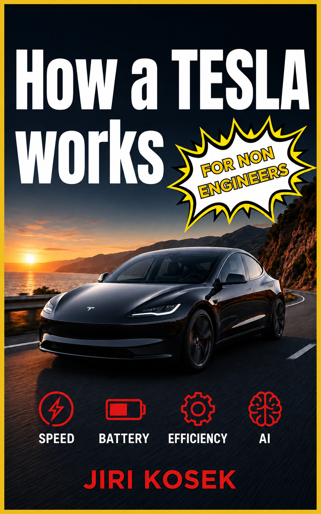

<p align="center"></p>

<div align="center">

# How a Tesla Works

### What is actually happening inside a modern electric car

*A field guide to the machine, for the curious non-engineer.*

</div>


\newpage
# Preface

There is a strange hole in the middle of the bookshelf.

On one side sit the Tesla books, and there are a great many of them. They are about money, about personalities, about share prices and factory drama and the improbable arc of a company that most people expected to fail. They are, in their way, excellent. They will tell you everything about the men and the markets and almost nothing about the machine.

On the other side sit the engineering textbooks — sober, authoritative, and priced like a small kitchen appliance. Open one and you are three pages into a differential equation before anyone has explained why you should care. These books are written by experts, for people who are on their way to becoming experts. They assume you already want to build the thing.

And in between — nothing. There is no book for the person who does not want to build an electric car but very much wants to *understand* one. Who has stood next to a Tesla at a charging bay, heard the faint tick and whir of a machine cooling itself, and thought: what is actually going on in there? Not the marketing version. The real version. The one an engineer would recognize.

This is that book.

It is built almost entirely from other people's careful work — from the people who buy these cars, saw them into pieces, and photograph every bracket; from the trade-press engineers who explain a power converter without flinching; from patents, teardown videos, and the occasional grudging official spec sheet. That knowledge exists. It is simply scattered across a thousand articles and videos, and nobody has yet sat down to assemble it into a single narrative you could read on a train.

A warning, and a promise. The warning: this is a book about a moving target. Electric cars are being redesigned faster than books can be printed, and some of what follows will have aged by the time you read it. Rather than pretend otherwise, the text states its own date. It is written as of 2026, and it says so, the way a photograph is honest about the year it was taken.

The promise: wherever a number or a claim rests on someone's careful guess rather than a confirmed fact — and in this world of trade secrets, that is often — the text says so plainly. You will see the seams. That is deliberate. A book that pretends to certainty it does not have is worse than useless; it is misleading. This one would rather show you exactly how much is known, and how it came to be known, because that turns out to be one of the more interesting parts of the story.

You will not need mathematics. You will need curiosity, a tolerance for the occasional diagram, and a willingness to be surprised by how much cleverness is hiding inside a machine you have probably walked past a hundred times without a second glance.

Let's open it up.
# How to read this book

You can read this book straight through, front to back, and it is built to reward that — each part sets up the next, and by the end the whole car assembles itself in your head. But you can also drop into any chapter that catches your eye. Each subchapter is a short, self-contained essay on one idea, roughly the length of a magazine column, and it tries not to assume you have read the others.

A few things worth knowing before you start.

**It is about one car, mostly.** To keep things concrete, the book uses the Tesla Model 3 and Model Y — the two best-selling, most-torn-apart electric cars in the world — as its default example. Where a genuinely important idea first appeared on a different vehicle, it still gets explained; it is simply explained as an idea, not as a scoreboard between models. This is a book about how the technology works, not about which trim to buy.

**The numbers are handled carefully, and sometimes at arm's length.** Precise figures — how many volts, how many kilowatt-hours, how fast the motor spins — are exactly the things that change from one model year to the next, and exactly the things that manufacturers keep quiet about. So the book concentrates its hard numbers into a few reference tables rather than sprinkling them through every page, and it flags the ones that come from teardowns and educated inference rather than official confirmation. When you see a claim marked in the text as inferred, that is not the author hedging for the sake of it. It means: this is the best the outside world currently knows, and here is why it is not certain.

**The diagrams are deliberately crude.** Every diagram in this book is drawn in plain text characters — lines and slashes and boxes made of dashes. This is a choice, not a limitation. A simple diagram that shows you the *shape* of an idea is worth more than a glossy render that hides the mechanism, and plain-text drawings have the happy property of reducing an idea to its bare structure, never needing a caption in six-point type, and never pretending to a precision they do not have. Read them as maps of the *relationships* between parts, not as blueprints.

**Units are metric, with imperial in tow.** Kilometers, kilograms, degrees Celsius, kilowatts — the language engineers actually work in — with miles, pounds, and Fahrenheit given alongside wherever a figure lands more familiarly that way. The book is written to read the same on either side of the Atlantic.

**There is no math.** Not because the math is unimportant — it is the whole hidden engine of the field — but because you do not need it to understand what is happening, any more than you need to read sheet music to be moved by a song. Where a relationship matters, it is described in words and pictures.

A small label appears in the text from time to time. **[INFERENCE]** marks something known only from teardowns or patents rather than from the manufacturer's own word; these are meant to survive, because knowing *how* we know something is half the fun.

That is all the housekeeping. The car is waiting.
# Part I — A Different Kind of Machine

# 1. The car that deletes the engine

There is a party trick that engineers who work on electric cars enjoy performing on the uninitiated. They ask you to picture a car — any car — and then to point to the engine. Everyone can do this. The engine is the heart of the thing, the part that thrums and heats and roars, the reason the hood is long and the reason the whole machine smells faintly of warm oil. Then they ask the follow-up question, and it is the one that undoes people: *what if you simply took it out, and did not put anything like it back?*

Not replaced it with a cleaner engine. Not a smaller one. Removed it — along with the gearbox it needed, the exhaust it breathed through, the fuel system that fed it, and the elaborate machinery that existed only to manage its many shortcomings — and built a car around the hole where it used to be.

That is not a metaphor. It is close to a literal description of what an electric car is, and it is where any honest account of one has to begin. Before we can marvel at battery chemistry or silicon-carbide switches or a single valve that routes heat around the car like a switchboard operator, we have to be clear about the size of the thing that has been deleted, and about why deleting it changes everything else.

This first chapter does exactly that. It looks hard at what an internal-combustion car actually is, once you stop taking it for granted. It lays out the five jobs that every car — gasoline or electric, 1920 or 2026 — must somehow accomplish. It shows how going electric upends all five of those jobs at once, rather than politely swapping one part for another. And it ends with the single obsession that ties the whole rest of the book together: the relentless, unglamorous, utterly decisive pursuit of efficiency.

By the end of it, the engine will be gone, and the real story can start.
## 1.1 What an internal-combustion car actually is

Set fire to a cup of gasoline and it simply burns — a hot, useless, faintly alarming flame. To make that same cupful move a ton and a half of metal down a highway, you need one of the most quietly deranged machines humans have ever built: a device that takes the explosion, that most uncontrollable of events, and arranges to have it happen in a sealed metal chamber several thousand times a minute, on schedule, forever, without ever blowing itself apart. That machine is the internal-combustion engine, and once you look at it clearly, the strangest thing about it is how much of the car exists only to cope with it.

Start with what it is. A gasoline engine is a set of cylinders — usually four in an ordinary car — in each of which a piston slides up and down. Fuel and air are squeezed into the top of the cylinder, a spark lights them, and the resulting bang shoves the piston down. That downward shove is the entire point; everything else is plumbing. The pistons turn a crankshaft, the crankshaft spins, and that spin, eventually, reaches the wheels. To keep the bangs coming in the right order you need camshafts, valves, springs, a timing chain. To stop the whole thing seizing solid you need oil pumped everywhere under pressure. To stop it melting you need a cooling system — a radiator, a water pump, liters of coolant circulating constantly. To start it at all you need a separate electric motor, because an engine cannot begin turning itself. Count the moving parts and you arrive somewhere around two hundred in the powertrain alone [INFERENCE — commonly cited industry figure, not a single audited count], every one of them wearing, needing lubrication, and eventually failing.

And here is the part that should genuinely astonish you: for all that machinery, most of the fuel is wasted. Not a little of it — most of it. The figures are not controversial; they come from the United States Department of Energy, which has measured them exhaustively. Of the energy in a tank of gasoline, only somewhere between **18 and 25 percent** actually reaches the wheels. The rest is lost, and the largest share by far — around **68 to 72 percent** — is simply thrown away as heat: out of the exhaust pipe, into the radiator, off the engine block into the air. You have, in effect, a very expensive heater that produces motion as a side effect.

Concise diagram of where a tankful of gasoline actually goes:

```
   100 units of energy in a tank of gasoline
   -------------------------------------------------------
    -70   engine losses, mostly heat, out of the
          exhaust pipe and the radiator
    - 3   idling at traffic lights
    - 4   drivetrain friction
    - 5   pumps, alternator, accessories
   -------------------------------------------------------
     18   reaches the wheels
          (18-25 in practice, and the only part you
           actually wanted to buy)
```

There is worse. The engine only works well within a narrow band of speeds — too slow and it stalls, too fast and it tears itself up — and that band does not match the range of speeds a car actually needs, from crawling in a parking lot to cruising at 80 mph (130 km/h). So you bolt on a gearbox: a heavy, precise, oil-filled box of cogs whose entire job is to keep translating between the engine's fussy comfort zone and the road's demands. Every gear change is a small confession that the power source cannot do what is asked of it directly. Add the clutch, the driveshafts, the differential, and you have a second complicated machine that exists purely to manage the failings of the first.

Now step back and look at the car as a whole. The engine is heavy, so it sits low and forward, and the chassis is built around it. It is hot, so the front of the car becomes a giant air scoop feeding the radiator. It vibrates, so the whole thing floats on rubber mounts. It breathes, so there is an intake, a filter, an exhaust, a catalytic converter, a silencer running the length of the underbody. It needs feeding, so there is a fuel tank, lines, a pump, injectors. A conventional car is not a passenger box with an engine added. It is an engine with a passenger box wrapped around it, and nearly every design decision — the long hood, the transmission tunnel running between the front seats, the grille — is a scar left by the thing under the hood.

Hold that picture in your head, because the entire premise of an electric car is a single, radical act of subtraction. Take the engine out. Take the gearbox, the exhaust, the fuel system, the cooling of the block, the two hundred moving parts, the whole apparatus of coping — and simply delete it. What is left, and what has to be reinvented in its place, is the subject of everything that follows.

---

<div class="sources" style="font-size:0.85em;color:#555">

**Sources**

- U.S. Department of Energy / EPA, *Where the Energy Goes: Gasoline Vehicles*, fueleconomy.gov — energy-loss breakdown (18–25% to wheels; ~68–72% engine/heat losses).
- ScienceDirect, "Estimation of tank-to-wheel efficiency functions based on type approval data" (2020) — tank-to-wheel efficiency figures for ICE vehicles.
- Industry teardown commentary comparing ICE powertrain (~200 moving parts) with EV drivetrain (~17–20 moving parts); figure marked [INFERENCE] as a widely cited approximation rather than an audited count.

</div>

## 1.2 The five jobs every car must do

Strip away the badges, the marketing, the arguments about gasoline versus electric, and every car ever built — the Model T, a Formula One car, the Tesla in this book — is trying to do the same five things. Once you can see them, the whole machine stops being a mystery and becomes a to-do list, and the difference between a combustion car and an electric one becomes wonderfully easy to describe: they agree completely on the list and disagree on almost every line of it.

Here is the list.

**One: store energy.** A car has to carry its own fuel, because there is no cord long enough to reach the store. So somewhere on board there is a tank of concentrated energy — gasoline in a steel tank, or electricity in a battery — waiting to be spent. How much you can store, how heavy it is, how quickly you can put more in, and how much of it leaks away as you go: these questions shape everything else.

**Two: turn that stored energy into motion.** Energy sitting in a tank does nothing. Something has to convert it into a spinning shaft — the raw rotation that will eventually reach the wheels. In a gasoline car this is the engine, burning fuel to shove pistons. In an electric car it is the motor, using magnetism to spin a rotor. This is the step where the two kinds of car diverge most violently, and it is the heart of Part III of this book.

**Three: get that motion to the wheels, at the right speed and the right force.** Raw rotation is not enough. Pulling away from a standstill needs enormous force and very little speed; cruising on a highway needs the opposite. The car must bridge that gap — trading speed for force and back again — and then split the drive between wheels, let them turn at different rates around corners, and do it all without shaking itself to pieces. This is the job of gearboxes, driveshafts and differentials, and it is where the electric car quietly throws away an entire category of hardware.

**Four: manage the heat.** Everything above produces heat, and heat is both the enemy and, occasionally, a resource. Store energy and some of it warms up. Convert it and a great deal of it warms up. A car must carry away the heat it does not want, and — a newer idea — sometimes catch and reuse the heat it does. Gasoline cars treat this as pure waste disposal. Electric cars, as we will see, turn it into one of the most elegant systems in the whole vehicle.

**Five: control the whole thing.** None of the first four jobs is any use unless a human — or, increasingly, the car itself — can command it: go, stop, turn, faster, gentler, now. Something has to take the driver's intentions and translate them into the precise, coordinated behavior of every other system, thousands of times a second, safely. In an old car this was cables, rods and hydraulics. In a modern one it is computers and software, and it has grown from a footnote into arguably the largest engineering effort in the car.

Diagram of the five jobs and where each lives in this book:

```
   Three jobs sit in a line, one after the other:

     1 STORE   -->   2 CONVERT   -->   3 DELIVER   --> wheels
       energy          to spin           to wheels
         |               |                   |
      battery         motor +            reduction
       pack           inverter           gear, axle

   Two more wrap around all three, all of the time:

     4 MANAGE HEAT ..... heat pump, octovalve
     5 CONTROL ......... computers, software
```

That is the entire job description of a motor car, and it has not changed in a hundred and forty years. What has changed — completely, radically, in the space of a single generation — is how a Tesla answers each line of it. It stores energy in a way a Victorian engineer would not recognize. It converts that energy with a device that has one moving part instead of two hundred. It delivers the motion with a single fixed gear and no clutch at all. It manages heat as a treasured resource rather than a nuisance. And it controls the lot with software that can be rewritten overnight while the car sleeps in your driveway.

Five jobs. One familiar list, five unfamiliar answers. The next section walks down the list one more time and shows exactly how going electric upends every single one of them at once — which is the real reason an electric car is not a normal car with a different fuel, but a genuinely different kind of machine.

---

<div class="sources" style="font-size:0.85em;color:#555">

**Sources**

- Framing subchapter. The "five jobs" taxonomy is the book's own organizing device, not a sourced technical claim; the specific systems named (battery pack, inverter, motor, reduction gear, heat pump, octovalve, vehicle controllers) are each grounded in their own dedicated chapters later in the book.

</div>

## 1.3 Why electric changes all five at once

The tempting way to think about an electric car is as a normal car with the fuel swapped out — as though an engineer had lifted the gasoline engine, dropped a motor in its place, and gone home. If that were true, this would be a much shorter book. But it is not what happens. Change the way a car stores and converts energy and you do not change one line of the five-job list; you knock over all five, one into the next, like dominoes. Walk down the list again and watch it fall.

**Store.** Gasoline is an astonishing way to carry energy. Kilo for kilo it holds something like fifty times more than a lithium battery — a fact the battery can never win. And yet the electric car mostly wins the exchange anyway, because of what happens at the next step. A battery gives up its energy through wires almost losslessly, whereas a tank of gasoline must first be set on fire. The catch is time: you can pour a tankful of gasoline in two minutes, and putting the equivalent energy into a battery takes longer and requires an entire chapter (Part VI) to explain properly. Storage stops being a solved problem and becomes *the* problem around which the car is designed.

**Convert.** This is where the ground truly shifts. The engine — two hundred moving parts, most of the fuel lost as heat — is replaced by an electric motor with essentially **one** moving part, which turns electricity into rotation at efficiencies of **around 90 percent or more**. It is silent. It barely wears. And it does something no engine can: it produces its full twisting force, its maximum torque, from a dead standstill — from zero revolutions per minute. An engine has to spin up and be coaxed into its narrow happy band before it pulls hard. A motor just pulls, instantly, the moment you ask. That single fact is what makes an ordinary electric car feel quicker off the line than sports cars that cost ten times as much.

**Deliver.** And because the motor pulls hard from zero and keeps pulling across a huge range of speeds, the entire elaborate apparatus for *managing* an engine's fussiness — the multi-speed gearbox, the clutch, the gear stick, the shift shock — simply evaporates. In its place sits a single fixed reduction gear: one ratio, no changes, no clutch, ever. An engineering problem that consumed a century of refinement is not solved so much as deleted. Job three shrinks from a heavy oil-filled machine to a single set of cogs.

Then something appears on the list that has no equivalent in a gasoline car at all. Because a motor and a generator are the same device run in opposite directions, an electric car can put its motor into reverse as a brake — slowing the car by *generating* electricity and pouring it back into the battery. This is **regenerative braking**, and it recovers a meaningful slice of the energy an ordinary car would waste as heat and brake dust every time it slows down. No engine can do this. It is a genuinely new job, and it quietly rewrites how the car brakes, how it feels to drive, and how far it can go.

**Manage heat.** Here the whole logic turns inside out, and this is the part engineers find most delicious. A gasoline car's thermal problem is *too much* heat: the engine is a furnace, and the challenge is throwing the excess away fast enough. An electric car's problem is the mirror image. The motor and battery are so efficient that they barely produce waste heat at all — which sounds like good news until a cold morning, when there is suddenly no free furnace to warm the cabin and, worse, the battery itself needs warming before it will perform. Heat flips from nuisance to scarce resource, something to be scavenged, hoarded and moved around the car on purpose. The systems that do this — the heat pump, the almost comically clever octovalve — are the subject of Part IV, and they are among the most beautiful engineering in the whole vehicle.

**Control.** Finally, once the motor can be commanded in microseconds and there is no mechanical gearbox insisting on its own timing, it stops making sense to connect the driver to the machinery with cables and rods. The accelerator becomes a signal, not a wire. Braking becomes a negotiation between the regenerating motor and the old friction brakes, refereed by software. And once the car is run by software, that software can be improved overnight, over the air, long after the car has left the factory. Control grows from an afterthought into the largest single engineering effort in the car.

Five jobs, five upheavals, each one triggering the next. That is why an electric car is not a re-fueled car but a re-conceived one — and why, in the end, the single thread running through every one of these changes is a relentless, almost obsessive pursuit of one thing: efficiency. Which is where the chapter ends, and the obsession begins.

---

<div class="sources" style="font-size:0.85em;color:#555">

**Sources**

- EV Engineering & Infrastructure (evengineeringonline.com), "How does regenerative braking work in an EV" — regenerative braking principles and recovery ranges.
- Recharged / Motor Authority — electric motors deliver maximum torque from ~zero rpm; role of the inverter.
- ArenaEV, "Why electric cars don't have conventional gearboxes" — single-speed reduction gear rationale.
- Motor efficiency ranges (PMAC ~83–95%, induction ~65–94%) per drivetrain-efficiency literature; the gasoline/lithium energy-density contrast (~50× by mass) is a standard, widely published comparison and is developed with figures in Chapter 2.

</div>

## 1.4 Efficiency as the organizing obsession

For a hundred years, car engineers were allowed to be wasteful, and they knew it. Gasoline was cheap, extraordinarily energy-dense, and could be replenished in the time it takes to buy a coffee. If your engine threw away three-quarters of its fuel as heat — and it did — you simply carried a bit more fuel. Efficiency was a virtue, pursued when convenient, but it was never the thing the whole car was organized around. There was always slack in the system.

Take the engine out, and the slack vanishes overnight.

The reason is the battery, and it is worth being blunt about it. The battery is the single heaviest and most expensive object in an electric car — a slab that can weigh half a ton and cost as much as a small second-hand car all by itself. Every unit of energy it holds was expensive to buy and is heavy to carry. So the calculus flips completely. In a gasoline car, wasted energy cost you a little extra fuel. In an electric car, wasted energy costs you *range* — and to buy the range back you must add battery, and battery adds weight and cost, and the extra weight consumes yet more energy, and round the spiral goes. Efficiency stops being a virtue and becomes the master variable. Save a watt anywhere and you have, in effect, been handed free range, free weight and free money, all at once.

This is the single idea that explains almost every strange design choice in the rest of this book. Once you see it, you cannot unsee it.

Why does a Tesla have those flush door handles that pop out to greet you? To smooth the airflow. Why the near-total absence of a front grille? Because a hole in the front of a car is a hole that air falls into, and air is the enemy. Why the smooth belly pan under the floor, the small aerodynamic wheel covers that owners either love or quietly replace, the obsessive sculpting of every mirror and pillar? All of it is a war on drag — and drag matters ferociously because, as we will see in Part VII, the power needed to push air aside rises with the *cube* of speed, so a small gain in slipperiness at 75 mph (120 km/h) pays off out of all proportion where it counts. The result is a body with a drag coefficient of around **0.23** — and, in the latest version, **0.219** — numbers that put a family sedan into territory once reserved for the odd hand-built streamliner. Tesla's own engineers have said that this single aerodynamic improvement was the largest factor in an eight percent efficiency gain on the updated car. Eight percent, from shaping the air.

The obsession does not stop at the skin. It reaches into the tires, chosen and constructed to roll with less resistance. Into the heat pump, which we will meet later, whose entire reason for existing is to warm the cabin using a quarter of the electricity a simple heater would burn. Into the regenerative braking that scavenges back the energy of every slowing. Into the motor, tuned for efficiency across the speeds you actually drive, and into an oil pump for that motor that is itself electric, so it only runs when needed rather than being dragged along constantly. None of these is dramatic on its own. Each buys back a percent, or a fraction of a percent. Added together, across the whole car, they are the difference between a usable range and a disappointing one.

The payoff is a number that would have been science fiction to an engine designer. Where a gasoline car delivers perhaps a fifth of its fuel's energy to the road, an electric car delivers the great majority of it — commonly **80 to 90 percent**, measured from the battery to the wheels. A Model 3 will carry a person and their groceries using somewhere around **130 to 160 watt-hours per kilometer**, which is to say it travels the length of a football field on roughly the energy an electric kettle uses to not-quite-boil.

The contrast, drawn crudely:

```
   Where the energy goes  (tank or battery  ->  wheels)
   Both bars are the same 100 units.  # = reaches the wheels.

   GASOLINE  [########--------------------------------]  ~20%
   ELECTRIC  [##################################------]  ~85%

   Same bar, same scale: about one part in five, against
   four to four and a half.
```

This is why "efficiency as an obsession" is the right frame for the whole machine, and why it belongs at the end of the first chapter. Deleting the engine was only the opening move. Everything that follows — the chemistry of the cells, the switching of the inverter, the cleverness of the thermal system, the shortening of every wire — is the same obsession, followed relentlessly into every corner of the car. An electric car is not merely a vehicle that happens to be efficient. It is a machine in which efficiency has become the organizing principle, the thread you can pull to unravel every other decision.

Pull it, and let us begin with the place all the energy is kept: a single, humble cell.

---

<div class="sources" style="font-size:0.85em;color:#555">

**Sources**

- EVspecs / InsideEVs — Tesla Model 3 drag coefficient (0.23; facelift 0.219, cited as "lowest absolute drag of any Tesla").
- WLTP consumption data (EVspecs, wltpinfo.com) — Model 3 ~128–167 Wh/km depending on variant; RWD ~130 Wh/km.
- Mobility.ch, eufactcheck.eu, and battery-to-wheel efficiency literature — EV battery-to-wheel efficiency commonly cited at ~80–90%; gasoline engine ~20%.
- The cube-law relationship between speed and aerodynamic power is developed with sources in Chapter 12.

</div>

# Part II — Storing the Energy

# 2. Inside a single cell

If you could shrink yourself to the size of a grain of salt and climb inside one of the battery cells in a Tesla, you would find yourself in a place of almost unbearable tidiness. No flame, no explosion, no moving parts of any kind — none of the violence we associate with power. Just two forests of microscopic structure, a few thousandths of a millimeter apart, and a swarm of atoms drifting back and forth between them, quietly, endlessly, like commuters who never quite arrive.

That drifting is where the energy lives. Not in a fire, not in pressure, but in *position* — in the simple fact that certain atoms would rather be on one side of the cell than the other, and can be persuaded, at a price, to sit on the wrong side and wait. Charging the battery is the act of paying that price and parking the atoms where they do not want to be. Driving the car is letting them go home, and stealing the energy they give up on the way.

A single cell is the atom of the whole enterprise — the smallest unit of the machine that does anything useful. A Tesla contains thousands of them, and Part III onwards is really the story of what the car does with the electricity they provide. But none of it makes sense until you understand the cell itself: what is inside it, why it is built the way it is, and why the choices made at this scale — a few grams of powder, a particular metal in a particular crystal — ripple all the way out to how far the car goes, how fast it charges, how long it lasts, and how much it costs.

This chapter stays small on purpose. It looks at one cell. It explains how lithium-ion storage actually works, without equations. It untangles the single most common confusion in the whole field — the difference between a battery's *chemistry* and its *format*, two things almost everyone runs together. It lays out the brutal trade-offs that no battery escapes: energy against cost, range against longevity, performance against the cold. And it ends with Tesla's most-hyped cell, the 4680, and the surprisingly old idea hiding inside it.

One cell. Get it right, and the pack — thousands of them working as one — will make sense in the chapter after.
## 2.1 How lithium-ion stores and releases energy

Here is a small mystery to start with. A charged battery and a flat one weigh exactly the same. Not almost the same — the same, to the precision of any scale you could bring to bear. Whatever energy is, it has no weight worth mentioning, and yet a charged phone battery can burn your hand and a flat one cannot. So where does the energy actually *go* when you charge a battery? What changes inside it?

The answer is one of the loveliest ideas in engineering, and it is almost entirely about geography.

A lithium-ion cell has two electrodes — two solid structures — held a hair's breadth apart and kept from touching by a thin porous membrane called the separator. One electrode, the one engineers call the anode, is almost always made of graphite: the same soft gray carbon that is in a pencil, arranged in microscopic sheets stacked like the pages of a book. The other, the cathode, is a metal-oxide crystal — a compound of lithium with metals such as nickel, cobalt, manganese or iron, and the exact recipe is the subject of the next few sections. Filling the space between them is the electrolyte, a liquid that lithium ions can swim through freely but electrons cannot.

Now the trick. Both electrodes are riddled with microscopic parking spaces — vacancies in their crystal structure, exactly the right size and shape to hold a lithium ion. The engineers call the act of slotting an ion into one of these spaces *intercalation*, which is a forbidding word for a homely idea: it is shelving. A lithium ion arrives, finds an empty slot in the lattice, and settles into it like a book pushed into a gap on a shelf. It changes nothing about the structure; it just occupies a space that was there waiting.

When you charge the cell, you use an external supply of electricity to force lithium ions out of the cathode, across the electrolyte, and into the graphite anode — cramming the pages of that carbon book full of lithium that would, left to itself, rather be back in the metal oxide. This is the paying-the-price moment from the chapter opener. The energy you put in is stored as a kind of chemical tension: a great many ions parked somewhere they do not want to be, held there only because the circuit is now open and they have no way home.

Driving the car opens the door. Connect the two electrodes through a load — the motor, ultimately — and the lithium ions rush back from the graphite to the metal oxide, where they are more comfortable. But here is the crucial part. The ions travel through the electrolyte, and the electrolyte will not let electrons follow. So each departing lithium ion leaves its electron behind at the anode, and that electron, desperate to rejoin its ion on the other side, can only get there the long way round — out through the wire, through the car, doing work every step of the way, before arriving at the cathode to reunite with the ion that has been waiting. That forced detour of electrons *is* the electric current. That is the whole secret.

A simple picture of the two directions:

```
   CHARGING -- the charger forces the ions uphill

      ANODE                                    CATHODE
   (graphite)    electrolyte + separator    (metal oxide)
      +---+                                     +---+
      |   | <--------------- Li+ ---------------|   |
      +---+                                     +---+
        |                                         |
        +<------------------ e- ------------------+
                     through the CHARGER

   DISCHARGING -- the ions run home, and the electrons
                  can only follow the long way round

      ANODE                                    CATHODE
   (graphite)    electrolyte + separator    (metal oxide)
      +---+                                     +---+
      |   |---------------- Li+ --------------->|   |
      +---+                                     +---+
        |                                         |
        +------------------ e- ------------------>+
               through the WIRE -- this is the CAR running
```

Two things fall out of this picture immediately, and both matter for the rest of the book. First, nothing is burned, nothing is consumed, nothing moves except ions and electrons shuttling back and forth. That is why the same cell can be charged and drained hundreds or thousands of times: it is the same lithium, rocking between the same two shelves, over and over. Engineers sometimes call it the "rocking-chair" battery, and it is a good name. Second, because the ions physically have to travel through the electrolyte and squeeze into their slots, there are limits to how fast you can rush them. Push too hard, too cold, or too full, and the tidy shelving turns messy — ions pile up, plate out as metal, or damage the lattice they are meant to slot into. Almost every rule you have ever heard about looking after a battery — don't charge it in the freezing cold, don't leave it at 100 percent, don't fast-charge it to the brim — is a direct consequence of what you have just seen. It is all about keeping the rocking gentle.

---

<div class="sources" style="font-size:0.85em;color:#555">

**Sources**

- ScienceDirect, "Intercalation-based electrode materials for lithium-ion batteries: structure, chemistry, and performance" (2026) — intercalation mechanism, electrode/electrolyte/separator structure.
- Stanford PH240, "Lithium-Ion Batteries and Graphite" — graphite anode, charge/discharge ion and electron flow.
- Standard electrochemistry of Li-ion cells (graphite anode; NMC/NCA/LFP cathodes) as developed in later subchapters of this chapter.

</div>

## 2.2 Chemistry vs. format — the axis everyone conflates

Listen to people talk about electric-car batteries for any length of time and you will hear two kinds of names used as if they were the same kind of thing. Someone will say a car has "LFP batteries," and someone else will say it has "4680 batteries," and the conversation rolls on as though these were rival answers to the same question. They are not. They are answers to two completely different questions, and keeping them apart is the single most clarifying move you can make in this whole subject. Almost every muddle about EV batteries comes from collapsing these two axes into one.

Think of it like coffee. "Espresso" and "a takeaway cup" both describe your morning coffee, but one is about *what is in it* and the other is about *what it is packaged in*. You can have espresso in a takeaway cup, or in a china cup, or in a tiny glass. The drink and the container vary independently. Batteries are exactly the same, and the two axes are called chemistry and format.

**Chemistry** is what the cell is made of — specifically, the recipe of the cathode, that metal-oxide electrode from the previous section. This is where names like NMC, NCA and LFP come from, and they are just shorthand for which metals are in the mix. NMC is nickel, manganese and cobalt. NCA is nickel, cobalt and aluminum. LFP is lithium iron phosphate — no cobalt, no nickel, just iron. The chemistry decides the things that matter most to a driver: how much energy the cell packs into each kilogram, how much it costs, how it behaves in the cold, how long it lasts, and how it fails when abused. Change the chemistry and you change the soul of the cell.

**Format** is the physical shape and size the chemistry is packaged in — the cup, not the coffee. Here the names are different in character: they are numbers describing dimensions, or words describing shape. Tesla's cells have mostly been cylindrical, like slightly overgrown AA batteries, and named for their measurements in millimeters: the old 18650 (18 mm across, 65 mm tall), the 2170 that arrived with the Model 3 and Model Y (21 by 70), and the much-discussed 4680 (46 by 80). Other cars use flat rectangular *prismatic* cells, or soft flat *pouch* cells like a vacuum-packed slice of ham. The format decides how the cells pack together, how they shed heat, how easily they can be made, and — as we will see later — whether they can help hold the car together structurally.

And here is the point the whole section is built to make: **the two axes are independent.** A 4680 is a size, not a chemistry. You can build a 4680 cell with a nickel-rich chemistry or, in principle, with LFP; Tesla has used the 4680 format with a high-nickel NCM (a close cousin of NMC) cathode, while also making 4680-format cells for stationary storage with different recipes inside. Likewise LFP is a chemistry, not a shape: the LFP cells in many standard-range cars are large prismatic blocks bought from suppliers such as CATL and BYD, while nothing stops LFP being rolled into a cylinder. When a car is described as having "4680 batteries," you have been told the container and nothing about the coffee. When it is described as having "LFP batteries," you have been told the coffee and nothing about the container.

Why labor the distinction? Because the two axes are chosen for different reasons and traded off against different things, and the rest of this chapter needs them kept separate. The next section, on trade-offs, is almost entirely a chemistry story — density, cost, cold, cobalt. The section after, on the 4680, is almost entirely a format story — how making the container bigger and smarter changes the economics of building millions of them. Confuse the two and neither story lands. Keep them apart and you have a mental filing system that will serve you through every battery announcement you ever read, including the ones that have not happened yet.

So whenever someone tells you a car's battery in a single word, ask yourself the quiet follow-up: *is that the coffee, or the cup?* You will be surprised how often even the experts have only told you one of the two.

---

<div class="sources" style="font-size:0.85em;color:#555">

**Sources**

- InsideEVs, "What Batteries Are Tesla Using In Its Electric Cars?" and Shop4Tesla / teslabs.de — chemistries NMC, NCA, LFP and their attributes.
- Torque News, "Tesla 18650, 2170 and 4680 Battery Cell Comparison" — cylindrical format dimensions and naming.
- InsideEVs, "Tesla To Use 4680-Type Battery Cells" and Yeslak (2026 Tesla battery guide) — 4680 format used with NCM-class chemistry; LFP supplied as prismatic cells by CATL/BYD. Independence of format and chemistry is inferred from these combined sources.

</div>

## 2.3 Trade-offs: density, cost, longevity, cold, cobalt

There is no such thing as the best battery, and anyone who tells you otherwise is selling one. There are only batteries that are good at some things by being bad at others, and the whole art of choosing a chemistry is deciding which virtues you can afford to sacrifice. It is less like shopping and more like negotiating: every gain is paid for somewhere else on the ledger. The two chemistries in most Teslas — a nickel-rich NMC or NCA in the longer-range cars, and lithium iron phosphate, LFP, in the standard ones — are a near-perfect illustration, because they sit at almost opposite corners of the same set of compromises.

Start with **energy density** — how much energy you can pack into each kilogram, which is really the question of how far the car goes before it gets too heavy to bother. Here the nickel chemistries win clearly. NMC and NCA cells hold something like **150 to 250 watt-hours per kilogram**, while LFP manages roughly **90 to 160**, with the best modern versions creeping toward 200. That gap is the single reason the long-range cars use nickel: for a given weight of battery, they simply carry more energy. If range were the only thing that mattered, the conversation would end here.

But range is never the only thing that matters, because of **cost**. Nickel and cobalt are expensive, mined in a few troubled places, and volatile in price. Iron and phosphate — the guts of LFP — are cheap and everywhere. The result, as of a 2024 industry survey, is LFP packs landing near **95 dollars-worth per kilowatt-hour** against **130 to 150** for nickel packs, a difference that runs to thousands across a whole car. This is why LFP has swept the standard-range market: by 2024 it accounted for close to half of all EV batteries globally, and for roughly three-quarters of Chinese demand — a share that was touching eighty percent by the end of that year. When you are building millions of affordable cars, thirty percent off the most expensive component is not a detail. It is the strategy.

Then **longevity**, and here the ledger flips again. LFP is the tortoise, and the tortoise wins the distance race. An LFP cell will typically survive **two to five thousand** full charge-discharge cycles, and sometimes far more, where a nickel cell may be tiring after **one to two thousand**. LFP is also relaxed about being charged all the way to 100 percent, which nickel chemistries resent — one reason Tesla tells LFP owners to charge to full routinely and nickel owners to stop around 80 for daily use. The advice differs because the chemistry differs; it is not fussiness, it is physics, and Chapter 3 returns to why.

Now the two places nickel takes its revenge. The first is **cold**. LFP's chief weakness is a sluggishness in low temperatures — its usable energy and, especially, its willingness to accept a fast charge fall away more sharply in the cold than a nickel cell's. On a January morning an LFP car often needs to warm its own battery before it will charge quickly, which costs energy and time. Nickel chemistries suffer in the cold too, but less. This is not a fatal flaw — it is managed, as we will see, by the thermal systems in Part IV — but it is real, and owners in cold-winter climates feel it.

The second is **cobalt**, and this one is as much ethics as engineering. Cobalt is what makes older nickel chemistries stable, but it is expensive and much of it comes from mines with genuinely ugly human and environmental records. The entire trajectory of battery development has been a slow retreat from cobalt: from formulations that were a fifth cobalt by weight to high-nickel recipes that use around a tenth, and to LFP, which uses none at all. When you read that a battery is "cobalt-free," that is LFP's quiet moral advantage being advertised — bought, remember, at the cost of density and cold performance.

The whole negotiation, on one card:

```
                        NMC / NCA           LFP
   ------------------------------------------------------------
    energy density       150-250 Wh/kg      90-160 Wh/kg
    pack cost            USD 130-150/kWh    USD ~95/kWh
    cycle life           1,000-2,000        2,000-5,000
    cold tolerance       better             weaker
    cobalt-free          no                 yes
    charge to 100%       not for daily use  routinely fine
   ------------------------------------------------------------

   No column wins every row. That is why one carmaker
   ships both, in different cars.
```

Read that grid and the market makes itself. The affordable, high-mileage, charge-it-to-full commuter car wants LFP and its cheapness and endurance. The long-range and performance car wants nickel and its density, and pays for it in money, in cobalt, and in a shorter cycle life it manages with careful charging. Neither is the "better" battery. They are answers to different questions — which is exactly why a single manufacturer builds cars with both, and why the next thing to understand is not a chemistry at all, but a container: the 4680.

---

<div class="sources" style="font-size:0.85em;color:#555">

**Sources**

- Ufine, evlithium.com, BSLBATT — LFP vs NMC energy density (LFP ~90–205 Wh/kg; NMC ~150–250), cycle life (LFP ~2,000–5,000+; NMC ~1,000–2,000).
- BloombergNEF 2024 pack-cost survey (via evlithium/GlobalSpec) — LFP ~$95/kWh vs NMC ~$130–150/kWh.
- IEA, *Global EV Outlook 2025*, "Electric vehicle batteries" — LFP accounted for nearly half the global EV battery market in 2024 and nearly three-quarters of Chinese demand, reaching ~80% of Chinese batteries sold in November–December 2024; LFP packs ~30% cheaper per kWh than NMC.
- Electronics360 / GlobalSpec and battery.mba — cobalt content trend (NMC 811 ~10% vs older ~20%), LFP cobalt-free; LFP cold-weather weakness.
- Charging advice by chemistry (LFP to 100%, nickel to ~80% daily) developed further in subchapter 3.4.

</div>

## 2.4 The 4680 and the tabless idea

In 2020, at an event Tesla called Battery Day, the company unveiled a new cell with the unglamorous name 4680 and made a set of promises about it grand enough to move the share price. Six years on it is one of the more instructive stories in the whole book — not because it failed, and not because it triumphed, but because it did neither cleanly, and the gap between what was promised and what arrived tells you more about real engineering than any success story could.

Recall from earlier that 4680 is a *format*, not a chemistry — a cylinder 46 millimeters across and 80 tall, roughly the size of a small tin of tomato purée, and about five times the volume of the 2170 cells it was meant to supersede. Making the can bigger sounds trivial, even backward; surely more, smaller cells give you more control? But bigger cells mean fewer of them for the same pack — thousands instead of tens of thousands — and fewer parts to make, weld, wire and monitor is fewer chances to get something wrong and less cost in the assembling. The 4680's first argument for existing is simply arithmetic: a big cell is a cheap cell to build with, if you can build the cell itself.

The clever part, though, is not the size. It is a change to the internals with the faintly comic name *tabless*, and it revives an idea older than the hype around it. Inside any cylindrical cell the electrodes are not stacked but rolled — two long ribbons of foil wound up like a Swiss roll. In a conventional cell, the current is collected by a little metal tab welded to that ribbon at one point, which means every electron produced anywhere along the meter-long foil has to travel the whole winding length to reach the tab before it can leave. That is a long, resistive journey, and resistance means heat, and heat is the thing that limits how hard you can charge and discharge a cell.

The tabless design does away with the single tab and instead folds the entire edge of the foil into the connection, so the whole rim of the roll becomes one giant contact. Now an electron only has to cross the short width of the ribbon — the height of the cell — rather than run its entire length.

The difference, drawn crudely:

```
   Inside the cell the electrodes are not stacked but rolled --
   two long foil ribbons wound up like a Swiss roll. Unrolled,
   one ribbon is about a meter long, but only as tall as the
   cell is high. Where the current leaves is everything.

   CONVENTIONAL -- all the current leaves by ONE small tab

                                                      [tab]
                                                        ^
     +---------------------------------------------------+
     |  e- >>>>>>>>>>>>>>>>>>>>>>>>>>>>>>>>>>>>>>>>>>>>  |
     |  e- >>>>>>>>>>>>>>>>>>>>>>>>>>>>>>>>>>>>>>>>>>>>  |
     +---------------------------------------------------+
     <---------- up to a meter of travel ---------------->

     Every electron runs nearly the FULL LENGTH of the foil
     to reach that one tab: a long path, high resistance,
     and resistance is what makes heat.

   TABLESS -- the whole EDGE of the foil becomes the contact

     =====================================================
       ^     ^     ^     ^     ^     ^     ^     ^     ^
     +-|-----|-----|-----|-----|-----|-----|-----|-----|+
     | e-    e-    e-    e-    e-    e-    e-    e-    e-|
     +---------------------------------------------------+

     Every electron crosses only the SHORT way -- the height
     of the cell, a couple of centimeters instead of a meter.
     Shorter path, lower resistance, and the cell runs cooler.
```

Shorten the path and you lower the cell's internal resistance, and a lower-resistance cell runs cooler, which in principle lets it accept and deliver current harder without cooking itself. That was the pitch: a bigger cell, cheaper to make, that could also charge nearly as fast as the small ones despite holding far more energy. Add to it Tesla's parallel bet on a "dry" electrode process — coating the foils without the toxic solvents and long drying ovens the industry has always needed, saving energy, space and money — and Battery Day painted the 4680 as the cell that would make electric cars decisively cheaper.

Here honesty is required, because this is where the story gets interesting rather than triumphant. The 4680 shipped, first in the Model Y built at the new Texas factory from April 2022 and only some eighteen months later in the Cybertruck, and independent teardowns and lab tests — the careful outside scrutiny this book leans on throughout — found a more mixed picture than the promises. Sandy Munro's teardown team measured a later revision with a respectable energy-density gain of around **12 percent** over its predecessor, real but hardly revolutionary. And the headline claim — that tabless would let the big cell fast-charge almost like a small one — has not clearly borne out; real-world DC fast-charging data has been, if anything, underwhelming, and reporting through 2026 described Tesla still struggling to make its own 4680 cells as good as the cells it buys from suppliers. The dry-electrode process, the quietly more important bet, appears to be edging toward viability at scale but has been genuinely hard to master.

So what is the 4680, in the end? Not the miracle of the keynote, and not the flop of the sceptics. It is a sane, incremental format change — fewer cells, a smarter current path, a hard manufacturing bet attached — that is delivering some of what was promised, more slowly and less completely than advertised. Which is, if you have spent any time near real engineering, the most normal outcome imaginable. The lesson worth carrying out of this chapter is not about one cell. It is that the distance between a bold announcement and a shipped product is where nearly all the actual work lives, and that the trustworthy way to know how a technology is really doing is to wait for someone to saw one open and measure it.

---

<div class="sources" style="font-size:0.85em;color:#555">

**Sources**

- Munro / leandesign.com, "Cybertruck's 4680 Battery: Inside Tesla's Gen 2 Cell" — ~12% energy-density gain on later revision; tabless design characterization.
- InsideEVs, "Tesla's 4680-Type Battery Cell Teardown: Specs Revealed" and IOPscience teardown (2024) — 4680 dimensions (46×80 mm) and internal construction.
- InsideEVs, Drive Tesla, CleanTechnica (April 2022) — first customer deliveries of 4680-cell, structural-pack Model Ys from Gigafactory Texas, some eighteen months before Cybertruck deliveries began in November 2023.
- notateslaapp.com and evlithium.com — dry-cathode/dry-electrode process goals; tabless current-path and lower internal resistance explanation.
- Electrek (May 2026), "Tesla's 4680 battery cells are underperforming" — real-world DC fast-charging shortfall vs Battery Day claims; in-house vs supplier cell performance. Some figures are teardown-derived [INFERENCE] rather than manufacturer-confirmed.

</div>

# 3. From cell to pack

A single lithium-ion cell is a modest thing. It holds about as much energy as you would need to boil a mug or two of water, and it pushes electricity at a voltage — a little under four volts — too feeble to do anything a car would recognize as work. On its own it could not turn a wheel. It is the AA battery of the electric age: useful only in numbers.

So the engineers use numbers. Thousands of them. The leap from the previous chapter to this one is the leap from one cell to the four-and-a-half thousand that might sit beneath the floor of a Model 3 — and that leap is not a matter of simply piling them up. Four thousand cells wired carelessly together would be, at best, useless and, at worst, a fire waiting for an excuse. Turning a heap of cells into a single, trustworthy, half-ton machine that can be charged in minutes, drained hard for years, and trusted to sit under a family without incident is one of the least appreciated feats in the whole car.

This chapter is about that feat. It is about how cells are ganged together to build up both the voltage and the capacity a car needs, and why the arithmetic of "in series" and "in parallel" quietly governs everything. It is about the battery management system — the watchful, slightly paranoid electronic brain that treats every group of cells as a patient to be monitored, and without which the pack would not survive a week. It is about the surprising structural turn of recent years, in which the battery stopped being a heavy object the car carries and became part of the car's very skeleton. And it is about the slow, inevitable fading that every battery suffers, why it happens, and why the advice for looking after one depends entirely on the chemistry inside it.

A cell stores energy. A pack turns that storage into a machine you can rely on. Here is how the one becomes the other.
## 3.1 Thousands of cells, one machine

Suppose you have four thousand little cells and you want to build a car battery out of them. You cannot just throw them in a box and run a wire out of each end. You have two problems, and they pull in different directions, and the way engineers solve both at once is the hidden grammar behind every battery pack ever made.

The first problem is *pressure*. A single cell pushes at a little under four volts, and voltage is the electrical equivalent of pressure — the shove behind the current. A motor that is going to move a car wants a great deal more shove than one cell can give: a few hundred volts, not a few. The fix is to connect cells in a chain, positive to negative, positive to negative, so their voltages add up. Engineers call this wiring cells *in series*, and it is exactly like stacking batteries end to end in a flashlight. Stack enough of them and the pressure climbs to something a motor can use.

The second problem is *quantity*. A single cell holds only a mug's worth of energy, and you want a car's worth. Chaining cells in series does not help here — a chain of cells has the voltage of the whole chain but still only the capacity of one cell's worth of current at a time. To get more capacity you connect cells side by side instead, all their positives together and all their negatives together, so they share the load and their capacities add up. This is wiring *in parallel*, and it is like widening a river rather than lengthening it: same height of water, far more of it flowing.

Every battery pack is therefore built on two axes at once — some cells in series to build the voltage, many more in parallel to build the capacity — and the shorthand engineers use captures both in a few characters. A Tesla Model 3 pack is described as **96s46p**, and once you can read that, you can read any pack. The "96s" means ninety-six groups wired in series, which sets the voltage. The "46p" means each of those groups is itself forty-six cells wired in parallel, which sets the capacity. Multiply them out — ninety-six times forty-six — and you get **4,416 cells** in a long-range car, all working as one. A standard-range pack is **96s31p**: the same ninety-six-high stack for voltage, but only thirty-one cells wide, so **2,976 cells** and less capacity.

Notice what stays fixed and what changes. Both packs are ninety-six cells "tall," because both need the same voltage. Each series group — Tesla calls one a *brick* — sits at a shade over 3.6 volts, and ninety-six of them in a chain give a pack of very roughly **350 volts** nominal. That number is a constant of the car; it is set by the "96s" and nothing else. What the car varies to make a bigger or smaller battery is the *width* — how many cells are ganged in parallel in each brick — because that, and only that, is what changes how much energy the pack holds.

The structure, drawn as a ladder:

```
   Each BRICK = 46 cells side by side in PARALLEL  -> capacity
   96 BRICKS stacked in SERIES                     -> voltage

        +----------------------------------------------+   ^
   96   | [o][o][o][o] .... 46 cells .... [o][o][o][o] |   |
   95   | [o][o][o][o] .... 46 cells .... [o][o][o][o] |   |
    :   |                     :                        |   | 96 x 3.6 V
    2   | [o][o][o][o] .... 46 cells .... [o][o][o][o] |   | = ~350 V
    1   | [o][o][o][o] .... 46 cells .... [o][o][o][o] |   v
        +----------------------------------------------+
         <----------- width sets ENERGY ------------->

   96s46p = 96 x 46 = 4,416 cells   (long range)
   96s31p = 96 x 31 = 2,976 cells   (standard range)
   The height never changes: every pack needs the same voltage.
```

These bricks are then grouped into a handful of larger blocks — historically four *modules* in a Model 3 — for ease of building and wiring, though the newest structural packs, which the chapter comes to shortly, blur the modules away entirely. However they are grouped, the principle is unchanged: height for pressure, width for quantity.

One consequence of parallel wiring is worth pausing on, because it explains why the whole scheme is trustworthy at all. When forty-six cells are ganged in parallel, they are forced to share a single voltage — they lean on one another, the strong ones quietly propping up the weak. A brick behaves like one enormous, reliable super-cell rather than forty-six temperamental small ones, and the failure or fade of any single cell is diluted almost to nothing across its forty-five neighbors. It is strength in numbers in the most literal sense: the pack is more dependable than any cell in it, precisely because no cell is ever asked to stand alone.

Height for voltage, width for energy, and safety in the crowd. That is the entire architecture. What it still lacks is a brain — something to watch all ninety-six bricks and make sure none of them drifts into trouble. That brain is the battery management system, and it is next.

---

<div class="sources" style="font-size:0.85em;color:#555">

**Sources**

- batterydesign.net and Electrek (2017) — Model 3 pack architecture: 96s configuration, 96s46p (4,416 cells) long-range, 96s31p (2,976 cells) standard-range; ~3.6 V nominal cell → ~350 V pack.
- Tesla Motors Club and Drive Quip — module/brick grouping (historically 4 modules); "brick" = parallel group terminology.
- Parallel-group self-balancing behavior is standard battery-engineering principle; developed further in 3.2.

</div>

## 3.2 The BMS as nervous system

A battery pack cannot be trusted. That is not a criticism; it is a design starting point. Left entirely to themselves, ninety-six bricks of lithium cells will not stay perfectly matched. One brick runs a fraction warmer because of where it sits; another drifts a little higher in charge; a third is very slightly weaker than its neighbors from the day it was built. These differences are tiny, but a battery lives a long, hard life of thousands of cycles, and tiny differences left unattended grow into dangerous ones. A cell driven too high in voltage can vent and, in the worst case, catch fire. A cell dragged too low can be quietly destroyed. So every serious battery pack comes with a full-time supervisor whose entire job is to not trust it — the battery management system, or BMS.

Think of it as the pack's nervous system, because that is very close to what it is. Threaded through the battery are hundreds of sensors: a voltage tap on every one of the ninety-six bricks, and temperature sensors — thermistors — salted through the modules. Several times every second, the BMS reads all of them. Voltage of each brick. Temperature here and here and here. The current flowing in or out of the whole pack. It is taking the battery's pulse, continuously, for the entire life of the car, whether the car is driving, charging, or asleep in a parking lot at three in the morning.

From that torrent of readings it computes two numbers that matter enormously and that neither you nor the car can measure directly. The first is *state of charge* — how full the battery is, the percentage on your screen. You cannot simply look at a lithium cell and read its fullness the way you read a fuel gauge with a float; the relationship between a cell's voltage and its true charge is subtle and shifts with temperature, age and how hard it is being used. The BMS estimates it, constantly, by combining voltage readings with a careful tally of every electron that has gone in and come out — a running sum called coulomb counting. When people complain that their range estimate "jumped," they are usually watching the BMS quietly correct its own estimate. The second number is *state of health* — how much the battery has aged, how much of its original capacity remains — and it is an even harder inference, pieced together over months.

Then the BMS acts. Its most delicate routine is *balancing*: keeping all ninety-six bricks at the same level of charge so that none races ahead to a dangerous voltage while the others lag. The commonest method is almost comically blunt — when one brick creeps ahead, the BMS bleeds its tiny excess away through a resistor as a whisper of heat until the others catch up. This is passive balancing: it does not make the strong cells stronger, it gently wastes their surplus so the weak ones set the pace. More sophisticated systems shuffle charge from fuller cells to emptier ones instead of wasting it, but the goal is the same — a pack that stays level, like a rowing crew forced to keep time.

And underneath all of it sits the BMS's final, absolute power: the ability to say no. The pack connects to the rest of the car through *contactors* — heavy-duty electrically-operated switches, the master isolators between four hundred volts of stored energy and everything downstream. The BMS holds the keys to those contactors. If any reading strays outside safe limits — a brick too high, a temperature too hot, a current too fierce, a crash sensor tripped — it can throw the contactors open and disconnect the entire pack in milliseconds, leaving the dangerous energy sealed inside the box where it can hurt no one. This is also, incidentally, why the giant traction battery cannot simply wake itself up, a puzzle the book returns to in Part V: those contactors sit open until something with its own, separate power supply tells the BMS it is safe to close them.

A sketch of the supervisor and what it watches:

```
   +---------------------------------------------------------------+
   |                      B M S                                    |
   |                                                               |
   |     reads, several times a second, for the life of the car:   |
   |       - the voltage of every one of the 96 bricks             |
   |       - temperatures, from thermistors through the pack       |
   |       - the current flowing in or out of the whole pack       |
   |                                                               |
   |     computes:  state of charge   (the % on your screen)       |
   |                state of health   (capacity remaining)         |
   |                                                               |
   |     acts:      balances the bricks                            |
   |                commands heating and cooling                   |
   |                opens the contactors if anything strays        |
   +-------------------------------+-------------------------------+
                                 |
                                 v
                     [ C O N T A C T O R S ]
            the master switch between the pack's 350 V
            and everything else in the car
```

None of this makes the car go. The BMS produces not a single newton of thrust. What it produces is *trust* — the quiet, unglamorous assurance that four thousand volatile cells will behave like one dependable machine for fifteen years and a few hundred thousand kilometers. It is the difference between a battery and a hazard, and it never sleeps. The next question is what all this careful supervision is actually protecting, and the answer, increasingly, is not just a battery but the structure of the car itself.

---

<div class="sources" style="font-size:0.85em;color:#555">

**Sources**

- TI.com and Panasonic Industrial — BMS core functions: continuous voltage/current/temperature monitoring, state-of-charge and state-of-health estimation, protection cut-offs.
- SRM Tech, Cavli Wireless — passive vs active cell balancing; thermistor temperature sensing; contactor cut-off on unsafe conditions.
- Coulomb-counting / state-of-charge estimation is standard BMS practice; the contactor/low-voltage "can't start itself" point is developed in subchapter 8.2.

</div>

## 3.3 The structural pack

For the first decade of the modern electric car, the battery was a passenger. A heavy, precious passenger, cosseted in its own armored case and bolted to the underside of a car that was otherwise built the old way, with a floor of its own above it. The car had a floor; the battery had a lid; and the two sat one atop the other, each doing its own job, with a certain amount of metal doubled up between them. It worked. It was also, an engineer would tell you, slightly wasteful — two structures where the laws of physics might permit one.

The structural pack is the idea of collapsing those two into a single thing. Instead of a battery that hides beneath the car's floor, the battery *becomes* the floor. Its top surface is the surface the passengers' feet and seats rest on; its walls are part of the car's load-bearing box. The seats, astonishingly, bolt directly onto the top of the battery pack. There is no separate floor pan above it because there does not need to be one — the pack is strong enough to be the floor, so the floor is deleted, along with its weight and its cost. It is the same instinct we met in Chapter 1, the deletion of redundant parts, applied now to the very bones of the car.

When Munro & Associates — the teardown firm whose careful dissections this book leans on repeatedly — pulled apart Tesla's structural Model Y pack, they came away using words like "mind-blowing," which is not the usual register of a man who takes cars apart for a living. What impressed them was the integration. The whole assembly, they found, could be lifted out of the car *with the seats still attached to it*, because the seats were mounted to the pack rather than to the body. Complete with seats, carpet and ducting, that pack weighed in the region of **540 kilograms** — light, by the standards of a structure doing this many jobs at once. And inside it sat not thousands of small cells but a few hundred of the large 4680 format from Chapter 2 — teardown estimates put it around **830 cells** [INFERENCE — teardown estimate, not an official figure], bonded together so tightly that the block of cells itself adds stiffness to the car.

That last trick is the clever heart of it. The cells are not merely stored in the structure; they are glued into it with a stiff structural foam, so that the whole slab of cells resists twisting and helps carry the loads of the car. In effect the battery is turned into a kind of sandwich panel — two strong metal faces with a load-bearing filling — of the sort aircraft engineers prize for being rigid and light at once. The reward is a car that is exceptionally stiff, which improves how it handles, how quiet it is, and how it protects its occupants in a crash.

The old way and the new, in section:

```
   Same battery in both. The old way just wraps it in an extra
   floor above -- a skin the structural pack throws away.

   CONVENTIONAL -- the battery is a passenger

     ========================   car floor pan
     ------------------------   gap + mounting
     ========================   battery lid
     ########################   cells
     ========================   battery floor
     -> the car's floor pan sits on the battery's own lid: two skins

   STRUCTURAL -- the battery IS the floor

     ========================   pack lid = the floor; seats bolt on
     ########################   cells, foam-bonded into one slab
     ========================   pack base = the car's underside
     -> the lid becomes the floor; the floor pan (and gap) are deleted

     ====  metal skin      ----  air gap      ####  cells
```

But — and this book tries always to give you the *but* — nothing in engineering is free, and the structural pack pays for its virtues in a currency called repairability, in which it is close to bankrupt. The same teardown team that admired the rigidity was blunt about the cost: the pack has, in their words, essentially zero repairability. The top cover is bonded to the cells with a polyurethane adhesive so aggressive that getting into the pack without wrecking it ranges from extremely difficult to impossible. When the cells are foamed into a structure, you cannot easily lift out a bad module and slot in a good one, the way you could with the old bolt-together packs. A fault that once meant replacing a module can now mean replacing, or writing off, a component that is both the battery and part of the chassis.

This is the sharpest trade in the whole battery story, and Part XI returns to it when we look at the end of a car's life. Bonding the battery into the body buys stiffness, lightness, fewer parts and lower cost to *build* — and surrenders the ability to cheaply repair the single most expensive object in the car. It is efficiency, that organizing obsession, pushed to the point where it starts to bite back. Whether the trade is worth it depends on how long these packs last before anything goes wrong, which brings us to the last question of the chapter: how batteries age, and why.

---

<div class="sources" style="font-size:0.85em;color:#555">

**Sources**

- Munro / leandesign.com and Tesla Motors Club — Model Y structural 4680 pack: seats mount directly to pack; pack removable with seats attached; ~540 kg (≈1,198 lb) with seats/carpet/ducting; "mind-blowing" integration assessment.
- InsideEVs, "Watch Tesla Model Y 4680 Structural Pack Get Removed" — structural pack as vehicle floor.
- Tesla Oracle / Tesmanian — very high rigidity but "zero repairability"; polyurethane adhesive bonding the cover. Cell count (~800–850 4680 cells) is a teardown estimate, marked [INFERENCE].

</div>

## 3.4 Degradation, and why charging advice differs by chemistry

Every battery is dying from the moment it is made, and there is nothing to be done about it except slow it down. This sounds gloomy, and owners often find it faintly alarming, so it is worth saying clearly at the outset: modern car batteries die *very* slowly — most will still hold the large majority of their original capacity after more than a decade — and the whole point of understanding how they age is that the aging is partly in your hands. The advice printed in the owner's manual, the numbers on the charging screen, the folklore traded at charging stations: nearly all of it is downstream of two simple mechanisms, and once you know them, the advice stops being arbitrary and starts being obvious.

Batteries age in two ways at once, and engineers give them two names. The first is *cycle aging* — the wear from actually using the battery, from each charge and discharge. Every time lithium ions shuttle in and out of those crystal shelves from Chapter 2, they do a little violence: the lattice swells and shrinks, tiny cracks form, and a microscopic amount of lithium gets permanently trapped and taken out of circulation. Do this a few thousand times and the losses add up. The second is *calendar aging* — the wear from merely existing, from time itself, whether the battery is used or not. Sitting on a shelf, a lithium cell slowly corrodes itself: a thin, self-made film called the SEI, the solid-electrolyte interphase, keeps very gradually thickening on the anode, consuming a little lithium as it grows. A battery locked in a garage for a year and never touched will still have aged.

Here is the crucial part, the part that turns theory into advice: both kinds of aging are made dramatically worse by two conditions — *heat* and *a high state of charge*. Heat speeds up most chemical reactions, including the destructive ones, which is one more reason the thermal system in Part IV matters so much. And a battery held at or near 100 percent full sits under a kind of chemical tension — the electrodes are at their most reactive, and the self-corroding SEI reaction runs faster. The research is stark: a nickel cell left resting at 100 percent charge can lose capacity several times faster than one kept nearer the middle, and warmth compounds it savagely. In one study a cell held full at 40 degrees degraded to worn-out in a fraction of the time it took at ordinary temperature.

That single fact — that the top of the charge range is where the damage concentrates — is the whole reason behind the famous advice to charge a nickel-chemistry car to only about 80 percent for everyday use, and to fill it to 100 only when you genuinely need the range and preferably just before you set off. You are not "wasting" the top twenty percent. You are declining to store your battery in its most stressful state.

And now the chemistry from Chapter 2 pays off, because this is exactly where LFP and nickel part company. The advice differs by chemistry because the *physics* differs by chemistry. LFP's cathode is built around an extraordinarily stable phosphate structure — the bond holding it together is so strong that sitting at 100 percent charge simply does not stress an LFP cell the way it stresses a nickel one. So LFP cars are not only permitted but positively encouraged to charge to 100 percent regularly — partly because it is harmless, and partly for a practical second reason: LFP's flat voltage makes it hard for the BMS to estimate state of charge accurately, and an occasional trip to a known, definite 100 percent lets the supervisor from the last section recalibrate its gauge.

The two rules of thumb, and why:

```

                        NICKEL (NMC / NCA)       LFP
   ----------------------------------------------------------------------

    daily charge to     about 80%                100%, routinely

    charge to 100%      before a long trip       any time you like

    why                 the top 20% causes       the phosphate cathode
                        most of the aging        shrugs a full charge off

    bonus               --                       a full charge recalibrates
                                                 the BMS gauge

   ----------------------------------------------------------------------

   Both chemistries dislike the same two things:
   heat, and being left sitting at 100% for weeks.
```

Two caveats keep this honest. First, even LFP would rather not be *parked* at 100 percent for weeks on end in the heat; charging to full is fine, marinating at full is not. Second, all of this is guidance about the margins. The difference between careful and careless charging is real, but it is measured in a few extra percent of capacity over many years, not in the survival of the battery. You will not destroy a modern EV battery by charging it wrong. You will, at most, slightly hasten a decline that is already slow.

Which is a fitting place to close the battery chapters. We began with a single cell storing energy as geography, and end with a half-ton structural machine that ages gracefully if treated with a little understanding. The energy is now stored, supervised, and built into the car. It is time to turn it into motion — and for that we need the strangest and most elegant device in the whole vehicle: the inverter.

---

<div class="sources" style="font-size:0.85em;color:#555">

**Sources**

- ScienceDirect and IOPscience — calendar vs cycle aging; SEI growth on the graphite anode; acceleration by high temperature and high state of charge.
- ECS webinar (Wittman & Preger) and Chargie degradation guide — nickel cells degrade ~20–30% faster held at 100% vs 80%; damage concentrated in the top of the SOC range; example of accelerated fade at 40 °C / 100% SOC.
- Eleport, Techflare, Sunrich Energy, Notebookcheck — LFP tolerance of routine 100% charging (strong P–O phosphate bond); 100% charge used to recalibrate LFP state-of-charge estimation; caution against prolonged storage at 100%.

</div>

# Part III — Turning Energy Into Motion

# 4. The inverter

Of all the components in an electric car, the inverter is the one most people have never heard of and the one an engineer is most likely to call beautiful. It has no moving parts. It is about the size of a large hardback book. It makes no noise you can hear. And it performs, tens of thousands of times every second, a feat of timing so precise that if it got it wrong even occasionally the motor would stutter, the car would lurch, and the whole silky performance that people associate with electric cars would fall apart. It does not get it wrong. That is the astonishing part.

The inverter sits between the two great systems we have already met and the one we are about to. Behind it is the battery: a vast, placid reservoir of direct current, electricity that flows steadily in one direction, like water held behind a dam. Ahead of it is the motor, which — as the next chapter will explain — does not want steady one-directional current at all. It wants alternating current, electricity that surges back and forth, and not just any alternating current but three separate streams of it, exquisitely timed against one another, whose rhythm the inverter must be able to speed up, slow down, and strengthen on command, instantly, to make the car do what the driver's foot is asking.

Bridging those two worlds — turning the battery's placid DC into the motor's dancing AC, and controlling that dance so finely that it becomes speed and torque — is the inverter's entire job. It is the true throttle of an electric car. When you press the accelerator, you are not opening a valve or feeding a fire. You are, in the end, telling the inverter to switch a little faster and a little harder, and everything else follows from that.

This chapter takes the inverter apart in three steps. First, the basic and slightly magical problem of making a smooth wave out of a set of switches that can only be on or off. Then how the speed and force of that switching become the speed and torque of the car. And finally the material bet — a humble-sounding change of the stuff the switches are made from, from ordinary silicon to silicon *carbide* — on which Tesla staked a meaningful slice of its efficiency, and won.

It is, as promised, a device that flips a switch twenty thousand times a second without ever getting it wrong. Let us see how.
## 4.1 The DC-to-AC problem

The battery has a problem it does not know about. It is brimming with electricity of exactly the wrong kind.

Electricity comes in two temperaments. The kind in a battery is *direct current*, DC: it flows steadily in one direction, from minus to plus, like a river with a single current. It is calm and constant, which is perfect for storage. But the motor that is going to move the car — for reasons the next chapter will make vivid — cannot use calm and constant electricity at all. It runs on *alternating current*, AC: electricity that reverses direction over and over, surging one way and then the other, many times a second. Worse, it does not want one stream of alternating current but three, each rising and falling a third of a cycle apart, so that together they can conjure a magnetic field that appears to *rotate*. The whole trick of the motor, as we will see, is that rotating field, and the whole trick of making it is three neatly staggered AC waveforms.

So somewhere between the placid DC battery and the AC-hungry motor, something has to perform a conversion that sounds almost like alchemy: turn steady one-directional current into three smoothly surging, precisely staggered waves. That something is the inverter, and the delightful thing is that it does this with no cleverness of the analog kind at all. It does not gently shape the current. It has, in fact, only the crudest possible tool — a set of switches that can do nothing but slam fully on or fully off — and it makes a smooth wave out of them by brute speed and impeccable timing.

Here is the idea, and it is genuinely counterintuitive. Imagine you want water flowing at exactly half the tap's full rate, but your tap has no in-between setting: it is either fully open or fully shut. What do you do? You flick it on and off, fast, and you control the *average* by how much of the time it spends open. Open half the time, and on average you get half the flow. Open a lot of the time, and you get most of the flow; barely at all, and you get a trickle. If you flick fast enough, the person in the bath never notices the individual bursts — they feel only the smooth average. This is *pulse-width modulation*, universally shortened to PWM, and it is one of the most useful ideas in all of electronics.

The inverter does exactly this with the battery's DC. Its switches chop the steady voltage into a rapid train of pulses, and by making the pulses wider when the wave should be high and narrower when it should be low, it sculpts the *average* into any shape it likes — including the gentle rise and fall of a sine wave. The motor never sees the smooth wave drawn on the engineer's whiteboard; it sees a blur of full-voltage pulses of varying width. But the motor's own coils, being electrically sluggish, smooth those pulses out, averaging the blur into precisely the surging current the whiteboard promised. The crudeness is hidden by speed.

The motor needs three staggered phases, so the inverter simply uses three switch pairs — one pair per phase, feeding one of the motor's three connections — and delays each pair's wave by a third of a cycle from the one before. That is six switches in all, and very nearly the entire inverter: six fast switches, a few large capacitors to steady the supply, and a controller clever enough to choreograph the pulse widths in real time.

Everything else about the inverter — the speed of its switching, the material its switches are made from, the heat it must shed — is refinement of this single, slightly absurd, entirely successful idea: that the way to make a smooth wave, when all you have is an on/off switch, is to flick it faster than anyone can see and let physics do the smoothing. The next question is what happens when you change how fast, and how hard, you flick — because that, it turns out, is the same thing as changing the speed and the torque of the car.

---

<div class="sources" style="font-size:0.85em;color:#555">

**Sources**

- Union College capstone (three-phase PWM rectifier/inverter) and arXiv PWM inverter papers — PWM principle, chopping DC into variable-width pulses to synthesize a sine wave.
- EV Engineering & Infrastructure (evengineeringonline.com), "EV inverters: key to motor control" — three-phase inverter structure, DC-bus decoupling capacitors, IGBT/MOSFET switches.
- Three-phase (120°-offset) waveform generation is standard power-electronics practice; the rotating magnetic field it produces is developed in Chapter 5.

</div>

## 4.2 Switching frequency as speed and torque

Once you understand that the inverter builds the motor's three waves out of fast on/off pulses, a rather thrilling consequence follows: whoever controls the pulses controls the car. Not loosely, not with the lag of a mechanical linkage, but completely, and in microseconds. The inverter is not merely a converter sitting quietly between battery and motor. It is the throttle, the gearbox, and the sense of instant response, all collapsed into one silent box. To see how, you have to see that the pulses carry two independent messages at once — one that sets the car's speed, and one that sets its force.

Start with speed. The motor turns because the three AC waves make a magnetic field that rotates, and the rotor chases that field around (Chapter 5 makes this concrete). So the speed of the motor is set by how fast the field rotates, and *that* is set by the frequency of the AC waves — how many times a second they complete a full cycle. Make the waves cycle faster and the field spins faster and the motor speeds up; slow the waves and the motor slows. The inverter can dial this output frequency anywhere it likes, smoothly, from a standstill to the motor's top speed, which is precisely why an electric car needs no gears. The "gearing" is done in software, by choosing how fast to cycle the waves, and it can be changed a thousand times a second without a clutch, a shift, or a pause.

Now force — torque, the twist that actually pushes the car. Torque comes not from how *fast* the field rotates but from how *strong* it is, which is to say from how much current is being driven through the motor's coils at each instant. And current, in the PWM scheme from the last section, is set by how much of the time the switches spend open — by the width of the pulses. Wide pulses, more current, more torque; narrow pulses, less. So the inverter has two knobs it can turn independently: the *frequency* of the waves for speed, and the *amplitude* — the pulse width — for torque. When you press the accelerator, you are commanding torque, and the inverter answers by fattening the pulses to pour more current into the motor, right now, this instant.

Two knobs on the same box of switches:

```
   Three different rates, doing three different jobs:

   1  OUTPUT FREQUENCY ..... how fast the three waves cycle
      (a few hundred Hz)      -> how fast the field spins
                              -> the car's SPEED

   2  PULSE WIDTH ........... how long each switch stays open
      (the duty cycle)        -> how much current in the coils
                              -> the car's TORQUE

   3  SWITCHING FREQUENCY ... how fast the switches chop
      (10,000-20,000 Hz)      -> smoothness against wasted heat
                              -> the designer's balancing act
```

This is the deep reason electric cars have that famous instant shove. In a gasoline car, asking for more torque means air and fuel and spark and rising revs — a physical process with its own unavoidable delays. In an electric car, asking for more torque means telling the inverter to widen its pulses, and it can do that between one blink of its internal clock and the next. There is essentially no lag between your foot and the force at the wheels. The throttle response people rave about is really inverter response.

There is a third number lurking here, easy to confuse with the first, and worth separating cleanly: the *switching frequency* itself — how many times a second the switches flick on and off to build the waves. This is far faster than the waves it produces. The output waves might cycle a few hundred times a second at most; the switches underneath them chop away at something like **ten to twenty thousand** times a second, painting each smooth wave out of thousands of tiny pulses. Turn this rate up and the waves come out smoother and the motor runs quieter and more precisely — but every flick of a switch wastes a little energy as heat, so switching faster than you need is simply pouring efficiency away. Choosing the switching frequency is a balancing act between smoothness and loss, and it is one of the quiet arts of inverter design. It is also, incidentally, why an electric car sometimes emits a faint high-pitched whine that rises and falls: you are hearing the switching, or its effects in the motor, leaking into the range of human ears.

So three frequencies, doing three different jobs, all inside one box: the output frequency that sets speed, the current that sets torque, and the underlying switching frequency that trades smoothness against waste heat. Master all three and you have complete, instantaneous, gearless command of the car's motion from a device with no moving parts.

Which raises the obvious engineering question. If every flick of a switch costs a little heat, and you are flicking twenty thousand times a second through hundreds of amps at hundreds of volts, the switches themselves become the bottleneck — the hottest, most stressed, most loss-prone part of the whole chain. Make them even slightly better and the gains multiply across billions of flicks an hour. That is exactly the prize Tesla went after when it changed what its switches were made of, and it is the subject of the next section.

---

<div class="sources" style="font-size:0.85em;color:#555">

**Sources**

- evengineeringonline.com and Union College capstone — inverter output frequency sets motor speed; current (pulse width) sets torque; PWM carrier switching in the ~10–20 kHz range.
- General power-electronics principle — switching-frequency trade-off between waveform smoothness and switching losses; audible inverter/motor whine as a by-product.
- Instant torque response attributed to microsecond inverter current control (per Chapter 1 sources); rotating-field motor behavior developed in Chapter 5.

</div>

## 4.3 Silicon carbide and why Tesla bet on it

By now the inverter's switches have started to look like the most important six components in the car, and in a sense they are. Everything the inverter does, it does by flicking them, and every flick — twenty thousand a second, through hundreds of amps — loses a sliver of energy as heat. Multiply a sliver by billions and you have a real number: a meaningful fraction of everything the battery holds, burned off not in the motor, not in moving the car, but in the switches themselves. So the material those switches are made of is not a detail. It is one of the highest-leverage choices in the whole drivetrain, and around 2018 Tesla made a bet on it that the rest of the industry has spent the years since scrambling to copy.

For decades, the switch of choice for high-power, high-voltage work was a silicon device called the IGBT — the insulated-gate bipolar transistor. Silicon is the workhorse of all electronics, cheap and well understood, and the IGBT is good at handling the big voltages an EV needs. But it has a temperament: it switches somewhat slowly, and every time it switches it loses a noticeable gulp of energy. At the ferocious rates an inverter demands, those gulps add up, and they also produce heat that must then be hauled away by yet more cooling hardware. Silicon, for all its virtues, was quietly holding the inverter back.

The alternative is a material called silicon *carbide* — silicon fused with carbon into a hard, crystalline compound, the same stuff used in sandpaper and bulletproof ceramics. As a semiconductor it has what physicists call a wider band gap, and the practical consequences read like an inverter designer's wish list. Silicon-carbide switches flick far faster than silicon ones and waste much less energy each time they do. They tolerate higher voltages and, crucially, far higher temperatures, so they can run hot without complaint and need less cooling. They can be made smaller for the same power. Every one of those properties attacks the exact weaknesses of the silicon IGBT.

The catch, and the reason silicon carbide was not simply used from the start, was money. It is harder to grow silicon-carbide crystals cleanly than silicon ones, the wafers were expensive, and the manufacturing yields were poor. For years it lived at the exotic end of the catalog, used in aerospace and industry where cost mattered less than performance. Putting it into a mass-market passenger car — needing not a handful of devices but millions, reliably, cheaply — was a genuine leap.

Tesla took it. With the Model 3 in 2018, it became the first carmaker to build its main traction inverter around silicon-carbide MOSFETs — the faster, lower-loss switch that silicon carbide makes practical at high voltage — sourced from the European semiconductor firm STMicroelectronics. This was not a concept or a limited edition; it was the inverter in an ordinary car sold by the hundreds of thousands, and it made the Model 3 the first passenger vehicle to run its propulsion on silicon carbide. The industry noticed. Teardown analysts pulled the module apart, counted the two dozen little silicon-carbide chips inside, and worked out what it meant for efficiency.

What it meant was headline numbers that had previously belonged to laboratories. Tesla's inverter-and-motor combination has been credited with efficiencies around **97 percent** — meaning that of the electrical energy leaving the battery, only about three parts in a hundred are lost turning it into rotation. That is extraordinary, and it matters for the reason Chapter 1 hammered home: efficiency won here is range won everywhere, without adding a single expensive kilogram of battery. A few percent recovered in the inverter is a few percent of range handed to every car, for the cost of a better switch.

The bet had a second, subtler payoff. Because silicon carbide runs cooler and needs less cooling hardware, and because the switches themselves are smaller, the whole inverter shrinks — less mass, less volume, fewer parts around it — and Tesla drove the module's cost down sharply over just a few years, turning the expensive exotic choice into an ordinary one. That is the quiet way a bold material bet actually pays off: not in a single dramatic moment, but in the slow conversion of "too expensive to consider" into "too good not to use."

Honesty requires a closing note that points forward. Silicon carbide is superb but still not cheap, and Tesla has since signaled it wants to *reduce* how much of it each car needs — a reminder that in this field even a winning bet is provisional, and the pursuit of efficiency is always shadowed by the pursuit of cost. [INFERENCE — based on Tesla's stated intentions and analyst reporting, with exact designs unconfirmed.] But the direction the Model 3 pointed in has become the industry's road. The humble switch, made of sandpaper's cousin, turned out to be one of the places the electric car was quietly won.

---

<div class="sources" style="font-size:0.85em;color:#555">

**Sources**

- IDTechEx, "Tesla's Innovative Power Electronics: The Silicon Carbide Inverter" — Model 3 (2018) first passenger car with SiC MOSFETs in the main inverter; ~97% inverter+motor efficiency; rapid cost decline.
- Yole Group / System Plus teardown of the STMicroelectronics SiC module in the Model 3 inverter — device construction and SiC die count.
- IET Power Electronics (Shi, 2023), "A review of silicon carbide MOSFETs in electrified vehicles" — SiC advantages over silicon: faster switching, lower losses, higher temperature/voltage tolerance, smaller size.
- Tesla's stated intent to reduce SiC content is analyst/roadmap-derived and marked [INFERENCE].

</div>

# 5. The motor

Here is a machine with, depending on how you count, exactly one moving part. It has no pistons, no valves, no crankshaft, no camshaft, no spark plugs, no exhaust. It does not breathe. It does not need to warm up. It can spin from stillness to eighteen thousand revolutions a minute and back to stillness in the time it takes to read this sentence, and it will do so a hundred thousand times without wearing out. It converts electricity into motion at an efficiency the finest gasoline engine ever built could only dream of, and it can run that process backwards, turning motion into electricity, to help slow the car and refill the battery. It is smaller than a carry-on suitcase.

The electric motor is the beating heart of the car that has no beat. And the quietly astonishing thing about it is how *old* the idea is. The principle it runs on was worked out in the 1820s and 30s, by Faraday and his contemporaries, before anyone had built a useful gasoline engine at all. For a century and a half the electric motor was everywhere — in factories, trains, trams, fans, drills — everywhere except, stubbornly, in the family car, where the energy-density problem of Chapter 2 kept it out. The motor was never the hard part. The battery was. Solve the battery, and a technology that had been waiting patiently in the wings for a hundred and fifty years could finally take the stage.

This chapter is about that patient machine and the surprisingly deep choices hiding inside it. It starts with the trick at the core of every AC motor — the rotating magnetic field, an invisible whirlpool of magnetism made without anything mechanical spinning to make it. Then it looks at the two rival kinds of motor a Tesla uses, and the elegant reason it often uses *both at once* rather than picking a winner. It explains why one fixed gear is enough where a gasoline car needs seven. And it closes with the small, invisible efficiencies — an oil pump here, a clever bearing there — that never make the headlines but quietly add up to real range.

One moving part. A hundred and fifty years in waiting. Let us see what took it so long, and why it was worth the wait.
## 5.1 Torque from a rotating magnetic field

Take a bar magnet and hold it near a compass. The needle swings to point at it. Now walk slowly in a circle around the compass, keeping the magnet pointed at the needle. The needle follows you round and round, chasing the magnet, never quite able to look away. You have just built, with your own legs, the essential idea of an electric motor — a magnetic field that moves, and something that is dragged along behind it. The entire cleverness of a real motor is doing the walking without any legs: making a magnetic field rotate when nothing you can see is rotating to produce it.

That trick is called the rotating magnetic field, and it is one of those ideas that seems impossible until you see it, and obvious forever after. The stationary outer part of the motor — the *stator* — is a ring of electromagnet coils. Recall from the last chapter that the inverter feeds the motor not one alternating current but three, each staggered a third of a cycle behind the last. Those three currents run to three sets of coils spaced evenly around the ring. And here is the magic: because the three currents peak at different moments, the coils reach their strongest at different moments too, one after another around the circle. The peak of magnetism is never in one place; it is always handing off to the next coil along, like a stadium crowd doing a Mexican wave. No coil moves. The wave of magnetism sweeps round the ring anyway, smoothly, continuously, as fast as the inverter cares to cycle the currents.

That sweeping wave is your walking magnet, and it rotates with nothing mechanical driving it — only the timing of three electrical currents. Put something magnetic in the middle, the *rotor*, and it is dragged around in pursuit, exactly like the compass needle following your walk. That pursuit is the torque. That torque, through a gear and a driveshaft, is the car.

Everything else about a motor is a variation on how you make the middle bit — the rotor — get dragged along, and that turns out to be where the two great families of motor part company, which is the next section. But the principle underneath both is this single, beautiful one. The speed of the car is the speed of the sweeping wave, which is the frequency of the currents, which is set by the inverter — so the inverter, by choosing how fast to cycle, chooses how fast the field sweeps and therefore how fast the motor turns. The force of the car is how hard the rotor is dragged, which depends on how strong the field is, which is the current, again set by the inverter. The two knobs from the last chapter — frequency for speed, current for torque — are revealed here as the same two knobs, now seen from the motor's side.

It is worth pausing on how different this is from an engine. An engine makes torque in violent, discrete events — bang, bang, bang, each a small explosion shoving a piston, the whole thing lurching from one combustion to the next and needing a heavy flywheel to smooth the lurches into something like steady rotation. A motor makes torque *continuously* and *smoothly*, because the magnetic field sweeps round without interruption. There is no bang, no pause, no roughness to smooth away. This is why an electric car is not merely quiet but eerily so — there is genuinely nothing happening that ought to make a noise. The field turns, the rotor follows, and the only sounds are the faint electrical whine of the switching and the tires on the road.

And because the field can be made to sweep the instant the inverter is told to make it sweep, the torque arrives the instant you ask — no revving, no building up, no lag. The rotating magnetic field is not just how the motor works; it is the physical root of nearly everything that makes an electric car feel the way it does: the silence, the smoothness, the instant response. A walking magnet, made of nothing but well-timed electricity, dragging a rotor eternally round behind it. That is the whole heart of the machine.

---

<div class="sources" style="font-size:0.85em;color:#555">

**Sources**

- Electrical Engineering Portal and Electrical4U — rotating magnetic field from three-phase currents in 120°-spaced stator coils; rotor dragged by the field.
- Tutorialspoint / IDC-Online, "Rotating Magnetic Field in Three-Phase Induction Motor" — stator/rotor structure, synchronous speed set by supply frequency.
- Continuous vs discrete (combustion) torque contrast draws on Chapter 1; inverter speed/torque control from Chapter 4.

</div>

## 5.2 Induction vs. permanent-magnet — why both

The last section left a gap on purpose. The sweeping magnetic field drags the rotor round — but what *is* the rotor, the thing being dragged? It turns out there are two good answers, two whole families of motor built on the same rotating-field principle, and they have opposite personalities. Tesla, rather than choosing between them, has often built cars that use one of each, and the reason is one of the neatest pieces of pragmatism in the car.

The first kind is the **induction motor**, and it is the one Tesla started with — a design so associated with the physicist Nikola Tesla that the company is named after him. Its rotor carries no magnets at all. Instead it is a cage of conducting bars, the so-called squirrel cage, and it works by a lovely piece of physical jujitsu. The stator's sweeping field, passing over the bars, *induces* electric currents in them — this is the same Faraday induction that runs the whole electrical world — and those induced currents create their own magnetism, which the sweeping field then grabs and drags along. The rotor makes its own magnetism to order, out of the field that is chasing it. There is a catch built into the physics: the rotor must always turn slightly slower than the field, because if it ever caught up, the field would stop sweeping past the bars and the induction would cease. That deliberate lag is called slip, and an induction motor lives on it.

The second kind is the **permanent-magnet motor**, and it does the obvious thing the induction motor pointedly avoids: it puts actual magnets on the rotor. Now the stator's field has something permanently magnetic to grab, and it drags the rotor round in perfect lockstep — no slip, no lag; the rotor turns exactly as fast as the field sweeps, which is why this type is called synchronous. Tesla's version, used in the Model 3 and Y, is a sophisticated variant that also exploits the shape of the rotor's iron to add extra pull, and goes by the mouthful of names IPM-SynRM. The details matter less than the headline: because the magnets are always there, providing their magnetism for free, this motor does not have to spend energy magnetizing its own rotor the way the induction motor does.

That single difference — free magnetism versus made-to-order magnetism — sets up the whole trade-off. The permanent-magnet motor is more efficient, especially at the low and medium speeds where a car actually spends most of its life, because it gets its rotor field gratis; independent figures put the Model 3's permanent-magnet motor around **96 percent** efficient against roughly **94 percent** for a comparable induction motor. But that free magnetism has to be bought elsewhere: the magnets are made of rare-earth metals, expensive and geopolitically awkward, and — more subtly — they never switch off. Even when you are coasting and want the motor to do nothing, the magnets keep sweeping past the stator coils, generating a drag you must actively cancel.

The induction motor is the mirror image. It is a little less efficient in gentle everyday driving because of the energy spent magnetizing its rotor, and it uses no rare-earth magnets — just cheap, robust copper or aluminum and iron. Its special virtue is that when you do not need it, it can be switched fully off and left to freewheel with almost no drag at all, because with no current in the stator there is no magnetism anywhere and nothing to cancel. It is also happy being pushed hard at high speed.

Now the punchline, for a dual-motor car with a motor on each axle:

```
                     FRONT axle             REAR axle
   ----------------------------------------------------------

    motor            induction              permanent-magnet
                     (asynchronous)         (synchronous)

    rotor            squirrel cage,         rare-earth magnets
                     no magnets             on the rotor

    efficiency       ~94%                   ~96%

    when idle        switches fully off,    magnets never stop;
                     almost no drag         drag to be cancelled

    its job          wakes for hard         does the everyday
                     acceleration and       driving, most of
                     high speed             the time

   ----------------------------------------------------------

   Each motor covers the other's weakness, and the car pays
   the full price of neither.
```

This is why Tesla builds cars with two different kinds of motor rather than two of the same. The permanent-magnet motor on one axle handles the ordinary business of driving efficiently. The induction motor on the other axle sits idle and dragless for most of a journey, then springs to life when you ask for real acceleration or reach high speed, contributing muscle exactly when the permanent-magnet motor's efficiency advantage matters least. Each motor covers the other's weakness. The car gets the everyday economy of the magnet motor and the on-demand power and dragless coasting of the induction motor, and pays the full cost of neither.

It is a very characteristic kind of cleverness — not a single brilliant machine, but two ordinary ones arranged so their flaws cancel. And it only works because, as the next section explains, an electric motor is so untroubled by having to cover a huge range of speeds that you can bolt one straight to the wheels through a single, unchanging gear.

---

<div class="sources" style="font-size:0.85em;color:#555">

**Sources**

- Tesmanian and lesics.com — Model 3 rear IPM-SynRM permanent-magnet motor; front AC induction motor on AWD; efficiency ~96% (PM) vs ~94% (induction).
- Tesla Owners Online / Tesla Motors Club — rationale for dual motor types: PM efficiency at low/medium speed, induction dragless idling and high-speed strength.
- Squirrel-cage induction and slip; permanent-magnet synchronous operation — standard machine theory (Tutorialspoint, Electrical4U); rare-earth magnet cost/supply is widely reported industry context.

</div>

## 5.3 Instant torque, one gear, no transmission

A gasoline car has a gearbox because its engine is fussy. As we saw in Chapter 1, an engine makes useful power only within a narrow band of speeds, and that band is far too small to cover everything from pulling away at a junction to cruising on a highway. So the gearbox exists to keep swapping ratios, endlessly re-matching the engine's little comfort zone to the road's wide demands. Five, six, seven gears; a clutch; a lever; the whole ritual of shifting. It is all a workaround for one shortcoming: the engine cannot cover the range on its own.

An electric motor can. And that single fact deletes the entire gearbox.

Remember the two things a motor does effortlessly that an engine cannot. It makes its full torque from zero revolutions — maximum shove available the instant it starts to turn, without needing to build up speed first. And it keeps turning usefully across an enormous span of speeds: a Tesla motor spins happily from a standstill all the way to around **eighteen thousand revolutions a minute**, roughly three times the redline of a typical gasoline engine. One device, covering from nothing to eighteen thousand, with strong torque available throughout. There is simply no gap for a gearbox to bridge, because there is no range the motor cannot cover by itself.

So instead of a gearbox, an electric car has a *reduction gear*: a single, fixed set of cogs with one unchanging job. The motor spins fast but with modest torque; the wheels need the opposite — slower rotation, far more torque. A fixed reduction of about **nine to one** makes the trade. The gears divide the motor's speed by nine and multiply its torque by nine — once, permanently, with nothing to decide. In a Model 3 the ratio is a shade over 9:1, set by two pairs of gears, and that is all it takes to turn the motor's eighteen thousand rpm (revolutions per minute) into a top speed north of 155 mph (250 km/h), with no shifting anywhere in between.

The whole "transmission," end to end:

```
   ENGINE CAR
     engine, usable over a narrow band of revs
       -> clutch, to disconnect for every shift
       -> gearbox, 5 to 7 ratios, forever swapping
       -> driveshafts -> wheels

   ELECTRIC CAR
     motor, 0 to ~18,000 rpm, strong torque throughout
       -> ONE fixed reduction. No clutch, nothing to select.
       -> driveshafts -> wheels

   And this is all that one reduction does:

     MOTOR --> [ gear pair 1 ] --> [ gear pair 2 ] --> WHEELS
                          about 9 : 1 in total

                      at the motor          at the wheels
     ------------------------------------------------------
     speed            up to 18,000 rpm      divided by 9
     torque           modest                multiplied by 9
     ------------------------------------------------------

   Two pairs of cogs, a shade over nine to one, and that is
   the entire transmission: no clutch, no gear lever, and one
   uninterrupted pull from standstill to beyond 155 mph (250 km/h).
```

The consequences ripple outward. There is no clutch, so the drive is never interrupted — the motor stays connected to the wheels at all times, which is part of why regenerative braking (next chapter) is even possible. There is no gear-change, so there is no shift shock, no pause, no hunting for the right ratio on a hill; acceleration is one seamless surge from zero to top speed, uninterrupted, the way a single long note differs from a scale. There is no gear lever and, increasingly, no obvious "transmission" at all — just a compact housing bolting the motor to the wheels. And there are far fewer parts to build, lubricate and break: a handful of gears instead of a dozen synchronized ratios, a clutch, and their hydraulics.

It is worth dwelling on how much *engineering history* is quietly discarded here. The multi-speed automatic gearbox is one of the great achievements of twentieth-century mechanical engineering — a marvel of hydraulics and control, refined over decades by thousands of clever people. The electric car does not improve on it. It renders it unnecessary. That is a different and slightly ruthless kind of progress: not building a better version of the hard thing, but changing the problem so the hard thing is no longer needed at all. We saw it with the engine, and here it is again with the gearbox.

A small honest caveat keeps the enthusiasm in check. A very small number of high-performance electric cars have experimented with two-speed gearboxes, to squeeze out both fierce acceleration and a high top speed, and there are efficiency arguments for a second ratio at the extremes. But for the overwhelming majority of electric cars, including every mainstream Tesla, the single reduction gear is not a compromise. It is simply enough. The motor's range is so wide and its torque so flat that a second gear would add cost, weight and complexity to solve a problem the car does not have.

One gear. No clutch. No shifting. A hundred and forty years of transmission engineering, politely set aside. And all of it made possible by a motor that makes its full effort the instant you ask and never runs out of range — which leaves only the small matter of the invisible refinements that turn a good drive unit into an excellent one.

---

<div class="sources" style="font-size:0.85em;color:#555">

**Sources**

- Tesla Motors Club (Highland Model 3 deep dive) and Fellten/ampREVOLT drivetrain listings — Model 3 overall reduction ratio ≈9.036:1 (two gear pairs, 81/31 × 83/24), motor to ~18,000–18,447 rpm, ~163 mph (262 km/h) top speed.
- InsideEVs, "Tesla Model 3/Model Y Modular Electric Drive Units" — single-speed reduction drive-unit design.
- Motor speed range and instant-torque behavior from Chapters 1 and 4; two-speed EV gearbox exceptions are general industry context.

</div>

## 5.4 Small efficiencies: the electric oil pump and other invisible wins

If Chapter 1 had a moral, it was that efficiency in an electric car is not won in one grand stroke but accumulated in a hundred small ones, each too minor to notice on its own. Nowhere is this clearer than inside the drive unit, where the headline components — motor, inverter, gear — are already so good that the remaining gains have to be scavenged from the margins. This section is about those margins: the unglamorous refinements that no advertisement mentions and that, added together, are worth real kilometers of range.

Start with a component so humble it sounds like a joke in a book about electric cars: the oil pump. Yes, an electric car has oil, and a pump to move it. Not engine oil — there is no engine — but a light synthetic fluid that lubricates the reduction gears and, cleverly, also cools the motor from the inside. And here is the small, characteristic piece of intelligence. In a gasoline car the oil pump is driven mechanically by the engine itself, which means it runs flat out whenever the engine runs, pumping hard even when hardly any oil flow is needed, dragging on the engine and wasting energy the entire time. Modern engines soften this with variable-displacement pumps that can throttle their output somewhat, but the pump remains chained to the crankshaft: it cannot switch itself off while the engine runs, and it cannot run at all when the engine does not.

Tesla's drive unit instead uses an *electric* oil pump — a small independent pump with its own motor, controlled by the car's computers, that speeds up, slows down, or switches off according to what the drive unit actually needs at that moment. Gentle cruising on a cool day needs barely any flow, so the pump barely runs, and the energy that a mechanical pump would have wasted stays in the battery. Push the car hard until the motor heats up, and the pump spins up to pour cooling oil exactly where it is wanted. The pump is sized and run to minimize its own losses — flow on demand, rather than flow regardless. It is the same principle as the whole car: never spend energy on something you are not currently using.

The oil's double life is itself a small elegance. The same fluid that keeps the gears from grinding is flung onto the spinning rotor to carry its heat away, then drips down into a sump, passes through a heat exchanger to hand its warmth to the main coolant, and returns to do it again. Tesla's own patents describe fussing over details most people would never imagine mattering — an elevated sump that lets gravity feed oil straight onto the specific bearings and gear teeth that need it, rather than the traditional method of letting the gears splash through a bath of oil and drag against it. Splashing wastes energy churning the oil; targeted feeding does not. It is a fraction of a percent, chased deliberately.

And there are more of the same kind, scattered through the car. The induction motor from two sections ago, able to switch fully off and freewheel with almost no drag when it is not needed, is one of these wins wearing a bigger coat. The bearings and shaft seals are chosen and shaped to rub as little as possible, because a seal that grips a spinning shaft too tightly costs energy every second of every journey. Even the temperature of the oil is played as an efficiency card: warm oil is thinner and easier to pump, so the car will sometimes tolerate a slightly hotter drive unit precisely because the thinner oil wastes less energy in pumping and churning — a balance held on a knife-edge by software, since oil that gets *too* hot stops cooling properly.

None of this is the sort of thing that sells a car. You cannot feel the electric oil pump modulating its flow, or the sump feeding a bearing by gravity, or the seals rubbing a little less. That is precisely the point. These are the wins the driver never notices, which is why they are so easily overlooked and so genuinely important. A car is not made efficient by one miracle. It is made efficient by an engineering culture that treats every half-percent as worth chasing, everywhere, all the time — in the shape of a sump, the control of a pump, the tightness of a seal.

Add them up across the drive unit and they are the difference between a car that goes far and one that goes further. Which is the whole game. We have now stored the energy, converted it, and delivered it to a single gear. What remains is to *manage* that motion — to slow the car, to split the drive between wheels, to turn the motor's talents into control — and that is the business of the next chapter.

---

<div class="sources" style="font-size:0.85em;color:#555">

**Sources**

- Tesla, Inc. patents (freepatentsonline US2019/0003572; USPTO 12162343, 11114921) — electric oil pump with variable speed/duty cycle; oil lubricating gears and cooling the rotor; heat exchanger to coolant; elevated/targeted oil sump vs splash lubrication.
- Teslarati, "Tesla is designing an electric pump system" — variable-flow electric pump to minimize pumping losses.
- Lectron EV — synthetic drive-unit fluid; no engine oil. Some design specifics are patent-derived [INFERENCE] and may vary across drive-unit revisions.

</div>

# 6. Motion management

Making a car go is, oddly, the easy part. A motor and a gear will get you moving. The hard part — the part that took the industry a century to make feel natural, and that electric cars quietly reinvented — is everything *around* going: slowing down without wasting the energy, splitting the drive cleanly between wheels that want to turn at different speeds, and coordinating it all so finely that the car feels like an extension of the driver's intentions rather than a machine being wrestled.

This is the chapter where the motor stops being merely a source of thrust and becomes an instrument of control. Because an electric motor can be commanded so precisely and so fast — its torque adjusted in millionths of a second, its direction reversed at will — it can do jobs that used to need entirely separate mechanical systems, or that could not be done at all. It can brake the car and recharge the battery in the same motion. It can let you drive most of the time without ever touching the brake pedal. And when there are two motors, or four, it can subtly push and pull individual wheels to help the car turn, correcting a slide before a human could even feel it beginning.

We start on solid mechanical ground — the single reduction gear and the differential, the last genuinely old-fashioned bits of hardware in the drivetrain. Then we get to the trick that makes electric braking special: regeneration, running the motor backwards to harvest the energy of slowing. We look at how that harvested braking is blended with ordinary friction brakes so seamlessly that most drivers never notice the handover, and how it enables the strange, quickly-addictive habit of one-pedal driving. And we finish with torque vectoring, the almost telepathic coordination of multiple motors that turns raw power into poise.

Going is easy. Managing the going — starting, stopping, cornering, all of it made smooth and safe and efficient — is where the real sophistication lives.
## 6.1 The single-speed reduction gear

We have already met the reduction gear as an idea — the single fixed gear-down, about nine to one, meaning the motor turns roughly nine times for every one turn of the wheels. It stands in for a whole gearbox because the motor's range is wide enough not to need one. But it is worth looking at the actual lump of metal, because it is the last stubbornly mechanical thing in the drivetrain, and it quietly solves a problem that has nothing to do with gearing at all: the problem of corners.

Here is that problem. When a car goes round a bend, its outer wheels travel a longer path than its inner wheels, and so they must turn faster. If both driven wheels were locked to the same shaft, forced to spin at identical speeds, one of them would have to skid on every corner — chirping, scrubbing, fighting the road. Every car ever built, gasoline or electric, needs a device that lets its two driven wheels turn at different speeds while still sharing the drive. That device is the *differential*, and it is genuinely old — a clever arrangement of gears, understood since the nineteenth century, that splits torque to both wheels but allows each to find its own speed.

In an electric drive unit, the differential does not disappear; it is simply folded into the same compact housing as the reduction gears, so tidily that from the outside you would never guess two separate jobs are being done. The motor's fast, gentle-torqued spin enters one end; a first pair of gears steps it down; a second pair steps it down again to reach the roughly nine-to-one total; and the final gear drives the differential, which hands the now-slow, now-powerful rotation out to the two driveshafts and lets each wheel turn at whatever speed the corner demands. Motor, reduction, and differential, all in one sealed aluminum box the size of a picnic hamper.

The one drive unit, doing three jobs:

```
   motor spin  (fast, modest torque)
        |
   [ gear pair 1 ]   step down
        |
   [ gear pair 2 ]   step down again -- about 9:1 in total
        |
   [ DIFFERENTIAL ]  splits the drive to both wheels, and lets
        |     |      them turn at different speeds in a corner
      left   right
      wheel  wheel

   All three jobs inside one sealed aluminum box.
```

A small elegance hides in the choice of gears. The teeth are cut at an angle — *helical* rather than straight — so that each pair of teeth rolls into contact gradually rather than meeting all at once with a slap. Straight-cut gears are marginally stronger and are what you hear whining in a racing car; helical gears are quieter, and quiet matters enormously in a car with no engine to mask other noises. In a gasoline car a little gear whine vanishes under the general roar. In an electric car, where the cabin can be library-silent, the faint singing of the reduction gears is sometimes the loudest thing in the drivetrain, and engineers work hard to hush it — angling the teeth, tightening the tolerances, damping the housing.

Now a genuinely interesting consequence of going electric, and one the "no model comparisons" spirit of this book lets us treat as pure technology. In a gasoline four-wheel-drive car, getting drive to both axles means a *third* differential and a driveshaft running the length of the car to connect front to back — heavy, complex, lossy. An electric car with a motor on each axle needs none of that. The two axles are not connected by any shaft at all; they are connected only by the road and by software. Each axle has its own motor and its own differential, and the car coordinates them electronically, deciding instant by instant how much torque each end should make. The long propshaft, the center differential, the transfer case — an entire subsystem of traditional all-wheel drive — is simply absent, replaced by two independent drive units and a fast computer telling them what to do. That electronic coordination is not only lighter and simpler; it is the foundation of the torque-vectoring tricks at the end of this chapter.

So the reduction gear is more than a stand-in for a gearbox. It is the drive unit's quiet mechanical core — stepping the motor down, splitting the drive, letting the wheels breathe through corners, all while trying not to sing. It is also the boundary line in the car: on one side, the last of the old mechanical world of gears and shafts and differentials, refined but ancient; on the other, the new world of electronic control, where slowing the car no longer means rubbing metal on metal but running the whole machine in reverse to catch the energy. That new world is where we go next.

---

<div class="sources" style="font-size:0.85em;color:#555">

**Sources**

- InsideEVs, "Tesla Model 3/Model Y Modular Electric Drive Units" — integrated motor + two-stage reduction + differential in one drive-unit housing.
- General drivetrain engineering — differential function (allowing driven wheels to rotate at different speeds through corners); helical vs straight-cut gear noise trade-off.
- Dual-motor cars replacing the mechanical center differential/propshaft with two independent, electronically coordinated axles is standard EV architecture; torque coordination developed in 6.4.

</div>

## 6.2 Regenerative braking

Every time an ordinary car slows down, it commits a small act of waste so routine that no one thinks about it. The car has energy of motion — the whole ton-and-a-half of it, moving — and to slow down it must get rid of that energy. A friction brake does this by clamping pads onto a spinning disc and turning the energy of motion into heat, which then simply blows away into the air. All that effort the engine made to get the car moving, all that fuel, is scrubbed off as warmth on a brake disc and lost forever. A gasoline car throws away its speed, quite literally, as hot air.

An electric car does not have to. And the reason is the single most satisfying fact about electric motors: a motor and a generator are the same machine. Feed electricity into a motor and it produces rotation. Force a motor to rotate and it produces electricity. It runs both ways with equal ease. So when an electric car wants to slow down, it does not have to reach for the friction brakes at all. It simply tells the inverter to run the motor as a generator — to let the wheels, still turning with the car's momentum, spin the motor and be resisted in doing so. The motor fights the rotation, which slows the car, and the energy of that slowing, instead of becoming waste heat, becomes electricity that flows back into the battery. This is *regenerative braking*, and it is the closest thing a car has to getting something for nothing.

The elegance is total. The very same device that spent battery energy to speed the car up now refills the battery as the car slows down. The motor pushes, then catches. Over a journey full of the ordinary slowings of real driving — for corners, for junctions, for traffic — this clawing-back adds up, and a car that uses its regeneration well can extend its range by something on the order of **ten percent**. That is ten percent of range recovered not by a bigger battery or a slipperier body, but simply by refusing to throw away energy the car already had.

Waste versus recovery, side by side:

```
   FRICTION BRAKE (any car)      REGENERATION (electric car)

   the car's motion              the car's motion
        |                             |
        v                             v
   pads clamp the disc           the wheels spin the motor
        |                             |
        v                             v
   HEAT on the disc              ELECTRICITY
        |                             |
        v                             v
   blown away into the air       back into the battery

   the speed is thrown away      the speed is banked -- worth
                                 around 10% of range
```

Regeneration has real limits that shape how the car behaves. The first is the battery's willingness to accept charge. If the pack is completely full — say you have just charged to 100 percent and set off downhill — there is nowhere for the recovered energy to go, and regeneration has to be dialed back or switched off, handing the job to the friction brakes after all. The same is true when the battery is very cold, because, as Chapter 2 explained, a cold battery cannot accept a fast charge without risking damage; on a freezing morning a Tesla will often show reduced regeneration until the pack has warmed, and the car warns you that braking will feel different. This is not a fault. It is the BMS from Chapter 3 protecting the cells, and it is one of the reasons the car works so hard to keep the battery in its comfortable temperature range — a theme Part IV takes up in full.

The second limit is power. A motor asked to generate has a ceiling on how much it can push back, and that ceiling is generally lower than its ceiling for driving — so gentle and moderate slowing can be handled entirely by regeneration, but a genuine emergency stop demands far more braking force than the motor can provide. For that you still need the old friction brakes, clamping hard. Regeneration handles the everyday; friction handles the extremes and the emergencies.

Which raises an obvious question. If some slowing is done by the motor and some by the friction brakes, and the changeover depends on the battery's temperature, its state of charge, and how hard you are braking — who manages the handover? If the driver had to think about it, the car would be undriveable. The answer is that they never do: a layer of software silently blends the two kinds of braking together, moment by moment, so that the pedal feels the same whether the car is regenerating, rubbing, or both. That blending, and the peculiar pleasure of a car you can drive with one pedal, is the next section.

---

<div class="sources" style="font-size:0.85em;color:#555">

**Sources**

- Not a Tesla App and Shop4Tesla — regenerative braking principle (motor as generator, energy returned to battery); range benefit "as much as ~10%."
- EVKX.net, "Regenerative braking calculations" — power and energy limits of regen; recovery dependent on conditions.
- Tesla owner documentation and CleanTechnica/ArenaEV — reduced regeneration when the battery is full or cold; friction brakes required for hard/emergency stops. Regen power-ceiling point is standard EV behavior.

</div>

## 6.3 Blended braking and one-pedal driving

Ask a Tesla driver what surprised them most in their first week, and a striking number will say the same odd thing: they almost stopped using the brake pedal. Not out of recklessness — the car slows down beautifully — but because most of the slowing had quietly migrated to the *other* pedal, the one they used to think of as "go." This is one-pedal driving, and it is the most immediately noticeable behavioral change of switching to electric. Underneath it sits a piece of software cleverness called blended braking, and the two are worth taking apart carefully, because the way they fit together is a small masterpiece of hiding complexity from the user.

Begin with the pedal you *do* still have. When you press the brake pedal in an electric car, you are not — as you might assume — simply clamping the friction brakes. You are making a request: *slow the car by this much.* The car then decides how to honor it. For all but the hardest stops, it will honor it with regeneration alone, running the motor backwards to slow the car and harvest the energy, exactly as the last section described. Only when you ask for more deceleration than the motor can supply, or when regeneration is unavailable because the battery is full or cold, does the car quietly bring the friction brakes into play — and it does so smoothly, feeding them in underneath the regeneration so that the total slowing matches what your foot asked for. This is *blended braking*: two utterly different mechanisms, one electrical and one mechanical, seamlessly mixed so that the pedal feels like a single consistent thing.

The blending is genuinely hard to do well, which is why it is a point of pride. The friction brakes and the regenerating motor have completely different characters — different response times, different force curves, different behavior when cold or wet — and yet the handover between them must be imperceptible. If the driver could feel the moment the friction brakes cut in, the car would feel lumpy and untrustworthy. Getting it invisible, across every temperature and state of charge, is the sort of unglamorous refinement that separates a car that merely works from one that feels polished. There is even a safety dividend: because the friction brakes remain fully independent and mechanically capable, they can stop the car entirely on their own if the electronics ever fail, so the clever blending never compromises the fundamental ability to stop.

Now the other pedal, and the real revolution. In an electric car, lifting off the accelerator does not just cut the power — it actively brakes, hard, through strong regeneration. Ease off, and the car slows noticeably, as if you had gently pressed a brake; lift off entirely, and it slows firmly enough to handle most everyday deceleration without the brake pedal ever being touched. With a little practice you learn to modulate the car's speed entirely through the accelerator: press for faster, lift for slower, and reserve the actual brake pedal for hard or unexpected stops. Hence one pedal. Some Teslas take it to the logical end with a "Hold" mode that brings the car to a complete standstill and keeps it there, blending in the friction brakes automatically at walking pace, so the car comes to a clean, held stop without any pedal at all.

The two pedals, reimagined:

```
   ACCELERATOR                   BRAKE PEDAL

   press -> the motor drives     press -> "slow me by THIS much"

   lift  -> the motor            the car then chooses:
            regenerates, and       regeneration first,
            the car slows          friction added only as needed

   does most of the everyday     kept for hard stops and
   braking on its own            emergencies

   Hold mode: below about 4 mph (6.5 km/h) regeneration fades away, so
   the friction brakes are blended in to bring the car to a
   clean, held standstill -- no pedal at all.
```

One-pedal driving is beloved but not automatically more *efficient*, a subtlety often missed. Its regeneration recovers energy handsomely, but the driving style it encourages — squeezing the accelerator harder to overcome the strong lift-off braking — can burn energy too, and a smooth driver coasting toward a stop can sometimes do as well or better. What one-pedal driving reliably delivers is not maximum efficiency but a calmer, more relaxed way of driving, and far less use of the friction brakes.

That last point has a lovely material consequence, which Chapter 14 returns to: the friction brakes on an electric car barely wear out. Because regeneration does the great majority of the slowing, the pads and discs are used so lightly that they can last the life of the car, and the main hazard becomes not wear but rust from disuse. A brake that is too rarely used to wear down — it is a small, perfect emblem of the whole electric project, in which the old hard problem is not solved but sidestepped, and the leftover parts are left with almost nothing to do.

---

<div class="sources" style="font-size:0.85em;color:#555">

**Sources**

- Not a Tesla App, "How Tesla's Regenerative Braking Works" — brake pedal requests deceleration; car blends regen and friction; friction blended in below ~4 mph (~6.5 km/h) in Hold mode.
- Tesla patents on one-pedal drive, blended braking, and brake-light control (USPTO 11794715, 11745737, 11724642) — grade-compensated one-pedal torque, regen/friction blend management.
- arXiv (haptic pedal feel, 2019) and Shop4Tesla — one-pedal driving does not guarantee higher efficiency; independence of friction brakes for emergency stopping. Reduced brake wear developed in 14.2.

</div>

## 6.4 Multi-motor torque vectoring

A car corners on a knife-edge that most drivers never think about. In a turn, the four tires are each doing slightly different work, each with a slightly different grip on the road, and the balance between them decides whether the car turns obediently, pushes wide, or slides its tail. For a century, managing that balance was a matter of suspension geometry, tire choice, and — when things went wrong — a driver's reflexes and, later, electronic stability systems that could only ever *subtract* grip by pinching a brake on one wheel. An electric car with more than one motor can do something categorically different: it can *add* precisely metered thrust to individual wheels, faster than any human, to steer the car with power itself. This is torque vectoring, and it is where multiple motors stop being about straight-line speed and start being about poise.

The principle is simple to state. If you drive the wheels on one side of the car, or one end of it, a little harder than the other, you create a twisting force that tends to rotate the car about its vertical axis — engineers call this rotation *yaw*. Push the outside of a corner harder and you help swing the nose *into* the turn; push the inside or the front harder and you *straighten* the car out of a slide. Because an electric motor's torque can be dialed up or down in millionths of a second, a car with independent motors can apply exactly the right nudge, exactly when needed, to keep itself pointed where the driver intends — trimming understeer, catching oversteer, all invisibly, many times a second.

In a dual-motor Tesla, the two axles are independent — recall from earlier in the chapter that there is no mechanical shaft joining them, only software. So the car can shift torque front-to-rear at will: more torque to the rear to sharpen the car's turn-in, more to the front to calm it and pull it straight. Tesla's own description of its performance mode is almost tactile — extra torque to the rear axle helps rotate the nose into a corner, torque to the front arrests that rotation and pulls the car straight. The highest-performance cars go further still, with a pair of motors at the rear that can be driven *independently of each other*, so the car can command the left and right rear wheels separately — the fullest form of the trick, biasing torque across the axle to rotate the car through a bend with a precision no mechanical differential could match.

It is worth being clear about why doing this with motors is so much better than the older ways. Traditional stability control works only by braking — it can slow a wheel to arrest a slide, but it cannot speed one up, so its only tool is to take grip away, which also scrubs off speed and momentum. Torque vectoring by motor can *give* as well as take: it can add drive to the wheel that needs it, correcting the car's line without necessarily slowing it. And it is faster, because there is no hydraulic brake to pressurize, no mechanical clutch to engage — only a change in the inverter's command, which happens at the speed of electronics. The car can begin correcting a slide before the driver's inner ear has even registered that one is starting.

The safety dividend is the part that matters for an ordinary driver who will never see a racetrack. Most of the time, torque vectoring is not making the car exciting; it is making it quietly, boringly stable — keeping it planted on a wet highway curve, straightening a twitch on a bumpy bend, ensuring the enormous instant torque of an electric car reaches the road as clean forward progress rather than a spun wheel. The same fast, fine motor control that lets a performance car dance through corners lets an everyday car simply refuse to misbehave.

This is the final and most sophisticated form of "motion management," and it closes the loop the chapter opened. The motor began as a source of thrust. Through regeneration it became a brake. Through blending it became a brake you rarely have to press. And now, in multiples, it becomes a way to steer the car with power — the machine coordinating itself, thousands of times a second, into something more surefooted than the sum of its wheels. We have stored the energy, converted it, delivered it, and learned to manage it. It is time to confront the by-product of all this activity, the thing every one of these systems has quietly been fighting or hoarding: heat.

---

<div class="sources" style="font-size:0.85em;color:#555">

**Sources**

- Tesla, "Introducing Plaid Track Mode" and InsideEVs (Model 3 Performance Track Mode) — front/rear torque bias to control yaw; independent rear-wheel torque control on tri-motor Plaid.
- ScienceDirect (dual-motor torque-vectoring drive system, 2025) and Tesla Owners Online — torque vectoring definition (differential torque generating a yaw moment) and speed advantage over brake-based systems.
- Contrast with brake-only stability control is standard chassis-control engineering; the independent-axle basis was established in 6.1.

</div>

# Part IV — Managing Heat

# 7. Heat as enemy and resource

Of all the surprises in this book, the one that most reliably catches people off guard is this: the hardest engineering problem in an electric car may not be the battery, or the motor, or the software. It may be the plumbing.

That sounds absurd until you understand what the plumbing is being asked to do. An electric car contains several things that care intensely about their own temperature and disagree completely about what that temperature should be. The battery is happiest in a narrow, almost human band — roughly the temperature of a mild spring day — and sulks or suffers at either extreme: too cold and it cannot deliver power or accept a charge; too hot and it ages fast or, in the limit, becomes dangerous. The motor and power electronics run hot and want cooling. The cabin wants whatever the humans in it want, which on a hard winter day might be twenty-two degrees while the world outside is minus five. And the whole car has been designed, per the obsession of Chapter 1, to waste almost no energy — which means, perversely, that there is almost no free heat lying around to warm any of this with.

A gasoline car never had this problem, because it was drowning in waste heat. Its engine produced far more warmth than anyone knew what to do with, and heating the cabin was as simple as bleeding off a little of the excess. The thermal system of a gasoline car is essentially a disposal operation: get rid of heat, fast enough, before it melts something. The electric car inverts this completely. Its thermal system is a *conservation and logistics* operation: find what little heat there is, hoard it, and move it precisely to wherever it is needed — from the motor to the battery, from the battery to the cabin, from the outside air itself — spending as little electricity as possible in the process.

This chapter is about how that is done, and it contains some of the most quietly brilliant engineering in the entire vehicle. We start with why the problem inverts, and why it is genuinely harder than the one it replaced. We meet the heat pump, a device that seems to conjure warmth from nothing. We take apart the octovalve, a single component that routes heat around the car like a switchboard and that made a teardown veteran describe it as unlike anything he had seen. We see how the car warms itself *before* you drive, using the battery as a thermal store. And we end in the cabin, with the surprising energy cost of simply being comfortable.

The plumbing, it turns out, is where a lot of the magic is.
## 7.1 Why an EV's thermal problem inverts the combustion one

The engineer who used to design cooling systems for gasoline engines had, in a sense, an easy brief. Make the heat go away. The engine was a furnace — recall from Chapter 1 that around seventy percent of the fuel's energy left as waste heat — and the job was disposal: a big radiator at the front, a pump pushing coolant through the block, a fan for when the car sat in traffic, and a fixed one-way flow of heat from a place that had far too much of it to the open air that would take as much as you gave. Warming the cabin was almost an afterthought, a matter of diverting a trickle of the engine's endless excess. Nobody worried about running out of heat. There was always more heat than anyone wanted.

The electric car tears this brief up and writes the opposite one. And the reason is the very efficiency the whole car is built around. A drivetrain that turns eighty-five or ninety percent of its energy into motion is, by definition, one that wastes only ten or fifteen percent as heat — a tenth of what an engine threw off. That is wonderful for range and catastrophic for anyone hoping to warm the cabin for free. The furnace is gone. The car that sips energy so carefully has, as a direct consequence, almost no spare warmth to give.

So the first inversion is scarcity: heat changes from something you frantically dispose of to something you carefully hoard. But there is a second inversion that makes the problem genuinely harder than the one it replaced, and it concerns the battery. An engine did not much care how warm it was, within wide limits, once it was running. A lithium battery cares enormously, and in *both* directions. When it is too cold — a frosty morning — it cannot deliver its full power, cannot be fast-charged without risking the damage described in Chapter 2, and offers reduced regenerative braking; it needs *warming*. When it is too hot — hard driving, or the fierce heat of DC fast charging — it ages rapidly and, at the extreme, risks the runaway the whole design works to prevent; it needs *cooling*. The very same component demands heating on some days and cooling on others, sometimes within the same journey, and it insists on being kept inside a fairly narrow band to do its best work.

Three tenants, three different demands:

```
   What each part wants, thermally:

   BATTERY ......... a narrow, mild band. WARMING when cold,
                     COOLING when hot or fast-charging. The
                     fussiest tenant -- and it changes its mind
                     within a single journey.

   MOTOR + POWER ... runs hot; almost always wants COOLING.
   ELECTRONICS       Its waste heat is a RESOURCE to be stolen.

   CABIN ........... whatever the humans want. WARMING through
                     a hard winter, COOLING in summer.

   Three conflicting demands -- and only a tenth as much waste
   heat as an engine had, to satisfy all of them.
```

Put those together and the shape of the new problem appears. You have three consumers — battery, drivetrain, cabin — with conflicting and shifting needs, and only a meagre supply of waste heat to draw on. The old fixed, one-way flow is useless here. What you need instead is a system that can *reconfigure* itself: that can take the modest warmth coming off the motor and power electronics and, instead of dumping it out of a radiator, redirect it to warm a cold battery, or pipe it into the cabin. That can, on a hot day at a fast charger, do the reverse and pull heat *out* of the battery as fast as possible. That can connect and disconnect its various loops on demand, sending heat wherever the shortage is worst, moment by moment.

This is why the electric car's thermal system is not a scaled-down version of the gasoline car's but a different kind of machine altogether — closer to a small, mobile district-heating network than to a radiator. It has to be a logistics operation, routing a scarce resource around a changing map of demand, and it has to do the routing while spending almost no energy, because every watt it burns keeping the battery or cabin comfortable is a watt stolen from range.

Two devices make this possible, and the rest of the chapter is largely about them. The first is a way to *manufacture* heat far more cheaply than a simple electric heater ever could, by moving it rather than making it — the heat pump. The second is a way to *route* heat and cooling around the car with a single, elegant component instead of a tangle of valves — the octovalve. Together they turn the daunting inverted problem of this section into one of the quiet triumphs of the modern EV. We take them in turn, starting with the device that seems, at first glance, to break the laws of arithmetic.

---

<div class="sources" style="font-size:0.85em;color:#555">

**Sources**

- E-Mobility Engineering, "Tesla Octovalve analysis" and TESLA.ROCKS — EVs have limited waste heat; thermal system must route heat between cabin, powertrain and ambient; battery's narrow temperature band.
- Chapter 1 efficiency figures (≈70% engine heat loss vs ~10–15% EV loss) and Chapter 2 (cold-battery charge limits, high-temperature aging) underpin the inversion argument.
- Motronix / Tesla.rocks — battery needs both heating and cooling depending on conditions; reconfigurable coolant loops as the design response.

</div>

## 7.2 The heat pump: moving heat uphill

The simplest way to heat something with electricity is to run current through a wire and let its resistance turn the electricity into heat — the glowing element of a toaster, a kettle, an old-fashioned electric fire. It is beautifully reliable and it has one iron limitation: you get out exactly what you put in. One unit of electricity becomes one unit of heat, never more. For most of the history of electric cars, this is how they warmed their cabins, with a resistive heater that was really just a large, sophisticated toaster — and in winter it was a glutton, draining the battery to make warmth and stealing range at exactly the time of year range was already scarce.

The heat pump breaks the one-to-one rule, and to a newcomer it can sound like cheating. It delivers *two, three, sometimes more* units of heat for every unit of electricity it consumes. It does not violate any law of physics — you cannot create energy — because it is not *making* heat at all. It is *moving* heat, gathering warmth that already exists in a cold place and pumping it into a warmer one. The electricity is not spent becoming heat; it is spent doing the work of relocation, like a conveyor belt that costs a little to run but carries far more than its own weight.

If this sounds familiar, it should: it is exactly what your refrigerator and your home air conditioner do, and a car's heat pump is the same machine. A fridge takes heat from inside its cold cabinet and dumps it into your kitchen — feel the warm grille on the back. An air conditioner takes heat from inside a room and dumps it outdoors. A heat pump is simply this cycle harnessed the useful way round: take heat from the cold outside world and dump it into the cabin. And the astonishing part is that even freezing air contains a great deal of heat that can be extracted — "cold" is not the absence of heat, only rather less of it — so the pump can conjure warmth for the cabin out of a winter morning that feels, to you, to have none to give.

The trick uses a working fluid, a refrigerant, and its willingness to change between liquid and gas. Compress the refrigerant and it turns hot; let it expand and it turns cold. So the pump makes the refrigerant colder than the outside air, at which point heat flows into it from that air, because heat always flows from warmer to colder. Then it compresses that refrigerant until it is hotter than the cabin, and now the gathered heat flows out of it into the cabin. Expand, absorb, compress, release — round and round, ferrying heat from a place that has a little to a place that wants more.

The heat pump versus the toaster:

```
   RESISTIVE HEATER -- the old way

     1 unit of electricity  -->  1 unit of heat
     and that is the ceiling, always.

   HEAT PUMP -- moves heat instead of making it

     1 unit of electricity  -->  runs the compressor
                                      |
     it gathers 2-3+ units of heat from:
        - the cold outside air (even freezing air holds heat)
        - waste heat from the motor and power electronics
                                      |
                                      v
                           delivered into the cabin

   Not free energy: a conveyor belt, not a furnace. And the
   multiplier shrinks as the outside air gets truly cold.
```

For an electric car the payoff is measured directly in winter range, the sorest point in the whole ownership experience. When Tesla brought a proper heat pump to the Model Y, paired with the octovalve of the next section, the gains were large: reports credited the redesigned thermal system with efficiency improvements of around ten percent overall, and in genuinely extreme cold — where a resistive heater would be draining the battery hardest — range benefits climbed toward thirty percent. That is not a rounding error. It is the difference between an electric car being merely tolerable in a Scandinavian February and being genuinely usable.

The heat pump has a second gift that suits the inverted problem perfectly: it is not limited to the outside air as its source of heat. It can just as easily gather the modest waste warmth coming off the motor and power electronics — that ten-to-fifteen percent of "lost" energy from the last section — and pump *that* into the cabin or into a cold battery. The scarce waste heat the car does produce stops being waste and becomes another source for the pump to harvest. The device does not care where the low-grade heat comes from; it only moves it uphill to where it is wanted.

A heat pump is more complex than a heating element, with a compressor, refrigerant, and more that can go wrong, and its magical multiplier shrinks as the outside air gets truly frigid — the colder the source, the harder the pump must work and the less it multiplies. But for the great majority of conditions a driver actually meets, the heat pump turns the cabin from a range-devouring luxury into an affordable comfort. It gathers heat that seems not to be there and carries it where it is needed — which is precisely the kind of scarce-resource logistics the whole thermal system exists to perform. All it needs is something to direct the flows. That something is the octovalve.

---

<div class="sources" style="font-size:0.85em;color:#555">

**Sources**

- CleanTechnica, "Tesla's Octovalve Enabled a Staggering 10% Increase In Range" — Model Y heat pump + octovalve ~10% efficiency gain; up to ~30% range benefit in extreme cold.
- E-Mobility Engineering, "Tesla Octovalve analysis" — heat-pump refrigerant (R1234yf) cycle, chiller, compressor; waste-heat recovery.
- Heat-pump coefficient-of-performance principle (delivering more heat than electricity consumed by moving rather than generating heat) is standard refrigeration physics; COP degradation in extreme cold is well established.

</div>

## 7.3 The octovalve — one valve, many paths

When Sandy Munro's teardown team got to the thermal system of the Model Y, they reacted the way most people react only to art. They had spent careers taking cars apart, and here was a component that made them reach for words like "beautiful" and "totally different." It was not the motor or the battery that moved them. It was a valve. To understand why a valve could do that, you have to understand the mess it replaced.

The last two sections left us with a demand: the car must be able to route its scarce heat and cooling wherever they are needed, reconfiguring its plumbing on the fly — motor waste heat to a cold battery here, chilled coolant to a hot battery there, cabin warmth from the heat pump, all in shifting combinations. In a conventional car, plumbing like that means a great tangle of separate parts: a dozen or more individual valves, each with its own actuator and wiring; meters of hose looping between components; T-junctions, clamps, sensors, and the leaks and failures that a hundred connections invite. It works, but it is heavy, sprawling, expensive, and fragile — a nest of pipes bolted together by evolution rather than design.

The octovalve collapses that nest into a single object. It is, at heart, one rotary valve with eight ports — hence *octo* — turned by a small electric stepper motor, and by rotating to different positions it connects those eight ports together in different combinations. Each combination plumbs the car's coolant into a different set of loops. In one position the battery and drive unit share a loop while the radiator and chiller form another; rotate the valve and the loops reconnect a different way; rotate again and the whole system runs as one long series circuit. A handful of positions, several distinct plumbing diagrams, all from one part that simply turns. What used to require opening and closing a dozen scattered valves is now done by choosing an angle.

One valve, several plumbing diagrams:

```
   One rotating valve, eight ports. Turn it, and the same
   components are replumbed into a different set of loops:

   position A   [ battery + drive unit ]  [ radiator + chiller ]
                two separate loops, running in parallel

   position B   [ battery ]-[ drive unit ]-[ radiator ]-[ chiller ]
                one long series loop, sharing heat all round

   position C   [ drive unit ] -------> [ battery ]
                steal the motor's waste heat to warm a cold pack

   The heat pump MAKES the cheap heat.
   The octovalve DECIDES WHERE IT GOES.
   Neither is much use without the other.
```

Tesla folds this valve, together with the pumps, the coolant reservoir, and the sensors, into an integrated block the company nicknames a super-manifold — and here the numbers become almost comic. Where a conventional thermal system might contain hundreds of separate pieces, Tesla's simplified manifold reduces the heart of it to a small handful of main components. Fewer parts to make, fewer to assemble, fewer joints to leak, less mass to carry. It is the same instinct we keep meeting — the deletion of complexity — applied now to the plumbing, and it is why a hardened teardown engineer found it moving: not because a valve is glamorous, but because doing a sprawling job with one elegant part is the essence of good engineering.

But the octovalve's real significance is not that it is tidy. It is that the tidiness *enables* the whole strategy of the chapter. Because one component can reconfigure the coolant paths quickly and reliably, the car can actually do the scarce-resource logistics the inverted problem demands. It can, on a cold morning, take the trickle of waste heat from the motor and power electronics and route it to warm the battery so the pack reaches its happy band sooner. It can gather heat with the heat pump and send it to the cabin. It can, arriving at a fast charger with a hot battery, throw the valve to a configuration that pours maximum cooling into the pack so it can accept a rapid charge. The heat pump *makes* the cheap heat; the octovalve *decides where it goes*. Neither is much use without the other, which is why they were designed as a pair, and why the Model Y's roughly ten percent efficiency gain is credited to the combination rather than to either alone.

There is a lineage worth noting, because it shows this did not arrive fully formed. The Model Y's octovalve had a predecessor in earlier Model 3s: an integrated coolant assembly enthusiasts nicknamed the "superbottle," which already gathered the reservoir, pumps, and a simpler multi-way valve into one unit. The octovalve is that idea matured — more ports, more configurations, the heat pump woven in — a reminder that even the elegant components in this book are usually the third or fourth try, not the first. Tesla was proud enough of the result to hide a little octovalve emblem inside the part, an engineer's signature on a piece of plumbing.

So: one valve, many paths. It is the switchboard of the car's small heat economy, the router that lets a scarce resource reach every corner that needs it. With the heat made cheaply and routed cleverly, one question remains — what if the car could get all its temperatures right *before* you even climb in? That is preconditioning, and the trick behind it is treating the giant battery not just as a fuel tank but as a store of warmth.

---

<div class="sources" style="font-size:0.85em;color:#555">

**Sources**

- E-Mobility Engineering, "Tesla Octovalve analysis" — eight-port rotary valve, four-position stepper motor, five coolant-loop configurations; refrigerant/coolant manifolds; loop-state descriptions.
- InsideEVs / Jalopnik / VASA — Munro teardown reaction; super-manifold reducing "hundreds" of conventional parts to a few; integration of pumps, reservoir, sensors.
- Teslarati and CleanTechnica — "superbottle" predecessor on Model 3; hidden octovalve emblem; ~10% Model Y efficiency gain attributed to heat pump + octovalve together.

</div>

## 7.4 Preconditioning and the pack as thermal store

Here is a problem the last three sections have been circling. A cold battery charges slowly — Chapter 2 explained why: shove ions into cold, sluggish electrodes too fast and you risk plating lithium and damaging the cell, so the BMS wisely throttles the charging rate until the pack warms up. On a winter road trip this is maddening. You arrive at a fast charger with a battery chilled to near-freezing, and instead of the rapid charge you were promised, you get a trickle, while the pack slowly warms itself using some of the very energy you are trying to add. The fastest charger in the world is useless to a cold battery.

The solution is to warm the battery *before* you arrive, so it is already at its ideal temperature the moment you plug in — and this is called preconditioning. It is one of those features that sounds trivial and turns out to be the difference between a good and a wretched winter journey. In a Tesla it mostly happens invisibly: set a Supercharger as your destination in the navigation, and the car quietly begins warming the pack perhaps half an hour out, spending a little energy to heat the battery on the move so that it arrives primed. The reward is a charging session that starts at full speed instead of crawling while the pack thaws — often saving many minutes, sometimes cutting a session by ten minutes or more. You spent a little range warming the battery, but you bought back far more time at the charger, and the trade is almost always worth it.

The same idea works the other way, before you drive rather than before you charge. Using scheduled departure, you tell the car when you intend to leave, and it arranges to have both the cabin and the battery at the right temperature by that moment — de-iced, warmed, ready. And this is where a genuinely elegant point emerges, one that reframes the whole battery: you can do this warming *while the car is still plugged into the wall*. That means the energy to heat the cold pack comes from the grid, not from the battery's own range. You leave with a warm, efficient battery and a warm cabin, and you have spent none of your driving range to get them. The car has, in effect, done its shivering on someone else's electricity.

Preconditioning, both directions:

```
   BEFORE CHARGING                BEFORE DRIVING (plugged in)

   you navigate to a charger      you set a departure time
        |                              |
        v                              v
   the car warms the pack         the car warms the pack AND
   on the way there               the cabin from the WALL
        |                              |
        v                              v
   arrive warm, and charge at     leave warm: full range, full
   full speed from the first      regen, comfortable -- and none
   minute                         of it paid for out of range

   Warming from the wall is nearly free.
   Warming a frozen pack on the move costs real range.
```

Underneath both tricks lies a change in how to think about the battery, and it is the real insight of this section. We have treated the pack as a fuel tank — a store of *energy*. But a half-ton slab of cells is also an enormous store of *heat*, a thermal flywheel. It takes a lot of energy to change the temperature of five hundred kilograms of battery, which cuts both ways: it is slow and costly to warm from stone cold, but once warm it stays warm for a long time, coasting on its own thermal mass long after the heating stops. The car exploits this. It can warm the pack while plugged in and then live off that stored warmth for the first part of a drive. It can, on the octovalve's command, use the pack as a buffer — dumping the motor's waste heat into the battery's mass to save it for later, or leaning on the pack's coolness to absorb a burst of heat. The battery is not just where the energy lives; it is a great thermal reservoir the car can charge and draw down like any other store.

That reframing is why the thermal system and the battery are really one system, not two. The BMS that protects the cells, the heat pump that makes cheap warmth, the octovalve that routes it, and the driver's own schedule all cooperate to keep the pack's temperature — and therefore its charging speed, its power, its regeneration, and its aging — inside the narrow happy band it prefers. Preconditioning is the visible tip of that cooperation: the car thinking ahead, spending a little heat now, from the cheapest available source, so that it is ready for what you are about to ask of it.

There is a limit worth stating plainly. Preconditioning is not free when it must run from the battery itself — warming a frozen pack on the move does spend real range, and in deep cold that cost is noticeable. It is nearly free only when the car can draw from the wall. The art, which the software increasingly handles for you, is knowing when the warming is worth it and where the energy should come from. Get that right and the fussiest tenant in the car — the temperature-sensitive battery — is kept comfortable almost for free. Which leaves only the tenants who complain the most and pay the least attention to efficiency: the humans in the cabin.

---

<div class="sources" style="font-size:0.85em;color:#555">

**Sources**

- Tesla Motors Club, Lectron EV, JOWUA, Notebookcheck — automatic battery preconditioning via navigation to a Supercharger (~30 min/30 mi out); scheduled departure preconditioning; time saved at the charger.
- Tesla owner documentation — preconditioning warms battery to optimal ion-transfer temperature for charging; cabin preconditioning to last climate setting.
- Preconditioning from grid power while plugged in, and the pack's large thermal mass acting as a store, follow from the battery physics of Chapter 2 and standard EV operation.

</div>

## 7.5 Cabin climate: filtration and the energy cost of comfort

We have spent the chapter keeping machines happy — the fussy battery, the hot motor, the scarce heat routed cleverly around them. But the car also carries a cargo that is warm-blooded, opinionated, and utterly indifferent to efficiency: people. The cabin is the one part of the thermal system whose target temperature is set not by physics but by whim, and satisfying that whim turns out to be, in winter, one of the single largest drains on the whole car. Comfort has a cost, and in an electric car you can watch it tick down on the range display.

Consider the raw problem. On a cold morning the cabin might need to be lifted thirty degrees above the outside air and held there, in a glass box that leaks heat from every window. A gasoline car did this for free, bleeding warmth from its furnace of an engine. An electric car, with almost no waste heat to spare, must *pay* for every degree — which is exactly why the heat pump of section 7.2 matters so much, and why heating, not driving, is often what shortens winter range most. The pump softens the blow by delivering two or three units of warmth per unit of electricity instead of one, but the cabin remains a genuine load, and on the coldest days it competes directly with the wheels for the battery's energy.

This is why so much of the comfort strategy is really an efficiency strategy in disguise. Preheating the cabin while plugged in, from the last section, spends the wall's energy rather than the battery's. Heated seats and a heated steering wheel are quietly encouraged over cabin heating, because warming the small surfaces a body actually touches costs a fraction of what it takes to warm the whole air volume — a few tens of watts to make a person feel warm, versus kilowatts to make the air warm. The car nudges you, gently, toward the cheap kind of comfort. Even the decision of how much fresh cold air to draw in versus how much warm cabin air to recirculate is an energy calculation, balanced against the need to keep the windows clear and the air fresh.

Where the energy goes to keep you comfortable:

```
   What comfort costs, by order of magnitude:

   heating the whole cabin ....... KILOWATTS       expensive
      via the heat pump .......... 2-3x cheaper    still the
                                                   biggest load
   heated seat / steering wheel .. TENS OF WATTS   cheap: warms
                                                   the body, not
                                                   the air
   preheating while plugged in ... no range at all paid by the wall
   the filtration fan ............ tens of watts   a rounding error

   Clean air is cheap. Warm air is expensive.
```

Which brings us to the other half of cabin climate: the air itself, and Tesla's most theatrically-named feature. Many Teslas carry a genuine HEPA filter — the high-efficiency particulate filter used in hospitals and clean rooms — far larger and finer than the paper element in an ordinary car, capable of trapping the great majority of fine particulates, pollen, spores and the like. Tesla pairs it with a mode it calls, with a straight face, Bioweapon Defense Mode, which runs the fan hard enough to raise the cabin to a slight positive pressure, so that filtered air is pushed *out* through every gap and unfiltered air cannot leak *in*. The car becomes a mild pressure vessel of clean air. It is a real capability — independent tests have shown it scrubbing a smoky or polluted cabin impressively — dressed in a name that belongs on a film poster.

Honesty compels two observations. The first is that the name is marketing having fun; the underlying filtration is legitimate and useful, especially in polluted cities or wildfire smoke, but the branding oversells a good air filter as something closer to a bunker. The second, and more relevant to this chapter, is the reassuring part: running the filtration itself costs very little. Moving air through a filter is the job of a fan, and a fan sips power measured in tens of watts, a rounding error next to the kilowatts of heating and cooling. Clean air is cheap; warm air is expensive. It is the *temperature* of the cabin, not the cleanliness of it, that drives the energy cost.

And that is the note the chapter ends on. The cabin is where the car's careful heat economy meets human beings who neither know nor care that heat is scarce, and the engineering response is the same one we have seen throughout: make the expensive thing cheaper (the heat pump), route it precisely (the octovalve), do the work at the cheapest time (preconditioning from the wall), and nudge behavior toward the efficient option (warm the body, not the air). Comfort is not free in an electric car, but a great deal of cleverness goes into making it feel as though it nearly is.

We have now stored the energy, turned it into motion, managed that motion, and mastered the heat it all produces. Every one of these systems, though, has quietly depended on something we have taken for granted: a web of electrical power and signals connecting it all. It is time to look at the backbone — the two voltages, the wiring, and the controllers — that lets the whole car function as one.

---

<div class="sources" style="font-size:0.85em;color:#555">

**Sources**

- Electrek, Not a Tesla App, Tesmanian — HEPA filter (removes ≥99.97% of fine particulates), Bioweapon Defense Mode positive-pressure operation; filter far larger/finer than standard automotive filters.
- Fox News / AutoPilot Review — independent demonstrations of cabin air-cleaning effectiveness; energy impact of the filtration fan is minimal.
- Heat pump cabin-heating economics from 7.2; heated-seat vs cabin-air energy contrast and preheat-while-plugged-in are standard EV efficiency practice.

</div>

# Part V — The Electrical Backbone

# 8. Two voltages, one car

There is a fact about electric cars that almost nobody outside the industry knows, and that sounds, when you first hear it, like a mistake. An electric car — a machine whose entire identity is that it runs on a big battery — contains a *second*, small battery, of exactly the humble twelve-volt kind that has sat under the hood of gasoline cars for a century. And here is the part that reliably astonishes people: if that small, cheap, ordinary battery goes flat, the car will not start. The vast four-hundred-volt pack beneath the floor, brimming with enough energy to drive across a country, sits there useless, unable to so much as unlock the doors, because the little battery that was supposed to wake it up has died.

This is not a design flaw. It is the visible tip of a deep truth about how electric cars are built: they are not one electrical system but two, living side by side, doing utterly different jobs, and joined by a careful bridge. There is a high-voltage world — the big pack, the motor, the fast-charging, the powerful and genuinely dangerous business of moving a car — and a low-voltage world — the lights, the locks, the screens, the computers, the dozens of little motors and sensors that make a car a car rather than just a drivetrain. The two worlds run at different voltages for good reasons, they are kept deliberately isolated from each other for safety, and the story of how they connect, and how that connection is evolving, is the subject of this chapter.

We start by laying out the two worlds and why a car needs both. Then we solve the puzzle the opener posed — why the mighty pack cannot start itself, and why a two-dollar fuse of a battery holds the keys. We look at the clever single box that bridges the two worlds, doing the work of two separate devices at once. And we trace the quiet revolution now underway in the low-voltage world itself: the retirement of the ancient lead-acid battery, and the move to a higher voltage that lets the car shed kilometers of copper wire.

It is the least glamorous part of the car and one of the most consequential. Every system in every previous chapter has quietly depended on this backbone to carry its power and its commands. Here is how it works.
## 8.1 The high-voltage world and the low-voltage world

Why should a car have two voltages at all? A house makes do with one. The answer reveals something about the nature of electricity that is worth pausing on, because it explains a design choice that otherwise looks like needless duplication.

The job of moving a car is enormous. Shifting nearly two tons at highway speed takes power measured in the tens or hundreds of kilowatts — the output of a small house's worth of appliances, or a great many kettles, all at once. Electrical power is voltage multiplied by current, which means you can deliver a given amount of power either as high voltage and modest current, or as low voltage and enormous current. And current is the expensive one. Current is what heats wires, and to carry a lot of it without melting you need thick, heavy, costly copper. Push a hundred kilowatts through a twelve-volt system and the current would be so gigantic that the cables would need to be as thick as your wrist. So anything that moves the car — the motor, the inverter, the fast charging, the powerful cabin heater and air-conditioning compressor — runs at *high* voltage, a few hundred volts, so that the same power can be delivered at a current thin enough for sane cabling. This is the high-voltage world, and in a Model 3 it lives at around 350 to 400 volts.

But most of what a car does is not moving. It is the thousand small jobs: lighting the headlamps, running the windows and wipers and door locks, powering the screens and the computers and the radio, driving the little pumps and fans, sensing and signaling. None of these needs much power, and for all of them high voltage would be a menace and an extravagance — you do not want four hundred volts anywhere near a courtesy light or a window switch a passenger can touch, and the components to handle it would be needlessly expensive. So all of this runs in a separate *low*-voltage world, historically at the same twelve volts that has powered car accessories since the age of the crank handle, where the parts are cheap, universal, and safe to be near.

Two worlds, two jobs:

```
   HIGH-VOLTAGE WORLD           LOW-VOLTAGE WORLD
   ~350-400 V                   ~12-16 V (48 V on newer designs)
   -------------------------------------------------------------
   the big traction battery     the small auxiliary battery
   motor + inverter             lights, wipers, windows, locks
   fast charging                screens, computers, sensors
   cabin heater, A/C            pumps, fans, door handles
   -------------------------------------------------------------
   anything that MOVES the car  everything else
   powerful and DANGEROUS       low-power

   +--------------------------------------------------------------+
   |   GALVANIC ISOLATION: no electrical path between the two,    |
   |   monitored constantly, and shut down the instant it leaks   |
   +--------------------------------------------------------------+
```

The word to hold onto is that last one: **isolated**. The two worlds are not merely at different voltages; they are deliberately kept electrically separate, so that the dangerous high-voltage system has no direct electrical path to anything a human might touch. Engineers call this galvanic isolation, and it is a safety cornerstone. The metal body of the car, the door handles, the pedals, the twelve-volt world the passengers live in — all of it is kept insulated from the four hundred volts under the floor, with the car constantly monitoring that isolation and ready to shut the high-voltage system down the instant it detects a leak between the worlds. You can sit in an electric car, touch every surface, and never come within an insulator's breadth of the voltage that drives it. That separation is not an accident; it is engineered, monitored, and enforced.

This two-world design also has a lovely consequence for safety in a crash, which Part X returns to. Because the low-voltage world is independent, the car can — and in an accident, does — throw open the contactors and disconnect the entire high-voltage pack, sealing the danger inside its box, while the twelve-volt world carries on powering the hazard lights, the door releases, the emergency call. The frightening voltage can be isolated in milliseconds precisely because nothing safety-critical depends on it directly. The dangerous world does the muscle work; the safe world keeps the lights on and the humans in control.

So the two voltages are not duplication but division of labor, dictated by physics: high voltage where power must flow, low voltage where safety and thrift matter more than power, and a monitored wall of insulation between them. Which sets up the puzzle from the chapter opener, and it is a genuinely awkward one. If the two worlds are isolated, and the high-voltage pack sits sealed behind open contactors until something tells it to connect — then what provides the power to give that first command? What wakes the giant? The answer is the small battery, and the surprising primacy of the least impressive component in the car is the subject of the next section.

---

<div class="sources" style="font-size:0.85em;color:#555">

**Sources**

- STMicroelectronics, Panasonic, Infineon — EV architecture of a high-voltage traction battery (200–450 V) and a separate 12 V low-voltage system; DC-DC bridge between them.
- Power = voltage × current, and the current/cable-thickness relationship, are basic electrical principles; galvanic isolation and isolation monitoring are standard EV-safety practice (developed further in Chapter 19).
- Model 3 pack voltage (~350–400 V) from Chapter 3 sources; contactor disconnection in a crash from EV high-voltage-safety literature.

</div>

## 8.2 The low-voltage battery — and why the big pack can't start itself

The puzzle from the last section is a genuine chicken-and-egg, and it is worth stating precisely because the answer reveals how carefully an electric car has to be woken up. The huge traction battery does not sit permanently connected to the car. It sits sealed off, behind those heavy switches called contactors, which the BMS from Chapter 3 holds firmly *open* whenever the car is asleep. This is not caution for its own sake; it is essential. A four-hundred-volt battery left permanently live at its terminals would be a standing hazard and would slowly drain itself through every connected circuit. So when the car is parked and off, the pack is disconnected from everything, its energy locked safely inside.

Now the trap springs shut. To *close* those contactors and connect the pack, you need to power the BMS, wake the computers, run the checks, and energize the coils that pull the contactors closed. All of that takes electricity. But the only large source of electricity — the pack itself — is exactly the thing that is disconnected and cannot be reached until the contactors close. The giant cannot lift itself by its own bootstraps. It needs an outside push, a small independent source of power that is *always* available, to perform the first act of waking up and closing the switches to itself.

That small independent source is the low-voltage battery — the humble twelve-volt (or, in newer cars, sixteen- or forty-eight-volt) battery that lives on quietly in the corner of the electrical system. When you approach the car, it is this battery that powers the door handles to present themselves, lights the screens, and boots the computers. It is this battery that then supplies the sip of power needed to energize the contactor coils and connect the mighty pack. Only once the pack is connected does the car have access to its main energy store — and at that moment a device we will meet in the next section takes over, using the big pack to run the whole low-voltage world and to recharge the little battery that did the waking. The small battery is the ignition key. Without it, the car is a locked vault with the key inside.

The wake-up sequence:

```
   1  car asleep ......... the big pack is SEALED behind open
                           contactors; no high voltage anywhere
                                 |
   2  you approach ....... the 12 V battery powers the handles,
                           the screens and the computers
                                 |
   3  checks ............. computers and BMS run their checks,
                           then energize the contactor coils
                                 |
   4  CONTACTORS CLOSE ... the ~400 V pack is connected at last
                                 |
   5  DC-DC takes over ... it now runs the whole 12 V world and
                           recharges the 12 V battery

   If step 2 has no power, the sequence never begins. That is
   how a flat 12 V battery strands a car with a full pack.
```

This is why a flat twelve-volt battery strands an electric car so completely, and why it is one of the commoner ways for a Tesla to leave its owner stuck at exactly the wrong moment. The failure is almost absurd: a battery costing a small fraction of the car, holding a rounding error of its total energy, can immobilize the whole machine — not because the car is out of energy, but because it cannot *reach* its energy without the small battery's help. Manufacturers mitigate this — the car watches the low-voltage battery's health, tops it up, and warns you when it weakens — but the fundamental dependency remains. A great deal of engineering rests on a component most owners forget exists.

There is a second, deeper reason the low-voltage battery earns its place, and it is about safety rather than starting. Recall that the two worlds are isolated, and that in a crash the car deliberately disconnects the high-voltage pack. The instant it does so, the pack is gone as a power source — and yet the car in that moment most needs its safety systems working: the hazard lights, the door releases, the emergency call, the airbag controllers, whatever electric assistance the brakes and steering can still offer. All of these run on the low-voltage world precisely so that they survive the loss of the high-voltage one. The small battery is not just how the car starts; it is the reserve that keeps the essentials alive when the main pack is, deliberately or otherwise, cut off. It is the reason the car remains safe and controllable in the very situations where the big battery must be shut down.

So the least impressive object in an electric car turns out to be one of the most important: the thing that wakes the giant, and the thing that keeps the lights on when the giant is put to sleep. It has one obvious weakness — that when it fails, it fails total — and the industry's response, as the last section of this chapter will show, has been to make the low-voltage battery itself better, longer-lived, and eventually part of a wholesale rethink of the low-voltage world. But before that, we should meet the device that stands between the two worlds and does the daily work of keeping the small battery fed: the box that is two machines in one.

---

<div class="sources" style="font-size:0.85em;color:#555">

**Sources**

- STMicroelectronics and Panasonic — 12V battery needed for initialization (powering computers/relays to connect the HV battery) and for safety-critical systems if the HV battery is disconnected.
- High-voltage DC contactor references — contactors connect/disconnect the traction pack, held open when the car is off, closed via low-voltage coil power.
- The bootstrapping dependency and crash-time low-voltage reserve are standard EV architecture; DC-DC takeover developed in 8.3; crash disconnection in Chapter 19.

</div>

## 8.3 The PCS: onboard charger and DC-DC converter in one box

Between the two worlds of the last two sections sits a bridge, and like so much in this book it is a bridge that used to be two separate structures and has been quietly merged into one. In a Tesla it is called the Power Conversion System, or PCS, and it does two jobs that at first glance seem unrelated but turn out to be close cousins. Understanding it means understanding the two directions electricity has to flow across the boundary between high and low voltage.

The first job faces outward, toward the wall socket. When you plug an electric car into a home charger or a public AC point, the electricity arriving is *alternating* current — the same mains AC that runs your house, surging back and forth fifty times a second. But the battery, as Chapter 2 insisted, can only store *direct* current, steady and one-directional. So something in the car must convert the incoming mains AC into DC at the right high voltage to charge the pack. That something is the *onboard charger*, and it is why an electric car can be charged from an ordinary socket at all — it carries its own AC-to-DC converter with it, sized to accept as much as the wiring allows, typically around 7 to 11 kilowatts in a Model 3 depending on the version. (Fast DC charging, as Part VI will explain, works differently and bypasses this box — but for everyday AC charging, the onboard charger is what does the work.)

The second job faces inward, toward the car's own low-voltage world. Once the car is running and the big pack is connected, *something* has to power all those twelve-volt accessories — the lights, computers, pumps and screens — and keep the little low-voltage battery from the last section topped up. That job belongs to a *DC-DC converter*: a device that takes the pack's high-voltage DC and steps it down to the low-voltage DC the accessories need, around fourteen to sixteen volts, continuously, whenever the car is awake. It is the workhorse that means the small battery barely has to do anything once the car is running; the DC-DC converter is quietly carrying the whole low-voltage load, drawn from the giant pack, and trickling charge back into the small battery. This is what "takes over" in step five of the wake-up sequence.

Two conversions, one box:

```
   PCS -- two converters sharing one liquid-cooled housing:

   +----------------------------------------------------------------+
   |   ONBOARD CHARGER    wall AC ----> HV DC ----> the pack        |
   |   (faces the plug)   charging the car from a socket            |
   |                                                                |
   |   DC-DC CONVERTER    pack HV DC ----> ~14-16 V                 |
   |   (faces the car)    runs the lights, screens and computers,   |
   |                      and tops up the 12 V battery              |
   +----------------------------------------------------------------+

   Both are the same craft -- fast switches and magnetics --
   so one box does two jobs. And one box can fail two jobs.
```

Now the interesting part, which is why these two devices live in a single box. On the face of it, an AC-to-DC charger and a DC-to-DC step-down converter are different machines for different purposes. But underneath, both are exercises in the same craft — power electronics, the art of the previous chapters' inverter: switching, transforming, and converting electrical power from one form to another using fast semiconductor switches and magnetic components. They share the same family of parts, the same cooling needs, the same design language. So rather than build two separate units, each with its own casing, connectors, cooling and control board, Tesla folds them into one liquid-cooled module — the PCS — that houses both converters together. It is the same integration instinct we met with the octovalve and the structural pack: notice that two things are secretly similar, and merge them to save parts, mass, cost and space. Fewer boxes, fewer connectors, fewer things to fail, less to carry.

The PCS lives, in the Model 3, in a compartment under the rear seat that Tesla's own people nickname the "penthouse," bolted close to the pack it serves. And like every integrated component, it carries the shadow side of integration that this book keeps flagging: when one function fails, you often replace the whole combined unit, and a fault in the humble DC-DC half can put the car off the road just as surely as a fault in the charger half, because without the DC-DC converter the low-voltage world starves and the small battery slowly flattens. Owners who have met a "power conversion system" fault know that a single box quietly doing two jobs is a single box that can take two jobs down with it.

Still, the logic is sound and thoroughly characteristic. The car must move power across the boundary between its two electrical worlds in both directions — inward from the wall to charge, and downward from the pack to run the accessories — and both crossings are power-electronics problems solved with the same toolkit. Building one clever box to do both is exactly the kind of consolidation that makes an electric car lighter and cheaper than the sum of its historical parts. With the two worlds now bridged and fed, the last question of the chapter is why the low-voltage world is, right now, in the middle of changing out from under a century of habit — abandoning the lead-acid battery, and even the twelve volts themselves.

---

<div class="sources" style="font-size:0.85em;color:#555">

**Sources**

- Tesla Motors Club, Go-Parts, and Tesla support pages — PCS integrates AC-to-DC onboard charger and DC-to-DC converter in one liquid-cooled unit; steps HV down to ~14 V for the 12V system; located under the rear seat ("penthouse").
- Tesla onboard-charger specs — Model 3 ~7.7 kW (32 A) RWD and ~11.5 kW (48 A) LR/Performance AC charging.
- damienmaguire Model 3 charger reverse-engineering project — PCS naming and dual function. DC fast charging bypassing the onboard charger is developed in Chapter 11.

</div>

## 8.4 From lead-acid to 16V lithium to 48V

The low-voltage world is the most conservative corner of the car, and for a strange reason: its very universality made it hard to change. For over a century, "twelve volts" and "lead-acid battery" were so standard that an entire planet's worth of components — every bulb, motor, relay and switch a car might use — was built to that assumption. To change the low-voltage system was to break compatibility with the whole ecosystem. So even the most radical electric cars, for years, kept a perfectly ordinary twelve-volt lead-acid battery under the hood, the same lump of lead and acid your grandfather's car used, sitting incongruously inside the most advanced vehicle of its age. It is a good reminder that even revolutions carry their ancestors around for a while.

The first change was to the battery's chemistry, and it addressed the weakness we met two sections ago: lead-acid batteries are heavy, they dislike being deeply discharged, and they die relatively young — and when the low-voltage battery dies, the whole car is stranded. So Tesla, around the turn of 2022, began replacing the lead-acid unit with a small *lithium-ion* low-voltage battery. Confusingly to newcomers, these have often run at around sixteen volts rather than twelve — close enough to keep the twelve-volt ecosystem happy, but chosen to suit the lithium chemistry — and some newer cars have moved to a small LFP low-voltage battery instead. The details matter less than the direction: the ancient lead-acid battery, the last truly Victorian component in the car, is being retired in favor of a lithium one that is lighter, longer-lived, and less likely to leave you stuck. It is the same logic as the main pack, applied to its small cousin.

The second change is far bigger, and it is the one this section is really about: abandoning twelve volts altogether in favor of *forty-eight*. The reasoning is the same physics that gave us two voltages in the first place, now turned on the low-voltage world itself. Power is voltage times current, and current is the expensive, wire-thickening, heat-making part. Raise the low-voltage system's voltage from twelve to forty-eight — a factor of four — and you can deliver the same power at a *quarter* of the current. A quarter of the current means much thinner wires can carry it, because there is far less heat to shed, which means dramatically less copper.

Why 48 volts saves so much wire:

```
   The same power, delivered at two different voltages:

   at 12 V   current [############################]
                     thick, heavy, expensive copper

   at 48 V   current [#######]
                     one quarter the current, and a small
                     fraction of the copper

   Four times the voltage = one quarter the current for the
   same power. And 48 V is still safely below the ~60 V
   threshold at which electricity becomes a shock hazard.
```

That copper is not trivial. The low-voltage wiring harness of a modern car is one of its heaviest, most sprawling, most labor-intensive components — kilometers of wire threaded through the whole body, which the next chapter is devoted to. Cutting the current fourfold lets that harness slim down substantially, saving weight, cost, and the sheer effort of building it. And forty-eight volts sits at a sweet spot: high enough to bring these savings, but still comfortably below the roughly sixty-volt threshold at which electricity becomes a shock hazard to a human, so it remains part of the "safe" low-voltage world, needing none of the isolation and armor of the high-voltage side. It is the highest voltage you can use without inheriting the dangers of high voltage.

Tesla introduced a full forty-eight-volt low-voltage architecture on the Cybertruck, and — in a move worth noting for a company not famous for openness — published the specification and offered it to the rest of the industry, hoping to break the century-old twelve-volt standard by making its replacement freely available. The reason for the generosity is self-interested but sound: forty-eight volts only pays off fully when the whole ecosystem of components moves with it, so encouraging rivals to adopt the same standard makes those components cheaper for everyone, Tesla included. The change also *enables* things twelve volts struggled to, because some of the newest features — the steer-by-wire and rear-wheel steering of Chapter 14 — want to drive small motors with meaningful power, and doing that at forty-eight volts rather than twelve means thinner wires to each, exactly where thin wires are most welcome.

This is a piece of "direction of travel" rather than the state of every car on the road today, and this book flags it as such: the mainstream Model 3 and Y still live largely in the twelve-volt (now sixteen-volt lithium) world, while forty-eight volts is the architecture the newest designs point toward. But the trajectory is clear, and it is all of a piece with everything in this chapter. The low-voltage backbone — the least glamorous, most conservative part of the car — is being modernized on the same principles as the rest of the machine: lighter batteries, less copper, fewer kilograms, every watt and every wire treated as something to be trimmed. Which is the perfect cue for the next chapter, because once you start caring this much about wire, you start rethinking the entire nervous system that the wire is part of.

---

<div class="sources" style="font-size:0.85em;color:#555">

**Sources**

- Tesla Motors Club, Tesla service bulletins, evseekers — transition from 12V lead-acid to ~16V lithium-ion low-voltage battery (~late 2021–early 2022); some newer cars using ~12.8V LFP.
- The Driven, InsideEVs, Munro/leandesign, Vicor — Cybertruck 48V low-voltage architecture; 4× voltage → ¼ current → thinner/lighter wiring and less copper; 48V below the shock-hazard threshold; Tesla open-sourcing the 48V spec.
- InsideEVs / carbuzz — 48V enabling steer-by-wire and rear-wheel steering (developed in Chapter 14). 48V as direction-of-travel, not yet universal across the 3/Y, is stated per this book's convention.

</div>

# 9. Zonal architecture and the disappearing fuse box

Somewhere in almost every car ever made, tucked under the dashboard or inside the engine bay, there is a little gray box with a snap-off lid, and inside it a neat row of colored plastic fuses. Most drivers open it perhaps once, squinting at a diagram to find the fuse for the cigarette lighter, and never think about it again. That box is a monument to a way of building cars that the electric car is quietly dismantling — and the story of what replaces it is really the story of a deeper change in how a car is organized.

To see the change, you have to see the old logic first. Traditional cars are wired by *function*. There is a module for the engine, a module for the brakes, a module for the body electronics, each a specialist, and each needing to reach out with its own wires to sensors and switches scattered all over the car. The result, built up over decades of adding one feature at a time, is a nervous system organized like a company with departments in different cities, every department running its own private phone lines to every office it deals with. It works, but the wiring grows into a sprawling, heavy, fiendishly complex tangle — as we will see in the next chapter, one of the single heaviest and most labor-intensive things in the whole car.

Tesla threw this organizing principle out and replaced it with one so simple it sounds naive: organize by *place*, not by *job*. Put a handful of general-purpose controllers around the car — one at the front, one on the left, one on the right — and let each one look after whatever happens to be physically near it, whatever that thing does. A light, a window motor, a door sensor, a pump: if it is on the left side of the car, it talks to the left controller, full stop. This is *zonal architecture*, and it changes everything downstream — the wiring, the fuses, the weight, even how the car is assembled.

This short chapter takes it in three steps. First, the three geographic controllers and the strange, liberating idea of organizing a car by location. Then the disappearance of the physical fuse box, replaced by electronic fuses that never blow and can reset themselves. And finally the point of it all: how organizing by zone lets the car shed a startling fraction of its wiring. It is a chapter about tidiness, and about how a tidier idea, followed honestly, ripples out into kilograms saved and complexity deleted.
## 9.1 VCFRONT, VCLEFT, VCRIGHT — controllers by geography, not function

Imagine you are wiring a car and you have to connect a hundred small devices — lights, motors, switches, sensors — scattered throughout the body, to the computers that control them. There are two ways to organize the job, and the choice between them turns out to be one of the most consequential decisions in the whole design.

The traditional way organizes by *function*. You build a controller for each job — one for the body electronics, one for the doors, one for the climate system, and so on — and then each controller runs its own wires out to every device it needs, wherever in the car that device happens to sit. The door controller reaches out to all four doors; the lighting controller reaches out to every lamp front and rear; the climate controller threads wires to sensors in the cabin, the vents, the outside. Every controller is a specialist with tentacles stretching across the entire car, and the tentacles overlap and criss-cross into an enormous woven mass. This is how cars were wired for a century, and it grew more tangled every year as features multiplied.

Tesla's Model 3 does something that, once you hear it, seems obvious — though obvious ideas are often the hardest to adopt, because they require throwing out the accumulated habits of an industry. It organizes by *geography*. Instead of a controller per function, there are a few controllers per *region* of the car, and each one takes charge of everything nearby, regardless of what that thing does. There are three main ones. **VCFRONT** sits at the front, behind the frunk, and looks after the things at the front — the lights, many of the thermal components, whatever lives up there. **VCLEFT** sits in the left footwell and handles the devices down the driver's side of the car. **VCRIGHT** sits in the right footwell and handles the passenger side. The names are refreshingly literal: front controller, left controller, right controller.

Function versus geography:

```
   BY FUNCTION (the old way)      BY GEOGRAPHY (zonal)

   door module --> all 4 doors    VCFRONT --> all things up front
   light module -> every lamp     VCLEFT  --> all things on the left
   climate mod. -> every vent     VCRIGHT --> all things on the right

   each module reaches right      each controller handles only
   across the whole car           what is physically NEAR it

   long wires crossing and        short local drops, plus one
   overlapping everywhere         thin shared data backbone
```

The liberating part is that a zone controller does not care what a device *is*. To VCLEFT, a driver's-door window motor, a driver's-side puddle lamp, a left-side temperature sensor and a nearby pump are all just "things near me that need power and control." It provides them power, switches them on and off, reads their sensors, and reports up to the car's central brain over a shared network. The controller is a general-purpose local agent — domain-agnostic, in the jargon — rather than a specialist. And because it is general-purpose, the same basic controller design can be dropped anywhere, which simplifies the parts list too.

What makes this work is that the zone controllers do not each need their own long wires back to a central computer. They connect to one another and to the main computers over a shared communications network — the car's data backbone, which the next chapter examines — so that VCLEFT can tell the central computer "the driver just pressed the window switch," and the central computer can tell VCRIGHT "raise the passenger window," all over a few shared data wires rather than dedicated point-to-point runs. The intelligence is distributed to the edges of the car, near the things being controlled, and only *decisions and messages* travel long distances, not raw power to every device.

It helps to think of it as the difference between two ways of running a country's post. The old, functional way is like every government department maintaining its own private courier network to reach every citizen — hopelessly duplicated. The zonal way is like having one local post office in each town that handles all the mail for everyone nearby, whatever it concerns, and a single trunk route connecting the post offices. Vastly less infrastructure, and far easier to extend: add a new device near a zone, and you simply connect it to the local controller rather than running a fresh wire across the whole car.

This reorganization is the foundation for the two sections that follow. Because each zone controller is the local hub for power distribution, it can also *become* the fuse box for its region — but a fuse box without any fuses, as the next section explains. And because devices now connect to a nearby controller instead of a distant one, the total length of wire in the car can fall dramatically, which is the payoff the chapter builds toward. It all flows from one deceptively simple decision: to stop asking "what does this device do?" and start asking "where is it?"

---

<div class="sources" style="font-size:0.85em;color:#555">

**Sources**

- Go-Parts and Jalopnik — Tesla Model 3 zonal body controllers VCFRONT (behind frunk), VCLEFT and VCRIGHT (footwells); each handles components by location (front / driver's side / passenger side).
- S&P Global Automotive Insights — zonal architecture reduces the number of ECUs and wiring by using domain-agnostic hardware managing local functions; potential wiring reduction cited (up to ~50%, developed in 9.3).
- Zone controllers acting as fuse boxes (MOSFETs/current detectors, no physical fuses) per Go-Parts; developed in 9.2. Data-backbone communication developed in Chapter 10.

</div>

## 9.2 Solid-state eFuses replacing the fuse box

A fuse is one of the oldest and most elegant safety devices in all of engineering, and it works by deliberately being the weakest link. Inside that little colored plastic rectangle is a thin strip of metal, carefully sized so that if too much current ever flows — a short circuit, a fault — the strip overheats and melts, breaking the circuit before the excess current can start a fire or destroy something expensive. It is beautifully simple, utterly reliable, and it has exactly one inconvenience: once it has done its job, it is dead. A blown fuse is a melted fuse, and it must be found, pulled out, and replaced with a new one. Every glovebox once carried spares for precisely this reason.

The zone controllers of the last section are, among their other duties, the car's power distributors — the point where electricity is handed out to all the local devices. That makes them the natural home for circuit protection, the job the fuse box used to do. But when you open a Tesla zone controller, you find no fuses at all. There is no row of colored rectangles, no spares, no melting strips of metal. In their place are semiconductors — MOSFETs, the same family of electronic switches we met in the inverter — paired with tiny current sensors. Together these form what the industry calls an *eFuse*: an electronic fuse that does the fuse's job without ever melting anything.

Here is how it changes the game. Instead of waiting for a strip of metal to heat up and melt — a process that, in electrical terms, is rather slow — an eFuse continuously *measures* the current flowing through each circuit and, if it detects too much, simply switches the circuit off, electronically, in microseconds. It is a fuse that watches rather than sacrifices itself, and it is fast: solid-state protection can interrupt a fault current hundreds of times faster than a melting fuse, cutting the danger off before it develops. And because nothing has been destroyed in the process — no metal melted, just a switch opened — the eFuse can be *reset*. When the fault clears, the circuit can be switched back on, in software, without anyone opening a panel or fitting a spare.

Melting fuse versus electronic fuse:

```
   TRADITIONAL FUSE              eFUSE (in the zone controller)

   a metal strip melts when      a MOSFET and a current sensor,
   the current is too high       watching continuously
        |                             |
        v                             v
   the circuit breaks            switches off in MICROSECONDS
        |                             |
        v                             v
   the fuse is DEAD; someone     RESETS itself in software once
   must physically replace it    the fault clears
        |                             |
        v                             v
   a glovebox full of spares     reports which circuit faulted,
                                 and how. No spares at all.
```

The consequences ripple outward in ways a melting fuse could never manage. Because an eFuse is really a smart switch, the car can turn any protected circuit on or off *deliberately*, in software, not just in response to a fault. It can shut down a misbehaving device remotely. It can shed non-essential loads to save power when the low-voltage battery is weak. It can report, precisely, which circuit faulted and how — turning a diagnostic mystery ("something blew a fuse") into a specific logged event a technician, or the car itself, can read. And it can do all of this without any moving or consumable parts, so there is nothing to wear out, nothing to stock, nothing to fumble for at the roadside in the dark.

This is a genuinely different relationship between the car and its own electrical faults. A traditional car protects itself by breaking, permanently, in a hundred little sacrificial places, and relies on a human to notice and repair each one. A zonal car protects itself by *watching* everything continuously and choosing, intelligently and reversibly, when to cut power and when to restore it. The fuse box stops being a passive tray of spare parts and becomes an active, monitored, software-controlled part of the car's nervous system — one more example of a mechanical certainty giving way to an electronic decision, exactly as the accelerator did, and the gearbox, and the brakes.

The honest caveat is the same one that shadows every integration in this book. When protection lives inside a smart zone controller, a failure of that controller is more consequential than a single blown fuse ever was: it can take a whole zone's worth of functions with it, and it is not fixed by a fifty-cent part from a garage drawer but by replacing or repairing a controller. Owners of these cars occasionally discover this the hard way, when a single body-controller fault disables a surprising spread of unrelated features on one side of the car. The elegance of consolidation and the fragility of consolidation are, as always, two views of the same design.

But the direction is set, and it is of a piece with the whole chapter. Organize by zone, distribute the intelligence to the edges, and let electronics do — faster, resettably, and under software control — what melting metal used to do once and for all. Which leaves the question the chapter has been circling from the start: what does all this reorganization actually *buy*? The answer, measured in kilograms of copper, is the subject of the last section.

---

<div class="sources" style="font-size:0.85em;color:#555">

**Sources**

- Go-Parts — Tesla zone controllers act as fuse boxes containing no fuses, using MOSFETs and current detectors for fault tolerance.
- Infineon, Microchip, Elmos — automotive eFuse: solid-state, resettable overcurrent protection; interrupts faults in microseconds (100–500× faster than melting fuses); supervises the power path; replaces fuses/relays with configurable, resettable switches.
- Remote/software control, load-shedding and diagnostic benefits follow from eFuse capabilities; the failure-consolidation caveat is consistent with body-controller fault reports (Go-Parts).

</div>

## 9.3 Why zoning shortens wire

Everything in this chapter has been building toward a single, unglamorous payoff, and it is worth stating plainly because it is the reason the whole reorganization was worth doing: zoning lets a car shed a startling amount of wire. Not a few meters — potentially *half* of the low-voltage wiring, by some accounts. To see why, you have to picture the two architectures not as diagrams but as physical lengths of copper threaded through a car body.

In the old functional layout, wiring runs point-to-point over long distances. A switch on the driver's door must connect to the module that controls it, which might be meters away; a lamp at the rear must reach its controller near the front; a sensor here reports to a specialist there. Because controllers are organized by job rather than place, their wires must constantly traverse the length and width of the car to reach devices scattered everywhere. Every feature added over the decades added more of these long runs, until the wiring harness became a woven mat of copper weighing dozens of kilograms and taking a small army — or a great deal of awkward, un-automatable hand labor — to install.

The zonal layout attacks this at the root. Because there is a controller in each region, most devices now connect only to the *nearest* controller — a short local drop of a meter or less instead of a long haul across the car. The driver's window switch talks to VCLEFT, right there in the footwell, not to a distant central module. The long-distance traffic that remains is no longer power to every individual device but *data* between the handful of controllers and the central computers, carried on a slim shared backbone of a few wires that all the zones share. You replace a great many long, dedicated power wires with many short local ones plus one thin shared trunk. The total length of copper falls, and with it the weight.

Where the wire goes — and stops going:

```
   FUNCTIONAL: every device gets its own long wire

     [ central modules ]
        |   |   |   |
        |   |   |   +------------------------ device (rear)
        |   |   +------------------- device (right)
        |   +---------------- device (left)
        +--------- device (front)

     long, overlapping runs criss-crossing the whole car

   ZONAL: short local drops, one shared backbone

     [ computer ]==============================================
                         |            |            |
                     [VCFRONT]    [VCLEFT]    [VCRIGHT]
                         |            |            |
                      nearby       nearby       nearby
                      devices      devices      devices

     only DATA travels far; power stays local
```

The numbers make the case. Industry analysis of zonal architectures credits them with cutting wiring by as much as **fifty percent**, and Tesla's own progression across its cars has been a steady war on harness length and mass. That saved copper is not a trivial prize. Copper is heavy and expensive, and every kilogram of wire is a kilogram the battery must haul around for the life of the car, quietly costing range — so shortening the harness feeds straight back into the efficiency obsession of Chapter 1. Less wire is more range, cheaper materials, and less mass, all at once.

But the deepest benefit is one this book will return to in Part XI, and it is about *building* the car rather than driving it. A sprawling, criss-crossing traditional harness is notoriously difficult for a robot to install — it is floppy, three-dimensional, and full of long runs that must be threaded through the body by dexterous human hands. A zonal architecture, with its short local connections and small number of standard controllers, is far friendlier to automation: shorter, simpler, more modular wiring is wiring a machine can handle. So zoning does not only make the car lighter and cheaper in materials; it makes the car easier to *manufacture*, which is its own enormous saving. The way the electrical system is organized turns out to be inseparable from how the whole car is put together — a theme that runs from here all the way to gigacasting.

There is a neat symmetry in closing on this. The chapter began with a little gray fuse box, a relic of organizing a car by function, and ends with kilometers of wire deleted by organizing it instead by place. The reorganization was never really about fuses or controllers as such. It was about recognizing that a century-old habit — wire everything back to functional modules — had quietly become the heaviest, most complex, least automatable part of the car, and that a simpler question, *where is this thing?*, could unravel the whole tangle. That is efficiency of a subtle kind: not a better component, but a better way of arranging the components you already have.

And it sets up the next chapter perfectly. We have now met the controllers and the wire, and hinted repeatedly at the "shared backbone" that carries data between the zones. That backbone — the actual nervous system that ties the whole distributed car together, and its evolution from a humble industrial bus to gigabit Ethernet — is where we turn next.

---

<div class="sources" style="font-size:0.85em;color:#555">

**Sources**

- S&P Global Automotive Insights — zonal architecture can reduce vehicle wiring by up to ~50% via domain-agnostic controllers managing local functions.
- Go-Parts / Jalopnik — Tesla's zone controllers as local hubs shortening wire runs; data carried between controllers on a shared network.
- Copper mass/range and manufacturability benefits follow from the wiring reduction; automation and harness design developed in Chapter 20; the shared data backbone (CAN, Etherloop) is the subject of Chapter 10.

</div>

# 10. The nervous system

A car is held together by two kinds of connection. There is the obvious kind — the steel and bolts and welds that make it a single rigid object — and there is the hidden kind, the web of wires and signals that lets all its parts talk to one another and act as one machine. We tend to notice only the first. But it is the second, the nervous system, that has quietly become one of the defining engineering problems of the modern car, and one of the places where an electric car diverges most sharply from what came before.

The previous chapter left us with a phrase used and not yet explained: the "shared backbone" over which the zone controllers talk. That backbone is the car's nervous system in the literal sense — the pathways along which every command and every sensor reading travels, thousands of times a second, tying the distributed car into a coherent whole. And like a biological nervous system, it has been under enormous evolutionary pressure, because the amount of information a car must move around inside itself has exploded. A car from the 1990s needed to shuttle simple messages: this switch is on, that sensor reads this. A car in 2026 must move high-definition video from a ring of cameras to a supercomputer, stream digital audio to every speaker, carry the signals for active noise cancellation, and coordinate dozens of controllers — all while the older, simpler traffic continues underneath.

This chapter follows that nervous system from its heaviest, most physical form to its most advanced. We begin with the wiring harness itself — the literal bundle of copper — and why it became one of the heaviest and most stubbornly hand-built things in the whole car. We meet the venerable data network that has been the car's spinal cord for decades, and the ceiling it is now hitting. We look at the striking idea of running gigabit data and electrical power down the same wire, arranged in a loop for resilience. And we end with something that is not a component at all but a strategy: Tesla's habit of publishing its own connector and charging standards and inviting the industry to copy them.

The nervous system is where the car stops being a collection of clever parts and becomes a single, coordinated organism. Here is how the signals flow.
## 10.1 The wiring harness as a mass and cost problem

If you could magically dissolve everything in a car except its wiring, you would be left with a ghostly, three-dimensional sculpture of the whole vehicle, woven from kilometers of copper — a tangle so intricate and so specific that it is, by some measures, the single most complicated component in the entire machine. This is the wiring harness, and it is one of those things that is invisible precisely because it is everywhere. It threads through every door, up every pillar, across the roof, under the floor, into the dashboard, connecting every light, motor, sensor, switch and computer to whatever it needs to reach. And for most of automotive history it has been quietly getting worse.

The numbers are startling once you look. The harness in a traditional premium car can run to something on the order of several kilometers of wire and tens of kilograms of copper — enough to make it one of the heaviest single systems in the car, rivaling components you would think of as far more substantial. It is also one of the most expensive, not because copper is dear but because of how the harness must be *made*. And here is the crux of the problem, the thing that makes the harness such a thorn: it is fiendishly hard to automate.

Why can a robot not simply install it? Because a wiring harness is floppy, three-dimensional, and maddeningly variable. A robot excels at rigid, repeatable tasks — pressing, welding, placing a solid part in a precise spot. A harness is the opposite: a limp, sprawling web that must be threaded through holes, routed around corners, tugged into channels, and plugged into dozens of connectors buried in awkward places, with the exact configuration changing from one car's options to the next. This is work that human hands, with their dexterity and judgement, do far better than any machine yet built. So the harness is largely assembled by people — often laboriously, connector by connector — which makes it a rare island of manual labor in factories otherwise straining toward full automation. Tesla has spoken openly about this frustration: the harness is where the dream of a car built almost entirely by robots runs aground.

The harness as a physical and economic burden:

```
   The wiring harness is:

     LONG ...... several kilometers of wire in a premium car
     HEAVY ..... tens of kg of copper -- a range cost, forever
     COSTLY .... expensive mostly because of how it is ASSEMBLED
     MANUAL .... too floppy and variable for robots; human hands
     COMPLEX ... the most part-number-heavy component in the car

   which makes it a prime target for radical simplification --
   and explains zonal wiring, 48 volts, and everything that
   follows in this chapter.
```

Every one of these burdens points the same way: toward making the harness *shorter and simpler*. A shorter harness is lighter, which the efficiency logic of Chapter 1 turns directly into range, because every kilogram of copper is dead weight the battery carries for the life of the car. A simpler harness is cheaper in materials. And — most importantly for the way Tesla thinks — a simpler harness is one a machine might finally be able to install, which unlocks savings in the factory that dwarf the cost of the copper itself. The harness is not just heavy; it is the bottleneck standing between the car and the fully automated assembly line that Part XI describes as the real prize.

This reframes everything in the previous chapter. Zonal architecture, with its short local wiring drops, was not tidiness for its own sake — it was an assault on harness length. Moving to forty-eight volts, from the chapter before, was not only about efficiency — it was about carrying the same power through thinner, lighter wire. Each of those changes chips away at the same enemy: the sprawling, heavy, hand-built harness. Tesla has publicly set itself the audacious goal of shrinking the harness by an order of magnitude across its car generations — from kilometers toward something short and modular enough for robots to fit — and while the most extreme targets remain aspirational, the direction has driven a cascade of design decisions.

But shortening the *power* wiring only solves half the problem, because the harness carries two utterly different things woven together: electrical power to run devices, and data to control them. You can shorten the power wiring with zones and higher voltage, but the data wiring has its own history, its own limits, and its own crisis — because the amount of information a car must move has grown faster than the old data networks can handle. To understand where the nervous system is going, we have to meet the network that has been the car's spinal cord for forty years, and see exactly where it is now buckling under the load. That network is the CAN bus.

---

<div class="sources" style="font-size:0.85em;color:#555">

**Sources**

- Keysight, Copperhill, autopi.io — the automotive wiring harness as one of the heaviest, most complex, and least-automatable components; motivation for reduction.
- Industry commentary (and Tesla's stated harness-reduction goals) on harness length/mass across car generations and the difficulty of automating harness assembly; specific length targets are aspirational and treated as direction-of-travel.
- Connections to zonal wiring (Chapter 9) and 48V (Chapter 8) draw on those chapters' sources; manufacturing/automation payoff developed in Chapter 20.

</div>

## 10.2 CAN bus and its limits

In 1986, an engineer at Bosch presented a new way for the electronic parts of a car to talk to each other, and it was so well-suited to the job that four decades later it is still, quietly, running inside almost every vehicle on earth. It is called the CAN bus — Controller Area Network — and before we watch it hit its limits, it deserves a moment of genuine admiration, because it solved a real problem with real elegance.

The problem it solved was wiring, the very problem of the last section. Before CAN, if a switch needed to talk to a device, you ran a wire between them, and as cars gained electronics the number of wires threatened to become unmanageable. CAN's insight was to let many devices share a single pair of wires — a *bus* — like party-line telephones sharing one line, rather than each pair having its own private connection. Every controller taps into the same two-wire bus, and messages are broadcast onto it for whoever needs them. It is robust almost to a fault: designed for the electrically filthy environment of a car, it shrugs off noise, keeps working if some messages are garbled, and has a clever scheme for deciding who talks when two devices try at once, so the most urgent message always wins without any collision or confusion. Cheap, tough, and reliable, CAN became the nervous system of the automobile and never really left.

The two-wire party line:

```
   CAN BUS: one shared pair of wires; every controller taps in

     ==+==========+==========+==========+==========+==
       |          |          |          |          |
     motor      brakes     doors      lights     sensor

   Every message is broadcast to all of them, and the more
   urgent message wins if two talk at once.

   Robust, cheap, and forty years proven -- but SHARED, and
   slow by modern standards: about 1 Mbit/s, a few Mbit/s on
   newer variants. Fine for a hundred short conversations.
   Hopeless for one enormous one, such as camera video.
```

But CAN was designed for a world of small messages. Its whole job was to carry short, urgent control signals: *this switch is on; that sensor reads forty degrees; apply the brakes.* For that, its modest speed — around one megabit per second, a few megabits in newer versions — is not merely enough but ideal, because control signals are tiny and what matters is that they arrive reliably and on time, not that they arrive in bulk. For its intended purpose, CAN remains excellent, and even the newest cars still use it for exactly this kind of low-level, must-not-fail control traffic.

The trouble is that a modern car is no longer only moving small messages. It is drowning in *data*. A ring of cameras watching the road produces a torrent of high-definition video. The self-driving computer must be fed that video in real time. Digital audio streams to every speaker; microphones stream back for noise cancellation; screens want high-resolution graphics; the car uploads and downloads great gulps of information. These are not tiny control signals; they are fire-hoses of data, and pushing them through a one-megabit party line is like trying to broadcast television down a telegraph wire. It simply cannot carry the volume.

For a while, carmakers coped by adding *more* buses — splitting the traffic across a powertrain CAN, a body CAN, a chassis CAN, and so on, until a complex car might have more than ten separate CAN networks, each handling its own district. But this is a patch, not a cure. It multiplies wiring — the very thing the last section was trying to reduce — and it does nothing to solve the fundamental ceiling: no matter how many one-megabit buses you add, none of them can carry a stream of camera video, because that stream needs far more bandwidth than any single CAN bus can provide. The party line is fine for a hundred short conversations; it cannot carry one enormous one.

So the industry has arrived at a familiar crossroads. CAN is not going away — for the low-level control traffic it was born to carry, it is still the right tool, and it will keep doing that job in the "nerve endings" of the car for a long time yet. But for the *backbone* — the high-volume trunk lines that must move video, coordinate the central computers, and carry the flood of data a software-defined car generates — something with vastly more capacity is needed. That something is automotive Ethernet: the same fundamental technology that networks the computers in an office, adapted for the car, offering hundreds or thousands of megabits per second and, crucially, a design where every connection can run at full speed rather than sharing one crowded line.

The move from CAN to Ethernet as the car's backbone is one of the quiet architectural shifts of this decade, and Tesla has pushed it about as far as anyone. In the Cybertruck it took the idea to an unusual and rather beautiful extreme — a single Ethernet loop carrying not just data but power, threaded around the whole car. That is the subject of the next section, and it is where the nervous system stops being a bundle of legacy wiring and becomes something genuinely new.

---

<div class="sources" style="font-size:0.85em;color:#555">

**Sources**

- CSS Electronics, Keysight, Copperhill, Excelfore, Electronic Design — CAN bus origin (Bosch, 1986), two-wire shared-bus topology, priority arbitration, robustness; ~1 Mbit/s (CAN FD/XL a few–tens of Mbit/s).
- Same sources — CAN's bandwidth ceiling versus ADAS/camera/infotainment data needs; proliferation of 10+ CAN buses per car; automotive Ethernet (100 Mbit/s+) replacing CAN as the backbone while CAN persists for low-level control.
- Ethernet-loop (Etherloop) extension developed in 10.3.

</div>

## 10.3 Etherloop: gigabit Ethernet, power over the same wires

Every so often an engineering idea is elegant enough that describing it makes people smile, and Tesla's Etherloop is one of them. It answers three separate problems — data bandwidth, power delivery, and wiring resilience — with a single stroke, and the stroke is almost absurdly simple: run one high-speed cable in a loop around the whole car, and send both the data *and* the power down it together.

Start with the bandwidth problem the last section left open. The car needs a backbone that can carry video, audio, and the coordination of its central computers — far more than CAN can manage. Ethernet, the technology that networks the world's offices, provides it, and Tesla's implementation runs at *gigabit* speed: a thousand megabits per second, a thousandfold leap over the old party line. Down this single connection can flow the digital video from multiple cameras to the self-driving computer, digital audio out to each speaker, the signals from cabin microphones used for active noise cancellation, and the general chatter of the car's brains — all the data-heavy traffic that CAN could never dream of carrying.

Now the elegant part. Ordinarily, data wires carry only data, and power comes down its own separate, heavier cables — two parallel networks threading through the car, doubling the wiring. Etherloop collapses them into one. Borrowing an idea long used in office networks called Power over Ethernet, Tesla sends the car's forty-eight-volt electrical power down the *same* cable that carries the data. A device tapped into the loop gets both its instructions and its electricity from a single connection. This is where the chapters knit together: it is precisely because the low-voltage system moved to forty-eight volts (Chapter 8) that meaningful power can be pushed down slim Ethernet-style wiring, and it is precisely the zonal organization (Chapter 9) that makes a single shared loop practical. The threads of the whole part come together in one cable.

And then the loop itself, which is the cleverest touch. The cable is not a line with two ends but a *ring*, running all the way around the car and back to where it started. Why a ring? For resilience. In a straight-line network, cutting the wire anywhere severs everything beyond the cut. In a loop, every device can be reached from *both* directions — so if the cable is damaged or cut at any single point, the signals simply travel the other way around the ring to reach their destination. The network heals around the break. For a car, where a wire might be severed in a collision or by a fault, this self-healing property is a genuine safety and reliability feature, not merely a neat trick.

One cable, three problems solved:

```
   ETHERLOOP: one gigabit cable, run as a RING around the car

     +=======================================================+
     |                                                       |
     |   carries DATA (cameras, audio, microphones)          |
     |   AND 48 V POWER, along the very same cable           |
     |                                                       |
     +==+==========+==========+==========+==========+========+
        |          |          |          |          |
      camera    speaker      zone       mic       camera
                            controller

   Each device taps the loop once, for both data and power.
   Cut the loop anywhere and the signals simply travel the
   other way round the ring -- it heals itself.
```

The payoff, when you combine Etherloop with everything else in this part, is measured in the currency the whole part has cared about: copper deleted. Reports credit the Cybertruck's combination of forty-eight volts, zonal controllers and the Etherloop backbone with cutting the number of cross-car wires by around two-thirds and the copper used by something like seventy percent. That is not an incremental trim; it is a wholesale reimagining of the nervous system, and it attacks the harness problem of the first section from every angle at once — fewer wires, thinner wires, wires that carry two things instead of one, arranged so the whole thing is shorter and simpler and, crucially, closer to something a robot could install.

Honesty and this book's conventions both require the reminder that Etherloop, like the full forty-eight-volt architecture, is direction-of-travel rather than the state of every Tesla on the road. It debuted on the Cybertruck; the mainstream Model 3 and Y still rely on more conventional mixtures of CAN and Ethernet and twelve-volt-derived power. This chapter includes Etherloop not because it is in the reference car, but because it shows, more clearly than anything else, where the nervous system is heading — and because it is the natural endpoint of every trend in this part: shorten the wire, raise the voltage, merge the functions, distribute the intelligence, and tie it all together over a fast, resilient, shared backbone.

There is one more thing to say about a car that runs its whole nervous system on published, standard technologies like Ethernet — and about a company that, unusually, keeps taking its own hard-won designs and *giving them away*. That is not generosity for its own sake; it is a strategy, and understanding it explains why a Ford can now charge at a Tesla station and why the humble connectors in a car have become a battleground. Standardization as strategy is where the chapter, and the part, conclude.

---

<div class="sources" style="font-size:0.85em;color:#555">

**Sources**

- Wikipedia (Etherloop), electrifynews, MachEforum, teslamagazine — Cybertruck Etherloop: single gigabit Ethernet loop carrying data and 48V power (Power over Ethernet); loop topology reroutes if cut; carries camera video, digital audio, ANC microphone signals.
- NextBigFuture / autoevolution — ~68% reduction in cross-car wires and ~70% less copper from the combined 48V + zonal + Etherloop approach.
- Dependencies on 48V (Chapter 8) and zonal architecture (Chapter 9) per those chapters; Etherloop stated as Cybertruck-first direction-of-travel per this book's convention.

</div>

## 10.4 Standardization as strategy (NACS, LVCS)

There is a puzzle in this chapter that a business-minded reader will have spotted. A company spends years and fortunes engineering a superior charging plug, or a cleaner scheme of low-voltage connectors, and then — instead of guarding these advantages jealously — it publishes the specifications and invites its rivals to copy them for free. Why would anyone do that? The answer turns standardization from a piece of dull housekeeping into one of the sharpest strategic moves in the whole industry, and it is a fitting note to end the electrical backbone on, because it is about the connectors and standards that are the backbone's physical vocabulary.

The clearest case is the charging plug. For years North America had a messy standoff of competing connectors, with Tesla using its own slim design and most other makers using a bulkier one called CCS. Tesla's plug was smaller, neater, and — because Tesla had built the largest and most reliable fast-charging network in the world to go with it — attached to something everyone else wanted access to. In late 2022 Tesla did something telling: it published its connector's design, renamed it the North American Charging Standard, and offered it to the entire industry. What followed was a rout. Through 2023, Ford, then General Motors, then seemingly every major carmaker — Rivian, Volvo, Mercedes, Hyundai, Kia, Honda, Toyota and more — announced they would adopt the plug, and a standards body formally blessed it as an official standard. In the space of about a year, one company's proprietary connector became the connector the whole continent would use.

Look at what Tesla gained by giving something away. Its plug design became the industry default, which entrenches Tesla's engineering choices at the heart of every rival's car. Its charging network, already dominant, gained a flood of new paying customers driving other brands. And the sheer scale of a single shared standard drives down the cost of every connector, adapter and charger for everyone — Tesla included — because the whole industry now buys the same parts. Generosity and self-interest turn out to be the same act: by making its standard free, Tesla made its standard *win*, and a winning standard is worth far more than a jealously guarded one that stays niche.

The same logic reaches inside the car, to the humble low-voltage connectors — the little plugs where every wire meets every device. Here the enemy is not a rival standard but sheer chaos: a typical car uses a bewildering variety of different connector types, hundreds of them, a legacy of decades of each supplier and each system doing its own thing. That variety is expensive, complicated to manufacture, and hostile to automation — every different connector is a different part to stock and a different motion for a robot to learn. Tesla's response was to publish a Low Voltage Connector Standard, a deliberately small, rationalized set of connector types meant to cover the whole car, and — as with the charging plug — to offer it to the industry rather than hoard it.

The connective tissue between these two examples is the theme of the whole part: fewer, simpler, cheaper, more automatable. Reducing a car to a handful of standard connectors serves exactly the same end as zonal wiring and forty-eight-volt power and the Etherloop — it shortens the harness, simplifies the factory, and inches the car toward being something a machine can build. Standardization is not separate from the engineering; it is the engineering, pursued at the level of the parts catalog rather than the circuit.

And there is a larger lesson here that echoes beyond wiring, one worth carrying into the rest of the book. Tesla's habit of publishing standards — the charging plug, the connector set, the forty-eight-volt architecture of Chapter 8 — reflects a company that often competes less by keeping secrets than by *setting the terms* everyone else must build to. When your design becomes the industry's default, you no longer merely make a good product; you shape the ground on which every competitor stands. That is a different and more durable kind of advantage than any single clever component, and it is one reason the influence of these cars runs well beyond the number of them on the road.

With that, the electrical backbone is complete: two voltages, zonal controllers, eFuses, a shrinking harness, a fast and resilient data loop, and a set of open standards binding it together. The car now has a body, a drivetrain, a thermal system, and a nervous system. What it still needs is to be *refueled* — and charging, it turns out, is its own rich and frequently misunderstood story. That is Part VI.

---

<div class="sources" style="font-size:0.85em;color:#555">

**Sources**

- CNBC, TechCrunch, Bloomberg, The Auto Channel — Tesla published its connector as NACS (2022), standardized as SAE J3400; Ford, GM, Rivian, Volvo, Mercedes, Hyundai, Kia, Honda, Toyota and others adopted it through 2023.
- Tesla's "Low Voltage Connector Standard" publication — rationalizing the large variety of automotive low-voltage connectors into a small standard set to cut cost and aid automation. Some LVCS specifics are treated as [INFERENCE] where not fully confirmed in the sources retrieved.
- Strategic analysis (network effects, cost-at-scale, standard-setting) synthesized from the above reporting; links to harness/automation goals from earlier in this chapter and Chapter 20.

</div>

# Part VI — Filling It Up

# 11. Charging, demystified

Refueling a gasoline car is so simple that a child understands it: liquid goes in a hole, a gauge goes up, you drive away. It is over in two minutes and there is nothing to know. Charging an electric car is where a great many otherwise-enthusiastic newcomers get confused, frustrated, or quietly put off — not because it is genuinely difficult, but because it is surrounded by a fog of jargon, competing numbers, and half-understood advice. Kilowatts and kilowatt-hours, AC and DC, Level 2 and DC fast, tapering, connectors with a zoo of incompatible shapes. It sounds like a subject that requires an engineering degree.

It does not. Underneath the fog, charging rests on a small number of genuinely simple ideas, and once you have them, the whole confusing landscape snaps into focus and stays there. This chapter is an attempt to hand you those ideas, cleanly.

The first and most important is a single question that explains almost everything: *where does the electricity get converted?* The grid supplies one kind of electricity and the battery stores another, and the whole difference between slow home charging and blisteringly fast roadside charging comes down to which side of that conversion you are standing on. Get that one idea, and the difference between an onboard charger and a Supercharger — which sound like rival products but are really two answers to the same problem — becomes obvious.

From there we tackle the question every road-tripper eventually asks: why does charging start fast and then slow down, so that the last stretch to a full battery seems to take forever? The answer connects straight back to the battery chemistry of Chapter 2 and the watchful BMS of Chapter 3, and it comes with a piece of practical advice that will save you time on every long journey. Then we turn the whole chapter around and send the energy the other way, because the same box that fills the battery can, with the right hardware, empty it into your house — which quietly turns every parked car into a power station. And we finish with the messiest, most human part of the whole story — the "connector wars," the long, faintly ridiculous battle over the shape of the plug, and how it is finally resolving.

No equations, no jargon left unexplained. By the end you will understand charging well enough to never be intimidated by a charging station again — and to quietly correct the confident person at the dinner table who has it wrong.
## 11.1 AC vs. DC — where the conversion happens

Here is the one idea that unlocks the entire subject of charging, and it is worth reading twice because everything else in this chapter hangs from it. The electricity in the wall — indeed, in the entire grid — is *alternating* current, AC, the kind that surges back and forth. The electricity a battery can store is *direct* current, DC, the steady one-directional kind from Chapter 2. So charging an electric car *always*, without exception, involves converting AC into DC somewhere between the grid and the battery. The only question — and it is the question that separates a trickle from a torrent — is **where that conversion happens.**

There are exactly two possible answers, and they correspond to the two worlds of charging that so confuse newcomers.

The first answer: the conversion happens *inside the car*. When you plug into an ordinary home socket or a public "AC" charging point, what arrives at the car is raw grid AC. The car then converts it to DC itself, using the onboard charger we met in Chapter 8 — that half of the PCS box whose job is exactly this. The wall simply hands the car alternating current; the car does the rest. This is often called Level 2 charging, and it is what you use overnight at home or topping up at a parking lot. Its speed is limited by the size of the converter the car can reasonably carry: a Model 3's onboard charger handles somewhere around 7 to 11 kilowatts, enough to refill the battery comfortably over a night's sleep, but no faster.

The second answer: the conversion happens *outside the car*, in the charging station. A DC fast charger — a Supercharger is one — is a large, heavy, powerfully-cooled cabinet that contains its own enormous AC-to-DC converter. It does the conversion itself and sends *DC straight into the car's battery*, bypassing the little onboard charger entirely. Because the converter now lives in a big roadside cabinet with no weight or size limit and proper cooling, it can be vastly more powerful than anything a car could carry — pushing hundreds of amps at hundreds of volts, delivering ten, twenty, thirty times the power of home charging, and refilling a battery in the time it takes to drink a coffee.

The whole distinction, in one picture:

```
   AC CHARGING  (home, or a destination charger)

     grid AC --> [ the car's onboard charger: AC to DC ] --> pack

     the conversion happens INSIDE the car, so it is limited
     by what the car can afford to carry: ~7-11 kW, and hours

   DC FAST CHARGING  (a Supercharger)

     grid AC --> [ big roadside cabinet: AC to DC ] --------> pack

     the conversion happens OUTSIDE the car, in a cabinet with
     no weight limit and proper cooling: hundreds of kW, minutes

   One question tells you which you are using:
   where does the conversion happen -- in the car, or the box?
```

That is the whole thing. Slow charging and fast charging are not two different technologies so much as two different *places* to put the same converter — in the car, where it must be small and light, or in a roadside cabinet, where it can be enormous. Every other difference follows from this one. The home charger is cheap and can be anywhere there is a socket, because the expensive converting hardware is the modest one you carry with you. The fast charger is costly and lives only at dedicated stations, because the expensive converting hardware is the giant one bolted to the ground — but you get to *share* that giant with every other car that visits, which is what makes it economic.

It also explains a common source of confusion: the numbers. A home AC charger might be rated at 7 or 11 kilowatts; a fast DC charger at 150 or 250. People assume the car is somehow "accepting" charging differently, but the bottleneck in the two cases sits in completely different places. On AC, the limit is the little converter *in the car*. On DC, the car's own converter is out of the loop entirely, and the limits become the charger's power, the cables, and — as the third section will explain — the battery's own willingness to be filled quickly, which changes as it fills.

So whenever you approach any charger, anywhere in the world, you can ask the one clarifying question and know immediately what you are dealing with. *Where does this conversion happen — in my car, or in that cabinet?* If it happens in your car, you are AC charging, and the speed is set by what you carry. If it happens in the cabinet, you are DC charging, and the speed can be enormous. Two answers to one question, and the fog begins to lift. The next section looks more closely at the two devices this distinction creates — the modest charger you carry and the mighty one you visit — and why the car cannot simply carry the mighty one everywhere.

---

<div class="sources" style="font-size:0.85em;color:#555">

**Sources**

- ChargePoint, Wevolver, Ekoenergetyka, evbattery.us — grid is AC, batteries store DC; AC (Level 2) charging converts inside the vehicle via the onboard charger (~7.2–19.2 kW); DC fast charging converts in the station and bypasses the onboard charger, delivering far higher power.
- Onboard-charger figures for the Model 3 (~7.7–11.5 kW) from Chapter 8 sources; the shared-cabinet economics and battery-side limits are developed in 11.2 and 11.3.

</div>

## 11.2 Onboard charger vs. Supercharger

The last section left us with two converters — a small one the car carries and a giant one at the roadside — and an obvious question a sensible person immediately asks: why not just carry the giant one? If a DC fast charger can refill a battery in twenty minutes, why does every car not simply have that capability built in, so you could get a rapid charge from any socket? The answer is a lovely lesson in engineering trade-offs, and it explains the whole peculiar division of labor in EV charging.

Consider what it would take to carry a Supercharger's worth of converting power around with you. A 250-kilowatt converter is not a scaled-up version of the 11-kilowatt one in the car; it is a different beast entirely. It is bulky — a substantial cabinet, not a shoebox. It is heavy, and by now you know what this book thinks of dead weight: every kilogram carried is range lost forever, so hauling a fridge-sized converter around on the off-chance you might fast-charge would quietly cost you range on every single journey. It runs hot at those power levels and needs serious liquid cooling. And it is expensive — the converting hardware is one of the pricier parts of a fast charger. To build all that into every car would mean every owner paying for, and carrying, and cooling, a massive converter that sits idle ninety-nine percent of the time.

So the engineering does the obvious economical thing: it splits the job by how often each kind of charging is actually needed. Most charging, by far, happens slowly and predictably — overnight at home, or during the hours a car sits parked at work or a hotel. For that, a small, cheap, light onboard charger is perfect, because time is abundant when you are asleep. The car carries only what it needs for the common case. The rare case — needing a lot of energy fast, on a long journey — is handled by putting the giant, expensive converter *at the roadside*, where it does not have to be carried, can be as big and well-cooled as necessary, and, crucially, is **shared**. One Supercharger cabinet serves car after car after car, so its cost is spread across thousands of charging sessions rather than borne by a single vehicle.

The division of labor:

```
   ONBOARD CHARGER               SUPERCHARGER
   (you carry it everywhere)     (you visit it)
   -------------------------------------------------------------
   small, light, cheap           huge, heavy, expensive, cooled
   converts AC->DC in the car    converts AC->DC in the cabinet
   ~7-11 kW                      up to 250 kW and beyond
   for the COMMON case:          for the RARE case:
   slow, overnight, time to      fast, mid-journey, in a hurry
   spare
   anywhere there is a socket    only at dedicated stations
   you carry its weight even     its cost is SHARED across
   when it is idle               every car that visits
   -------------------------------------------------------------

   Not rivals: one car, two doors into the same battery.
```

This is why the Supercharger network matters as much as the car itself, and why it deserves a word here even in a book about engineering rather than business. A fast charger is useless in isolation; what makes it valuable is that there are many of them, reliably working, spaced along the routes people actually drive. Tesla's decision to build that network itself — rather than wait for others to — is one of the reasons its cars became practical for long journeys years before many rivals, and it is the network, as much as the plug, that every other carmaker wanted access to when they adopted Tesla's connector in the story of Chapter 10. The car and the network are two halves of one system; neither is much use without the other.

There is a subtlety worth adding, because it prevents a common misunderstanding. The two converters are not rivals; a car uses *both*, on different occasions, and the same battery accepts energy from either. When you AC-charge at home, the onboard charger is working and the Supercharger circuitry is irrelevant. When you DC fast-charge on a trip, the onboard charger sits idle and the roadside cabinet feeds the pack directly. The car simply routes the incoming power appropriately: through its own converter for AC, or straight to the pack for DC. It is not two kinds of car but one car with two doors into its battery — a small one it carries for everyday use, and a large one it borrows from the roadside when speed matters.

And yet even the mightiest roadside converter cannot make a battery charge at full speed all the way to full. Plug into a 250-kilowatt charger with a nearly-full battery and you will not get anything like 250 kilowatts, no matter how big the cabinet is — because the limiting factor is no longer the converter at all, but the battery's own changing appetite. That appetite, and why it fades as the battery fills, is one of the most useful things a driver can understand, and it is the subject of the next section.

---

<div class="sources" style="font-size:0.85em;color:#555">

**Sources**

- ChargePoint / Wevolver / Ekoenergetyka — onboard charger (small, in-vehicle, ~7–11 kW) vs DC fast charger (large external cabinet, hundreds of kW); a 150 kW DC charger delivers ~10× an 11 kW AC charger.
- Supercharger V3 (~250 kW) and higher V4 figures are Tesla's published network specs; weight/cost/cooling trade-offs of carrying a large converter follow from the AC/DC distinction in 11.1 and this book's efficiency framing.
- Battery-side limits at high state of charge developed in 11.3.

</div>

## 11.3 Charge curves and why speed falls

Ask someone how long an electric car takes to charge and they will usually quote a single number — "twenty minutes," "an hour" — as though charging happened at a steady rate, like filling a bath. It does not, and the belief that it does is the source of more road-trip frustration than any other misunderstanding. Charging is fast at first and slows down as the battery fills, sometimes dramatically, and the shape of that slowdown — the *charge curve* — is one of the most useful things a driver can carry in their head.

Picture the curve. You arrive at a fast charger with a fairly empty battery, plug in, and the power leaps up — perhaps to the charger's full rated speed, a couple of hundred kilowatts, energy pouring in. This is the fast part, and it typically holds from a low state of charge up to somewhere around the halfway mark. Then, as the battery fills past roughly fifty percent and heads toward eighty, the power begins to ease off. Past eighty percent it falls away sharply, so that the final climb from eighty to a hundred can take almost as long as everything before it combined. The battery that gulped its first half in fifteen minutes may take another forty to sip its way to completely full. The curve starts high and tapers, like a sprinter slowing to a walk.

Why? The reasons reach straight back to the chemistry of Chapter 2 and the watchful BMS of Chapter 3, and they are all really the same reason wearing different clothes. Remember that charging means forcing lithium ions into the graphite anode's parking spaces. When the battery is nearly empty, those spaces are plentiful and the ions slot in easily, so you can push hard and fast. As the battery fills, the easy spaces are taken, and the remaining ions must be crammed into a structure that is increasingly full — pushed somewhere they are progressively less willing to go. Force them in too fast at that point and you risk exactly the damage the BMS exists to prevent: lithium plating out as metal, heat building up, cells straying toward danger. So the BMS deliberately throttles the charging rate as the battery fills, trading speed for the battery's safety and longevity. It is not the charger giving up; it is the car's guardian easing off the throttle to protect the pack.

Two other effects from the same family pile on near the top. Heat: fast charging warms the pack, and a warm pack near full charge is doubly stressed, so the BMS slows things to keep temperatures in the safe band. And balancing: as the battery approaches full, the BMS slows down to let the weaker cells catch up to the stronger ones, that leveling act from Chapter 3. All of it conspires to make the last stretch slow.

The shape of a fast charge:

```
   Charging power, against how full the battery already is:

   250 kW |    #######
          |   ###############
          |  ####################
      190 | #########################
          | ############################
          |#################################
      125 |####################################
          |#######################################
          |##########################################
       60 |#############################################
          |################################################
          |##################################################
          +--------------------------------------------------
           0%      20%      40%      60%      80%    100%
           |------- the fast stretch -------|--the crawl--|

   Fast while there are empty parking spaces to fill, slower
   and slower as they run out. Which is why 10-80% is the
   number that matters on a journey, and 0-100% is not.
```

Out of this comes the single most valuable piece of practical charging advice, and it is delightfully simple: on a road trip, **charge to about eighty percent and drive on.** The stretch from eighty to a hundred is the slowest, least rewarding part of the curve — you spend a long time gaining relatively little range — so you almost always cover more distance in less total time by charging to eighty, driving, and stopping again briefly, than by waiting at each stop for a full battery. The "0 to 100 percent" time that people quote is nearly meaningless for journey planning; the number that matters is something like "10 to 80 percent," the fast part of the curve, where fast charging earns its name.

Two useful footnotes tie the chapter together. First, this is exactly why preconditioning from Chapter 7 matters so much: arriving with a warm, ready battery lets the car sit up at the top of the fast part of the curve from the moment you plug in, instead of crawling while the pack warms. A cold battery has a low, sad charge curve; a preconditioned one has a tall, fast one. Second, the taper explains the apparent paradox that a bigger, more powerful charger does not always charge much faster — because past a certain point the limit is the battery's appetite, not the charger's power, and a 350-kilowatt charger cannot force a nearly-full pack to accept 350 kilowatts any more than a fire hose can fill an almost-full glass faster than a tap.

Understand the curve and you understand charging. It is not a bath filling at a constant rate; it is a battery accepting energy eagerly when empty and reluctantly when full, refereed the whole time by a BMS that would always rather protect the pack than shave a minute off your stop. Which leaves two questions, one surprising and one merely overdue. The surprising one first: everything this chapter has described so far assumes the energy is flowing *into* the car — and there is no law of physics that says it must.

---

<div class="sources" style="font-size:0.85em;color:#555">

**Sources**

- Recharged, InsideEVs, Elinta Charge, chargingadvisor — charge tapering controlled by the BMS to prevent overvoltage/overheating; peak charging roughly 10–50%, sharp slowdown past 80%; contributing factors of chemistry (filling parking spaces), temperature, cell balancing, efficiency.
- Practical "charge to ~80% on trips" and "10–80% is the meaningful metric" follow directly from the curve; preconditioning link from Chapter 7; charger-power-vs-appetite point from 11.2.

</div>

## 11.4 When the energy flows backwards

Here is a number that ought to be more famous than it is. A typical home gets through somewhere between ten and thirty kilowatt-hours of electricity a day — nearer the low end in a frugal European household, nearer the high end in a larger American one. A Cybertruck carries a battery of roughly a hundred and twenty. Park one on your driveway and you have, sitting there doing nothing, anywhere from four days to almost two weeks of household electricity — a domestic power station with wheels, spending twenty-three hours a day as an extremely expensive paperweight. Every electric car on every street is a similar store, and until very recently the entire industry treated the plug as a one-way valve. This chapter has so far described energy going in. It is time to admit that the wire works in both directions, and that this may turn out to be the most consequential thing about electric cars that has nothing to do with driving them.

The idea goes by an ugly family of names, all of them variations on the same theme: *vehicle-to-load* (V2L) means running a tool or a kettle off the car; *vehicle-to-home* (V2H) means running your house off it; *vehicle-to-grid* (V2G) means selling power back to the utility. Tesla's implementation of the family is called **Powershare**, and it arrived with the Cybertruck. What matters for a book about how the machine works is that these are not software features. They are a hardware capability, and to understand why, we need to go back to the box from Chapter 8.

Recall the PCS, the Power Conversion System bolted under the rear seat in its compartment nicknamed the penthouse. Section 8.3 introduced it as a combined onboard charger and DC-DC converter: it takes alternating current from the wall and rectifies it into direct current the pack can drink. Now look at that description again with the last few chapters in mind, and something ought to nag. Turning DC into AC by switching very fast is *exactly* what Chapter 4 spent its entire length describing, because that is what an inverter does. The onboard charger is a power-electronics bridge between an AC world and a DC one — and a bridge, in principle, does not care which way traffic crosses it. The very switches that turn mains AC into pack DC can also run the other way, turning pack DC back into mains AC — provided they are designed and controlled to work in both directions.

That qualifier — *designed and controlled to work in both directions* — is doing real work. Making a charger run backwards is not free: the switching devices must conduct and block in both directions, and the control software must synchronize its output with the grid's own fifty-hertz rhythm, matching frequency and phase, rather than simply following whatever the wall provides. Above all it must satisfy a safety rule called *anti-islanding* — the absolute obligation to shut down the instant the grid goes dead, so that a car on a suburban driveway cannot quietly electrify a length of cable that a lineman upstream believes is safely disconnected. Which is why vehicle-to-home is never just a cable. Powershare needs a **Powershare Gateway** at the house, a box whose job is to sense the outage, physically disconnect the home from the street, and only then let the car take over the household circuits.

The energy, running the other way:

```
   CHARGING  (sections 11.1 to 11.3)

     grid AC ---> [ onboard charger ] ---> DC ---> the pack

   DISCHARGING  (the same silicon, running backwards)

     the pack ---> DC ---> [ the same switches, inverting ] ---> AC
                                                          |
                        V2L  a socket: tools, a kettle <--+
                        V2H  the house, through a gateway <-+
                        V2G  the grid, sold back <----------+

   The gateway's real job is not conversion but disconnection:
   it cuts the house off from the street FIRST, so the car can
   never backfeed a line someone believes is dead.
```

With that plumbing in place the numbers become domestic rather than theoretical. Powershare Home Backup delivers up to **11.5 kilowatts** to a house — comfortably more than a home draws at its busiest — and Tesla's claim is that a Cybertruck can carry a household through a blackout for **more than three days**. The simpler modes need less apparatus: the truck's own sockets supply up to **9.6 kilowatts** for tools or a campsite, which is enough to run a building site, and the car can also charge another electric car, roadside, from its own pack. Somewhere in there the car stops being a consumer of the energy system and becomes a participant in it.

The caveats matter, and this book's convention is to state them rather than let the excitement run. As of 2026 Powershare Home Backup — the version that matters in a blackout — is a Cybertruck feature and a Cybertruck feature alone. Tesla does not offer it on the Model S, 3, X or Y, which were not built with the outlets or the bidirectional hardware it requires. What the Model Y has gained instead is the campsite version: the higher trims can take a roughly eighty-dollar adapter that turns the car into a 2.4-kilowatt household socket — enough for tools, a kettle or a fridge, and about a fifth of what the Cybertruck can push into a house. The distinction is worth holding onto, because the word "bidirectional" is doing a great deal of work in the marketing of both. [INFERENCE — the underlying hardware capability of past model years is not published by Tesla, and the widespread assumption that older cars could run backwards if only the software allowed rests on the charger topology being inherently bidirectional, not on any confirmation.] And there is a cost the brochures underplay, which readers of Chapter 3 will anticipate immediately: cycling the pack to power a house is still cycling the pack. Every kilowatt-hour sent to the fridge is a kilowatt-hour of the battery's finite life spent on something other than driving.

Still, step back and look at what the architecture implies. A country that replaces its cars with electric ones does not merely acquire cleaner transport; it acquires, incidentally, an enormous distributed battery — tens of gigawatt-hours of storage, already paid for, already installed, sitting idle on driveways at exactly the hours when a grid full of solar and wind most needs somewhere to put its surplus or somewhere to draw its shortfall. That is a genuinely large idea, and it arrives almost as an accident of having put a very good inverter in every car. The last section of this chapter turns from what flows through the plug to the far more quarrelsome question of what the plug should look like.

---

<div class="sources" style="font-size:0.85em;color:#555">

**Sources**

- Tesla (tesla.com/powershare and Powershare support pages), Electrek, Green Car Reports, Wikipedia (Tesla Powershare) — Powershare split into Home Backup (V2H), Outlets, and Mobile; up to 11.5 kW continuous to a home and backup for over three days; up to 9.6 kW across the vehicle's outlets; vehicle-to-vehicle charging; requires a Powershare Gateway plus a Universal/bidirectional Wall Connector.
- tesla.com/powershare and Not a Tesla App, "Tesla Powershare Explained" — Home Backup is listed as unavailable on Model S, 3, X and Y, which lack the outlets and bidirectional hardware it requires; it remains a Cybertruck feature.
- Electrek (August 2026) — Tesla's ~$80 vehicle-to-load adapter for Model Y Premium and Performance, giving a 20 A / ~2.4 kW household outlet. This is V2L, not home backup.
- Anti-islanding as a mandatory grid-protection requirement, and the transfer-switch role of the gateway, are standard distributed-generation engineering (IEEE 1547 and its international equivalents).
- Household consumption figures (~10 kWh/day in Europe, ~30 kWh/day in the United States) are rounded averages used here as scale anchors, not a Tesla specification; Cybertruck pack capacity ~123 kWh. [INFERENCE — pack capacity is a teardown/EPA-derived estimate, not an official Tesla figure.]
- The bidirectionality of the onboard charger's power-electronics topology follows from the inverter principles of Chapter 4 and the PCS description in 8.3; pack-cycling degradation cross-references 3.4.

</div>

## 11.5 The connector wars

Of all the ways the early electric-car era made life harder than it needed to be, none was as petty or as maddening as the argument over the shape of the plug. For years, an electric car could arrive at a working, powered charging station and be unable to use it, for the sole reason that the plug was the wrong shape — the automotive equivalent of arriving at a full gasoline station whose nozzles did not fit your filler neck. This was the "connector wars," and it is worth understanding both because it shaped the experience of early owners and because it is, at last, resolving.

The mess had an innocent origin: different regions and companies standardized at different times, in different ways, before anyone knew which approach would win. The result was a small zoo of incompatible connectors. For everyday AC charging, North America settled on a plug called J1772 and Europe on one called Type 2. For fast DC charging, a Japanese-led standard called CHAdeMO appeared first, then a European-and-American alliance produced CCS — the Combined Charging System — and Tesla, impatient with all of them, simply built its own slim connector and the network to match. China, meanwhile, went its own way entirely with a family called GB/T. A driver crossing regions, or shopping across brands, faced a bewildering compatibility matrix.

Amid the chaos, one genuinely good idea deserves singling out, because it is a small piece of elegant engineering hiding in a bureaucratic story. Early cars needed *two* separate sockets — one for AC charging and one for DC — because the two used different plugs. CCS's insight, right there in its name, was to *combine* them: take the existing AC connector and simply add two extra high-current pins below it for DC. Now a single port on the car accepts both — ordinary AC charging through the top part, fast DC charging through the whole thing — with no need for two holes in the bodywork. Tesla's connector does the same trick even more neatly, using the *same* pins for both AC and DC. One slim port, both kinds of charging: it is the same consolidating instinct that runs through this whole book, applied to a socket.

The regional picture, roughly as it stands in 2026:

```
   REGION           AC plug          DC fast plug
   ---------------------------------------------------------
   Europe           Type 2           CCS2  (Type 2 + 2 DC
                                     pins), mandated by law
   North America    J1772 -> NACS    CCS1 and CHAdeMO,
                                     now giving way to NACS
   Japan            Type 1           CHAdeMO, fading
   China            GB/T AC          GB/T DC
   ---------------------------------------------------------

   Europe arrived at one standard by decree; North America
   fought for a decade and arrived at Tesla's.
```

Europe's side of the story has a happy simplicity worth stating plainly. Europe largely avoided the worst of the war by regulating early: Type 2 for AC and CCS2 for DC were effectively mandated as the common standards, and — crucially — Tesla went along with it. European Teslas do not use a proprietary Tesla plug; they use the same Type 2 and CCS2 connectors as everyone else, and Tesla opened its European Supercharger network to other brands' CCS cars. So on the continent that regulated first, the connector wars barely happened: a European driver, whatever the badge, mostly plugs the same standard connector into mostly compatible chargers. The tidiness was bought by regulation acting before the fragmentation could set, a reminder that sometimes the way to win a standards war is to prevent it.

North America is the region where the war actually raged, and where it is now ending — through the story told in Chapter 10. Tesla's connector, opened up and rechristened NACS, has swept the field: nearly every carmaker has agreed to adopt it, and the older CCS1 and the aging CHAdeMO are on their way out. The continent that suffered the most fragmentation is converging, belatedly, on a single plug — Tesla's. It took a decade and a great deal of wasted effort, but the destination is the same one Europe reached years earlier by decree: one connector, both kinds of charging, cars and chargers that simply work together.

The deeper point, and the reason this belongs in a book about engineering rather than politics, is that a charging connector is *infrastructure*, and infrastructure is only as good as its universality. The finest fast charger in the world is worthless if your plug does not fit it, and the value of a charging network grows with the square of how many cars can use it. The connector wars were a decade-long, expensive demonstration that the *shape of the plug* was never really the point — the point was agreement, and the technical merits of any one connector mattered far less than getting everyone to use the same one. That both major markets have now, by very different routes, arrived at a single standard is arguably better news for electric cars than any improvement to the connectors themselves.

With that, filling the car up is demystified: convert the electricity somewhere, in the car or the cabinet; carry a small charger and visit big ones; respect the taper and charge to eighty on trips; and plug in a connector that, at long last, mostly fits. The car is now stored, driven, cooled, wired, and recharged. It is time to send it out into the world and see what fights back — beginning with the air.

---

<div class="sources" style="font-size:0.85em;color:#555">

**Sources**

- Wevolver, Power Sonic, ChargePoint, bp pulse — connector landscape: J1772/Type 2 (AC), CCS1/CCS2, CHAdeMO, NACS, GB/T; CCS "combines" AC plus two DC pins; regional standards.
- ChargePoint / usevchargingstations — Europe standardized on Type 2 + CCS2; Tesla uses Type 2/CCS2 in Europe and NACS in North America; NACS (SAE J3400) adoption across North American automakers (2025+).
- NACS adoption narrative cross-references Chapter 10; "value grows with universality" is the network-effect argument applied to physical connectors.

</div>

# Part VII — Air, Road, and Chassis

# 12. Fighting the air

At a standstill, air is nothing — an invisible, weightless, utterly ignorable emptiness. Walk through it and you feel no resistance at all. This everyday experience is deeply misleading, and the misunderstanding it breeds is the reason so many people are baffled when their electric car, which sailed two hundred kilometers around town on a charge, manages barely more than half that on a fast highway. The culprit is the air, and the strange, ferocious way its resistance grows the moment you start to hurry.

For an electric car, the air is arguably the single greatest enemy of range, and — because of a quirk of physics we are about to meet — it is an enemy that gets disproportionately, almost unfairly, stronger the faster you go. A gasoline car fought the same air, of course, but could afford to shrug: its fuel was cheap and dense, and a little extra spent pushing air aside hardly mattered. The electric car, with its expensive, heavy, carefully-rationed energy, cannot shrug. Every watt spent shoving air out of the way is range stolen from the battery, and at highway speed that theft becomes the largest single drain on the whole car.

This is why the Teslas in this book look the way they do. The smooth, almost featureless surfaces; the near-absent grille; the door handles that retract flush into the bodywork; the smooth belly beneath the floor; the oddly plain wheels that owners either accept or quietly replace. None of it is styling for its own sake. All of it is the visible result of a war against air resistance, fought for range, and this chapter is about that war.

We begin with the physics that makes it so unforgiving — the reason the energy cost of pushing through the air does not merely rise with speed but explodes with it, following the notorious "cube law" that punishes fast driving so severely. Then we go looking for where the drag actually comes from, and find that a surprising amount of it hides in places you would never suspect — not the sleek nose but the spinning wheels, the wells they sit in, and the turbulent underside of the car. And we end with the small, faintly comic saga of the aerodynamic wheel — the engineer's ideal shape colliding with the buyer's sense of what looks good, and the quiet tax that collision imposes on range.

The air is invisible, weightless, and, above a certain speed, the most important thing the car is fighting. Here is how it fights back, and how the car fights harder.
## 12.1 Power rises with the cube of speed

Most things in life scale in a comfortable, proportional way. Drive twice as far and you use roughly twice the fuel; buy twice as much and you pay twice the price. Our intuition is built for this kind of straightforward arithmetic, and it serves us well almost everywhere — except when it comes to pushing a car through air, where the numbers behave in a way so steep and so punishing that it genuinely surprises people who ought to know better.

Here are the two facts, and they are worth stating carefully because everything about high-speed range follows from them.

The first: the *force* of air resistance rises with the **square** of your speed. Double your speed, and the air pushes back not twice as hard but *four* times as hard. Triple it, and the force is *nine* times greater. The air resists gently at a crawl and viciously at speed, and the transition between the two is not gradual but accelerating.

The second fact is the one that really matters for range, and it is worse. The *power* your car must spend to overcome that force rises with the **cube** of speed. Double your speed and you need not four but *eight* times the power to keep going against the air. The reason is a neat piece of physics: power is force multiplied by speed, so if the force is already going up with the square of speed, and you then multiply by speed again, you get the cube. Force scales with speed squared; power scales with speed cubed. That extra multiplication is the difference between an inconvenience and a catastrophe for range.

The cube law, made concrete:

```
   Double the speed. What happens to the fight against air?

   speed          drag FORCE      power needed to overcome it
   ------------------------------------------------------------
    x1  base         x1                     x1
    x2  double       x4                     x8
    x3  triple       x9                    x27
   ------------------------------------------------------------

   that power, drawn to scale:

     x1   #
     x2   ########
     x3   ###########################

   Going faster costs power wildly out of proportion to the
   speed -- which is also why easing off buys back so much.
```

Abstract numbers do not persuade, so here is what the cube law does to a real electric vehicle. Take a van cruising at 50 mph (80 km/h) with a certain range. Speed up to roughly 60 mph (95 km/h) and the range noticeably shrinks. Push on to 70 mph (110 km/h), and it shrinks again. By the time you are traveling at around 80 mph (130 km/h) instead of 50, the range can have collapsed by something approaching *forty percent* — the same battery, the same road, the same weather, carrying you barely more than half as far, purely because you chose to hurry. That is not a gentle penalty for speed; it is a cliff, and every electric-car driver who has watched their predicted range evaporate on a fast highway has felt it directly.

There is a threshold hidden in all this that explains why aerodynamics dominates the chapter. At low, around-town speeds, air resistance is minor — the car spends most of its energy on other things, chiefly the rolling resistance of the tires, which is the next chapter's subject. But because air resistance grows so explosively with speed while those other losses grow only gently, there comes a point — somewhere in the range of ordinary main-road speeds — where the air overtakes everything else and becomes the single largest force the car is fighting. Above that point, on a highway, well over half of all the energy the car uses can be going to push air aside. The faster you go, the more totally the air dominates, until at high speed almost nothing else matters.

This is the physics that justifies the entire war described in the chapter opener. If range at highway speed is mostly a battle against air, and if the cost of that battle rises with the *cube* of speed, then shaving even a small amount off a car's aerodynamic drag pays off enormously at exactly the speeds where range is scarcest and most anxiously watched. A car that is ten percent slipperier is not ten percent better only at the margins; it is meaningfully better on every long, fast journey, which is precisely where electric cars have most needed to prove themselves. The cube law is why a family sedan is sculpted with the obsessive care once reserved for aircraft, and why the drag coefficient figures from Chapter 1 — the 0.23, the 0.219 — are quoted with such pride.

It also hands the driver a piece of free advice that no software update can beat: if you want more range on a long trip, slow down a little. Because the penalty is cubic, easing off from 80 to 70 mph (130 to 115 km/h) buys back a surprisingly large slice of range for a very small cost in journey time. The same physics that punishes haste so severely rewards a gentle lift of the foot just as generously. The air is an unforgiving opponent, but it is an honest one — and it fights hardest exactly where, and when, the car can least afford it. The next question is *where*, physically, on the car this fight is happening, and the answer is not where most people would guess.

---

<div class="sources" style="font-size:0.85em;color:#555">

**Sources**

- The Truth About Cars, AirShaper, InsideEVs, evchargingstations.com — drag force scales with speed squared; power to overcome drag scales with speed cubed (double speed → 8× power); over half of highway energy goes to aerodynamic drag.
- Fleet News — real-world example of EV range dropping ~39% between 50 and 80 mph (≈80–130 km/h), converted to metric here.
- Rolling resistance dominating at low speed and drag overtaking it at higher speed is standard vehicle dynamics; rolling resistance is the subject of Chapter 13. Drag-coefficient figures cross-reference Chapter 1.

</div>

## 12.2 Where drag actually comes from — wheels, wells, underbody

Ask someone to point to the part of a car that fights the air, and they will point at the front — the nose, the windshield, the broad face that meets the wind. It is a reasonable guess, and it is partly right: the sheer size of that front face, the *frontal area*, is one of the two things that set a car's drag, along with how cleanly its shape lets air flow around it. But it is also badly incomplete, because a great deal of a car's drag hides in places no one thinks to look — and understanding where the drag really lives is what makes sense of the strange details of an aerodynamic car.

The single most surprising culprit is the wheels. Those four spinning discs and the wells they sit in account for something like **a quarter of a passenger car's total aerodynamic drag** — a staggering share for parts most people would never associate with air resistance at all. It seems impossible until you think about what a wheel actually does to the air. It is not a smooth surface gliding through the wind; it is a rotating object full of gaps and spokes, spinning fast, churning the air into turbulence. Air gets caught in the spinning spokes and flung outward. High-pressure air trapped inside the wheel well escapes through the gaps and disrupts the flow along the car's side. The wheel wells themselves are great open cavities in the bodywork into which air tumbles and swirls. All of this thrashing about is wasted energy, and it happens at all four corners of the car, continuously.

Then there is the underbody — the whole underside of the car, which on a traditional vehicle is a disaster of aerodynamic clutter. Exhaust pipes, suspension arms, fuel lines, the ragged edges of panels, all hanging down into the airflow, each one snagging the air and stirring it into drag as the car passes over it. Air forced under the car meets this obstacle course and is churned up, and — interacting with the rolling wheels — becomes one of the larger sources of drag on the whole vehicle. The underside you never see is doing a surprising amount of the damage.

Where the drag hides:

```
   Where a car's aerodynamic drag actually comes from:

   body shape + frontal area ..... the part everyone expects
   WHEELS and WHEEL WELLS ........ about 25% -- the big surprise
   the UNDERBODY ................. churned, cluttered airflow
   mirrors, gaps, aerials, trim .. small, but they add up

   The biggest wins are usually NOT at the glamorous nose.
   They are down at the wheels and under the floor, where
   nobody is looking.
```

Once you know this, the design of an aerodynamic electric car suddenly reads like a checklist of counter-measures against each of these hidden sources, and the electric car has one enormous advantage that a gasoline car never did. Recall that the whole underside of a Tesla is a flat slab — the structural battery pack from Chapter 3. Where a gasoline car has a chaotic underbody of exhaust and driveshafts, an electric car has, essentially, a smooth floor: the pack forms a flat belly pan over most of the underside, and the car adds smooth covers over the rest, so that air flowing beneath slides across a clean surface rather than tumbling through clutter. The deletion of the engine and its plumbing pays an aerodynamic dividend the designers did not have to work for — the flat floor comes almost free with the architecture.

The wheels get their own dedicated treatment, which is the subject of the next section, because they are both a huge source of drag and a battleground of taste. But the rest of the car is shaped, detail by detail, to deny the air the places it likes to make trouble. The near-absent grille means the front is a smooth face rather than a hole for air to fall into and thrash around behind — an electric car needs far less cooling air than an engine did, so it can seal up the opening that a gasoline car had to leave gaping. The flush door handles retract so as not to interrupt the airflow sliding down the car's flanks. The mirrors are sculpted, the pillars angled, the tail shaped to let the air close back in cleanly behind the car rather than leaving a turbulent, dragging wake. Every one of these is a small answer to the question *where is the air making trouble here?*

The lesson worth carrying forward is that aerodynamics is not about one heroic shape but about a hundred small refinements, each trimming a little wasted air — and that the biggest opportunities are often invisible, down at the wheels and under the floor rather than up at the glamorous nose. It is the same pattern we saw with efficiency inside the drive unit: no single miracle, but an accumulation of unglamorous wins, each worth a fraction of a percent, that together decide how far the car goes at speed. And nowhere is the accumulation more visible — or more contentious — than in the humble, much-argued-over wheel.

---

<div class="sources" style="font-size:0.85em;color:#555">

**Sources**

- Chalmers University research and LinkedIn aerodynamics articles (Kmeť) — wheels and wheelhouses account for ~25% of passenger-car aerodynamic drag; ventilation drag through spokes; high-pressure air escaping wheel wells.
- Patents and articles on underbody aerodynamics (USPTO 10053163, 12037051) — underbody clutter and its interaction with rotating wheels as a major drag source.
- The flat-floor advantage follows from the structural pack (Chapter 3); grille/handle/mirror measures are widely documented Tesla aerodynamic features. Aero wheels developed in 12.3.

</div>

## 12.3 Aero wheels and the styling-vs-range tax

Here is a small human drama that plays out in the mind of nearly every new electric-car owner, and it is the perfect note to end the aerodynamics chapter on, because it is where cold physics collides with something physics has no opinion about: taste.

The previous section revealed that the wheels are responsible for roughly a quarter of a car's drag, much of it from air being churned by the open spokes and escaping the wheel wells. The engineering solution is obvious and effective: cover the spokes. Fit a smooth disc — an *aerodynamic wheel cover* — over the open face of the wheel, so that instead of a spinning cage that thrashes the air, the wheel presents a flat, calm surface that lets the air slip past. It works. A good aero cover can improve real-world range by around **four percent** — which, given the cube-law stakes of the last two sections, is a genuinely valuable gain, worth several kilometers on a long highway run, for nothing more than a plastic disc.

Four percent of range is not nothing. And yet a large fraction of owners take one look at the smooth aero covers, decide they look like the wheels of a dishwasher, prise them off, and expose the sculpted alloy spokes underneath — knowingly trading range for looks. Tesla, caught between its engineers and its customers, has sold cars both ways: aero covers over plain wheels for the efficiency-minded, and open, stylish alloys for those who would rather see the range go than be seen driving on covers. This is the styling-versus-range tax, and it is one of the few places in the whole car where the buyer is handed the efficiency trade-off directly and asked to choose.

The trade, laid bare:

```
   AERO WHEEL COVER              OPEN ALLOY SPOKES
   ------------------------------------------------------------
   smooth face, calm airflow     sculpted, and it looks like
                                 a wheel is supposed to look
   about 4% MORE real range      about 4% LESS
   widely called ugly            widely preferred
   ------------------------------------------------------------

   The buyer chooses: kilometers, or curb appeal. Both are
   legitimate answers, and the car politely admits it.
```

It is worth dwelling on why this tension is sharper for an electric car than it ever was for a gasoline one, because it reveals something about the whole project. On a gasoline car, the aerodynamic penalty of pretty open wheels was real but invisible — it cost a trickle of extra fuel that nobody noticed or costed. The energy was cheap and the tank refilled in two minutes, so the drag of a handsome wheel simply vanished into the general noise of running a car. On an electric car, the same drag is *legible*. It shows up as a smaller number on the range display, a slightly earlier charging stop, a visible consequence you can watch. The electric car, by making energy scarce and range precious, drags an old, hidden trade-off into the daylight and forces the owner to have an opinion about it. The physics did not change; the *stakes* did, and with them the visibility.

And the wheel is only the most obvious example of a tension that runs through the entire exterior. Every one of the aerodynamic features from the last section — the flush handles, the sealed nose, the smooth flanks — is, in some small way, a negotiation between what is slippery and what is beautiful, or between what is slippery and what is convenient. Flush handles are slicker but fiddlier to use, especially in ice. A sealed front is cleaner but denies the car the aggressive grille that many buyers find handsome. Designers of electric cars live permanently on this knife-edge, trying to make shapes that are both aerodynamically excellent and things people actually want to own — because a car so efficient that nobody buys it has solved the wrong problem.

Which is the honest, slightly deflating truth to end on, and a useful corrective to the engineering triumphalism that a book like this can slide into. The aerodynamicist would give you a smooth, teardrop-shaped, covered-wheeled car of extraordinary efficiency, and you would not buy it, because it would look strange and be awkward to live with. The real car is always a treaty between the wind-tunnel and the showroom, between the range display and the human eye. The four percent from a wheel cover is real, and so is the owner's right to look at it and say, no thank you, I would rather have the pretty wheels and accept the cost. Efficiency is the organizing obsession of this book, but it is not the only thing people want from a car, and the aero wheel is where the car politely admits it.

With the air dealt with — its physics, its hiding places, and its small daily argument with taste — we can turn to the other great resistance the car fights every meter it travels, one that matters even more at the low speeds where the air goes quiet: the grip and drag of four patches of rubber on the road.

---

<div class="sources" style="font-size:0.85em;color:#555">

**Sources**

- Performance Plus Tire and HotCars — aerodynamic wheel covers improve real-world EV range by ~4%; flat-rim designs cut drag substantially versus open spokes.
- Chalmers wheel-aerodynamics research (12.2) underpins the spoke-turbulence rationale; Tesla offering both aero-cover and open-alloy wheels is widely documented owner experience.
- The "styling tax" framing and the greater visibility of the trade-off in EVs are analysis grounded in the cube-law stakes of 12.1 and this book's efficiency theme; rolling resistance is the subject of Chapter 13.

</div>

# 13. Where rubber meets road

Everything this book has described so far — the energy stored with such care, converted at ninety-seven percent efficiency, delivered through a single elegant gear, its every waste watt hunted down — all of it, in the end, has to reach the ground through four patches of rubber each about the size of your hand. That is the humbling truth of any car. The whole magnificent machine touches the road only through four contact patches, and whatever happens there sets the ultimate limit on everything else. The most efficient drivetrain in the world is at the mercy of its tires.

For an electric car this old truth acquires a new sharpness, and for reasons that by now will feel familiar. The car is heavy, because batteries are heavy. It delivers its torque instantly and violently, because that is what electric motors do. And its energy is precious, because range is precious. Each of these facts lands directly on the tires — making them work harder, wear faster, and matter more to efficiency than the tires on any gasoline car ever did. The contact patch, that unglamorous handshake between rubber and tarmac, turns out to be a place where the electric car's defining characteristics all come home to roost.

This chapter is about that handshake. It begins with rolling resistance — the quiet, constant drag of a tire flexing as it rolls, a loss that most people have never heard of and that, at the everyday speeds where the air of the last chapter goes silent, becomes the single largest force the car is fighting. It looks at why electric cars chew through tires noticeably faster than gasoline cars, and at the special tires engineered to cope, which must juggle a set of demands that pull in opposite directions. It works through the wheel-size decision that every buyer faces — the same collision of looks and range we met with aero wheels, now playing out in the diameter of the rim itself. And it ends somewhere unexpected, with sound: because deleting the engine also deleted the noise that was covering up the noise of the tires, and an electric car has to be made quiet by deliberate engineering that a gasoline car got for free.

It is a chapter about the least sophisticated-looking part of the whole car — black, round, and easy to ignore — and about how much sophistication is now packed into it, because the tire is where all the cleverness upstream finally meets the road.
## 13.1 Rolling resistance and why EVs care more

A tire looks, from a distance, like a rigid hoop rolling smoothly along. It is not. Where it meets the road it is squashed flat into that hand-sized contact patch, and as the wheel turns, each part of the tire is squashed flat and then springs back, over and over, hundreds of times a minute. Rubber, being rubber, does not spring back perfectly — some of the energy of squashing it is lost as heat each time, in a phenomenon engineers call hysteresis. Multiply that small loss by four tires, each flexing continuously for every meter traveled, and you have a steady, unavoidable drag on the car that persists whenever the wheels are turning. This is *rolling resistance*, and it is the price of using soft rubber tires at all.

Most drivers have never heard of it, because in a gasoline car it was buried in the noise. But it has a crucial property that makes it the mirror image of the air resistance from the last chapter: rolling resistance stays roughly *constant* with speed, rising only gently, whereas aerodynamic drag climbs steeply with the square of speed. This means the two forces trade dominance depending on how fast you are going. At high highway speeds the air wins overwhelmingly, as we saw. But at the lower speeds of town and city driving — where the air is barely a factor — rolling resistance becomes the single largest force the car is fighting. Stop-start urban driving, the daily reality for most cars, is a regime ruled not by the wind but by the flexing of the tires.

Two forces, two regimes:

```
   Which force is the car actually fighting?

   force
        |                                              ##
        |                                            ##
        |                                          ##
        |                                       ###
        |                                     ##
        |                                  ###
        |                               ###
        |                           ####
        |================================================
        |                  #####
        |           #######
        |###########
        +------------------------------------------------
         0      25     50     75     100 mph

   #  aerodynamic drag -- tiny in town, EXPLODES on the highway
   =  rolling resistance -- roughly constant at any speed

   They cross at around 50 mph. Below it the tires are the
   main enemy; above it, the air. An electric car has to win
   both battles to have good range everywhere.
```

Now, why does an electric car care about this more than a gasoline car did? Three reasons, and they are the same three that run through the whole chapter. The first is the one from Chapter 1: an electric drivetrain is so efficient that there are very few *other* losses left, so the losses that remain — chiefly rolling resistance and air — loom proportionally much larger. In a gasoline car, where the engine was throwing away three-quarters of the fuel anyway, the drag of the tires was a rounding error lost among far bigger wastages. In an electric car, where almost nothing else is wasted, the tires' flexing becomes one of the biggest remaining leaks, and plugging it matters.

The second reason is weight. Rolling resistance rises with the load a tire must carry, and an electric car is heavy — several hundred kilograms of battery heavier than an equivalent gasoline car. More weight pressing down means more flexing, means more rolling resistance, means more energy lost every meter. The battery that gives the car its range also, through sheer mass, taxes that range through the tires.

The third reason is simply that range is scarce and anxiously watched, so every source of loss is worth attacking. And so the tire industry developed *low-rolling-resistance* tires — tires with special rubber compounds and constructions that flex with less hysteresis, losing less energy to heat as they roll. Fitting them can meaningfully extend an electric car's range, particularly in the city where rolling resistance dominates, and most electric cars come on such tires as standard.

But — and this book always looks for the but — low rolling resistance is not free, because it fights against two other things a tire must do. A tire that flexes less and loses less energy also tends to *grip* less, especially in the wet, and tends to be made of harder rubber that wears differently. Grip, efficiency, and durability pull against one another: make a tire slippery-rolling for range and you risk compromising its hold on the road; make it grippy and hard-wearing and you pay in rolling resistance. Every EV tire is a negotiated settlement between these demands, and the settlement is harder to reach than it was for gasoline cars precisely because the electric car pushes so hard on all three fronts at once — wanting maximum range, maximum grip for its instant torque, and maximum life despite its weight.

That collision of demands is exactly what the next section is about, because it turns out that the same qualities that make an electric car care so much about its tires also make it destroy them faster than anyone expected.

---

<div class="sources" style="font-size:0.85em;color:#555">

**Sources**

- Continental, Michelin, Apollo, Tire Pte Ltd — rolling resistance from tire hysteresis; low-rolling-resistance tires extend EV range; rolling resistance more significant in efficient EV drivetrains and rises with load/weight.
- BB Wheels / eleport — rolling resistance roughly constant with speed vs aerodynamic drag rising steeply; the low-rolling-resistance vs grip vs wear trade-off.
- The two-regime (city vs highway) framing cross-references the cube law of Chapter 12; EV weight from the battery mass of Chapter 3.

</div>

## 13.2 EV-specific tires and faster wear

New electric-car owners are often blindsided by a bill they did not expect. The car needs almost no servicing — no oil changes, no spark plugs, barely any brake wear, as the next chapter will explain — and then, sooner than they thought possible, it needs new tires. Electric cars chew through tires noticeably faster than gasoline cars, commonly by something like **twenty to thirty percent**, and the reasons are a neat summary of everything that makes an electric car what it is. The tire wear is not a defect; it is the car's own character, written into the rubber.

Three forces conspire to grind the tread down faster. The first is weight, again. An electric car carries several hundred extra kilograms of battery, and all of it presses down through the tires, which now bear a heavier load with every rotation. Heavier load means more force scrubbing the rubber against the road, and more force means faster wear. Owners often notice it worst at the rear, though that is less about where the battery sits — it lies flat across the whole floor, and the front-to-rear weight split is close to even — than about which wheels are driven: on a rear-drive or rear-biased car the back tires take the tractive and regenerative torque as well as the weight. The very mass that makes the car feel planted and lowers its center of gravity is slowly sanding its tires away.

The second is the instant torque that this book has celebrated so often, now revealing its cost. When you press the accelerator of an electric car, the motor delivers its full twisting force immediately — no building up, no delay. That torque arrives at the contact patch so abruptly that even when there is no visible wheel-spin, the tire suffers tiny amounts of *micro-slip*: the rubber momentarily scrubs against the road as it takes up the sudden load, scraping off a little material each time. The thrilling shove that makes electric cars so satisfying to drive is, at the microscopic level, a scrubbing of rubber on tarmac, and it happens every time you accelerate briskly. Drive an electric car enthusiastically — and its instant torque positively invites you to — and you are, quite literally, rubbing the tires away faster.

The third is regenerative braking, the mirror image of the same effect. Just as accelerating scrubs the tires, slowing the car by pouring torque backwards through the wheels puts its own shearing forces through the contact patch. The one-pedal driving of Chapter 6, so pleasant and so efficient, adds its share to the wear.

Why EV tires wear faster, and how they fight back:

```
   What wears an EV's tires          how EV tires answer
   ------------------------------------------------------------
   heavy battery, extra load  -->  reinforced sidewalls, and
                                   an XL load rating
   instant torque, micro-slip -->  tougher tread compounds
   regenerative braking       -->  built to take high torque
                                   through the contact patch
   owners want RANGE          -->  low-rolling-resistance
                                   compound
   the cabin is SILENT        -->  foam lining bonded inside
                                   to hush the road noise
   ------------------------------------------------------------

   One tire asked to be strong, grippy, efficient and quiet
   all at once -- and those demands pull against each other.
```

This is why electric cars increasingly wear *EV-specific* tires, which are not a marketing gimmick but genuinely different objects engineered for a genuinely harder brief. They have reinforced sidewalls and higher load ratings to carry the battery's weight without deforming. They use tougher tread compounds to survive the instant torque. They aim for low rolling resistance to protect range, per the last section. And — a lovely detail that shows how one design choice ripples into another — many of them contain a layer of sound-absorbing foam bonded inside the tire, for a reason that has nothing to do with wear at all: because an electric car has no engine noise to mask the drone of the tires on the road, that road noise becomes far more noticeable in the quiet cabin, so the tire itself must be quietened from within. The silence the electric drivetrain creates forces the tire to become a noise-control device.

Hold those demands together and you see the near-impossibility of the tire-maker's task. The EV tire must be strong enough to carry great weight, tough enough to survive violent torque, soft-rolling enough to protect precious range, grippy enough to be safe, and quiet enough to suit a silent car — and several of these pull directly against each other. A tougher compound resists wear but may roll harder; a low-rolling-resistance compound saves range but may wear faster or grip less. There is no tire that maximizes all of them, so every EV tire is a carefully balanced compromise, and the balance struck is different for a frugal commuter tire than for a performance one.

For the owner, the practical upshot is a genuine and slightly ironic cost of ownership. The electric car saves you money almost everywhere a gasoline car cost you — no fuel, minimal servicing, brakes that last for years — and then quietly hands some of it back at the tire shop. It is worth knowing in advance, both to avoid the shock and because gentler driving, correct pressures, and the right EV-specific tires can slow the wear considerably. The contact patch gives, and the contact patch takes away. And the size of the wheel that carries it, as the last section of the chapter shows, is one more decision where what looks best and what works best refuse to agree.

---

<div class="sources" style="font-size:0.85em;color:#555">

**Sources**

- napanexdrive, EV Central Service, Mechanic Insights, thecarbuzz — EVs wear tires ~20–30% faster; causes: extra weight (battery ~1,000–1,200 lb), instant-torque micro-slip, regenerative braking forces. Rear-biased wear is attributed here to the driven axle carrying the tractive and regenerative torque rather than to battery placement, since the pack lies flat across the floor and the Model 3/Y weight distribution is close to even.
- Michelin, Continental, Apollo — EV-specific tire design: reinforced sidewalls / higher (XL/HL) load ratings, tougher tread compounds, low rolling resistance, internal foam for road-noise reduction in quiet EV cabins.
- The competing-demands framing synthesizes these sources with the rolling-resistance/grip trade-off of 13.1; instant torque and regen from Chapters 5–6.

</div>

## 13.3 Wheel size trade-offs

Walk through any car configurator and you will reach the moment where you choose your wheels, and the bigger ones — the twenty- or twenty-one-inch alloys with their thin band of tire stretched around a vast expanse of shining rim — will look, to most eyes, simply better. They fill the arches. They give the car a planted, purposeful, expensive stance. And they will, quietly, make almost everything about the car slightly worse. The wheel-size decision is the same collision of taste and physics we met with the aero covers of the last chapter, but sharper, because the diameter of the wheel affects not one thing but several, and all of them point the same unglamorous way.

Start with what "a bigger wheel" actually means, because there is a subtlety people miss. When a car offers eighteen-inch and twenty-one-inch wheels, the overall diameter of wheel-plus-tire stays roughly the same — it has to, or the speedometer would lie and the car would sit at the wrong height. What changes is the *split* between metal rim and rubber tire. A big wheel is a large metal rim wrapped in a thin, low-profile tire; a small wheel is a smaller rim wrapped in a tall, deep tire. Same total diameter, very different proportions of hard metal to soft rubber. Almost every consequence flows from that shift.

The consequences, and they compound:

```
   SMALL wheel (say 18 inch)     LARGE wheel (say 21 inch)
   ------------------------------------------------------------
   tall, deep tire               thin, low-profile tire
   lighter                       heavier -- more metal
   more sidewall cushion         less cushion, harsher ride
   lower rolling resistance      higher rolling resistance
   smaller, less draggy face     bigger face, more aero drag
   ------------------------------------------------------------
   MORE RANGE, and comfier       LESS RANGE, and firmer
   looks modest                  fills the arches, sporty

   The engineering answer and the showroom answer disagree,
   and the buyer gets to settle it.
```

First, weight. A bigger rim is more metal, so it weighs more — and not just any weight, but the worst kind. Wheel weight is *unsprung* and *rotating*: unsprung because it sits below the suspension springs, where extra mass hurts ride and handling most, and rotating because a wheel must be spun up and slowed down constantly, which takes more energy the heavier and larger it is. Heavier wheels blunt both efficiency and the crispness of the ride.

Second, comfort. The tall, deep tire on a small wheel is a cushion — a generous band of air-filled rubber that soaks up bumps and potholes before they reach the car. The thin, low-profile tire on a big wheel has far less give, so more of every road imperfection is transmitted straight into the cabin. Big wheels ride harder. They also leave the expensive rim more exposed to curbs and potholes, which a deep tire would have absorbed.

Third — and this is where the chapter's themes converge — range. A bigger wheel tends to have higher rolling resistance and, being a larger and often more open structure, contributes more aerodynamic drag of exactly the wheel-churning kind from Chapter 12. So the same move that makes the car look sportier makes it measurably less efficient. The gap is real and consistent: the smaller wheel option on an electric car almost always carries a higher official range figure than the larger one, sometimes by a noticeable margin. Choosing the handsome big wheels is choosing to give up range, every day, for looks.

So the honest engineering recommendation — smaller wheels, taller tires, more range, better ride — is the one a great many buyers cheerfully ignore, because they want the car to look the way the big wheels make it look, and they are entitled to. This is the third time in two chapters we have met the same pattern: the aerodynamically or mechanically optimal choice is often the one people find least attractive, and the electric car, by making energy scarce and range visible, keeps dragging that trade-off into the open and handing it to the buyer. The wheel cover, the wheel size, the flush handle — again and again, efficiency and desire sit on opposite sides of the table, and the buyer gets to choose which one wins.

There is a broader point worth drawing out as the chapter closes, because it is easy to lose in the detail. The tire and wheel are where the electric car's grand efficiency story becomes a set of small, personal, daily decisions. All the cleverness upstream — the ninety-seven-percent inverter, the heat pump, the shortened harness — is fixed at the factory and invisible to the owner. But the contact patch is where the owner's own choices start to matter: which tires, what pressures, how big the wheels, how hard the right foot. A driver who wants maximum range has real levers to pull down here at road level, and a driver who wants the car to look and feel a certain way can knowingly spend some range to get it. After a whole book of engineering decisions made by others, the humble black tire is where the car finally hands *you* the trade-off. And there is one more thing the tire does in an electric car that it never had to do before, which has nothing to do with grip or range and everything to do with the fact that you can suddenly hear it.

---

<div class="sources" style="font-size:0.85em;color:#555">

**Sources**

- BB Wheels, Michelin, Continental — larger wheels (lower-profile tires) increase weight (unsprung/rotating mass), rolling resistance, and aerodynamic drag, reducing range and ride comfort; smaller wheels with taller tires improve efficiency and comfort.
- EV manufacturers' published range figures consistently show higher range on smaller wheel options; the same-overall-diameter (rim-vs-sidewall split) point is standard tire engineering.
- Aerodynamic wheel drag cross-references Chapter 12; the recurring efficiency-vs-taste "tax" ties back to 12.3.

</div>

## 13.4 The silence problem

There is a complaint about electric cars that sounds, at first hearing, like a joke at the complainer's expense: they are too noisy. Not the cars themselves — they are famously, eerily quiet — but the *inside* of them, which a surprising number of drivers coming from gasoline cars report as louder than what they left behind. They are not imagining it, and they are not wrong. They are experiencing one of the most elegant unintended consequences in the whole book: the electric car did not make more noise. It removed the noise that was hiding all the other noise.

An internal-combustion engine is, among its many other functions, a magnificent masking device. It sits a meter in front of you producing a broad, continuous roar, and that roar conveniently occupies the same acoustic territory as the sound of tires on tarmac and air tearing past the mirrors. For a century, car engineers got the suppression of road and wind noise partly for free, because the engine drowned it out. Psychoacousticians call this masking, and it is the same reason you cannot hear a dripping tap while the shower is running. Delete the engine — the whole triumphant subtraction of Chapter 1 — and you turn the shower off. The tap was always dripping. Now it is all you can hear.

The effect is worse than merely revealing what was there, because two of the electric car's defining traits actively make road noise louder. The car is heavy, as Chapter 13 has been insisting throughout, and a heavier car presses its tires into the road harder, exciting more vibration from every joint and stone chip. And it is stiff: the structural pack of Chapter 3, that magnificently rigid slab bolted into the floor, is an outstanding conductor of vibration, transmitting road roar into the cabin through a large flat surface that sits directly beneath the occupants. The very decisions that made the car efficient, safe and rigid all conspire to make it hum. So the engineers, having deleted one noise problem, inherit a subtler one — and this is why an electric car's cabin is quietly full of acoustic engineering that a gasoline car never needed.

The counter-measures work at every stage of the sound's journey. At the source, the tire itself is quietened from within: the sound-absorbing foam bonded inside the carcass, which section 13.2 met as a curiosity, is really the first line of defense, damping the drumming of the air cavity inside the tire before it ever reaches the body. At the path, the suspension bushings that connect wheel to body are tuned as much for what they *block* as for how they handle — the Model 3's 2024 revision, for instance, adopted softer rubber in both the suspension and the subframe-to-body mounts, trading a sliver of directness for isolation. At the boundary, the body is sealed with an obsessiveness that would seem excessive on a noisier car: revised weatherstrips at the beltline and around the mirrors, and door edges reshaped specifically so that air cannot get into the gaps between door, fender and quarter panel and howl there.

And then the glass, which is where the story becomes properly clever. Ordinary side windows are a single sheet of toughened glass — cheap, strong, and acoustically hopeless, because a stiff panel is an efficient loudspeaker. *Acoustic laminated* glass is instead a sandwich: two thinner sheets bonded around a soft plastic interlayer. The interlayer is the point. Sound arriving at the outer pane tries to flex it, the flexing shears the soft middle layer, and the shearing turns the sound into a tiny amount of heat. The window eats the noise. Tesla progressively extended this from the windshield alone, to the front side windows, and finally — on the revised Model 3 — to every piece of glass in the car, which is the single change the company credits most for that car's markedly quieter cabin. Independent testing found it cruising at around **67 decibels** at highway speed, some **three decibels** below the previous car. Three decibels sounds trivial and is not: the decibel scale is logarithmic, and three of them is *half* the sound energy.

Where the quiet comes from:

```
   The engine used to MASK all of this, for free. Take it
   away and the noise must be fought at every stage:

   SOURCE     the tire cavity drumming on the road
      |       answered by: foam bonded inside the tire (13.2)
      v
   PATH       vibration traveling up into the body
      |       answered by: softer suspension and subframe
      |       bushings, which absorb instead of transmitting
      v
   BOUNDARY   noise pressing at the glass and the door seals
      |       answered by: acoustic laminated glass -- two
      |       panes around a soft interlayer that shears sound
      |       into heat -- plus reshaped door edges and seals
      v
   CABIN      whatever still gets through
              answered by: microphones hear the boom, and the
              speakers play its exact opposite
```

The last stage is the one that would have been science fiction in a car with an engine. Because the cabin is now quiet enough for it to work, some Teslas run *active noise cancellation* on road noise: microphones listen for the low-frequency boom coming up through the structure, and the audio system plays a precisely inverted waveform through the speakers so the two cancel. This is the same trick as a pair of noise-canceling headphones, applied to a room, and it is only feasible because it needs serious real-time computation and a network fast enough to carry the microphone signals — which is exactly why the Etherloop of section 10.3 lists cabin-microphone traffic for noise cancellation among the reasons the car outgrew the CAN bus. The car's data backbone exists, in small part, to make the car quieter.

It is a satisfying place to end a chapter about tires, because it shows the whole book's pattern turning back on itself. The engine was deleted for efficiency; its deletion unmasked road noise; the fix for road noise runs through the tire, the suspension, the glass, and finally through the car's computers and its gigabit network. Nothing in a machine this integrated stays in its own chapter. Which is the right thought to carry upward, out of the contact patch and into the chassis that holds it all together.

---

<div class="sources" style="font-size:0.85em;color:#555">

**Sources**

- Teslarati and Electrek — Tesla's noise-reduction strategy; double-pane (acoustic laminated) glass extended to all windows on the 2024 Model 3, credited by Tesla as the principal source of the quieter cabin; earlier Tesla work on door and window seals and on tire insulation with tire manufacturers; active road-noise cancellation introduced on Model S/X.
- Go-Parts (Model 3 quarter glass, "Highland" acoustic versions) and Tesla Motors Club — acoustic laminated glass as two panes bonded around a damping interlayer; previously only the windshield and front side glass were laminated.
- Car and Driver via Notebookcheck — 2024 Model 3 measured ~67 dB at a 70 mph cruise, ~3 dB below the previously tested 2019 Model 3. The observation that 3 dB represents half the sound energy is the definition of the logarithmic decibel scale.
- Revised weatherstrips at the beltline and mirror area, reshaped door edges to prevent air entering the door/fender/quarter gaps, and softer suspension and subframe-to-body bushings are reported changes to the 2024 Model 3. [INFERENCE — enthusiast and press teardown reporting rather than a published Tesla engineering specification.]
- Acoustic masking by engine noise, and the greater road-noise excitation caused by vehicle mass and a stiff structural floor, are standard NVH engineering; the structural pack is described in 3.3 and the tire's internal foam in 13.2.
- Active noise cancellation depending on cabin microphone traffic over the car's high-bandwidth network cross-references 10.3.

</div>

# 14. Chassis and control

We have followed the energy from the cell to the contact patch. Now we come to the parts that decide not how fast the car goes but how it *behaves* — how it rides over a broken road, how it stops, how it turns, how it responds to the hands and feet of the person driving it. This is the chassis and its controls, and it is where an electric car's deepest theme — the quiet replacement of mechanical linkages with electronic ones — reaches its most dramatic conclusion.

The pattern has been building through the whole book. The accelerator became a signal to the inverter rather than a cable to a throttle. The gearbox dissolved into software choosing a switching frequency. The brakes became a negotiation between a regenerating motor and old friction pads, refereed by a computer. Chapter by chapter, the solid mechanical connections that defined a car for a century have been thinning out, replaced by sensors, wires, and code. In this chapter that thinning reaches the two most sacred mechanical links of all — the ones between the driver's foot and the brakes, and between the driver's hands and the wheels — and we watch them, cautiously, begin to disappear.

We start on familiar ground with the suspension, and the electrically-controlled air springs and adaptive dampers that let a car change its own ride height and firmness on the fly, even reading the road ahead from maps. We look at the strange fate of the friction brakes, which in an electric car are used so little that they are more likely to rust from neglect than wear from use — and then we finally meet the computer that has been refereeing them all along, the box that decides moment by moment how much of your stopping is done by the motor and how much by the pads, and that also runs the anti-lock and stability systems keeping the car pointed where you aimed it. We trace the steering from its hydraulic past to the electric assistance that quietly underpins every self-driving feature. And then we reach the frontier: steer-by-wire, in which the steering wheel is connected to the road by nothing but wires and trust, and rear-wheel steering, which lets a large vehicle turn like a small one.

Some of what follows is on every Tesla today; some of it, like steer-by-wire, has so far appeared only at the edges and is written here as a direction of travel. All of it is the same story — the long, careful conversion of a mechanical machine into a computer that happens to have wheels. Here is how the car holds the road, and how it is learning to let go of the linkages that once held it.
## 14.1 Suspension, air springs, adaptive damping

A car's suspension has one deceptively simple job: to keep the wheels pressed on the road while keeping the road's bumps away from the passengers. These two goals fight each other — a firm setup grips well but transmits every jolt; a soft one glides comfortably but wallows through corners — and for a century the engineer had to choose a single compromise between them, baked into the steel of the springs and the oil of the dampers, fixed forever the moment the car left the factory. The most interesting suspensions on modern electric cars refuse to choose, because they can change their own character, continuously, as they drive.

To see how, separate the two components that do the work. The *spring* holds the car up and absorbs bumps by compressing; the *damper* controls how the spring moves, stopping it from bouncing endlessly like a pogo stick after every bump. On an ordinary car, both are fixed: a steel coil spring of a set stiffness, and a damper of a set resistance. The clever suspensions replace each fixed component with an adjustable one.

The spring first. In place of a steel coil, an *air spring* uses a tough rubber bag inflated with compressed air, and its brilliance is that you can change how much air it holds. Add air and the car rises; release air and it sinks. This lets the car adjust its own ride height on demand — and the reasons connect straight back to earlier chapters. Lower the car at highway speed and it presents a smaller, sleeker profile to the wind, cutting the aerodynamic drag that Chapter 12 showed dominates at speed; raise it for a rough track or a steep driveway and it clears obstacles it would otherwise ground on. The air spring also self-levels: load the trunk with luggage and the system simply adds air to keep the car sitting level rather than sagging at the back, so the headlights point straight and the handling stays true regardless of load.

Then the damper. An *adaptive damper* contains a valve that can be electronically adjusted, moment to moment, to make the damper firmer or softer. A computer reads sensors watching the road and the car's motion and continuously retunes each of the four dampers — softening them over a pothole to protect the passengers, firming them in a hard corner to control the body, all many times a second. This is what lets a single car offer a genuinely comfortable ride and genuinely sporting handling, not as a compromise between the two but as a choice it makes afresh instant by instant. The driver picks a mood — Comfort, Auto, Sport — and the car adjusts the firmness to match, and then keeps adjusting within that mood as the road changes.

Fixed versus adaptive:

```
   TRADITIONAL                 ELECTRONIC (air + adaptive)
   ------------------------------------------------------------
   steel coil spring           AIR SPRING
     one fixed stiffness         lower at speed -> less drag
     one fixed height            raise for rough roads
                                 stays level when loaded

   fixed-rate damper           ADAPTIVE DAMPER
     one compromise, set         firmness varies continuously,
     for life                    per wheel, per bump
   ------------------------------------------------------------

   A fixed mechanical property becomes an adjustable one --
   and once it is adjustable, software controls it.
```

The truly modern twist is that the suspension has started to look *ahead*, and here the electric car's identity as a connected computer comes into play. Because these cars are networked and share data — a theme Part VIII develops fully — a Tesla can download map data about rough patches of road, generated by other Teslas that drove there before, and pre-emptively raise its ride height or soften its damping *before* it reaches a known bad stretch, rather than only reacting once the wheels hit it. The car braces for a pothole it has never personally met, because thousands of other cars warned it. The suspension stops being merely reactive and becomes, in a small way, predictive — a physical system steered by the fleet's collective memory.

There is the usual honest caveat. Air suspension is more complex than steel coils — it has a compressor, air lines, valves, and rubber bags that can perish or leak with age — so it trades the simplicity and durability of a steel spring for its adjustability, and it can be costly to repair when it eventually fails. It is not, therefore, on every electric car; the mainstream Model 3 and Y largely use conventional steel springs, and reserve air suspension and full adaptive damping for larger and more expensive models. But the direction is clear, and it is entirely of a piece with the book's larger story: a fixed mechanical property — the stiffness of a spring, the resistance of a damper — is replaced by an electronically adjustable one, and once it is adjustable by software, it can be made to respond to the driver, the load, the speed, the corner, and even the road ahead. The suspension becomes one more thing the computer controls.

That same substitution — mechanical certainty giving way to electronic control — is about to play out in the two systems drivers trust most with their lives. It begins, gently, with the brakes, which in an electric car have the strangest fate of all: they barely get used.

---

<div class="sources" style="font-size:0.85em;color:#555">

**Sources**

- Tesla Model S owner's manual, findmyelectric, InsideEVs, xautoworld — adaptive air suspension: air springs with adjustable ride height and self-leveling; continuously variable adaptive damping; Comfort/Auto/Sport modes; ride-height changes for aero and clearance.
- InsideEVs — Model S/X raising suspension using downloaded rough-road map data generated by other Tesla vehicles (predictive adjustment).
- Aerodynamic benefit of lowering at speed cross-references Chapter 12; the fleet-data mechanism is developed in Chapter 16. Air suspension being reserved for larger models is standard model-range practice, stated per this book's convention.

</div>

## 14.2 The friction brakes that barely wear

There is a maintenance warning that Tesla owners occasionally receive that would baffle any driver of a gasoline car: the car suggests they go and brake *harder*, on purpose, from time to time. Not because the brakes are failing, but because they are being used too little — so little that they are beginning to rust and seize from sheer neglect. It is one of the strangest inversions in the whole electric car, and it follows directly from the regenerative braking of Chapter 6.

Recall the setup. An electric car does the great majority of its everyday slowing with the motor, run backwards as a generator, harvesting the energy instead of wasting it. The old friction brakes — the pads that clamp onto steel discs, turning motion into heat — are held in reserve for the times regeneration cannot cope: hard stops, emergency stops, the final crawl to a standstill, or moments when the battery is too full or too cold to accept the regenerated energy. In ordinary driving, a Tesla driver might go days or weeks barely touching the friction brakes at all. The pedal they press mostly commands regeneration; the friction brakes stay clamped in their calipers, idle.

The consequence is wonderful and slightly absurd. Friction brakes wear out because the pads grind against the discs; use them rarely and they hardly wear at all. Where a gasoline car might need new brake pads every fifty or sixty thousand kilometers, an electric car's friction brakes can plausibly last the entire life of the vehicle, barely thinned. The single most routine wear item in a traditional car — the brakes, replaced again and again over a car's life — becomes, in an electric car, something you may never replace at all. It is a real and rarely-mentioned saving in running costs, sitting quietly alongside the absence of oil changes, spark plugs, and exhaust repairs.

Brakes: the great reversal:

```
   GASOLINE CAR                  ELECTRIC CAR

   friction brakes do all        regeneration does most of
   of the slowing                the slowing; friction is
        |                        held in reserve
        v                             |
   pads wear out every                v
   50-60,000 km, replaced        pads barely wear, and may
   again and again               last the life of the car
        |                             |
        v                             v
   the enemy is WEAR             the enemy is RUST, from
                                 sheer disuse

   Hence the strangest maintenance advice in motoring:
   go and brake hard occasionally, to clean them off.
```

But — the inevitable but — a brake that is never used develops a different problem, and it is the problem behind that odd warning. Steel discs left unused begin to *corrode*. A film of rust forms on the disc surface and, worse, the moving parts of the caliper can grow stiff or seize from lack of exercise. A brake is a mechanical thing that expects to be used; leave it idle in the weather and it deteriorates not from wear but from neglect, like a hinge that rusts stiff because no one ever opens the door. So the car occasionally prompts the driver to apply the friction brakes firmly a few times, which scrubs the rust film off the discs and keeps the caliper parts moving freely. The maintenance task has inverted: not "replace the worn brakes" but "please wear the brakes down a little so they don't rust."

This inversion is worth pausing on, because it is a small, perfect emblem of the whole book. The electric car did not build a better friction brake. It changed the problem so the friction brake barely has to work — sidestepping wear, that century-old certainty, almost entirely — and in doing so it created a new, gentler problem in its place: the brake that suffers from being too little used. This is the characteristic shape of progress in these machines. The hard old problem is not solved head-on but designed around, and the leftover component, relieved of its historic burden, is left with almost nothing to do and a novel minor ailment of idleness. We saw it with the gearbox, deleted rather than improved; with the engine, subtracted rather than cleaned up. Here it is again in the brakes.

There is a broader engineering point too. Because regeneration handles the routine braking, the friction brakes on an electric car can, in principle, be specified more for their rare emergency duty than for constant everyday wear — though in practice they must still be fully capable of stopping a heavy car hard and repeatedly, for safety and for the moments regeneration is unavailable. And crucially, they remain entirely independent and mechanically capable: the blended-braking software of Chapter 6 leans on regeneration when it can, but the friction brakes are always there, ready to stop the car on their own if every electronic system failed at once. That independence is not compromised by their idleness. The brakes barely wear, they occasionally rust, and they never stop being the ultimate guarantee that the car can stop — which is exactly the reassurance you want from the one system you would never wish to see fail. But "the blended-braking software of Chapter 6" has now been invoked twice as though it were a spirit rather than a machine, and it is time to open that box: something physical decides, many times a second, how much of your stopping is done by the motor and how much by these idle pads.

---

<div class="sources" style="font-size:0.85em;color:#555">

**Sources**

- Not a Tesla App and Tesla owner documentation (via Chapter 6 sources) — regenerative braking handles most slowing; friction brakes used rarely and can last far longer than in a gasoline car.
- Widely documented Tesla guidance and owner experience — friction brakes prone to rust/seizing from disuse in damp climates; occasional firm braking recommended to clean discs and free calipers.
- Friction brakes remaining fully independent for emergency stopping cross-references the blended-braking discussion in 6.3; brake-replacement intervals for gasoline cars are standard industry figures.

</div>

## 14.3 The computer that referees the brakes

Back in Chapter 6 a promise was quietly made and not quite kept. Blended braking, that section said, works because when you press the brake pedal you are not clamping anything — you are filing a request, and *the car decides* how to honor it, mixing regeneration and friction so smoothly that you never feel the seam. It is a satisfying explanation, and it has a hole in it exactly where the interesting part should be. Something physical has to receive your foot's request, decide the split, and produce actual pressure in actual brake lines, hundreds of times a second, without ever getting it wrong. This book has named the octovalve and the eFuse or VCLEFT. It is long past time it named the box that stops you.

Start with what had to be thrown away. For most of a century, pressing a brake pedal did something honest and mechanical: your foot pushed a rod into a master cylinder, squeezing fluid down steel pipes to squeeze the pads against the discs. Because a human leg is not very strong, the effort was amplified by a *vacuum servo* — a large disc behind the pedal that used the suction from the engine's intake to multiply your push. It was elegant and nearly free, and it depended utterly on there being an engine, breathing, making suction. Delete the engine and the vacuum disappears with it. The first electric cars papered over this with a little electric vacuum pump, which is exactly the sort of vestigial add-on that Chapter 1 taught us to be suspicious of: a pump whose only job is to fake a by-product of a machine you no longer have.

The replacement is a device Tesla buys from Bosch and the service manuals call an *electromechanical brake booster* — the world knows it as the **iBooster**. It is roughly the size of a shoebox, weighs about **4.5 kilograms**, and contains an electric motor of up to **450 watts** driving a gear train that shoves the master cylinder rod. It generates up to **6.2 kilonewtons** of assistance, and it needs no vacuum, no engine, and no pump. Your foot no longer pushes the brakes; your foot pushes a *sensor*, and a motor pushes the brakes.

That substitution is the whole story, because once a motor stands between your foot and the fluid, the relationship between them becomes negotiable — which is precisely what blended braking needs. The iBooster reads how far and how fast you pressed, and it can then apply *any* pressure it likes, including none at all. So when regeneration is doing all the slowing, the booster deliberately holds back, letting the motor harvest the energy while your foot feels a perfectly normal, firm pedal that is in truth connected to almost nothing. As regeneration fades — the battery filling, the pack cold, the car slowing below walking pace — the booster feeds hydraulic pressure in underneath at exactly the rate the regeneration is falling away, so the *total* deceleration never wavers. Bosch's figure for the pairing of the iBooster with its ESP hev partner unit is that it permits virtually complete energy recovery up to **0.3 g** of deceleration, which comfortably covers all ordinary driving. The invisible handover of Chapter 6 is this: a small motor and a pressure sensor, trading off against each other in software, thirty or a hundred times a second.

Working alongside it sits a second, older box: the *hydraulic control unit*, the pump-and-valve block that has run anti-lock braking since the 1980s. It has an independent valve for each wheel, and can therefore brake the four wheels by different amounts without being asked — a single capability that turns out to be the foundation of three familiar acronyms. **ABS** releases a wheel that has locked and is skidding. **Traction control** brakes a wheel spinning up under power. **Stability control** compares where the steering says you want to go against what the car is actually doing, and brakes individual wheels to twist it back onto the intended line. All three run on the same hardware and the same input: four *wheel-speed sensors*, one per corner, counting the teeth of a ring as it passes. Everything the car knows about grip, it infers from four numbers that are simply how fast each wheel is turning.

Two boxes, one pedal:

```
   your foot
      |
      v
   PEDAL SENSOR      travel and force. No fluid connection.
      |
      v
   iBOOSTER          an electric motor pushes the master
      |              cylinder -- no vacuum, no engine needed.
      |              It decides the regen-vs-friction split.
      v
   HYDRAULIC         one valve per wheel, so each can be
   CONTROL UNIT      braked independently. This is what runs
      |              ABS, traction control and stability.
      |
      +------+-------+-------+
      |      |       |       |
      v      v       v       v
     FL     FR      RL      RR

   watching all the while: four wheel-speed sensors, the
   steering angle, the yaw rate, and how much regenerative
   braking the motor can supply at this moment
```

This makes the brake system the quietest safety-critical computer in the car: it arbitrates between two utterly different mechanisms, holds the pedal feeling constant across every temperature and state of charge, runs the three stability systems — and its entire measure of success is that you notice none of it. One further consequence matters, and Chapter 18 leans on it. Because the booster can build pressure *without the pedal being touched at all*, it is the actuator that automatic emergency braking uses: when the camera decides the car must stop and there is no foot on the pedal, this is the thing that stops it. Bosch claims it builds pressure roughly **three times faster** than the older hydraulic unit alone — and in an emergency stop, that difference is measured in meters.

Which raises the obvious question, and the one the rest of this chapter is really about. Once your foot only touches a sensor, and a motor does the actual braking, in what sense is the brake pedal still connected to anything? The honest answer, on a Model 3 or Model Y, is that it still is: push hard enough, or lose all electrical power, and the rod meets the master cylinder directly, and your leg alone can stop the car. The hydraulics remain as a mechanical backstop beneath the electronics, exactly as 14.2 insisted. But the Cybertruck's braking system is described by Tesla's own service documentation as *brake-by-wire*, running on the forty-eight-volt architecture of Chapter 8 — and the direction of travel is unmistakable. The pedal has become a suggestion. We are about to watch the same thing happen to the steering wheel, where the stakes, and the arguments, are higher still.

---

<div class="sources" style="font-size:0.85em;color:#555">

**Sources**

- Bosch Mobility (iBooster product page) — vacuum-independent electromechanical brake booster; supporting force up to 6.2 kN, ~4.5 kg, up to 450 W motor; builds braking pressure ~3× more quickly than a typical ESP system; enables virtually full recuperation to 0.3 g deceleration when paired with ESP hev; builds pressure independently of the driver, providing the redundancy automated driving requires and supporting automatic emergency braking / NCAP requirements.
- Tesla Model Y Service Manual ("Electromechanical Brake Booster Assembly, Remove & Replace") and Go-Parts (Model S 2021–2025 electromechanical brake booster guide) — Tesla's production use of an electromechanical booster in place of a vacuum servo.
- EVcreate and Tesla Motors Club — Model 3 uses the Gen 2 Bosch iBooster; staged master cylinder, 26 mm bore. [INFERENCE — enthusiast teardown and retrofit documentation rather than a Tesla-published specification.]
- Tesla Cybertruck Service Manual, sections "3310 — ABS, Traction, and Stability Control" and "ABS Module and ESC Sensor — Hydraulic Control Unit" — brake-by-wire, four-wheel ABS with electronic brake-force distribution and integrated stability control; Go-Parts (Cybertruck brake booster guide) describes the electro-hydraulic unit as the core of the brake-by-wire system.
- ABS / traction control / stability control operating principles and wheel-speed-sensor basis are standard chassis-control engineering.
- Bosch Mobility (iBooster product page) and WardsAuto — the mechanical push-through path is a designed property of the iBooster, not an incidental one: on loss of the on-board power supply the pedal acts directly on the master cylinder, braking all four wheels hydraulically without assistance.
- Blended-braking behavior and the friction brakes' mechanical independence cross-reference 6.3 and 14.2; the 48V architecture is developed in 8.4; automatic emergency braking connects to Chapter 18.

</div>

## 14.4 Electric power steering

Power steering is one of those conveniences so total that we have forgotten it is there. Turn the wheel of any modern car and it responds with an ease that has no relation to the real forces involved — the actual effort of twisting two heavily-laden tires against the road, which without assistance would demand a genuine heave, especially when parking. Something is multiplying your effort many times over. For most of automotive history that something was hydraulic, and its quiet replacement by an electric system is both a small efficiency story and the hidden foundation of everything the car is learning to do by itself.

The old way was hydraulic power steering, and it was effective but wasteful in a way that should now sound familiar. A pump, driven by a belt off the engine, kept a supply of oil under high pressure at all times, and when you turned the wheel, valves directed that pressure to help shove the steering rack in the right direction. The catch is that the pump ran *constantly*, dragging on the engine and consuming energy every moment the engine turned, whether you were steering or driving dead straight down an empty highway. Like the mechanical oil pump of Chapter 5, it was chained to the engine and could not switch itself off, so it wasted energy whenever it was not needed — which was most of the time.

Electric power steering throws the hydraulics away. In its place sits an electric motor, mounted on the steering system, that provides the assistance directly — when a sensor detects you turning the wheel, the motor spins to help push the rack over. Its first virtue is the efficiency one: the motor only draws power *when you actually steer*, and sits idle and lossless when you are going straight. There is no pump running for nothing, no fluid to leak or replace, no belt, no constant drag. For an electric car with no engine to drive a pump anyway, and with its obsessive care for every watt, this is the obvious choice, and it is universal on electric cars.

Hydraulic versus electric assistance:

```
   HYDRAULIC POWER STEERING      ELECTRIC POWER STEERING
   ------------------------------------------------------------
   a pump driven by the engine   an electric motor assists
   runs constantly, always on    only when you actually steer
   pressurized fluid and valves  a sensor reads your input,
                                 and the motor helps
   wastes energy going straight  draws nothing going straight
   the assist is mechanical      SOFTWARE sets the assistance
   ------------------------------------------------------------

   And the consequence that matters most: a motor that can
   turn the rack is a motor that can steer the car ITSELF.
   Every self-driving feature rests on this one fact.
```

But the efficiency is almost the smaller point. The larger one is that an electric motor is a thing a computer can command, and this quietly transforms what steering can be. Because software now sits between your hands and the assistance, the car can vary how much help it gives according to the situation — lots of assistance at parking speed, so the wheel turns with a fingertip, and less at highway speed, so the steering feels firm, planted and precise. It can add a gentle self-centering, nudging the wheel back to straight. And — this is the profound part — because the motor can push the steering rack on its own, the car can *steer itself*. Every self-parking maneuver, every gentle correction that keeps the car in its lane, every wheel movement made by Autopilot or Full Self-Driving, is the electric power steering motor turning the wheels in response to a computer rather than a pair of hands.

This is why electric power steering, dull as it sounds, is one of the true enabling technologies of the automated car. You cannot have a car that steers itself if steering requires a human muscle pulling on a hydraulic valve; you can the moment steering is done by a motor a computer can address. The same substitution we have watched everywhere — a mechanical action replaced by an electronically commandable one — here opens the door to autonomy, because a steering system the software can move is a steering system the software can drive. Everything Part IX describes about a car perceiving and navigating the world would be inert without a hand on the wheel that answers to code, and EPS is that hand.

Note, though, what electric power steering still keeps: the mechanical column. In an ordinary electric car there is still a physical shaft connecting the steering wheel in your hands to the rack that turns the front wheels — the electric motor merely *assists* the turning of that shaft, and if the electronics failed entirely you could still, with real effort, steer the car through the surviving mechanical link. The connection between your hands and the road is augmented by electronics but not yet replaced by them. That last mechanical link — the steering column that has connected wheel to wheels since the dawn of the motor car — is the final one to go, and cutting it is the boldest substitution in the whole book. It is called steer-by-wire, and it is next.

---

<div class="sources" style="font-size:0.85em;color:#555">

**Sources**

- General automotive engineering and Tesla design — electric power steering (EPS) replaces engine-driven hydraulic pumps; motor assists on demand (efficiency), enables variable assist, self-centering, and software-commanded steering for parking/lane-keeping/autonomy.
- Parallel to the on-demand electric oil pump of Chapter 5; EPS retaining a mechanical steering column (assist, not replacement) is standard, distinguishing it from steer-by-wire in 14.5.
- EPS as the enabler of self-steering features connects to the autonomy discussion in Part IX.

</div>

## 14.5 Steer-by-wire: no column, triple redundancy

For as long as there have been motor cars, one thing has been sacred: the physical connection between the steering wheel and the road wheels. A shaft — the steering column — runs from your hands down to the mechanism that turns the front tires, so that when you turn the wheel, metal moves metal, and you are, quite literally, mechanically linked to the road. Every other control has been allowed to become a signal — the throttle, the gear selector, the brakes largely so — but the steering kept its hard mechanical spine, because the idea of trusting your ability to *point the car* to nothing but electronics felt like a step too far. Steer-by-wire is that step, and it is the most radical single substitution in this entire book.

In a steer-by-wire system there is no column. Nothing physical connects the steering wheel to the front wheels at all. The steering wheel becomes a pure input device — sensors read how far and how fast you turn it — and that reading is sent, as an electrical signal, to motors down on the steering rack that do the actual turning. Your hands talk to a computer; the computer talks to the wheels. The sacred mechanical link is replaced by wires and software, and Tesla's Cybertruck became the first production car in the United States to do this with *no mechanical backup* — no emergency shaft waiting in reserve, nothing to fall back on if the electronics fail. That is a genuinely bold, and to some engineers genuinely alarming, thing to do.

Which means the entire viability of steer-by-wire rests on one thing: it must not fail. And since no single component can ever be trusted absolutely, the system is built on *redundancy* — the discipline of making everything more than once, so that no single failure can leave you unable to steer. The Cybertruck's implementation, as teardown engineers found, is a small masterclass in the art. There are *two* electric motors turning the steering rack, so that if one dies the other carries on. There are *three* position sensors reading the steering input, with a tie-breaker rule to decide what to do if they ever disagree — because with three opinions, two can outvote a faulty one. And the signals travel over a *dual-redundant* forty-eight-volt Ethernet loop — two independent communication paths, using the resilient looped network of Chapter 10, so that a single severed wire cannot cut the wheel off from the rack. Everything critical exists at least twice.

Redundancy, so no single failure disconnects you:

```
   STEER-BY-WIRE -- no mechanical column at all

   the steering wheel
        |
        v
   THREE position sensors ...... if one disagrees, the other
        |                        two outvote it
        v
   DUAL-redundant 48 V ......... two independent paths, so one
   Ethernet loop                 severed wire changes nothing
        |
        v
   TWO rack motors ............. if one dies, the other still
        |                        steers the car
        v
   the front wheels

   Everything critical exists at least twice. The sacred
   mechanical link is replaced by wires and built-in backups.
```

Notice how many threads of the book converge here. Steer-by-wire leans on the forty-eight-volt architecture of Chapter 8, because turning a steering rack takes real power, and doing it at forty-eight volts rather than twelve means thinner wires to the steering motors — one of the specific features that pushed Tesla toward the higher voltage in the first place. It leans on the resilient Ethernet loop of Chapter 10 for its fail-operational communication. And it is the ultimate expression of the substitution we have traced from the very first chapter: the last mechanical linkage, the one everyone thought untouchable, finally converted into a signal.

What do you gain for taking such a leap? Because the steering ratio is now defined in software rather than fixed by mechanical gearing, the car can change how much the wheels turn for a given turn of the wheel — and change it with speed. At parking speed it can be extremely aggressive, so that a tiny movement of the wheel swings the front tires hard over: the Cybertruck goes from lock to lock in a little under one full turn of the wheel — around 340 degrees — where an ordinary car needs about three, and a U-turn takes roughly a third of a rotation, so you never have to shuffle your hands to park. At highway speed the same system calms right down, so the steering is relaxed and stable and a nervous twitch of the hands does not dart the car across a lane. A mechanical steering rack could never do both; a software-defined one simply chooses the ratio to suit the moment. It also frees the designer from routing a hard steering shaft through the car, which opens up packaging and crash-safety possibilities.

Honesty demands the caveat this section has been circling, and it is a serious one. Removing the mechanical backup means placing absolute trust in the electronics and their redundancy, and reasonable people disagree about whether that trust is yet warranted for something as safety-critical as steering. The redundancy is impressive, but it is not the same as a steel shaft that cannot crash, hang, or receive a bad software update. This is why steer-by-wire remains, in 2026, a frontier feature — present on the Cybertruck, absent from the mainstream Model 3 and Y, and written here, per this book's convention, as a direction of travel rather than a settled norm. It is one of the boldest bets in the car, and whether it becomes universal will depend on years of accumulated evidence that the wires really are as trustworthy as the shaft they replaced. But the direction, as with so much else, is unmistakable — and it enables one more trick that a fixed mechanical column never could, which is to let the *rear* wheels steer as well.

---

<div class="sources" style="font-size:0.85em;color:#555">

**Sources**

- The Autopian, Munro/leandesign, Go-Parts, Wikipedia (steer-by-wire) — Cybertruck steer-by-wire: no steering column, first US production car with no mechanical backup; two rack motors, three position sensors with tie-breaker, dual-redundant 48V Ethernet loop.
- Not a Tesla App / e-vehicleinfo, The Drive, Cybertruck Owners Club — software-defined variable steering ratio: roughly 340° lock-to-lock (about ±170°) against a conventional car's ~1,080°, and about 120° of input for a U-turn; more aggressive at low speed, calmer at high speed.
- Dependencies on 48V (Chapter 8) and the Ethernet loop (Chapter 10) per those chapters; steer-by-wire stated as Cybertruck-first direction-of-travel. The safety debate over removing mechanical backup is reported industry/engineering commentary.

</div>

## 14.6 Rear-wheel steering

We assume, without ever thinking about it, that a car steers with its front wheels and the back ones simply follow. For a small car this is fine. For a large one it is the source of a familiar frustration: the wide, lumbering turning circle that makes a long vehicle a misery to maneuver in a parking lot, forcing the three-point turns and careful shuffling that anyone who has driven a big estate or a van knows well. The problem is geometric and, until recently, unavoidable — but let the *rear* wheels steer too, even by a few degrees, and it largely disappears. That is rear-wheel steering, and the steer-by-wire technology of the last section is what makes it practical.

The trick has two modes, and they are cleverly opposite depending on how fast you are going. At low speed — parking, tight turns, U-turns — the rear wheels turn in the *opposite* direction to the front ones. Picture it: the front wheels swing left, and the rear wheels swing right. This effectively shortens the car, pivoting it around a much tighter point than its length would suggest, so that a large vehicle can swing round in an arc that ought to belong to something much smaller. The Cybertruck, a genuinely huge vehicle, can execute U-turns and park in spaces that would defeat a conventional truck, because at low speed its rear wheels are actively helping to rotate it, cutting the effective wheelbase and the turning circle dramatically.

At high speed the logic flips. Now the rear wheels turn in the *same* direction as the front ones, by a smaller amount. This does not tighten the turn — at speed you do not want tightness, you want stability. Steering all four wheels the same way lets the car change lanes and take highway curves in a smoother, more planted way, the whole car shifting together rather than the tail following the nose a beat later. The same system that makes the car nimble in a parking lot makes it steady on the highway, simply by reversing which way the rear wheels point.

Opposite at low speed, together at high speed:

```
   LOW SPEED -- parking, U-turns

     front wheels   turn LEFT
     rear wheels    turn RIGHT -- the opposite way

     the car pivots about its middle and takes a much
     tighter circle, as though it were a shorter car

   HIGH SPEED -- lane changes, highway curves

     front wheels   turn LEFT
     rear wheels    turn LEFT too, but only slightly

     the whole car slides across as one: stable and planted,
     with none of the tail-swing of a sharp turn-in

   Same hardware, opposite behavior -- chosen by software,
   according to how fast you are going.
```

On the Cybertruck the rear wheels move only a few degrees — around three, with the potential for more via a software update, since the angle is set in software rather than fixed in metal — but even that small movement transforms how a large vehicle behaves, because turning circle is exquisitely sensitive to rear-wheel angle. A handful of degrees at the back is worth an enormous improvement in maneuverability at the front.

Rear-wheel steering is not new in itself — a few cars have offered mechanical versions over the decades — but doing it this way, as part of an all-electronic, by-wire steering system, is what makes it clean and flexible. Because the rear wheels are turned by their own actuators taking electrical commands, the car can decide exactly how much rear steer to apply, in which direction, at any speed, purely in software. There is no mechanical linkage to the front wheels dictating the relationship; the computer chooses it, moment by moment, blending low-speed agility into high-speed stability as the car accelerates. It is the same theme one final time: a behavior that mechanical engineering could only approximate crudely becomes fluid and precise once it is placed under software control.

And so this chapter, and Part VII, close on the frontier of the book's central idea. We began the part with the tire — rubber pressed on tarmac, about as physical and mechanical as a car gets — and we end it with a car whose wheels, front and rear, are pointed not by shafts and hands but by motors answering to code, with the sacred mechanical links deleted and rebuilt as redundant electronics. The chassis, the most stubbornly mechanical region of any car, has been drawn into the same transformation as everything else: springs that adjust themselves, brakes that barely engage, steering with no column, wheels at both ends turned by wire.

It is the natural bridge to the rest of the book. If the car's very steering is now a computer's decision, then the computers themselves — how many there are, how they are divided, how they think — become the most important components of all. We have spent fourteen chapters on the machine. It is time to meet the mind.

---

<div class="sources" style="font-size:0.85em;color:#555">

**Sources**

- InsideEVs, Not a Tesla App, e-vehicleinfo, Notebookcheck — Cybertruck rear-wheel steering: opposite-phase at low speed (shorter effective wheelbase, tighter turning circle), same-phase at high speed (stability); ~3° now, up to ~10° via software.
- Rear-wheel steer angle set in software via by-wire actuators (dependent on the steer-by-wire system of 14.5); mechanical rear-steer predecessors are general automotive history.
- Turning-circle sensitivity to rear-wheel angle is standard vehicle geometry; stated as Cybertruck-first direction-of-travel per this book's convention.

</div>

# Part VIII — The Car as a Computer

# 15. Three computers, three jobs

There is a way of describing a modern Tesla that sounds like a provocation but is closer to a plain fact: it is a computer that has been given wheels, a battery, and a set of limbs. The previous parts of this book have described the limbs in loving detail — the motor, the thermal system, the steering that answers to code. This part is about the thing the limbs answer *to*. Because at some point in the last decade, the center of gravity of what a car *is* quietly shifted. It used to be a mechanical device with some electronics bolted on. It became a computer with some mechanics bolted on, and the software became the part that most defines how the car behaves, improves, and feels.

But "the car is a computer" is too loose to be useful, because a car is not one computer any more than a human is one organ. It is several distinct computing systems, deliberately kept separate, each with a different job, a different temperament, and a different set of things it must never be allowed to do to the others. Understanding the car's mind means understanding this division of labor — why the machine that decides whether to brake for a pedestrian is kept firmly apart from the machine that plays your music, and why both are kept apart from the humble controllers that actually pull the levers.

This chapter lays out the three tiers. First, the FSD computer — the artificial-intelligence brain, the most powerful and specialized processor in the car, whose entire life is spent looking at the world through the cameras and deciding what to do about it. Second, the MCU, the infotainment computer that runs the big screen, the maps, the media, the games — a system built to a completely different standard and, crucially, kept walled off from anything that could hurt you. Third, the zone controllers we met back in Chapter 9, the distributed nervous system that carries out the decisions, the car's hands rather than its head. And finally, the reason the whole thing is divided this way at all — the principle of separation that keeps a crashing app from crashing the car.

Three computers, three jobs, one machine. Here is how the car thinks.
## 15.1 The FSD/AI computer

Deep inside a modern Tesla sits a piece of silicon designed for a task unlike anything a car ever needed before. It is not there to run the engine or the radio or the windows. It is there to *see* — to take in a flood of video from cameras around the car, dozens of times a second, and turn that raw torrent of pixels into an understanding of the world: that is a lane, that is a cyclist, that is a child about to step off a curb, that car is going to change lanes in a moment. This is the FSD computer, the artificial-intelligence brain of the car, and it is the most powerful and specialized processor on board by a wide margin.

To understand why it needs to be special, you have to understand what kind of work it does, because it is a very particular kind. A traditional car computer runs ordinary programs — clear step-by-step instructions, of the form "if the sensor reads this, do that." The FSD computer barely does that sort of work at all. Its job is running *neural networks*: artificial intelligence models, loosely inspired by the brain, that recognize patterns in images. Recognizing that a cluster of pixels is a pedestrian rather than a lamp-post is not something you can write as a tidy list of rules; it is something a network must *learn*, from millions of examples, and then perform by grinding through an enormous number of simple mathematical operations very fast. This is a completely different flavor of computing from running a spreadsheet, and it needs completely different hardware, tuned to do vast quantities of that one kind of math.

So Tesla, rather than buy a general-purpose chip, designed its own — a processor specialized for exactly this pattern-recognition work, packed with dedicated circuitry for the neural-network mathematics and little else. The design has gone through generations, each more capable than the last: the earlier Hardware 3, then Hardware 4 (also called AI4), with further generations on the way. Each leap buys more of the one thing this task always wants — the ability to process more camera data, through bigger and more sophisticated networks, faster. The number that matters is not clock speed or memory in the way it would be for a laptop, but roughly how many of those neural-network operations the chip can perform each second, because that sets how much the car can perceive and how quickly it can react.

The AI brain's peculiar job:

```
   ORDINARY CAR COMPUTER         FSD / AI COMPUTER
   ------------------------------------------------------------
   runs step-by-step rules       runs neural networks
   written by a programmer       learned from millions of
   -- if X, then Y               examples, not written by hand

   modest, general-purpose       silicon specialized for one
   silicon                       kind of math, at huge volume

   handles switches and logic    turns camera VIDEO into an
                                 understanding of the world
   ------------------------------------------------------------
```

It is worth pausing on the sheer relentlessness of what this computer does, because it is easy to say "it processes camera data" and miss how astonishing that is. Every fraction of a second, from a standstill to highway speed, it is taking in the full view around the car, identifying every relevant object, tracking where each one is and predicting where each is going, working out the geometry of the road and the rules that apply, and deciding what the car should do — all fast enough to react before a hazard becomes a collision, and reliably enough to be trusted with human lives. It never blinks, never tires, never glances at its phone. Whatever one thinks of how *well* it does the driving — and Part IX takes an honest look at exactly that, because the claims and the reality do not always match — the raw feat of doing it at all, in real time, in a box the size of a paperback, is genuinely remarkable.

This computer is also the one most tied to the car's future, and that has a bittersweet edge. Because self-driving capability is limited by how much the AI brain can perceive and compute, the ceiling on what a given car can ever do is set, in large part, by which generation of this chip it happens to have. A car with an older FSD computer can be improved by software only up to the limits of its silicon; beyond that, it needs new hardware, which is expensive and not always offered. This is a genuine tension in the whole "software-defined car" promise — the software can improve for free, but only within the envelope the hardware allows, and the AI brain is where that envelope is tightest. Owners who bought older cars on the promise of future autonomy have felt this keenly.

For now, hold the FSD computer in mind as the car's eyes-and-judgement — the specialized, powerful, endlessly-watching brain whose entire existence is turning what the cameras see into decisions. It is one of three very different minds in the car, and by design it has nothing to do with the second one, whose job could not be more different, and which must never be allowed to interfere with the first. That second mind runs the screen in front of you.

---

<div class="sources" style="font-size:0.85em;color:#555">

**Sources**

- Not a Tesla App and AutoPilot Review — FSD/Autopilot computer (HW3, HW4/AI4) as the car's AI/neural-network processor; Tesla-designed custom silicon; processes camera data for perception and driving decisions.
- allpcb (evolution of Tesla autonomy) and teslatap — the FSD computer runs neural networks (pattern recognition) rather than conventional rule-based code; generational hardware improvements raise perception/compute capacity.
- The hardware-ceiling tension (software improvements bounded by the installed FSD chip generation) is widely reported owner/industry context; capability and claims examined in Part IX.

</div>

## 15.2 The MCU — infotainment, deliberately separate

The most visible computer in a Tesla is the one you actually touch: the big central screen, and everything on it — the map, the music, the climate controls, the browser, the video games that famously let you play while parked. This is run by a separate machine called the MCU, the Media Control Unit, and it is a completely different kind of computer from the AI brain of the last section, built to a completely different standard, for reasons that turn out to be about safety as much as anything.

At first glance the MCU is the most relatable part of the car, because it is essentially a consumer computer — much like the one in a laptop or a games console. The current generation is built around a processor from AMD, the same sort of chip you would find in a gaming PC, and it behaves accordingly: slick, responsive, graphically rich, running an interface that feels more like a tablet than a traditional car dashboard. It renders the maps, streams the media, draws the crisp animations, and handles the browser and the games. This is the computer that makes a Tesla feel like a device rather than a vehicle, and Tesla has leaned into that, treating the screen as a platform to be continually refreshed with new features.

But here is the crucial design decision, and it is the whole point of the section: the MCU is *deliberately kept separate* from the FSD computer that does the driving. These are two different machines with two different jobs, and the wall between them is intentional and important. The infotainment computer runs the fun, complex, frequently-updated, occasionally-crashing world of apps and media. The FSD computer runs the deadly-serious, must-never-fail world of perceiving the road and controlling the car. And the one must never be able to bring down the other.

Two minds, two standards, one wall:

```
   FSD COMPUTER                  MCU (infotainment)
   safety-critical               not safety-critical
   ------------------------------------------------------------
   perceives the road, drives    maps, music, browser, games
   must NEVER crash or hang      may crash -- it is only an app
   simple, verified, relentless  rich, complex, updated often
   ------------------------------------------------------------

        kept deliberately SEPARATE, even when they
        happen to share one physical box

   A frozen game must not be able to freeze the steering.
```

Why does this matter so much? Because the qualities that make good infotainment are exactly the qualities you must *never* want in a safety system. Infotainment should be feature-rich, always changing, pushing the limits of what the hardware can do — and software like that, inevitably, sometimes misbehaves. Anyone who has owned a Tesla has seen the central screen freeze, or an app hang, or the map stutter. That is the normal, tolerable cost of a rich consumer system. It would be utterly *intolerable* if the same glitch could freeze the car's perception of the road or its control of the brakes. So the two are separated: the infotainment computer can crash, reboot, and misbehave to its heart's content, and the driving computer carries on completely unaffected, because they are different machines and the driving one is walled off from the chaos of the entertainment one.

This separation also lets the two evolve at their own pace and to their own standards. The infotainment computer can be a fast-moving consumer platform, updated constantly with new features, games and cosmetic changes, chasing the latest and slickest experience — because if an update misbehaves, the worst case is an annoyed driver, not a dangerous one. The driving computer can be developed far more conservatively, its software scrutinized and validated to a much higher standard, changing more cautiously, because the stakes are life and death. Trying to run both on the same machine would force an impossible compromise: either the safety system would inherit the recklessness of the entertainment platform, or the entertainment platform would be shackled to the caution of the safety system. Keeping them apart lets each be what it needs to be.

There is a wrinkle worth noting honestly, because the newest cars complicate the neat picture. In recent Model 3 hardware, the MCU and the FSD computer have been *packaged together* into a single physical module — sharing a housing, cooling and wiring for efficiency, in exactly the consolidating spirit this book keeps meeting. But packaged together is not the same as merged: they remain logically distinct systems, with separate functions and even separate upgrade paths, and the safety isolation between them is maintained even when they share a box. The physical integration saves parts and space; the logical separation preserves the safety wall. It is a characteristically Tesla move — consolidate the hardware ruthlessly, but never at the price of letting the entertainment system reach into the safety system.

So the second of our three computers is the friendly, powerful, deliberately-fenced-off one that runs the screen. It is the face of the car and, by design, has no power over the car. Between the AI brain that decides and the infotainment computer that entertains sits a third tier — humbler, more numerous, and the ones that actually make things move. Those are the zone controllers, and they are next.

---

<div class="sources" style="font-size:0.85em;color:#555">

**Sources**

- Not a Tesla App, "Tesla's MCU Infotainment Computer vs FSD Computer" — MCU runs infotainment (screen, maps, media, games), current MCU3 based on an AMD Ryzen processor; FSD computer runs driving/safety; the two are separate with independent upgrade paths.
- Go-Parts and Not a Tesla App — in newer HW4 Model 3, MCU and FSD are packaged into one physical module for cooling/wiring while remaining logically distinct.
- evspeedy / automotiveworld — safety isolation of critical functions from infotainment as an intentional reliability decision; rationale developed further in 15.4.

</div>

## 15.3 The zone controllers

We have met the head that perceives and the face that entertains. Now the hands. If the FSD computer decides *what* the car should do and the infotainment computer runs the screen you look at, something has to actually *do* things — switch on the headlights, raise the window, energize a pump, apply a brake, turn a steering motor. That work falls to the third tier of the car's mind: the zone controllers, the VCFRONT, VCLEFT and VCRIGHT we first met in Chapter 9. Seen from the computing side of the car, they are the layer where decisions become physical actions.

The zone controllers are computers, but of a humbler and more numerous kind than the two grand processors of the last sections, and their humility is the point. They do not run neural networks or render maps. They run simple, robust, real-time control — reading the sensors and switches in their region of the car, driving the motors and lights and pumps nearby, and doing so with the utter dependability that low-level control demands. Where the AI brain is powerful and the infotainment computer is rich, the zone controllers are *simple*: they do a modest set of things, over and over, without drama, in hard real time, because the things they do are the things that must simply work every single time.

The relationship between the tiers is one of *intentions flowing down and actions flowing up*. A high-level system forms an intention — the driving computer decides the car should slow for a corner, or the driver presses a window switch, or the thermal logic decides the battery needs cooling. That intention travels, over the data backbone of Chapter 10, to the relevant zone controller, which translates it into the actual electrical business of making it happen: pulling this much current through that pump, switching this circuit through its solid-state eFuse, driving that motor. And information flows the other way too — each zone controller constantly reports what its sensors see back up to the higher tiers, so the car's brain always knows the state of every region. The head thinks; the hands act and report; the backbone carries the traffic between them.

This division is not just tidy; it is what makes the whole system tractable. The powerful, complex, fast-changing software at the top does not need to concern itself with the fiddly electrical details of every device — it issues intentions, and the zone controllers handle the physical particulars. And the zone controllers do not need to be clever — they need to execute simple commands flawlessly. What separates the tiers is not that one is intelligent and another reliable — *every* tier has to be reliable, the AI brain most of all, since a driving computer that made brilliant decisions unreliably would be worse than no computer at all. What differs is the kind of work each tier does, and therefore how it earns its reliability. The top tier does the hard, ever-changing job of judgement, and must be made trustworthy in spite of that complexity, through redundancy and relentless testing. The bottom tier earns its trustworthiness the opposite way — through sheer simplicity, a small fixed set of tasks done the same way every time, with little that can go wrong. It is the same principle as a well-run organization, where strategy, management and execution are distinct jobs done by distinct people, and where you would not want the strategist personally wiring the plugs or the electrician setting the strategy.

There is a reliability dividend hidden in this structure, and it matters for safety. Because the zone controllers are simple and robust and handle the essential physical functions, many basic things the car needs to do — lights, locks, the fundamental business of being a safe vehicle — live in that simple bottom tier rather than depending on the complex top one. If the sophisticated AI brain were somehow troubled, the humble controllers keeping the lights on and the basic systems running would carry on regardless, because they do not depend on it for their simple duties. The complexity is concentrated where it is needed and kept away from the essential functions, so that the things the car most depends on rest on the simplest, sturdiest tier of all.

So the car's mind is not one computer but a hierarchy of three kinds: the specialized AI brain that turns cameras into decisions, the consumer-grade infotainment computer that runs the screen, and the fleet of simple, sturdy zone controllers that carry the decisions out in the physical world. Each is suited to its job and unsuited to the others', which is precisely why they are kept separate. That separation — why the car is built as several isolated computers rather than one all-powerful brain — has been the unstated theme of the whole chapter, and it deserves to be made explicit, because it is one of the most important safety ideas in the entire vehicle.

---

<div class="sources" style="font-size:0.85em;color:#555">

**Sources**

- Chapter 9 sources (Go-Parts, Jalopnik) — VCFRONT/VCLEFT/VCRIGHT zone controllers handle local power distribution, sensing and actuation by region; eFuse-based switching.
- Chapter 10 — data backbone carrying commands between central compute and zone controllers.
- The three-tier "head/hands" hierarchy and the reliability benefit of concentrating intelligence away from basic functions synthesize those chapters with standard vehicle E/E-architecture practice; formalized in 15.4.

</div>

## 15.4 Why the separation matters

We have now met all three of the car's minds — the AI brain, the infotainment computer, the zone controllers — and noted, each time, that they are kept apart. This section is about why that keeping-apart is not incidental tidiness but one of the deepest safety principles in the whole vehicle. The single most important fact about the car's computers may not be how powerful any one of them is, but how firmly each is fenced off from the others.

The governing idea has a name in engineering — *isolation*, or the separation of concerns — and it rests on a blunt truth: complex software fails. Not occasionally, not only when badly written, but inevitably, as a matter of statistics. Any system rich enough to be genuinely useful — an infotainment platform full of apps and games, a self-driving system running vast neural networks — is far too complex to ever be proven perfect. It will have bugs; it will sometimes crash, hang, or behave in ways nobody predicted. You cannot make a rich system that never fails. What you *can* do is arrange things so that when a failure happens, it is contained — so that the failing part cannot drag down the parts that matter most.

That is the whole logic of the car's divided mind. Put the entertainment on one computer and the driving on another, and an infotainment crash — a frozen game, a hung app — is trapped on the entertainment side, unable to reach across and disturb the perception or control of the car. Keep the essential physical functions in the simple, robust zone controllers, and they carry on even if the clever systems above them stumble. Each wall between the computers is a firebreak, stopping a failure in one from spreading to another. The car is not built as one all-powerful brain precisely because one brain would mean one failure could take everything down at once.

Why the walls exist:

```
   The principle: complex software WILL fail.
   So build the car to CONTAIN the failure.

   infotainment crashes ...... stays on the MCU; the driving
                               is completely unaffected
   an app hangs .............. the safety computer never even
                               notices
   a bad media update ........ cannot reach the systems that
                               keep you alive
   the AI brain is troubled .. the simple zone controllers
                               keep the basics running

   Many isolated computers beat one all-powerful brain that
   fails all at once.
```

The separation buys three distinct things, each valuable on its own. The first is *safety*, as above: a failure in a non-critical system cannot cascade into a critical one, so the car's ability to perceive, steer and stop is protected from the chaos of everything else. The second is *independent development*: because the systems are walled off, the infotainment can be a fast-moving consumer platform, updated weekly with new toys, while the driving software is developed slowly and validated to a far higher standard — each free to move at its right pace without the other holding it back or dragging it into recklessness. The third is *security*. A car connected to the internet is a target, and if an attacker were ever to compromise the infotainment system — the most exposed, most feature-rich, most internet-facing part — the isolation means they would find themselves trapped in the entertainment computer, walled off from the systems that actually drive the car. The barriers that contain a crash also contain an intruder.

It is worth appreciating how this reframes the whole "car as a computer" idea that opened the part. The impressive thing about a Tesla's computing is not raw power — plenty of machines have powerful chips. It is the *architecture*: the deliberate division into tiers of different capability and criticality, walled off from one another so that the system as a whole is more trustworthy than any single part of it. This is the same wisdom we saw in the battery back in Chapter 3, where a pack of thousands of cells was made more reliable than any individual cell by how they were arranged and supervised. Reliability, in a complex machine, is less about perfect parts than about an architecture that expects imperfection and contains it. The car's mind is trustworthy not because its software never fails, but because it is built so that failure stays put.

And this principle points forward, because it is exactly what makes the next chapter's marvels safe to attempt. A car whose systems are properly isolated can afford to be *software-defined* — to receive over-the-air updates, to have its behavior rewritten while it sleeps, to be endlessly connected and improved — precisely because the architecture ensures that an update or a connection touching one part cannot endanger the whole. You could not safely offer a car that reprograms itself overnight unless you had first solved the problem of keeping its minds apart. Having met the three computers and understood why they are separate, we can now watch what that separation unlocks: a car that is defined, and continually redefined, by its software.

---

<div class="sources" style="font-size:0.85em;color:#555">

**Sources**

- evspeedy, automotiveworld, Not a Tesla App — intentional isolation of safety-critical driving functions from infotainment for reliability; consolidation into fewer powerful chips without compromising safety separation.
- arXiv, "Reliability Analysis of Gracefully Degrading Automotive Systems" (2023) — containment of failures and graceful degradation in automotive compute architectures.
- Security benefit of isolating internet-facing infotainment from driving systems is standard automotive-cybersecurity practice; the battery-reliability analogy references Chapter 3, and the software-defined discussion continues in Chapter 16.

</div>

# 16. Software-defined driving

Here is a thing that had never happened in the history of the motor car until quite recently: you park your car in the evening, entirely ordinary, and in the morning it is *better*. It accelerates a little quicker, or shows a new feature on the screen, or brakes more smoothly, or has learned to warn you about a pothole down the road. You did nothing. No garage, no parts, no mechanic. While you slept, the car quietly downloaded new software and became a slightly different, slightly improved machine than the one you parked. A century of cars only ever got worse with age. This one got better overnight.

That single, strange experience — the car that improves itself — is the headline of what people mean when they call a Tesla "software-defined." It captures a profound shift in what a car *is*. A traditional car was finished the moment it left the factory: its capabilities fixed, its behavior set in metal and wiring, depreciating from day one toward the scrapyard. A software-defined car is never finished. It is a platform that keeps changing, a physical object whose behavior is increasingly decided by code that can be rewritten at any time — and this changes everything about how the car works, how it is sold, how it is owned, and what it can become.

This chapter is about that shift and the technologies that enable it. It begins with the over-the-air update, the mechanism by which a car parked in your driveway can be reprogrammed from afar. It steps back to survey the deeper change that makes this possible — the vanishing of mechanical linkages we have watched throughout the book, the conversion of every control from a physical connection into a signal that software can mediate. It looks at the connectivity that ties the car to the wider world: the cellular modem that keeps it permanently online, the phone that has replaced the key, the cameras that stand guard while it is parked. And it ends with the most consequential idea of all — the fleet data loop, in which millions of cars quietly gather experience from the roads and feed it back to make every car smarter.

A car that is never finished is a genuinely new kind of object, with genuinely new powers and genuinely new problems. Here is how it is defined, and continually redefined, by its software.
## 16.1 Over-the-air updates

The mechanism behind the car-that-improves-overnight is simple to describe and radical in its consequences. Like your phone, a Tesla can receive new software wirelessly — over Wi-Fi at home, or over its built-in cellular connection — download it quietly in the background, and, once you approve, install it while the car sits parked and idle. Tesla rolls these updates out in waves, so not every car gets a given update on the same day, and the process is designed to be as unremarkable as a phone update: a notification, a tap to accept, a short wait, and the car reboots into a new version of itself. The engineering to do this *safely* is considerable — you very much do not want an update to fail halfway and leave a car unable to boot — but from the owner's side it is mundane, which is precisely the point.

What arrives in those updates is where it stops being mundane. Over-the-air updates have delivered three quite different kinds of change, and each rewrites an old assumption about cars.

The first is *new features*. Cars have received entirely new capabilities long after leaving the factory — new interface layouts, games, streaming apps, dashcam functions, improvements to navigation and climate control, and refinements to Autopilot. A feature that did not exist when you bought the car simply appears one morning, free, because the hardware was always capable of it and the software finally arrived to use it.

The second, and more startling, is *performance and behavior*. Tesla has used software updates to change how the physical car performs — improving acceleration, refining the regenerative braking, optimizing energy management to extend range, smoothing the driving experience. The car's hardware did not change; the code controlling that hardware did, and the car became meaningfully quicker or more efficient as a result. Because, as this whole book has shown, so much of the car is now controlled by software — the inverter's switching, the thermal system's logic, the blend of regeneration and friction braking — improving that software improves the physical machine. The car you own is, in a real sense, partly made of code, and better code makes a better car.

The third is the humble but valuable one: *fixes*. Bugs get corrected, quirks smoothed, problems that would once have required a recall and a trip to the dealer resolved with a download. A fault discovered across the fleet can be patched everywhere, overnight, without anyone lifting a wrench.

What an update can change:

```
   An update downloads while the car is parked, and installs
   only once you approve it. What arrives:

   NEW FEATURES .... apps, interface, dashcam, navigation,
                     driver-assistance behavior
   PERFORMANCE ..... acceleration, range, regeneration, thermal
                     behavior -- same hardware, better code
   FIXES ........... bugs patched across the whole fleet at
                     once, with no visit to a dealer

   The car stops being a fixed object bought once, and becomes
   a platform that keeps changing.
```

The consequence is a reversal of the oldest fact about owning a car: that it is all downhill from the showroom. A software-defined car can be *newer*, in capability, three years into its life than it was on the day it was bought — running the same software as a car fresh off the line, gaining features its original buyers never imagined. The car stops being a depreciating fixed asset and becomes something closer to a device that is supported, updated, and improved over time. That is a genuinely new relationship between a person and their car, and it is one of the things owners cite most warmly.

But this book insists on the other side, and here it is a real one. When a car is defined by software that the manufacturer controls, the manufacturer can change it in ways you do not want, as well as ways you do. Features can be altered or removed by an update as easily as added. Behavior you relied on can shift beneath you. Capabilities can be placed behind new paywalls, or a car's functions made dependent on a subscription. And because the software is controlled centrally, your car's behavior is, to a degree no mechanical car ever was, in someone else's hands. The same mechanism that lets a car improve overnight lets it change overnight, and not always in your favor. The power to reprogram the car from afar is a power, and it does not belong to you.

None of this would be possible, or safe, without the architecture of the last chapter — the isolation that ensures an update touching one system cannot endanger another, so that the car can be reprogrammed on your driveway without risking the systems that keep you alive. Over-the-air updating is the visible payoff of that careful separation of concerns. And it is only the most obvious expression of a much deeper change, one that has been building quietly through every chapter of this book: the steady conversion of the car from a machine of mechanical linkages into a machine of signals that software can command. That deeper change is worth naming directly.

---

<div class="sources" style="font-size:0.85em;color:#555">

**Sources**

- Recharged, MakeUseOf, tesevo — Tesla OTA updates via Wi-Fi/cellular, background download, install while parked, staged rollout; new features, performance/efficiency/acceleration improvements, and bug fixes delivered over the air.
- tesevo / trendingcar — examples of Autopilot, energy-management, and regenerative-braking improvements via software; a car gaining capability years after purchase.
- The ownership/control caveats (feature removal, paywalls, central control) are widely reported and follow from the software-defined model; dependence on the isolation architecture references Chapter 15.

</div>

## 16.2 Drive-by-wire and the vanishing mechanical linkage

If you have read this far, you have watched the same quiet event happen over and over, in system after system, without our ever quite giving it a single name. Now is the time. In an old car, the driver's controls were connected to the machinery by physical things — cables, rods, hydraulic lines, shafts — so that pressing a pedal or turning a wheel *mechanically moved* the part that did the work. In a modern electric car, one by one, those physical connections have been replaced by sensors and wires and code. The pedal no longer pulls a cable; it tells a computer what you want. This general phenomenon is called *drive-by-wire*, and it is the deep principle underneath the whole "software-defined" idea.

Let us collect the examples the book has already met, because seeing them together reveals the pattern. The accelerator, from Chapter 4, is no longer a cable to a throttle; it is a signal to the inverter, which decides how hard to switch. The gear selector, from Chapter 5, no longer moves linkages in a gearbox; it tells the software which way to spin the motor. The brake pedal, from Chapter 6, no longer simply pushes hydraulic fluid; it requests deceleration, which the car provides by blending regeneration and friction under software control, through the electromechanical booster of section 14.3. And the steering, from Chapter 14, in its most advanced form has shed even its mechanical column, becoming pure signal from wheel to road. Every primary control of the car — go, stop, change direction, select gear — has been, or is being, converted from a mechanical linkage into an electronic request.

The vanishing linkages:

```
   CONTROL       OLD (mechanical)      NEW (a signal)
   ---------------------------------------------------------
   accelerator   cable to a throttle   a request to the
                                       inverter
   gear select   linkage into the      software picks which
                 gearbox               way the motor spins
   brake         your foot pushes      a request; regen and
                 the fluid             friction blended
   steering      a shaft to the rack   pure signal, on the
                                       cars that have gone
                                       to steer-by-wire
   ---------------------------------------------------------

   Every primary control: a physical connection becomes a
   request to a computer.
```

Why does this matter beyond tidiness? Because the moment a control is a signal rather than a mechanical connection, *software can sit in the middle of it* — and that changes what the control can do. When your foot is mechanically linked to the throttle, your foot is the only thing deciding the throttle. When your foot merely *requests* acceleration from a computer, the computer can shape that request: smoothing it, limiting it for traction, blending it with regeneration, overriding it in an emergency, or — the ultimate step — supplying it *itself* when no foot is on the pedal at all. Every by-wire control is a control that software can mediate, improve, customize, and, crucially, operate autonomously. The vanishing of the mechanical linkage is precisely what makes a self-driving car possible: you cannot have a computer drive a car whose controls can only be moved by human muscle, but you can the moment every control is a signal the computer can generate.

This is also what makes the car *tunable by software*, and therefore improvable by the over-the-air updates of the last section. Because the pedal is a request interpreted by code, an update can change how that request is interpreted — making the accelerator response smoother, or the regeneration stronger, or the steering weightier at speed — without touching a single physical part. The behavior of the car lives in the software layer that sits between the driver's inputs and the machinery, and that layer can be rewritten. A mechanical car's character was fixed in its linkages; a by-wire car's character is written in code, and code can be edited.

There is, of course, a price, and it is the same one that shadowed the steer-by-wire discussion of Chapter 14, now generalized. A mechanical linkage is dumb but supremely trustworthy: a steel cable does not crash, does not hang, does not receive a bad update, does not get hacked. Replacing it with a signal means replacing a simple physical certainty with an electronic system that, however well engineered and redundant, is fundamentally more complex and more dependent on everything working. This is why by-wire systems are built with the layered redundancy and careful isolation of the last chapter — because when you remove the mechanical fallback, the electronics must be trustworthy enough to stand alone. The industry's willingness to make this trade has grown as the electronics have proven themselves, but it remains a real trade, and reasonable engineers still debate how far it should go, especially for steering and braking.

Step back and the arc of the whole book comes into focus. It began by deleting the engine, and has proceeded, chapter by chapter, to delete the mechanical connections that a century of cars was built from — the gearbox, the hydraulic steering pump, the throttle cable, the steering column — replacing each with something lighter, electronic, and controllable by software. What is left, increasingly, is a machine whose physical parts are moved by motors and whose motors answer to code. That is what "software-defined driving" really means: not just that the car can be updated, but that the car has become, at its core, a set of physical capabilities orchestrated by software. And software that orchestrates a car can also *connect* it — to your phone, to the network, to the wider world — which is where the car's boundaries begin to dissolve entirely.

---

<div class="sources" style="font-size:0.85em;color:#555">

**Sources**

- Synthesizes the by-wire systems documented in earlier chapters: throttle-by-wire/inverter control (Chapter 4), shift-by-wire (Chapter 5), blended braking (Chapter 6) and the electromechanical brake booster that executes it (14.3), steer-by-wire (14.5), each with its own sources.
- General automotive engineering — drive-by-wire replacing mechanical/hydraulic linkages with sensor-and-actuator signals; enabling software mediation, tunability, and autonomy.
- The redundancy/trust trade-off references the steer-by-wire safety discussion in 14.5 and the isolation architecture of Chapter 15.

</div>

## 16.3 Connectivity: cellular modem, phone-as-key, Sentry Mode

A traditional car was a sealed, self-contained island. Once you drove it off the forecourt, it had no idea what was happening in the world and the world had no idea what was happening in it. A modern electric car is the opposite: it is permanently connected, aware of itself and its surroundings, and reachable from your pocket. This connectivity is what makes the software-defined car of the last two sections actually work — you cannot send over-the-air updates to an island — but it also transforms the daily experience of owning the car, in ways that are genuinely delightful and, this book will insist, genuinely worth thinking about.

At the center of it sits a cellular modem, effectively a mobile phone built into the car, keeping it online more or less constantly. This is the channel through which updates arrive, navigation pulls live traffic, streaming media flows, and the car talks to Tesla's servers and to your phone. It is the umbilical cord that connects the island to the mainland, and almost every clever connected feature depends on it. The car is, in a real sense, always online, always in touch.

From that single fact flow the features owners notice most. Consider the key — or rather its disappearance. In place of a metal key or even a fob, the car can use your *phone as the key*: your phone communicates with the car over short-range wireless, and the car recognizes you approaching, unlocks as you reach for the handle, and lets you drive away, all without your ever taking anything out of your pocket. The phone authenticates you cryptographically, the way it authenticates a payment, so the convenience does not come at the cost of security. For most owners the car simply unlocks when they walk up to it and locks when they walk away, and the whole ritual of keys quietly evaporates.

Then there is what the car does while you are gone. Because a Tesla is festooned with cameras for the self-driving system of the next section, those same cameras can be put to work as a security system when the car is parked — a feature Tesla calls Sentry Mode. The car watches its surroundings, and if someone lingers too close or interferes with it, it can record video, sound an alarm, flash its lights, and send an alert to your phone with footage of what happened. The car that drives itself can also guard itself, using the same eyes for both, and many owners have recovered footage of a parking lot scrape or a break-in attempt that a traditional car would never have captured.

The connected car's new powers:

```
   CELLULAR MODEM .... always online: updates, live traffic,
                       streaming, and the phone app
   PHONE-AS-KEY ...... the car recognizes your phone and
                       unlocks as you walk up. No fob.
   SENTRY MODE ....... parked, the cameras keep watching,
                       record, and alert your phone
   REMOTE CONTROL .... precondition, check the charge, locate
                       it, sound the horn -- from anywhere

   The car stops being a sealed island and becomes a
   connected device -- with everything that implies, in
   convenience and in data leaving the vehicle.
```

All of this is real and mostly wonderful, and it is why owners often describe the car as feeling less like a vehicle and more like a smartphone that happens to have wheels. But a device this connected and this observant raises questions a sealed island never did, and honesty requires stating them plainly rather than waving them away. A permanently-connected car is a car whose location, movements, and status are continuously known to its manufacturer. A car covered in cameras that watch while parked is a car that is, unavoidably, a mobile surveillance device — recording not just would-be thieves but bystanders, streets, and neighbors. The data that makes the features work — where you drive, how you drive, what your cameras see — is genuinely useful and genuinely personal, and it flows off the car to servers you do not control.

The privacy question becomes sharper still with the last feature of the chapter, because the same connectivity that unlocks your doors and guards your car also does something far more ambitious with the data every car collects. Each Tesla is not only *receiving* software over that cellular link; it is *sending* back a stream of what it experiences on the road — and when you multiply that by millions of cars, you get the single most powerful, and most quietly consequential, idea in the whole software-defined story: the fleet data loop.

---

<div class="sources" style="font-size:0.85em;color:#555">

**Sources**

- Recharged / MakeUseOf (OTA context) and Tesla feature documentation — built-in cellular modem enabling updates, live navigation, streaming, and remote app control.
- Widely documented Tesla features — phone-as-key (cryptographic short-range authentication, keyless entry/start) and Sentry Mode (parked-camera surveillance, recording, and phone alerts using the vehicle's cameras).
- Privacy considerations (continuous location/telemetry to the manufacturer; camera surveillance of surroundings) are the author's analysis of well-documented capabilities; the data-upload mechanism is developed in 16.4.

</div>

## 16.4 The fleet data loop

We end the part with the idea that may matter more than any single component in this book, and it is not a component at all. It is a *loop* — a self-reinforcing cycle in which millions of cars on the road gather experience, feed it back to be turned into better software, and receive that better software in return, over and over, each turn of the cycle making every car a little smarter. Tesla calls the raw material "fleet data," and the cycle it drives is sometimes called the data flywheel, because like a flywheel it is hard to get spinning and then carries a formidable momentum of its own.

Start with what makes it possible. Every Tesla, as the last section established, is bristling with cameras and permanently connected. That means every Tesla is, whether or not anyone is using its self-driving features, a roving data-collection vehicle — a sensor moving through the real world, seeing real roads, real weather, real chaos. And the driving computer of Chapter 15 does something clever with this even when it is not driving: it runs in what Tesla calls *shadow mode*. The neural network watches the road and continuously works out what it *would* do — whether it would brake here, steer there — without actually controlling the car. Then it compares its own silent prediction against what the human driver actually did.

Most of the time they agree, and nothing happens. But every so often the network's prediction *diverges* from the human's action — the network would have braked and the human did not, or the human swerved for something the network did not flag. Those disagreements are gold. Each one is a moment where the AI might have been wrong, captured safely, with no risk to anyone, because the network was only watching. These interesting moments are picked out for further training, so that Tesla receives, from across the whole fleet, a constant stream of exactly the situations where its self-driving software is weakest — the rare, the confusing, the edge cases that no engineer could dream up but that real roads throw up by the million.

The loop that compounds:

```
   +--> millions of cars driving, cameras always watching
   |                     |
   |                     v
   |    each runs SHADOW MODE: it quietly predicts what it
   |    would do, and compares that against what the human
   |    actually did
   |                     |
   |                     v
   |    where the two DIVERGE, the situation is flagged
   |    and further processed
   |                     |
   |                     v
   |    better neural networks are trained on that new
   |    real-world data, in the data center
   |                     |
   |                     v
   |    the improved software is validated, then pushed
   |    over the air to the WHOLE fleet
   |                     |
   +---------------------+

   Each turn of the loop makes every car a little better.
```

What happens next is the training. Tesla gathers these clips from across the fleet and uses them to train new, improved versions of the neural networks, teaching the AI to handle the very situations where it previously stumbled. The improved networks are tested, validated, and then pushed back out to the entire fleet as an over-the-air update. And now the loop closes and begins again: the smarter software drives (and shadow-drives) on millions of cars, which find the *next* set of situations it gets wrong, which feed the next round of training. Round and round, each turn feeding the next.

The reason this is so powerful is that it turns *scale* into a compounding advantage. The more cars on the road, the more real-world data collected; the more data, the better the software can be trained; the better the software, the more attractive the cars — which puts still more cars on the road, gathering still more data. It is a flywheel that, once spinning, is extraordinarily hard for a competitor to catch, because catching it would mean matching not just the technology but the millions of cars and the years of accumulated road experience. This is why Tesla's fleet is so often described as its true moat: not the motor, not the battery, but the loop.

Now the honesty this book owes you, and it cuts two ways. First, privacy: the flywheel runs on data from real drivers, which means *your* driving, and what your car's cameras see, is potentially raw material for training the fleet's AI. Tesla applies controls and anonymization, and much is aggregated, but the fundamental bargain is real — the car improves because cars watch the world, and you are part of the world they watch. Second, and this is crucial, the existence of a powerful data loop does *not* by itself prove that the destination — a car that fully drives itself, anywhere, unsupervised — has been or will be reached. The loop is a genuinely formidable engine for improvement, and it has produced real, steady gains. Whether that engine is enough to cross the vast gap between "impressive driver assistance" and "true autonomy" is one of the most contested questions in the whole industry, and it is precisely the question the next part of the book takes up — carefully and without the marketing gloss.

For now, hold the loop in mind as the culmination of everything "software-defined" means. A car that can be updated, whose every control is a signal, that is permanently connected and covered in cameras, becomes a node in a planet-spanning system that learns from itself. That is a genuinely new kind of machine, and whatever its ultimate limits, it is why these cars improve in ways their owners never used to expect — and why the story of how a Tesla works cannot end at the edge of the car, but reaches out to the millions of others quietly teaching it, every day, how to be a little better.

---

<div class="sources" style="font-size:0.85em;color:#555">

**Sources**

- thecharlynazzal, Stratrix, thinkautonomous, Comet — Tesla "shadow mode": neural network runs continuously, predictions compared against human driver actions, divergences flagged as learning opportunities; fleet as distributed data collection.
- Tesla AI Day (2021) via Towards Data Science and IEEE Spectrum — the fleet-clip training and auto-labeling pipeline: real-world clips gathered from across the fleet and used to retrain the driving networks.
- The data-flywheel/moat analysis and the OTA-retraining loop synthesize these sources with Chapters 15–16; privacy and the autonomy-gap caveats are the author's, with the autonomy question deferred to Part IX.

</div>

# Part IX — Perception and Autonomy

# 17. What the car sees

A word of warning before this part begins, offered in the spirit of honesty that runs through the whole book. Everything you are about to read is the fastest-aging material here. The systems described in the previous parts — the battery, the motor, the thermal loops, the electrical backbone — are mature engineering, well understood, unlikely to look foolish in a few years. Self-driving is not. It is a field in violent motion, full of bold claims and bolder counter-claims, where the gap between what is promised and what is delivered has been wide and slow to close, and where a book can be overtaken by events between writing and reading. So this part is written more cautiously than the rest, with more "as of 2026" and more open questions left honestly open. Treat it as a snapshot of a moving target, not a settled account.

With that said, the subject is irresistible, because it is where the "car as a computer" idea reaches its most ambitious conclusion: the attempt to make the car not just controllable by software but *driven* by it. And that attempt begins, as all driving does, with perception — with the question of how the car senses the world around it well enough to move through it safely.

This chapter is about the car's senses, and it turns on one of the most contested engineering decisions Tesla has ever made. Most of the industry's approach to self-driving piles on sensors of different kinds — cameras, radar, and the spinning laser scanners called lidar — on the principle that more ways of seeing means more safety. Tesla went the other way. It stripped sensors *off*, removing first radar and then the ultrasonic parking sensors, until its cars perceived the world through cameras alone. It is the book's recurring instinct — deletion, subtraction, doing more with less — applied to the most safety-critical system of all, and it is either visionary or reckless depending on who you ask.

We look first at what the camera suite actually is and what was removed to arrive at it. Then we lay out, as fairly as we can, the great debate: the case for betting everything on vision, and the serious, informed criticism that says it is a bet that cannot be won. This is not a chapter that will tell you who is right, because in 2026 nobody honestly knows. It is a chapter that will let you understand the argument well enough to follow it as it plays out.
## 17.1 The camera suite, and dropping radar and ultrasonics

Walk around a Tesla and try to spot the cameras, and you will mostly fail, because they are small and tucked discreetly into the bodywork. There are eight of them looking outward, plus a ninth inside the cabin that watches the driver rather than the road — and the exact arrangement varies by model and by generation of hardware. On the reference car it runs roughly like this. Two look forward from behind the windshield: a main camera covering the broad middle-distance view, and beside it a wide fisheye that takes in traffic lights overhead and anything cutting in close. The earlier cars had a third here, a narrow long-range lens for reading the road far ahead; it was dropped once the sensors jumped from about one megapixel to five, and the main camera had pixels enough to do that work itself. One looks forward from low in the front bumper, a recent addition — the Cybertruck had it first, then the refreshed Model Y, and by 2026 the whole range — and it sees what the windshield cameras cannot: the curb, the bollard, the ground immediately ahead. Two look sideways and slightly forward from the tops of the B-pillars, watching for cross-traffic at junctions and for cars sliding into the lane. Two more sit in the front fenders, behind the turn-signal repeaters, looking backward along the flanks for lane changes and overtaking traffic. And one looks straight back from above the rear plate. Between them they cover every direction at once, continuously — not perfectly, since there are still blind spots low and close to the body, and the ultrasonic sensors that once filled them were deleted in 2022 — and it is this flood of camera streams that the AI brain of Chapter 15 spends its life interpreting.

What is striking about this suite is not what it contains but what it *no longer* contains, because Tesla arrived at cameras-only by a deliberate campaign of removal. Most cars aiming at any kind of self-driving carry a mix of sensor types, on the sensible-sounding logic that different senses cover each other's weaknesses. Tesla started that way too, then began stripping the other senses out. In 2021 it removed the forward *radar* from the Model 3 and Model Y, and later from the Model S and X. In 2022 it went further and removed the *ultrasonic sensors* — the little proximity sensors around the bumpers that every modern car uses for parking — from its mainstream cars. What remained was vision alone: cameras and the neural networks that interpret them, a system Tesla calls Tesla Vision.

One honest complication belongs here, because the campaign of removal was not quite the one-way street the story usually implies. From 2023 Tesla quietly fitted a *new* high-definition radar — a 76-to-77-gigahertz unit known internally as Phoenix — to the Model S and Model X built on the newer computer hardware, and to the Cybertruck. It is not the old radar returning; it is a far more capable sensor, and Tesla has been notably quiet about how much, if at all, the driving software actually leans on it. The mainstream Model 3 and Model Y — the reference cars of this book — remain camera-only. But "Tesla is vision-only" is a claim about most Teslas rather than all of them, and a company that removed radar as a matter of principle putting a better one back on its most expensive cars is exactly the kind of detail this book would rather report than tidy away.

The subtraction, step by step:

```
   What Tesla progressively REMOVED on the way to
   cameras-only:

   around 2021   forward-looking RADAR
                 dropped from Model 3/Y, then S/X
   around 2022   ULTRASONIC parking sensors
                 dropped from the mainstream cars

   what remains:  CAMERAS + neural networks
                  -- branded "Tesla Vision"

   and one wrinkle:
   from 2023     a NEW high-definition radar quietly
                 appears on HW4 Model S/X and Cybertruck.
                 Not on the Model 3 or Model Y.

   The book's recurring instinct -- do more with less --
   applied, boldly, to the car's senses themselves.
```

Why remove senses from a safety system? Tesla's reasons are a mix of the practical and the philosophical, and they are worth setting out plainly because they are the foundation of the whole bet. The practical ones are cost and simplicity: the sensors are not free, and removing them saves money across millions of vehicles and simplifies the wiring and the software. The philosophical ones are more interesting and more contested. Tesla's argument, articulated by its engineers, is that combining fundamentally different senses is not the free lunch it appears to be. When a camera says one thing and a radar says another — and they sometimes disagree, because they sense the world in different ways — the car must decide which to believe, and that arbitration is itself a source of error and confusion. Tesla claimed that as its camera-based system improved, the radar started *subtracting* from its performance rather than adding to it, injecting conflicting signals that the vision system was better off without. Better, they argued, to have one excellent sense than several that quarrel.

Underneath all of it sits the logic of the last chapter. Tesla's deepest bet is that the path to self-driving runs through *data and neural networks*, not through more sensors — that a fleet of millions of camera cars, feeding the data flywheel, will produce better driving than a smaller fleet bristling with expensive lidar. Cameras are cheap enough to put on every car, which keeps the flywheel spinning; lidar, historically, was not. So the sensor decision and the data strategy are one and the same: cameras everywhere, on every car, gathering everything, and the intelligence made to live in the software rather than the hardware.

The honest immediate cost of this deletion was real and worth recording. When Tesla removed the ultrasonic sensors before its vision-based replacement was fully ready, cars shipped that *temporarily lost* familiar features — parking distance displays, automatic parking, the Summon function that creeps the car toward you — while the software caught up to do those jobs with cameras alone. Owners paid, in lost function, for the company's conviction that vision would eventually do everything the sensors had done and more. Some features returned; the episode showed both the boldness of the strategy and its willingness to make customers live on the promise.

So the reference car of this book sees the world through its cameras and nothing else — no radar humming through fog, no laser scanner building a precise three-dimensional map, no ultrasonic chirps judging the distance to a wall. Just cameras, and a brain trained to understand them. Whether that is enough — enough for the parking assistance owners noticed losing, and enough for the far grander goal of a car that drives itself anywhere — is the single most argued-over question in the field, and the next section lays out both sides of it as fairly as the state of knowledge in 2026 allows.

---

<div class="sources" style="font-size:0.85em;color:#555">

**Sources**

- Electrek, Repairer Driven News, Green Car Reports, AutoPilot Review — Tesla Vision eight-camera suite; radar removed from 3/Y in 2021 and S/X in 2022; ultrasonic sensors removed from mainstream cars in 2022 (~$114/vehicle cited).
- Not a Tesla App ("Tesla Guide: Number of Cameras"), Drive Tesla, Tesla Oracle, Notebookcheck — the current HW4 suite: two forward windshield cameras rather than the earlier three, plus a front bumper camera introduced on the Cybertruck and the 2025 Model Y, for eight in total.
- InsideEVs, Teslarati, autoevolution, Go-Parts — teardown confirmation of the 76–77 GHz "Phoenix" high-definition radar fitted to HW4 Model S/X from 2023 and to the Cybertruck, and absent from the HW4 Model 3/Y. Whether and how far the driving software uses it is not published. [INFERENCE]
- Electrek / Not a Tesla App — Tesla/Musk and Andrej Karpathy rationale: cost, sensor-fusion complexity, radar reducing signal-to-noise, priority on fleet data over added sensors.
- CarExpert / Tesla support — temporary loss of Park Assist, Autopark, and Summon after ultrasonic removal. Vision-vs-sensor debate developed in 17.2.

</div>

## 17.2 Vision-only: the bet and the criticism

The question is simple to state: can a car drive itself safely using cameras alone, or does it need other senses — radar, and especially the laser scanners called lidar — to be truly safe? Tesla has bet its entire self-driving program on the first answer. Much of the rest of the industry, and many independent experts, believe the second. Both sides have real arguments, and honesty requires laying them out fairly, without a thumb on the scale.

Start with the case *for* vision-only, because it is more elegant than critics often admit. The headline argument is an appeal to biology: human beings drive using two eyes and a brain, and nothing else — no radar, no laser scanner — and we manage it well enough that most journeys end uneventfully. If a human can drive with vision and intelligence alone, the reasoning goes, then a machine with good enough cameras and a good enough neural network should be able to as well; the problem is not a lack of senses but a lack of brain, and the brain is exactly what improves with the data flywheel of Chapter 16. The supporting arguments follow: cameras are cheap enough to put on every car, which keeps that flywheel spinning with data from millions of vehicles; a single kind of sensor avoids the arbitration problem of a car receiving conflicting reports from different senses; and cameras capture the rich detail — color, text, the exact shape of things, brake lights, hand signals — that radar and lidar simply cannot. The bet is that intelligence, fed by scale, beats a pile of sensors.

Now the case *against*, which is equally serious and comes from equally informed people. It rests on the things cameras are genuinely bad at. A camera sees a flat image and must *infer* depth — how far away things are — indirectly, by clever reasoning, whereas lidar and radar *measure* distance directly, by timing reflected light or radio waves. Direct measurement is more reliable than inference, and depth is exactly the thing you most want to get right when deciding whether to brake. Cameras also struggle badly in conditions where radar and lidar shrug: thick fog, heavy rain, snow, blinding low sun, the darkness of an unlit road. A human copes with these by slowing down and using judgement, but a camera in fog is simply half-blind. And the deepest objection is about *redundancy*: relying on one kind of sensor means that when it is fooled — by glare, by an unusual object, by a reflection — there is no independent second sense to catch the error. Many safety experts hold that genuine, unsupervised self-driving *requires* redundant, diverse sensors precisely so that no single failure can go unchecked, and that a camera-only system, however clever, cannot reach the necessary safety on its own.

The argument, fairly stated:

```
   THE BET (vision only)         THE CRITICISM (not enough)
   ------------------------------------------------------------
   humans drive on eyes and      cameras INFER depth; radar
   a brain, so cameras and AI    and lidar MEASURE it
   ought to be sufficient        directly, which is safer

   cameras are cheap, so every   cameras fail in fog, rain,
   car carries them -- more      snow, glare and darkness.
   data, and a better AI         Radar and lidar do not.

   one sense means no            one sense means no
   conflicting signals to        redundancy: a fooled camera
   arbitrate between             has nothing to check it

   rich detail: color, text,     many experts hold that safe
   brake lights, gestures        autonomy REQUIRES diverse
                                 sensors, and lidar is now
                                 far cheaper than it was
   ------------------------------------------------------------
```

The evidence, as of 2026, is genuinely mixed and does not hand victory to either side. Tesla's vision system has improved markedly and, by some measures of active safety, its cars perform well. At the same time, camera-only driving has shown persistent weaknesses — including the unnerving phenomenon of "phantom braking," where the car brakes hard for a hazard that is not there, a classic symptom of a vision system misreading a shadow or a reflection — and independent assessments of how often a human must take over still fall well short of what unsupervised autonomy would demand. Meanwhile the economic ground has been shifting under the debate: one of Tesla's strongest original arguments, that lidar was hopelessly expensive, has weakened as lidar prices have fallen, softening the cost case for going without it.

So where does that leave an honest reader in 2026? With a real question, genuinely open. It is entirely possible that Tesla is right, and that a sufficiently trained vision system will cross the gap to safe autonomy, vindicating the boldest subtraction in the car. It is equally possible that the critics are right, and that no amount of neural-network cleverness can compensate for the physical limits of a single sense, so that the camera-only path tops out at excellent *assistance* but never reaches true self-driving. This book takes no side, because taking a side would be dishonest about the state of knowledge. What it can say is that the bet is real, the stakes are enormous, and the answer will be written not in marketing claims but in years of accumulated road evidence — the very evidence the next chapter's computers are built to gather and act upon.

---

<div class="sources" style="font-size:0.85em;color:#555">

**Sources**

- IEEE Spectrum, Not a Tesla App, basenor — the pro-vision case: human vision analogy, camera cost/scalability feeding the data flywheel, avoiding sensor-fusion conflicts, rich visual detail.
- Fast Company, InsideEVs, engineering.com, whatisrecal — the criticism: cameras infer depth vs direct lidar/radar measurement; poor performance in fog/rain/snow/glare/darkness; lack of redundancy; expert view that safe unsupervised autonomy needs diverse sensors; falling lidar costs.
- Phantom braking and disengagement-rate concerns per InsideEVs/reporting. The chapter deliberately reaches no verdict, consistent with the unsettled 2026 state and this book's honesty convention.

</div>

# 18. Thinking in real time

The last chapter gave the car its eyes. This one is about what happens behind them — the thinking. And thinking, in a self-driving car, is a more subtle and divided business than it first appears, because it happens in two completely different places, at two completely different scales, doing two completely different jobs. Failing to keep those two apart is the source of most public confusion about how these cars work, so untangling them is the main task of this chapter.

There is the thinking the car does *right now*, at the roadside, in real time — taking this instant's flood of camera images and deciding, in a fraction of a second, whether to brake, steer, or carry on. And there is the thinking that happens far away, in vast air-conditioned data centers, over weeks and months, where the neural networks are painstakingly *built and taught* before they are ever sent to a car. The car in your driveway does the first kind. Enormous machines you will never see do the second. Both are essential, and they could hardly be more different.

This chapter takes them in turn. First, the inference computer — the car's real-time brain, the specialized silicon that runs the finished neural networks fast enough to drive, and the generations it has passed through. Then the crucial distinction between *training* and *driving*, between building the intelligence and using it, and why the truly gigantic computing effort lives not in the car but in the data center. And finally, the section that matters most for anyone who will ever sit behind the wheel of one of these cars: what the names "Autopilot" and "Full Self-Driving" actually mean, what these systems genuinely do and genuinely do not do, and why the gap between the marketing and the reality has become a matter for the courts.

As with the last chapter, the tone here is deliberately careful. This is contested, fast-moving, consequential territory, and the honest thing to do is describe it as it stands in 2026 — impressive, incomplete, and surrounded by claims that outrun it. Let us look at how the car thinks, and at how much thinking it really does.
## 18.1 The inference computer (HW3 → HW4/AI4)

The word to learn for this section is *inference*, because it names precisely what the car's brain does and distinguishes it from the thing people usually imagine. In the world of artificial intelligence, "inference" means *running* a neural network that has already been built and taught — feeding it a fresh input, here the current camera images, and getting its answer, here a decision about the road. It is the opposite of *training*, which is the slow, heavy business of building and teaching the network in the first place, and which the next section shows happens somewhere else entirely. The computer in the car is an *inference* computer. It does not learn while it drives; it applies, at high speed, what was learned beforehand.

That distinction shapes everything about the hardware, because inference in a moving car has a brutal set of constraints that training does not. It must be *fast* — the answer is useless if it arrives after the collision, so the whole cycle of taking in the camera streams, running them through the networks, and producing a driving decision must complete many times a second, every second, without fail. It must be *small and cool enough* to live in a car, drawing modest power and shedding modest heat, unlike the room-sized machines that do the training. And it must be *reliable* to a degree ordinary computers never are, because a crash of this computer is not a lost document but a car that has stopped perceiving the road. Fast, compact, and utterly dependable — that is the demanding brief the inference computer must meet.

Tesla's answer has evolved through generations, each a response to wanting more of the one thing that always runs short: the ability to run bigger, cleverer networks on more camera data, faster. The earlier generation, Hardware 3, was a custom Tesla chip drawing a modest amount of power — on the order of eighty watts, about the same as a bright old-fashioned light bulb, which is remarkable for what it does. The current Hardware 4 (also called AI4) is substantially more capable, with far more memory and much greater bandwidth for shoveling camera data through the networks, at the cost of roughly double the power draw. Further generations, aimed at the still-heavier demands of the driving software, are on the way.

The inference computer's brief:

```
   INFERENCE = running an already-trained network.
   The car applies what was learned elsewhere. It does not
   learn anything here.

   The brain in the car must be:

     FAST ......... decide many times a second, before the
                    moment to decide has passed
     COMPACT ...... small and low-power, because it rides
                    in a car (HW3 ~80 W, HW4 ~160 W)
     REDUNDANT .... TWO chips, cross-checking each other, so
                    that if one is wrong or fails outright,
                    the other catches it

   A single chip deciding whether to brake for a child would
   be a single point of failure, in the most literal sense.
```

One design feature deserves special note because it embodies a principle from earlier in the book: redundancy. The Hardware 4 computer contains not one but *two* self-driving chips, and this doubling is deliberate. The two can work on the same problem and cross-check each other, so that if one produces a wrong answer or fails outright, the other is there — the same "make everything at least twice" logic we met in the steer-by-wire system of Chapter 14, applied now to the brain rather than the steering. A single chip deciding whether to brake for a child would be a single point of failure in the most literal and unacceptable sense; two chips checking each other is how you make a safety-critical decision trustworthy. The car's perception, like its steering, is built to survive the failure of any one part.

There is a tension here that connects back to Chapter 15's bittersweet note, and it is worth restating because owners feel it sharply. The capability of the driving software is bounded by the inference computer installed in the car, and that computer cannot be improved by an over-the-air update — it is physical silicon. So a car with an older-generation brain can be improved by software only up to what its chip can run; beyond that it needs a hardware upgrade, which is expensive, sometimes offered and sometimes not, and occasionally the source of real grievance from owners who bought on the promise that their specific car would one day drive itself. The software-defined car can update its code freely, but the inference computer is the hard floor beneath the software, and where that floor sits is fixed the day the car is built.

So the car carries a small, fast, redundant brain whose whole job is to run — not build — the neural networks, fast enough and reliably enough to drive. But those networks had to come from somewhere, and the effort of *building* them dwarfs anything happening in the car by a factor of thousands. To understand the whole system you have to leave the car entirely and visit the place where the intelligence is actually made — which reveals, cleanly, where the heavy thinking really lives.

---

<div class="sources" style="font-size:0.85em;color:#555">

**Sources**

- SemiAnalysis, Not a Tesla App, Tesla Oracle, Electrek — HW3 (~80 W) vs HW4/AI4 (two FSD chips, ~160 W, 16 GB GDDR6, ~224 GB/s, ~3.3× bandwidth over HW3); dual-chip redundancy for inference.
- Definition of inference vs training and the real-time/low-power constraints are standard AI-systems concepts; the hardware-ceiling/upgrade tension references Chapter 15 and widely reported owner experience.
- Redundancy parallel to steer-by-wire references Chapter 14; training infrastructure developed in 18.2.

</div>

## 18.2 Training vs. driving — where the heavy compute lives

Here is a misconception worth dismantling, because almost everyone holds it: that the car is where the artificial intelligence "happens." It is natural to imagine the clever computer in the car as the seat of its intelligence, learning and thinking as it drives. But the truth is stranger and more interesting. The car does relatively little of the real computational heavy lifting. The vast, staggering, power-hungry effort of *creating* the intelligence happens somewhere the car will never go — in enormous data centers, on machines the size of buildings, long before a single line of the result is sent to a car. To understand self-driving, you have to understand this division of labor, because it is where most of the confusion lives.

Think of it as the difference between an education and a job. *Training* a neural network is the education — the long, expensive, effortful process of teaching it, from scratch, using the mountains of real-world driving data gathered by the fleet in Chapter 16. You show the network millions upon millions of examples — this is a pedestrian, this is a lane, in this situation the human braked — and through an enormous amount of repetitive computation, the network gradually adjusts itself until it can recognize these things reliably. This is the heavy compute, and it is heavy almost beyond imagining: it takes weeks or months, on purpose-built supercomputers consuming *megawatts* of power — the electricity of a small town — grinding through numbers day and night. It is done offline, in advance, with no car anywhere near it.

*Driving* is the job — the trained network actually doing its work, the inference of the last section. Once the education is complete, the finished network is a fixed thing that can be copied and sent, over the air, to every car in the fleet. And running it, as we saw, takes only a modest computer drawing a light-bulb's worth of power, because applying what you have learned is vastly cheaper than learning it. The car does the job; the data center did the education.

Two kinds of thinking, two very different places:

```
   TRAINING                      DRIVING
   building the intelligence     using it
   ------------------------------------------------------------
   in giant data centers         in the car
   MEGAWATTS of power            80 to 160 watts
   weeks or months, offline      real time, right now
   grinds through millions       runs the finished network
   of examples                   once, per frame
   done ONCE, then copied        done constantly, in every
   to every car                  car, forever
   ------------------------------------------------------------

   The heavy thinking is NOT in the car. It happens in a
   building the car will never visit.
```

Tesla built specialized machinery for this training side, most famously a supercomputer project called Dojo, designed specifically to chew through the fleet's video data and train the driving networks. The story of Dojo is itself a lesson in how fast this field moves and how provisional even big bets can be: after years of development, Tesla wound the Dojo project down around 2025, judging it an evolutionary dead-end, and shifted its focus to new-generation chips (called AI5 and AI6), designed above all to run the inference in the car itself. This book flags that as very much a moving story — the specific hardware names will date quickly — but the underlying division does not change: whatever machine does it, *training* is a colossal offline effort, and *driving* is a small real-time one.

Why does this distinction matter to someone just trying to understand their car? Because it clarifies what is and is not happening as you drive. Your car is not learning from your driving in the moment — it is running a network that was trained elsewhere, weeks ago, on the aggregated experience of the whole fleet. Your car's *contribution* to the intelligence is the data it sends back (the shadow-mode divergences of Chapter 16), which feeds the next round of training in the data center, whose result is then sent back to you as an update. The intelligence flows in a great loop between the fleet and the data center, and the car is a node in that loop — a collector of experience and a user of the trained result — but not, itself, the place where the learning happens. The car applies; the data center teaches; the loop connects them.

This also quietly reframes the vision-versus-sensors debate of the last chapter. Tesla's whole bet rests on the belief that the *training* side — enough data, poured into big enough networks, on powerful enough supercomputers — can teach a network to drive on camera images alone, compensating for the physical limits of the cameras with sheer learned intelligence. The critics' doubt is, at bottom, a doubt that any amount of training can overcome those physical limits. So the argument about sensors is really an argument about how far the education can be pushed — which is why the training machinery, invisible and far away, is as much a part of "how a Tesla works" as anything under the hood.

We have now traced the thinking from the camera to the roadside brain to the distant data center and back. Only one question remains, and it is the one that matters most for the person actually sitting in the driver's seat: when all this perception and computation is switched on, what does the car actually *do* — and what do its famous, contested names really promise?

---

<div class="sources" style="font-size:0.85em;color:#555">

**Sources**

- Wikipedia (Tesla Dojo), TechCrunch, SemiAnalysis, Not a Tesla App — Dojo supercomputer built for training FSD neural networks on fleet video; Dojo wound down ~2025 in favor of AI5/AI6 chips for training and inference.
- The training-vs-inference distinction (offline, data-center, megawatt-scale training vs in-car real-time inference) is a standard machine-learning concept; power figures from 18.1 sources.
- The fleet↔data-center learning loop references Chapter 16; the connection to the vision-only bet references Chapter 17. Specific chip roadmap items are noted as fast-dating direction-of-travel.

</div>

## 18.3 What Autopilot and FSD do and don't mean

This is the most important section in this part of the book, and possibly the one with the most direct bearing on a reader's safety, so it will be blunt. Two of the most famous names in the car — "Autopilot" and "Full Self-Driving" — promise, in plain English, far more than the systems actually deliver. As of 2026, in any car a private buyer can own, neither makes the car drive itself. Both are *driver-assistance* systems that require a fully attentive human, ready to take over instantly, legally and practically responsible for the car at all times. The names oversell the reality, and the gap between them has become serious enough to reach the courts. Understanding what these systems really do is not pedantry; it is a matter of not trusting the car with something it cannot do.

Start with the tamer of the two. **Autopilot**, in its basic form, is what the rest of the industry would call adaptive cruise control plus lane-keeping: on a suitable road, the car can maintain its speed and following distance, and keep itself centered in its lane. It is genuinely useful and reduces the drudgery of highway driving, but it is assistance, not autonomy — it handles the steering and speed within a lane while the human handles everything else and watches constantly. The name evokes an aircraft flying itself; the reality is a competent lane-keeping aid.

Then the grander claim. **Full Self-Driving** — which Tesla, under regulatory pressure, now officially calls "Full Self-Driving (Supervised)" — is considerably more capable: it can attempt to navigate city streets, stop at traffic lights and stop signs, make turns, change lanes, and follow a route from start to finish. When it works well it is genuinely impressive. But the crucial word is the one the regulators forced into the name: *Supervised*. The system requires the human driver to watch the road continuously, keep hands ready, and be prepared to take control at any instant, because it can and does make mistakes — sometimes serious ones — and the human is the safety net. It is not a car that drives itself while you read a book. It is a car that attempts to drive while you watch it like a hawk.

Name versus reality:

```
   THE NAME SAYS ...        THE REALITY IN 2026 IS ...
   ------------------------------------------------------------
   "Autopilot"              adaptive cruise control and
                            lane-keeping. Assistance.

   "Full Self-Driving"      supervised assistance. It can
                            attempt city driving, BUT the
                            human must watch constantly and
                            be ready to take over instantly.
   ------------------------------------------------------------

   Both are SAE Level 2. That means the HUMAN is driving and
   the human is responsible, with the car assisting -- not
   the car driving itself.

   Trust the assistance. Do not trust the name.
```

The engineers' own framework makes the point precisely. There is a widely-used scale of driving automation, running from Level 0 (no automation) to Level 5 (goes anywhere, no human needed). Crucially, there is a bright line between Level 2 and Level 3: at Level 2 and below, *the human is driving* and the system merely assists, so the human is responsible for everything; at Level 3 and above, the *system* is doing the driving under defined conditions, and may allow the human to disengage. Both Autopilot and Full Self-Driving (Supervised), as of 2026, sit at **Level 2**. Despite the names, the human is legally and practically the driver, responsible for the car's every move. The system is a very sophisticated assistant, not a chauffeur.

This gap between name and reality is not merely a matter of opinion; regulators have acted on it. In 2024 the California authorities pressed Tesla into adding "(Supervised)" to the Full Self-Driving name, having found the unqualified term misleading for a system that still needs a human in the seat, and there has been continuing legal and regulatory pressure over the use of both names for software that does not, in fact, drive the car unsupervised. In China the branding was changed away from "self-driving" language entirely, toward "intelligent assisted driving." Tesla's own fine print acknowledges that the current features require an attentive driver and do not make the car autonomous, and — soberingly for owners who paid for the promise — that cars built with its older HW3 computer cannot reach unsupervised self-driving at all without a hardware upgrade. The company markets the destination while the fine print describes the journey.

None of this dismisses what these systems achieve, which is real and often remarkable — the honest position is neither the marketing's breathless optimism nor a reflexive cynicism. And the grandest ambition behind them — a genuine robotaxi, a car that needs no driver — is no longer just an ambition. In Austin, and spreading to other cities, Tesla now runs a fleet that carries passengers with nobody in the seat; under a new Texas law it has self-certified that software as Level 4, formally accepting responsibility for the driving, and its purpose-built Cybercab — designed with no steering wheel or pedals — has joined that fleet. But two things wall that fleet off from the car in your driveway: those vehicles are *geofenced*, confined to areas the company has mapped and judged safe, and they are *company-owned and operated*, not cars sold to private buyers. The line into true autonomy has been crossed — but only for that walled fleet, not for the Autopilot or FSD in a car you can buy, which remains Level 2. Whatever the name on the screen, when you engage those systems you are still the driver, still responsible, and still required to watch the road as if nothing were helping you at all. Trust the assistance; do not trust the name.

That honest note is the right place to close Part IX — the part the book's own brief flagged as the fastest-aging and least certain. We have given the car eyes, a brain, and a distant school, and looked clearly at how much it can and cannot yet do. Now we return to firmer ground, and to a subject where the electric car's advantages are not contested at all but simply, structurally, built in: surviving a crash.

---

<div class="sources" style="font-size:0.85em;color:#555">

**Sources**

- Wikipedia (Tesla Autopilot), Recharged, Quartz, Futurism, Tesla support — Autopilot (adaptive cruise + lane-keeping) and Full Self-Driving (Supervised) are SAE Level 2 driver-assistance requiring constant supervision; the human remains responsible.
- Quartz / Yahoo Finance / Alloy Mag — California DMV finding the names misleading; Tesla adopting "Full Self-Driving (Supervised)" in March 2024; rebranding to "intelligent assisted driving" in China.
- Electrek / Not a Tesla App / Teslarati (Q1 2026 earnings) — Tesla's admission that HW3 cars cannot run unsupervised FSD (a memory-bandwidth limit no update can patch), with trade-in and retrofit rather than the promised free upgrade.
- Engadget / CNBC / TechCrunch — Tesla's Austin robotaxi fleet operating with no in-car safety monitor from January 2026, expanding metro-wide through 2026; the vehicles are geofenced and company-operated.
- autoevolution / Not a Tesla App / Drive Tesla Canada — Texas SB 2807 (effective 28 May 2026); Tesla self-certifying its robotaxi software as SAE Level 4 with the TxDMV. Electrek — Cybercab (no steering wheel or pedals) unveiled and entering the robotaxi fleet in 2026.
- SAE Levels 0–5 and the Level 2/3 responsibility boundary are the standard industry framework. All claims are explicitly dated to 2026 per this book's convention.

</div>

# Part X — Surviving the Crash

# 19. Safety by architecture

Most of what makes a car safe in a crash is invisible, expensive, and hard-won — the product of decades of engineers deliberately designing structures to fold, absorb, and protect. This is true of electric cars too, and they inherit all of that accumulated craft. But electric cars also get something rarer: safety that arrives almost as a *side effect* of their basic layout, safety they did not have to design so much as receive, for free, from the decision to delete the engine and put a great slab of battery in the floor. The phrase for this is "safety by architecture" — protection that comes not from a clever added part but from the fundamental shape of the machine.

This is a genuinely happy chapter, because it is one of the few places where the electric car's defining burdens turn out to be gifts. The heavy battery that costs the car range, that wears its tires and complicates its thermal system, is the same heavy battery that plants the car's mass low and makes it extraordinarily hard to roll over. The empty space where an engine used to sit, that lets the nose be so aerodynamically clean, is the same empty space that becomes a superb crumple zone. Again and again, a consequence of the electric layout that we met earlier as a cost reappears here as a safety advantage. The architecture that was chosen for efficiency turns out, by luck and by design, to be an architecture that protects.

But it would be dishonest to make this chapter a simple celebration, because the same battery that lowers the center of gravity also introduces a hazard no gasoline car has: a large store of energy that, if damaged, can catch fire in ways that are hard to fight. So the chapter has two faces. It looks first at the safety the architecture gives away — the free crumple zone, the rollover resistance. Then it looks at the safety the architecture must work hard to *earn*: protecting the battery pack from damage, and managing the real dangers of high voltage and battery fire, both for the occupants and for the firefighters who may one day have to deal with the wreck.

Safety given and safety earned, both flowing from the same architecture. Here is how an electric car is built to survive the worst day of its life.
## 19.1 No engine block: the crumple zone you get for free

To understand why an electric car's nose is so good at protecting you, you first have to understand the grim problem an engine poses in a head-on crash. The whole modern approach to crash safety is the *crumple zone*: the idea that the front of the car should be designed to crush progressively, like a concertina, absorbing the tremendous energy of an impact by deforming, so that the energy is spent bending metal rather than breaking bodies. The longer and cleaner the crush, the more energy absorbed before it reaches the passenger cabin, and the better the occupants' chances. A good crumple zone is a controlled, energy-eating collapse.

Now put an engine in the way. A gasoline engine is a large, dense, rigid block of iron and aluminum sitting right in the middle of the space that ought to crumple. It does not crush; it is far too solid. In a serious frontal impact it can be driven backward, a heavy immovable mass shoved toward the cabin, and in the worst cases pushed into the space where the driver's legs and feet are. The engineer designing a gasoline car's crumple zone has to work *around* this block — routing it, bracing against it, trying to make it slide under the cabin rather than into it — and its sheer rigid mass fundamentally limits how cleanly the front can be made to collapse. The engine is a safety problem sitting exactly where you least want one.

Delete the engine, and the problem vanishes — and in its place you get one of the finest crumple zones in the business, essentially for free. Where the engine used to be, an electric car has empty space: the frunk, the front trunk, a hollow well that is mostly air. In a frontal crash, that empty space is pure gift — a long, unobstructed region that can crush and fold and absorb energy through its entire length, with no rigid block to intrude on the cabin or cut the crush short. The nose can be engineered to collapse in exactly the controlled, energy-eating way the ideal demands, because there is nothing solid in the way to prevent it.

The front end, engine versus empty:

```
   Side view of the nose, in a frontal impact:

   GASOLINE CAR
     [bumper][==== ENGINE BLOCK ====][ cabin ]
                    rigid, heavy
     the block cannot crush, so the crumple zone is short --
     and in a hard enough hit the block is shoved backwards,
     toward the people

   ELECTRIC CAR
     [bumper][      empty  frunk      ][ cabin ]
                 designed to fold
     the whole nose collapses progressively, soaking up energy
     over a long distance, with no rigid mass to intrude

   Nobody designed this as a safety feature. It is simply
   what is left when the engine goes.
```

The results show up plainly in crash tests. When electric cars with this layout have been through the standard government crash programs, they have tended to perform exceptionally in frontal impacts, and the generous, unobstructed front crumple zone is a large part of why. There are documented real-world crashes in which the long crush of an electric car's engine-less nose absorbed an enormous impact and the occupants walked away — outcomes that the presence of a rigid engine block might well have changed. This is not marketing; it is a straightforward consequence of geometry. Give a crash more room and more material to spend its energy on before it reaches people, and people come out better.

It is worth savouring how neatly this closes a loop the book opened in its very first chapter. There, deleting the engine was presented as the founding act of the electric car — the great subtraction from which everything else followed, chosen for efficiency and simplicity. Here, chapters later, that same subtraction pays an entirely different and unlooked-for dividend: it makes the car safer in a frontal crash, not by adding any safety feature, but simply by removing the thing that was in the way. The empty nose was not designed as a safety feature. It is what is left when the engine goes, and it happens to be exactly what a crumple zone wants to be.

This is the purest example of "safety by architecture" — protection that costs nothing because it falls out of the fundamental layout. And it has a companion, equally free and equally consequential, that comes not from what was taken *out* of the front but from what was put *into* the floor. The same heavy battery that this book has treated as a burden turns out to be the reason an electric car is so hard to tip over, which is the subject of the next section.

---

<div class="sources" style="font-size:0.85em;color:#555">

**Sources**

- Tesla ("Engineered for Safety"), InsideEVs, Interesting Engineering, Recharged — engine-less front provides a large unobstructed crumple zone (the frunk); Tesla frontal-crash performance and 5-star NCAP results; real-world crashes where the crumple zone protected occupants.
- Supercar Blondie / The Register — Model S/X top crash ratings including frontal and rollover.
- Crumple-zone principle and the problem of a rigid engine block intruding in a frontal impact are standard crash-safety engineering; the "engine deletion" framing references Chapter 1. Low center of gravity developed in 19.2.

</div>

## 19.2 Low center of gravity and rollover

There is a kind of crash that is disproportionately deadly, and it is not the head-on collision most people fear. It is the rollover — the car tipping onto its side or roof — and it kills far out of proportion to how often it happens, because a car on its roof exposes occupants in ways a car on its wheels does not. Tall, heavy vehicles are the most prone to it: sport-utility vehicles and trucks, whose mass sits high above the road, tip more easily when a sudden swerve or a curb strike sends them leaning. For decades, rollover resistance was one of the hardest safety problems for exactly the vehicles people increasingly wanted to buy. And the electric car, almost by accident, is extraordinarily good at resisting it.

The reason is a single number that governs how easily anything tips over: the height of its center of gravity, the point where its mass effectively balances. The lower that point, the harder the object is to tip — a bean bag is nearly impossible to knock over, a wine glass falls at a touch. And an electric car has the lowest center of gravity of almost any car on the road, because its single heaviest component sits as low as it possibly could: the battery pack, hundreds of kilograms of it, laid flat across the floor, millimeters above the tarmac. The car's mass is concentrated at the very bottom of the vehicle, like ballast in the keel of a boat.

High mass versus low mass:

```
   TALL GASOLINE SUV              ELECTRIC CAR
   mass sits HIGH                 mass sits LOW, in the floor

        [  engine  ]                    [  cabin  ]
        [   mass   ]                    [         ]
        [          ]                    [         ]
     ___[__________]___           ______[_________]______
                                  [#####  battery  #####]

     center of gravity HIGH        center of gravity LOW
     -> tips more easily           -> extremely hard to roll

   The same slab of battery that costs the car range, wears
   its tires and complicates its plumbing is what makes it
   nearly impossible to turn over.
```

The consequence is a car that strongly resists rolling over even when provoked. When electric cars with floor-mounted batteries have been subjected to the standard rollover tests, some have posted the best rollover-resistance scores on record — better than not just other cars but the very SUVs that the rollover problem was invented for. In some cases the testing machinery struggled to tip them at all through the normal procedures, because the low, heavy battery simply refused to let the car go over. A crash mode that engineers had fought for decades was, for the electric car, largely solved by where the battery happened to need to go.

And here is the theme of the chapter again, stated plainly: this safety did not have to be designed. The battery is in the floor because that is the sensible place to put a large, heavy, flat object in a car — low, central, out of the way, contributing to the structural pack of Chapter 3. Its lowering of the center of gravity is a free consequence of that placement, exactly as the crumple zone was a free consequence of removing the engine. The very same mass that this book has spent chapters treating as a liability — the weight that costs range, that grinds down tires, that must be hauled around forever — turns out, in a crash, to be the thing that keeps the car upright and its occupants safe. The burden and the gift are the same slab of cells.

There is a bonus that reaches beyond crashes, into everyday driving, and it is worth a sentence because it shows how deep the effect runs. A low center of gravity does not only resist rollover; it makes a car handle better, corner flatter, feel more planted and stable at speed. The same ballast-in-the-keel effect that keeps the car from tipping in an emergency also keeps it composed in an ordinary fast corner. The battery's low placement pays off both in the rare catastrophe and in the daily pleasure of driving — one more case where the electric architecture quietly delivers on two fronts at once.

So the electric car receives, from its basic layout, two of the largest safety prizes going: a superb frontal crumple zone from the empty nose, and near-immunity to rollover from the low battery. Both are gifts of architecture, earned by no special feature. But we have now placed a very large store of energy in the floor of the car, directly in harm's way, and that raises a problem the architecture cannot simply give away. A damaged battery is dangerous, and keeping it from being damaged — and containing the danger if it is — is the safety the electric car has to *work* for. That is the other face of the chapter, and it begins with how the pack itself is protected.

---

<div class="sources" style="font-size:0.85em;color:#555">

**Sources**

- Tesla ("Engineered for Safety"), Recharged, Supercar Blondie, The Register — floor-mounted battery gives an exceptionally low center of gravity; Model S rollover-resistance rating bettering many SUVs; testing difficulty tipping the car.
- Low center of gravity resisting rollover (and improving handling) is standard vehicle dynamics; the battery-placement rationale references the structural pack of Chapter 3.
- Rollover as a disproportionately deadly crash mode is well-established road-safety data; pack protection developed in 19.3.

</div>

## 19.3 Protecting the pack

The battery that gives the electric car its free crumple zone and its rollover resistance also introduces the one hazard a gasoline car never had: a large, flat store of chemical energy lying across the floor, exactly in the region most likely to be struck in a side impact or torn open by road debris. A damaged lithium battery is not a trivial thing. If a crash crushes or punctures cells, it can trigger a *thermal runaway* — the self-feeding chemical fire, introduced back in Chapter 3, in which one overheating cell heats its neighbors until the reaction cascades. So the same architecture that hands out safety gifts elsewhere must, here, work genuinely hard to keep the pack from being harmed, and to contain the danger if it is. This is the safety the electric car earns rather than receives.

The first line of defense is straightforward: armor. The pack is wrapped in a robust protective structure designed to keep crash forces and intrusions away from the cells. Around the perimeter runs a stiff cage — the car's side sills, cross-members and floor structure forming a continuous ring that ties the whole underbody together — so that a side impact is met by a strong barrier that spreads and absorbs the load before it can reach the cells. Beneath the pack, shielding guards against the mundane but real threat of road debris: a chunk of metal thrown up at speed, a high curb, an object that could otherwise gouge into the battery from below. The design intent is that the cells sit inside a protective shell strong enough that ordinary impacts, and even many severe ones, never actually reach them.

Notice the elegant two-way relationship here, because it is the heart of the section. The battery pack is not merely a fragile thing to be protected; it is also *part of the protection*. Recall from Chapter 3 that the structural pack is stiff enough to help hold the car together — so the very same rigid, load-bearing slab that stiffens the body and resists the crash is the thing being kept safe by that stiffness. The pack protects the car, and the car protects the pack, in a single integrated structure. A strong pack makes a strong car, and a strong car keeps the pack from harm. The two safeties are woven together, which is exactly why the structural battery, for all its repairability drawbacks, is prized by crash engineers.

The second line of defense assumes the first has failed — that despite everything, a cell has been damaged and begins to overheat. Here the goal shifts from prevention to *containment*: stopping one bad cell from taking the whole pack with it. The pack is engineered so that a single cell in thermal runaway is, as far as possible, isolated from its neighbors — with spacing, heat-resistant barriers and flame-rated insulation between cells and modules, and venting paths to channel the hot gases safely away rather than letting them ignite the cell next door. The thermal system of Part IV plays its part too, able to pour cooling into a troubled region to slow the cascade. The design cannot promise that a severely damaged pack will never burn, but it can buy time — and time, in a crash, is what lets occupants get clear before a slow-developing battery fire takes hold.

This is genuinely hard engineering, and it is worth being honest that it is never perfect. A sufficiently violent crash can defeat any armor, and a lithium fire, once truly under way, is difficult to stop. What the protection buys is a large reduction in how often a crash reaches the cells at all, and a crucial delay when it does — turning what could be an instant catastrophe into a slower, more survivable event. The statistics, as far as they can be trusted, suggest electric cars are not more prone to fire than gasoline cars overall, and may be less so; but when an electric car does burn, it burns differently, and that difference matters most to the people who arrive to deal with it.

Which points to the last piece of the safety story, and the one most often overlooked. All this protection is aimed at the occupants and the crash itself. But an electric car after a serious crash is a special kind of object — one that may still hold hundreds of volts of live electricity and a battery that could reignite hours later — and the people who have to approach that wreck, cut it open, and pull the occupants free are the firefighters and paramedics. How the car protects *them* — how it isolates its high voltage and signals its dangers to a rescuer — is where the chapter, and the safety story, close.

---

<div class="sources" style="font-size:0.85em;color:#555">

**Sources**

- Boyd, GreyB (xray), FSRI — pack protection: perimeter cage linking side sills to front members, underbody shielding against intrusion; cell-to-cell thermal barriers, spacing, flame-rated insulation, and venting to contain thermal runaway.
- Thermal-runaway cascade mechanism references Chapter 3; the structural pack doubling as crash structure references Chapter 3; thermal-system cooling of a troubled pack references Part IV.
- The "not more fire-prone overall, but burns differently" point reflects widely reported EV-fire data and is stated with appropriate caution; first-responder concerns developed in 19.4.

</div>

## 19.4 High-voltage safety: contactors, isolation, first responders

Imagine arriving, as a firefighter, at the wreck of a car you have never seen the inside of. In a gasoline car you know the dangers by heart: fuel, oil, a hot engine. In an electric car there is a hazard you cannot see, hear, or smell — up to four hundred volts of live electricity threaded through the wreckage, enough to kill, and a battery that might catch fire not now but in an hour. Designing an electric car to be safe is not only about protecting the people inside during the crash; it is about protecting the people who come *after* it, and about making a silent, invisible danger as safe and as legible as possible. This closing section is about that quieter form of safety.

The first and most important measure happens automatically, in the instant of the crash, and it draws on the two-worlds architecture of Chapter 8. The moment the car detects a serious impact — through the same sensors that fire the airbags — it throws open the *contactors*, the heavy switches that connect the high-voltage battery to the rest of the car. In milliseconds, the pack is disconnected, sealing its dangerous energy inside its own armored box, so that the high-voltage cables running through the crushed car are no longer live. This is why the two electrical worlds were kept separate and why the low-voltage battery from Chapter 8 matters so much: because the low-voltage world is independent, the car can cut off the high-voltage pack entirely while the twelve-volt system keeps the hazard lights flashing, the doors unlockable, and the emergency call placed. The frightening voltage is isolated the instant it becomes a threat, automatically, before anyone human is even aware a crash has happened.

Backing this up is the constant *isolation monitoring* also introduced in Chapter 8 — the car's continuous check that no high voltage is leaking into the metal body or anywhere a person might touch. If a crash compromises the insulation, the car detects the fault and can shut the high-voltage system down, so that the wreck does not become electrified. The same watchfulness that keeps the voltage away from occupants in normal driving keeps it away from rescuers in a crash.

But automatic isolation is not enough on its own, because a rescuer must be able to *trust* that the car is safe before cutting into it, and to make the danger visible. So electric cars are built to communicate their hazards to the people who deal with wrecks. High-voltage cabling is colored a distinctive orange, an industry convention that tells any trained responder: never cut this. Cars are provided with a designated *first-responder loop* or cut point — a specific place a firefighter can sever to guarantee the high-voltage system is de-energized, a manual backstop to the automatic contactors. And manufacturers publish standardized rescue sheets showing exactly where the battery, the cables, and the safe cutting points are, so that a crew can cut a roof off to reach a trapped occupant without slicing into a live cable or the pack itself. Making the invisible danger legible — color-coded, documented, with a clear "cut here to make safe" — is as much a part of the car's safety design as any armor.

Honesty requires facing the hardest part squarely, because it is where the electric car is genuinely more difficult than a gasoline one. A lithium battery fire is hard to fight. Once thermal runaway is truly under way, the pack can burn intensely, can take an enormous amount of water and a long time to cool, and — most treacherously — can *reignite* hours or even a day later, after everyone assumes it is out, because heat trapped deep in the pack can restart the cascade. Fire researchers have documented electric vehicles burning for well over an hour and demanding special tactics. This is a real hazard, and it would be dishonest to wave it away. What can be said in balance is that such fires are, by most evidence, no more *frequent* than gasoline fires and possibly less so — but they are *different*, and the fire service has had to learn new methods to deal with them. The danger is not that electric cars burn more; it is that when they do, they burn in an unfamiliar way that the old training did not prepare anyone for.

And so Part X closes on a mature, two-sided picture, which is the honest one. The electric architecture gives real safety away for free — the crumple zone, the low center of gravity — and it also demands real, hard-won engineering to manage the dangers it introduces: armouring the pack, isolating the voltage in an instant, and making the residual hazard as safe and as legible as possible for the people who come after the crash. It is neither the deathtrap that early fears imagined nor the invulnerable fortress that marketing sometimes implies. It is a genuinely well-protected machine that carries a new kind of danger, handled with genuine care. Having survived the crash, we can turn, in the next part, to the beginning of the car's life rather than its worst moment — to how the whole thing is built.

---

<div class="sources" style="font-size:0.85em;color:#555">

**Sources**

- Chapter 8 (two-voltage architecture, contactors, isolation monitoring) — automatic HV disconnection on crash detection; low-voltage world surviving to run safety systems.
- FSRI, NTSB (SR2001), Boyd, GreyB — first-responder hazards; orange HV cabling convention, first-responder disconnect loops, standardized rescue guidance; thermal-runaway fires burning ~90 minutes and risk of delayed reignition.
- The "not more frequent, but different and harder to fight" framing reflects fire-research findings and is stated with appropriate caution per this book's honesty convention.

</div>

# Part XI — Building It

# 20. Manufacturing as engineering

There is a saying inside Tesla, repeated often enough to have become a slogan: the factory is the product. It sounds like a paradox — surely the *car* is the product, and the factory merely the place it is made? — but it captures something this book has been circling from the very first chapter without quite naming. How a car is built is not separate from how a car works. The two are the same problem, and many of the most distinctive features of an electric car exist not because they make the car better to drive but because they make it possible to *build* cheaply, quickly, and by machine.

We have seen this again and again without always flagging it. The structural battery pack of Chapter 3 was, in part, a way to delete parts from the assembly line. The zonal wiring of Chapter 9 was, in large part, an attack on a harness that robots could not install. The standardized connectors of Chapter 10 were about simplifying manufacture as much as anything electrical. Time after time, a design decision we examined as engineering turns out to have been driven, underneath, by a manufacturing question: *how do we make millions of these, cheaply, with machines rather than hands?* This part brings that hidden driver into the open, because you cannot fully understand how a modern electric car works without understanding that it was shaped, profoundly, by the demand to be buildable.

The chapter looks at the most dramatic expression of this idea — gigacasting, the replacement of dozens of welded parts with a single monstrous casting — and at the choices of material that go with it. It returns to the wiring harness, this time as a manufacturing problem, and to Tesla's campaign to make a car a robot can assemble. And it ends with the strategy that ties it all together: vertical integration, the decision to make in-house what other carmakers buy, and why controlling the whole stack — from the lithium to the software — turns out to be inseparable from the engineering itself.

"The factory is the product" is not a slogan about factories. It is a claim that the way a thing is made is part of what the thing *is*. Here is how that claim reshapes a car.
## 20.1 Why how it's built is how it works

Here is a question that sounds simple and is not: what limits how cheap a car can be? Most people assume the answer is materials — the cost of the steel, the aluminum, the copper, the battery. Materials matter, but they are rarely the binding constraint. The thing that really governs the cost of a car is *labor and complexity*: how many separate parts must be made, shipped, stored, and joined together, and how much human effort and how many machines it takes to assemble them all correctly, millions of times over, without mistakes. A car is not expensive because of what it is made of. It is expensive because of how much *work* it is to put together.

Once you see this, a whole hidden layer of the car's design comes into focus, and it explains features that make no sense from a purely driving-focused point of view. Consider: a part that does its job perfectly but requires twelve separate pieces welded together in a precise sequence is, from a manufacturing standpoint, *worse* than a single part that does the same job — even if the single part is heavier or uses more material — because the single part eliminates a dozen chances for error, a dozen welds to inspect, a dozen components to source and store. The best design is often not the one that is cleverest on the road but the one that is simplest to build. This is the principle engineers call *design for manufacturing*, and Tesla pursues it with unusual ferocity.

This reframes almost every earlier chapter. When Chapter 3 described the structural battery pack, it noted that bonding the battery into the body deleted a separate floor structure — that was a manufacturing win, fewer parts to assemble, before it was anything else. When Chapter 9 explained zonal wiring, the deepest benefit was that short, modular wiring is easier for a machine to install than a sprawling harness. When Chapter 10 praised standardized connectors, the point was to shrink the parts catalog and simplify the factory. Each of these was presented, in its place, as electrical or structural engineering. Underneath, each was also a decision about how to *build* the car more cheaply and more automatically. The manufacturing logic was there all along, driving choices we examined for other reasons.

And it runs the other way too: the demand to be buildable actively *shapes* what the car becomes, sometimes overriding what would otherwise be the obvious engineering choice. A part might be redesigned to be castable in one piece, or a wiring run rerouted so a robot arm can reach it, or a component relocated so it can be installed from one direction without flipping the car. These are not compromises forced on a finished design; they are inputs to the design from the start. The car is engineered, simultaneously, to work *and* to be made — and when the two pull in different directions, the need to be made cheaply and automatically often wins, because a superb car that cannot be built affordably at scale is, commercially, no car at all.

This is why "the factory is the product" is more than a slogan. It is a statement that the manufacturing process and the vehicle are designed *together*, as one system, each constraining the other. Tesla does not design a car and then figure out how to build it; it designs the car and the factory in the same breath, so that the shape of the machine reflects the capabilities of the machines that make it. The giant casting exists because there is a giant casting machine; the wiring is shaped for the robots that will install it; the parts are consolidated because every deleted part is a deleted problem on the line.

The rest of this part follows that principle into its most striking consequences. The single most dramatic is a machine so large and a part so big that it changed how the industry thinks about building car bodies — the replacement of dozens of welded pieces with one enormous aluminum casting. It is the purest possible expression of "fewer parts is a better car," and it is where we go next.

---

<div class="sources" style="font-size:0.85em;color:#555">

**Sources**

- Automotive Manufacturing Solutions, InsideEVs, alcircle — design-for-manufacturing logic: part-count reduction as the key driver of cost, quality, and buildability; megacasting as the archetype.
- Synthesizes manufacturing motivations behind the structural pack (Chapter 3), zonal wiring (Chapter 9), and standardized connectors (Chapter 10), each with its own sources.
- "The factory is the product" and the co-design of vehicle and factory are widely reported descriptions of Tesla's manufacturing philosophy; gigacasting developed in 20.2.

</div>

## 20.2 Gigacasting

Imagine the back third of a car's underbody — the complex structure beneath the rear seats and boot that holds the suspension, absorbs crash loads, and ties the body together. In a traditional car this is an assembly of *dozens* of separate pieces: sheets of steel stamped into shape, then welded, bolted and glued together in a long, carefully-sequenced dance involving hundreds of robots, each weld a step that must be done right and then checked. It is one of the most complex and labor-intensive regions of the whole car body. Now imagine deleting all of it — all those dozens of parts, all those welds — and replacing it with a *single* piece, cast in one shot like a toy soldier poured from a mold. That is gigacasting, and it is one of the boldest manufacturing ideas in modern car-making.

The machine that does it is called a Giga Press, and it is genuinely enormous — one of the largest die-casting machines ever built, a device the size of a small house that clamps a mold shut with thousands of tons of force and injects molten aluminum into it under tremendous pressure. The aluminum fills every cavity of the mold, cools, and is lifted out as a single, finished, intricate part that would otherwise have been an assembly of dozens. Tesla pioneered this at automotive scale, first casting a single-piece rear underbody for the Model Y that replaced dozens of stamped-and-welded parts with one, and has pushed toward casting the front and eventually larger portions of the body the same way.

The benefits, when it works, are exactly the design-for-manufacturing wins of the last section, delivered at spectacular scale. Consolidating dozens of parts into one eliminates all the welding between them, and with it the hundreds of robots that did the welding — Tesla has claimed the change removed hundreds of robots from the line. It eliminates the variability of lining up many parts, so the finished structure is more consistent and dimensionally accurate. It removes a small mountain of logistics — all those part numbers, their suppliers, their storage, their sequencing — replaced by one casting. And by Tesla's own estimates the approach can cut the underbody's weight by around thirty percent and its cost by up to forty. Fewer parts, less labor, less weight, lower cost, better consistency: it is the manufacturing dream made metal, and it is why much of the rest of the industry scrambled to copy it.

But this book always tells you the price, and gigacasting's price is steep and worth understanding, because it echoes a warning from earlier in the book. The first cost is capital: a Giga Press is a multi-million-dollar machine, and the moulds ("dies") for it are hugely expensive too, which means the whole approach only makes economic sense at very high production volumes — you must build a great many identical cars to spread that colossal fixed cost. It also demanded a new aluminum alloy, developed specially, that could be cast into so large and complex a shape and still have the right strength — a metallurgical problem in its own right. And there is the drawback that connects directly to the next chapter: *repairability*. When a car's rear underbody is a single giant casting, a collision that would once have crumpled a few replaceable stamped parts can instead damage the one enormous casting — which cannot be unwelded and patched, only replaced whole, at great cost, if it can be replaced at all. A part designed to eliminate assembly is, almost by definition, a part designed to resist disassembly.

This is the same tension we met with the structural battery pack in Chapter 3, and it is not a coincidence — it is the deep signature of the whole design-for-manufacturing philosophy. Every act of consolidation that makes the car cheaper and simpler to *build* tends, by the same logic, to make it harder and more expensive to *repair*. Integration and repairability are two ends of one see-saw: press down on the cost of manufacturing and the cost of repair rises at the other end. Tesla has consistently chosen the manufacturing end, betting that cars built this way are cheap enough, and crash-safe enough, that the repair penalty is worth it. Whether that bet is right for the owner, as opposed to the maker, is one of the questions the next chapter takes up.

Big single-piece castings also point toward a different way of assembling the whole car, one Tesla has designed for its next-generation, lower-cost vehicles — the robotaxi and the cheaper models built alongside it — and calls *unboxed* assembly. A conventional car is built up around a single steel body-in-white: the shell is welded together first, then everything is fitted *into* it, workers and robots reaching awkwardly inside a progressively more enclosed box. The unboxed idea breaks that box apart. The car is split into a handful of large modules — front, rear, floor, sides — each of them built up in parallel on its own line, painted and stuffed with wiring, seats and trim while it is still open and easy to reach, and only near the very end are the finished modules brought together and joined into a car. Because the modules are worked on at the same time rather than one after another, and because each stays accessible until the last moment, the claim is a faster line in a smaller building. The giant castings are what make it practical: each is already one of those big modules, delivered in a single piece rather than assembled from a hundred. Gigacasting and unboxing are the same instinct — consolidate, parallelize, delete steps — applied to the part and to the whole.

Gigacasting is the most visible face of "the factory is the product" — a car body reconceived around the capabilities of one gigantic machine. But a casting must be made of *something*, and the choice of what to cast, stamp, and fold a car from is its own set of trade-offs, which the next section explores.

---

<div class="sources" style="font-size:0.85em;color:#555">

**Sources**

- Electrek, InsideEVs, alcircle, HotCars — Giga Press casts a single-piece rear underbody replacing ~70 parts; ~300 fewer robots; ~30% weight and ~40% cost reduction (Tesla estimates); requires a specially developed aluminum alloy.
- Automotive Manufacturing Solutions, Notebookcheck, Sunrise Metal — Giga Press scale and capital cost (~$18–25M per press), economic viability only at high volume (~100,000+ units/die); repairability and high repair-cost concerns.
- Tesla Investor Day 2023 coverage (Electrek, InsideEVs, Automotive Manufacturing Solutions) — the "unboxed" assembly process for the next-generation/robotaxi platform: parallel build of large sub-assemblies (front, rear, floor, sides) joined late, promising a smaller factory footprint and faster throughput; large castings serve as those modules.
- The manufacturing-vs-repairability trade-off references the structural pack of Chapter 3 and is developed in Chapter 21.

</div>

## 20.3 Materials: aluminum, steel, stainless

A car body looks like a single object, but it is a careful patchwork of different metals, each chosen for where it sits and what it must do. There is no best metal for a car, only best metals for particular jobs, and the art is putting the right one in the right place. An electric car sharpens this puzzle, because its great enemy is weight — every kilogram costs range — while its great duty is protecting occupants and a volatile battery, which wants strength. Lightness and strength pull against each other, and the choice of materials is where that tension is negotiated, spot by spot, across the whole body.

Take the three main players in turn. *Aluminum* is the lightweight champion: roughly a third the density of steel, resistant to corrosion, and — crucially for the last section — castable into the huge, complex single pieces that gigacasting demands. This is why aluminum dominates the big castings and much of the body of a car built for lightness. Its weaknesses are that it is more expensive than steel, softer, and trickier to join and repair. Where saving weight matters most and the loads are spread over large areas, aluminum wins.

*Steel* is the strength-and-value workhorse, and modern steel is not the humble material of old. High-strength and ultra-high-strength steels can be astonishingly tough, and they are cheap, well-understood, and easy to form and join. This is why the *safety cage* — the rigid structure around the passenger compartment that must not deform in a crash — is typically built from the strongest steels available: you want the space around the occupants to be a fortress, and steel makes the best fortress per dollar. So a typical car body mixes the two: aluminum where lightness pays, steel where strength is paramount, the two metals joined into a single structure. It is not aluminum *versus* steel but aluminum *and* steel, each doing what it does best.

Right metal, right job:

```
   ALUMINUM     light, castable, corrosion-resistant
                used for: the big gigacastings, and panels
                where weight matters most
                the cost: dearer, softer, harder to repair

   STEEL        strong, cheap, easy to form and to join
                used for: the safety cage around the people
                the cost: heavy -- so it is used where
                strength simply has to win

   STAINLESS    extremely durable, and needs no paint at all
                used for: the Cybertruck's structural skin
                the cost: heavy and hard to form -- which is
                why that car has flat panels and sharp folds

   The silhouette is not a style choice. It is the material,
   showing through.
```

Then there is the outlier, *stainless steel*, and it deserves a mention precisely because it is so unusual — a piece of "direction of travel" rather than the norm. The Cybertruck is built with a stainless-steel *exoskeleton*: instead of a conventional body where an inner structure is covered by non-structural painted panels, the tough stainless outer skin is itself part of the structure. The appeal is real — stainless is exceptionally durable, resists dents and corrosion, and needs no paint at all, deleting the entire enormous, expensive, energy-hungry paint shop from the factory. But the price is equally real: stainless is heavy, and it is notoriously hard to form into the curved shapes cars usually have, which is a large part of why the Cybertruck is so aggressively flat-paneled and angular. Its shape is not only a style choice; it is what stainless steel is willing to be bent into. The material dictated the form.

The stainless exoskeleton illustrates the chapter's theme from an unexpected angle. It is a material chosen substantially for *manufacturing* reasons — deleting the paint shop, one of the costliest and most polluting parts of any car factory — that then imposed itself on the entire design of the vehicle, from its silhouette to its weight. Here, as with gigacasting, the way the car is built did not merely influence how it works; it visibly reshaped what the car *is*. You cannot look at a Cybertruck and separate its appearance from its manufacturing; the two are the same decision seen from different sides.

The broader lesson is that material choice in a modern car is a genuinely multi-dimensional optimization — weight against strength against cost against formability against corrosion against, always, manufacturability — solved differently in every region of the body. The finished car is a negotiated settlement between these forces, written in metal: aluminum castings here, ultra-high-strength steel there, and, in one bold case, a stainless skin that swallowed the paint shop and dictated a silhouette. It is one more place where "the factory is the product," because what a car is made of is inseparable from how, and how cheaply, it can be made. And nowhere is that inseparability sharper than in the one part of the car that has stubbornly resisted the whole automated dream — the wiring.

---

<div class="sources" style="font-size:0.85em;color:#555">

**Sources**

- General automotive materials engineering — aluminum (low density, castable, corrosion-resistant, costlier/softer) vs high-/ultra-high-strength steel (strong, cheap, formable; used for the safety cage); mixed-material bodies.
- Cybertruck stainless-steel exoskeleton coverage (from Chapter 14/manufacturing sources) — structural skin, no paint (deletes the paint shop), heavy and hard to form, dictating the angular flat-panel shape.
- Gigacasting aluminum alloy references 20.2; the "material dictates form/factory" point synthesizes these with this part's design-for-manufacturing theme.

</div>

## 20.4 Harnesses designed for robots

If you visit a modern car factory, you will be struck by how few people there are. Great halls where robots stamp, weld, glue and lift, moving with a speed and precision no human could match, and only a scattering of workers overseeing them. The automation is nearly total — nearly. There is one region of the assembly where the robots thin out and the human hands return, one job that has stubbornly resisted the machines for decades, and it is the one we met back in Chapter 10: installing the wiring harness. Understanding why reveals the final frontier of "the factory is the product," and why Tesla redesigned the car's entire nervous system partly to conquer it.

Recall the problem. A traditional wiring harness is a sprawling, floppy, three-dimensional web of kilometers of wire, and floppiness is precisely what robots cannot handle. A robot arm is superb at rigid, repeatable motions — grip this solid part, place it exactly there, weld — and hopeless at the dexterous, judgement-laden business of threading a limp bundle of wires through holes, around corners, into awkward cavities, and plugging dozens of connectors into hidden sockets. That is work for human fingers, with their sense of touch and their ability to coax a floppy thing into place. So the harness became an island of manual labor in an automated sea, and — being one of the most complex and time-consuming parts to install — a stubborn brake on the dream of a car built entirely by machine.

Now every wiring decision in Part V reads differently. When Chapter 9 introduced zonal architecture with its short local wiring drops, one of the deepest motives was that short, simple, modular wiring is far easier for a machine to handle than long runs threading across the whole car. When Chapter 10 described the shrinking harness and the standardized connectors, the goal was explicitly to make the wiring something a robot might finally install. When Chapter 8 moved to forty-eight volts and thinner wires, and Chapter 10 folded data and power into a single resilient loop, part of the payoff was a physically simpler nervous system — fewer, thinner, shorter wires with fewer, standardized plugs. All of these were presented as electrical engineering. All of them are also a sustained campaign to defeat the one thing keeping humans on the assembly line: the un-automatable harness.

The strategy, then, is *design for automation* — not making a better robot to install the old floppy harness, but redesigning the harness so that it is no longer floppy and difficult, so that a robot *can* install it. Shorter runs, modular segments, standardized connectors, wiring routed so a machine arm can reach and seat it, even research into flatter, more rigid, more structured wiring that behaves less like spaghetti and more like a part a robot can pick and place. The car's nervous system is being reshaped, deliberately, to fit the capabilities of the machines that build it — the exact inversion of the usual order, in which the wiring is designed and then someone works out how to install it.

Honesty requires saying that this frontier is not yet conquered. Fully robotic harness installation remains an aspiration more than an accomplishment; the harness is still, in 2026, one of the more manual parts of building even the most advanced car, and Tesla's most ambitious targets for shrinking and automating it have proved harder to reach than announced. But the *direction* is unmistakable and entirely consistent with everything in this part: the car is being re-engineered, system by system, so that the machines can build all of it, because the last stretch of manual labor is the last big cost that stands between the current car and the fully automated factory. Every wire deleted, shortened, or standardized is a step toward a car a robot can build end to end.

This is "the factory is the product" pursued to its logical conclusion — a car whose very nervous system is shaped by the reach and grip of a robot arm. And it points naturally to the final piece of the manufacturing story, because designing the car, the factory, the wiring, the castings and the robots all together, as one integrated system, only works if you *control* all of those things. That control — making in-house what others buy — is the strategy that underpins everything in this part, and it is where the chapter ends.

---

<div class="sources" style="font-size:0.85em;color:#555">

**Sources**

- Chapter 10 sources (Keysight, Copperhill) — the wiring harness as the least-automatable component due to its floppy, three-dimensional nature; motivation to redesign for automation.
- Synthesizes the manufacturing rationale behind zonal wiring (Chapter 9), the shrinking harness and standardized connectors (Chapter 10), and 48V/Etherloop (Chapters 8, 10), each with its own sources.
- Tesla's harness-automation goals remaining partly aspirational is widely reported; stated as direction-of-travel per this book's convention. Vertical integration developed in 20.5.

</div>

## 20.5 Vertical integration

Most carmakers are, at heart, assemblers. They design a car and then buy the pieces — the seats from one supplier, the chips from another, the battery cells from a third, the software from a fourth — and their factories exist mainly to bolt these bought-in parts together. It is an efficient division of labor, and it worked for a century. Tesla broke with it, choosing instead to make an unusually large share of its own car in-house: the battery cells, the motors, the power electronics, the seats, the giant castings, the chips that run the self-driving system, the software from top to bottom, and — reaching all the way back up the supply chain — even the refining of the lithium that goes into the cells. This is *vertical integration*, and it is the strategy that quietly underpins everything else in this part.

Why would a company take on so much? Buying parts from specialists is usually cheaper and simpler, so making them yourself needs a strong reason. Tesla's reasons are several, and they compound.

The first is *cost and control at the parts that matter*. The battery is the most expensive component in an electric car, so controlling its production means controlling the car's single biggest cost, and being able to push that cost down and its quality up directly, rather than negotiating with a supplier who has their own margins to protect. Own the expensive, critical thing, and you own the economics of the whole car.

The second is *speed of innovation*, and this is subtler. When you make the cells, the castings, the chips and the software yourself, you can design them *together* — co-optimizing the battery for the car, the car for the factory, the software for the chip. Every integrated marvel in this book depended on exactly this. The structural pack works because Tesla controls both the cells and the body. The custom self-driving chip works because Tesla writes the software that runs on it and designs the chip for that software. You cannot deeply integrate components you buy as sealed boxes from separate suppliers; integration requires ownership. The whole design philosophy of this book — delete parts, merge functions, co-design everything — is only *possible* for a company that makes the parts it is merging.

Why make it yourself:

```
   ASSEMBLER                     VERTICALLY INTEGRATED
   (buy the parts)               (make the parts)
   ------------------------------------------------------------
   design the car, buy the       make the cells, motors,
   pieces, bolt them together    chips, software, castings --
                                 even refine the lithium

   cheaper per part, and         controls the cost of the
   far simpler to run            biggest components

   BUT cannot deeply co-design,  CAN co-design everything
   and is bound by suppliers'    together, and adapt fast
   limits and priorities         when the world breaks
   ------------------------------------------------------------

   The integration described all through this book is only
   available to a company that owns the pieces it is fusing.
```

The third reason is *resilience*, and it was proven dramatically in the semiconductor shortage that paralyzed the car industry in the early 2020s. When the chips that carmakers depended on suddenly became unavailable, most manufacturers simply stopped — they could not build cars without parts they did not control and could not substitute. Tesla, because it wrote its own software, could rewrite that software to work with *different*, available chips, and keep building. That is the deep payoff of owning your capabilities: when you control something, you can *adapt* it when the world changes; when you merely buy it, your ability to adapt is bounded by your supplier's capacity, priorities, and problems. Vertical integration trades some everyday efficiency for the ability to bend rather than break when things go wrong.

This book insists on the costs, and vertical integration has real ones. It is enormously capital-hungry — building your own cell factories, chip designs, casting machines and refineries costs staggering sums, and ties up money that an assembler would leave to suppliers. It is risky: do it badly and you have simply become a worse version of the specialist you could have bought from, and Tesla's own history is littered with in-house efforts that were painful, delayed, or abandoned. And it sacrifices the flexibility of being able to switch suppliers when a better or cheaper part appears. It is not obviously the right strategy for everyone, and much of the industry has deliberately not followed Tesla down this road.

But for understanding *how a Tesla works*, vertical integration is the keystone, because it is what makes the integrated design possible in the first place. Every chapter of this book has described a car in which the usual boundaries between components are dissolved — battery into structure, functions into single boxes, hardware co-designed with software, the car co-designed with its factory. That kind of integration is not a styling choice; it is only available to a company that controls the pieces it is fusing. The reason a Tesla can be built the way it is built is that Tesla makes, to an unusual degree, the things it is building with. The factory is the product, the components are the factory's, and the whole is designed as one — which is the note on which the making of the car can rest, and the book can turn, finally, to what happens when a car so tightly integrated reaches the end of its life.

---

<div class="sources" style="font-size:0.85em;color:#555">

**Sources**

- FourWeekMBA, Logistics Viewpoints, Supplychain360, dtadetayo (Medium) — Tesla's vertical integration: in-house cells, motors, seats, chips, software, castings, and lithium refining; rationale of cost control, quality, innovation speed, and resilience.
- Same sources — the chip-shortage example: Tesla rewriting firmware to use alternative chips because it controlled its own software; resilience-over-margin argument.
- The link between ownership and deep co-design synthesizes this part with the integrated designs throughout the book (structural pack, custom FSD chip, PCS, octovalve); repairability/end-of-life consequences developed in Chapter 21.

</div>

# 21. The end of the life

Every machine in this book has been described in its prime — storing energy, making motion, thinking, surviving. But machines do not stay in their prime. They age, they crash, they wear out, and eventually they die, and what happens then is not an afterthought to how a car works but a real and revealing part of it. The end of a car's life exposes, more honestly than any brochure, the true consequences of the design decisions made at its beginning. This short chapter follows the electric car to its end, and finds there both the sharpest cost of everything the book has praised, and one of the most genuinely hopeful facts about the whole enterprise.

The cost first. Chapter after chapter has celebrated integration — the merging of parts, the deletion of joints, the casting of dozens of pieces into one, the bonding of the battery into the body. Every one of those moves made the car lighter, cheaper to build, stiffer, more efficient. And every one of them, this chapter must now admit, made the car harder to *repair*. A machine designed so its parts cannot easily be separated is a machine that resists being taken apart to fix — and when it is damaged, the bill, or the verdict of the insurer, can be brutal. The very integration that is the car's engineering glory is its repair-shop curse, and the two are inseparable.

But the chapter does not end in gloom, because the largest and most valuable object in the car has a remarkable second act. When the battery is too tired to drive a car well, it is very far from dead — it still has far more to give than a gentler job would ask of it, and there are gentler jobs waiting. And when even that second life is over, the pack turns out not to be waste at all but a rich ore, from which the expensive metals can be reclaimed and sent round again. The battery that seemed, at the start of the book, to be the electric car's heaviest burden turns out, at the end, to be the part that most refuses to become rubbish.

So the chapter has two subjects: the price of integration, paid at the repair shop, and the afterlife of the battery, which redeems some of that price. The beginning of a car's story, seen from its end.
## 21.1 Repairability and the cost of integration

Here is a scenario that has genuinely happened, and it captures the whole problem in one image: a car is in a low-speed collision — the sort of parking-lot bump that would once have meant a bent panel and a modest bill — and the insurer writes the entire car off. Not because it cannot be driven, but because the damage reached a part that cannot economically be repaired, and replacing that part costs more than the car is worth. The car is scrapped over an injury that, on an older vehicle, would have been an afternoon's work at a body shop. This is the cost of integration, arriving at the end of the car's life, and it is the bill for many of the things this book has praised.

The logic is one we have met repeatedly, now seen from the repair shop rather than the factory. Every act of consolidation that made the car cheaper to *build* tends to make it harder to *fix*, because the two are opposites: building is assembly, repairing is partial disassembly, and a design optimized to resist being taken apart resists both. The structural battery pack of Chapter 3, bonded together with fierce adhesive, was described by teardown experts as having essentially "zero repairability" — you cannot lift out one bad module and slot in a good one when the cells are foamed into a structural slab. The gigacastings of Chapter 20 replaced dozens of repairable stamped parts with one huge casting that, if damaged, may have to be replaced whole rather than patched. Damage that a multi-part structure would have localized to a few cheap pieces can, in an integrated one, compromise a large and costly component. The see-saw between manufacturability and repairability, flagged all through the book, tips hard toward the manufacturer at the owner's expense.

The see-saw:

```
   INTEGRATION                   REPAIRABILITY
   (wonderful for building)      (wonderful for owning)
   ------------------------------------------------------------
   fewer parts, fewer joints,    separate parts you can swap
   cast and bonded as one        one at a time
        |                             |
        v                             v
   cheap to build, light,        cheap to fix -- but heavier,
   stiff                         more parts, dearer to build
        |                             |
        v                             v
   minor damage means a big      minor damage means a small
   part: a costly repair, or     part: a small repair
   a write-off
   ------------------------------------------------------------

   Press down on one end and the other rises. There is no
   position where both ends are up.
```

The consequences ripple outward to every owner, not just the unlucky one in the crash. Because integrated cars can be expensive to repair and prone to being written off after moderate damage, insurers price that risk in, and premiums for such cars can run high. The environmental cost is real too: scrapping a whole car over localized damage wastes all the energy and materials that went into the rest of it — a poor outcome for a product sold partly on its greenness. And there is a control dimension, echoing the software chapters: repairs to these integrated structures are often restricted to manufacturer-certified centers with the right equipment and documentation, which limits the independent repair shops that once kept old cars cheaply alive.

But this book owes you the other side, and here it is genuinely two-sided, because the picture is contested and evolving rather than simply damning. More recent analysis has pushed back on the gloomiest narrative, finding that when repairability is *designed into* a casting from the start — with the structure divided so a damaged section can be cut out and a replacement bonded in — gigacast cars can actually be *cheaper* to repair in some scenarios than conventional multi-part steel ones, because the repair procedure is cleaner and better documented. Tesla has responded to the criticism by supplying repair centers with casting sections and detailed repair manuals, reportedly at cost, so that at least some casting damage can be fixed rather than totaled. The early cars showed the raw cost of integration; the newer ones show an industry learning to claw some repairability back without giving up the manufacturing gains. It is not a solved problem, but it is a moving one, and the honest verdict in 2026 is: worse than a traditional car in the hardest cases, improving, and not as uniformly catastrophic as the scariest headlines suggested.

The deeper lesson is one to carry out of the whole book. Integration is not free, and its bill comes due at the two ends of a car's life that brochures never show: the factory, where it pays off, and the repair shop, where it charges. A tightly integrated car concentrates value and risk into fewer, larger, more capable, less separable pieces — which is exactly why it is cheaper to build, stiffer, lighter, and harder to fix, all at once. Those are not separate facts; they are the same fact, seen from different ends. Whether the trade favors the owner depends on how the car is treated by the world and by time, and it is one of the real, unresolved questions hanging over the whole design philosophy.

And yet the most expensive, most integrated, least repairable component of all — the battery — turns out to have the most generous ending of anything in the car. When it can no longer serve the road, it does not become rubbish. It goes on to a second job, and then gives back its very substance. That redemptive afterlife is where the chapter, and the part, close.

---

<div class="sources" style="font-size:0.85em;color:#555">

**Sources**

- Not a Tesla App, Malay Mail, Notebookcheck — moderate damage to structural packs/gigacastings leading to total losses; "zero repairability" of the structural pack; higher insurance/write-off rates; manufacturer-certified repair restrictions.
- Drive Tesla, Not a Tesla App, industryarsenal — counter-evidence: studies finding gigacasting can lower repair costs when designed for repair; Tesla supplying casting sections and repair manuals (reportedly at cost).
- The manufacturability-vs-repairability see-saw references the structural pack (Chapter 3) and gigacasting (Chapter 20); the contested, evolving verdict is stated per this book's honesty convention.

</div>

## 21.2 Second-life packs and recycling

When is a battery dead? The intuitive answer — when it stops working — is wrong, and the real answer is one of the more hopeful facts in this whole book. A battery is retired from a car not when it stops working but when it stops working *well enough for a car*, and that threshold is surprisingly high: an EV pack is typically pulled when it still holds something like **seventy to eighty percent** of its original capacity. In a car, that lost fifth or quarter matters — it means noticeably less range, which owners feel keenly. But seventy percent of an enormous car battery is still a very large, very capable battery. It has not died. It has merely moved on from one job and become perfect for another.

That other job is standing still. The reason a fading pack is a problem in a car but not in a building is that a car battery lives a brutal life — deep discharges, hard fast-charging, violent bursts of current for acceleration, constant temperature swings, and the ever-present penalty of weight. A battery bolted to the ground storing energy for a home, a business, or the electricity grid faces none of this. It can be charged and discharged gently and predictably, kept at a steady temperature, and never has to be light, because nothing has to carry it. Under those kind conditions, a pack that was tired in a car can serve for many more years. So retired EV batteries are given a *second life*: taken from scrapped or crashed cars, tested, sorted, and reassembled into stationary storage systems — the big battery packs that store solar energy for the night, steady the grid, or back up a building. Real projects already run on hundreds of these second-life packs, quietly doing the easy work of storage long after their cars are gone.

The battery's two lives, and its afterlife:

```
   FIRST LIFE -- in the car
     100%  ------------------------->  retired at 70-80%
     a brutal job: deep cycles, fast charging, heavy,
     and swinging through every temperature
        |
        v
   SECOND LIFE -- stationary storage
     70-80%  ----------------------->  down to perhaps 50%
     a gentle job: steady, predictable, and nobody cares
     what it weighs -- grid and home storage
        |
        v
   RECYCLING -- raw material
     more than 95% of the lithium, nickel, cobalt and copper
     reclaimed, and sent back into new cells

   The most expensive and most criticised component in the
   car is the one that most stubbornly refuses to be waste.
```

And when even the second life is over — when the pack is too tired for stationary storage too — it still does not become mere rubbish, because of what it is made of. A dead battery is, in effect, a rich and concentrated *ore*, packed with exactly the expensive metals that are so costly and so environmentally fraught to dig out of the ground: lithium, nickel, cobalt, copper. Recycling reclaims them. Modern battery-recycling processes can recover the great majority of these materials — one leading recycler reports reclaiming **over ninety-five percent** of the critical metals — and feed them straight back into making new cells. The metal that was mined once can be used again and again, so that a battery at the true end of its life becomes the raw material for the next generation of batteries, closing the loop and cutting the need for fresh mining.

This transforms the environmental story of the battery, and it is worth being clear-eyed about why. One of the strongest criticisms of electric cars has always been the ugliness of battery mining — the environmental and human cost of extracting lithium and cobalt. Second life and recycling do not erase that cost, but they change its shape profoundly: a well-recycled battery pays its mining debt *once* and then keeps giving, first as a car battery, then as grid storage, then as feedstock for new cells, rather than being extracted, used briefly, and thrown away. The material is borrowed from the earth, not consumed. The more mature this loop becomes, the less each new battery depends on fresh mining, and the better the whole enterprise looks against the fossil-fuel alternative, whose fuel is burned once and gone forever.

Second-life batteries are fiddly and costly to repurpose — packs from different cars vary, their remaining health must be carefully tested, and reassembling them is labor that eats into the economics — so the second-life market is real but still maturing. And recycling, for all its promise, has to scale up enormously to handle the coming wave of retired packs, and the reclaimed-material loop is not yet closed at the scale the industry needs. These are works in progress, not accomplished facts. But the *direction* is clear and genuinely encouraging, and it is the right place to end the story of the physical car: with its heaviest, most expensive, most criticized component turning out to be the one that most stubbornly refuses to become waste — used hard, then used gently, then melted down and born again.

And so the machine we have followed from a single cell to a finished car reaches the end of its life and, in its largest part, simply begins another. That circularity is a fitting close to the tour of the car itself. What remains is to step back and see the whole thing at once — to watch every system we have examined work together in a single ordinary drive. That is where the book turns next.

---

<div class="sources" style="font-size:0.85em;color:#555">

**Sources**

- IEEE Spectrum, Recharged, McKinsey, Sartorius, ACEEE — EV packs retired at ~70–80% capacity; second-life use in stationary storage under gentler cycling/thermal conditions; operating projects using hundreds of second-life packs.
- Redwood Materials (and energy-storage.news, Grist) — recycling recovering >95% of lithium, nickel, cobalt, copper; processing scale (~20 GWh/yr) and closed-loop material recovery reducing mining.
- Second-life economic/logistical challenges and recycling-scale caveats per ACEEE/evinfrastructurenews; the "pay the mining debt once" framing is the author's synthesis, stated with appropriate caution.

</div>

# Part XII — The Whole Car

# 22. Everything talking to everything

We have spent this whole book taking the car apart. Chapter by chapter, system by system, we have isolated each piece — the cell, the inverter, the motor, the octovalve, the zone controllers, the cameras — and examined it on its own bench, in its own light, as if it could be understood in isolation. That was necessary; you cannot grasp a complex machine without first pulling it into comprehensible pieces. But it was also, in a deep sense, a lie of convenience, because none of these systems actually works alone. The whole point of a modern electric car — the thing that makes it more than the sum of its clever parts — is that everything talks to everything, continuously, in a web of cooperation so dense that isolating any one piece slightly misrepresents it.

This chapter puts the car back together. Its job is synthesis: to take the parts we have understood separately and watch them work as one, because that is the only way to see what an electric car really is. A battery is interesting; a battery that is being kept at the perfect temperature by a heat pump routed through an octovalve, supervised by a management system, feeding an inverter switching twenty thousand times a second, all coordinated over a resilient data loop by three tiers of computer, while the whole thing is warmed in advance because the navigation knows you are heading to a charger — that is not merely interesting. That is a single, breathtakingly integrated machine, and it only becomes visible when you stop looking at the parts and start looking at the conversation between them. The way to see it is to follow a single ordinary drive — a cold morning, a journey, a charge, a return — and name every system as it wakes, cooperates, and hands off to the next.

Here, at last, is the whole car.

It is a cold February morning, and your car is asleep in the driveway. Let us follow one ordinary journey from that moment, and name each system of this book as it comes to life — not as a list, but as they actually wake and cooperate, so you can feel the whole machine working at once.

Before you have even left the house, the car has begun to stir. Last night you set a departure time, so the car — running its climate and battery warming from the wall, spending the grid's electricity rather than its own range (Chapter 7) — has been gently heating the battery out of the cold that would otherwise sap its power and slow its charging (Chapter 2), and warming the cabin. The heat pump does this cheaply, moving warmth rather than making it (Chapter 7), routed where it is needed by the octovalve's quiet turning (Chapter 7).

You walk up to the car, and it knows you: your phone speaks to it over short-range wireless, the door handles present themselves, and it unlocks without a key (Chapter 16). Inside, the big screen — run by the infotainment computer, walled off from anything that could hurt you (Chapter 15) — is already showing your route. When you pressed to wake the car, the small low-voltage battery powered the computers and closed the contactors, connecting the great high-voltage pack that had sat sealed and safe overnight (Chapter 8), and the management system ran its checks over every one of the pack's cells (Chapter 3).

You press the accelerator, and there is no cable, no throttle, no delay — only a signal to the inverter, which begins chopping the battery's steady direct current into three staggered waves of alternating current, twenty thousand switching operations a second, never once getting it wrong (Chapter 4). Those waves make a magnetic field sweep around the motor's stator, and the rotor is dragged after it, delivering full torque from the instant you ask (Chapter 5). The single reduction gear steps the motor's fast spin down and its torque up, the differential splits the drive between the wheels (Chapter 6), and the car surges forward in near silence.

At the first junction you turn, and systems you never think about keep you composed: the low, heavy battery in the floor holds the car flat (Chapter 19), the electric power steering answers with just the right weight (Chapter 14), and if you had asked too much, torque vectoring would have nudged individual wheels to keep you pointed true (Chapter 6). You lift off for a red light, and the motor runs backward as a generator, slowing the car and pouring the energy of your motion back into the battery rather than wasting it as heat — you barely touch the brake pedal, and the friction brakes, idle, quietly do not wear (Chapters 6 and 14).

On the highway the air becomes the enemy, the power to push through it climbing with the cube of your speed, and the car's whole shape — the sealed nose, the flush handles, the flat floor that is really the battery pack — fights it for every kilometer of range (Chapter 12), while the low-rolling-resistance tires fight the road (Chapter 13). All the while, the three tiers of computer hum along: the zone controllers switching lights and pumps by geography (Chapters 9 and 15), the whole car's chatter flowing over its data backbone (Chapter 10), and — if you engage it, watching the road as attentively as ever — the self-driving computer turning the camera streams into decisions (Chapters 17 and 18).

You navigate to a charger, and half an hour out the car begins warming the battery again so it will arrive ready to charge (Chapter 7). You plug in; the roadside cabinet pushes DC straight into the preconditioned pack, fast at first and tapering as it fills, and you leave at eighty percent (Chapter 11). Then home, and park, and walk away — the car locks itself, and Sentry Mode's cameras keep watch while it sleeps, the little low-voltage battery once again standing guard over the sealed high-voltage giant (Chapters 16 and 8).

Not one of those systems worked alone. The preconditioning needed the navigation, which needed the connectivity; the acceleration needed the inverter, the battery, the thermal system keeping the battery in its window, and the zone controllers carrying the commands. A single unremarkable drive is a symphony of cooperation, every player from every chapter of this book coming in on cue. That is the whole car: not a collection of clever parts but one deeply integrated machine. Having watched it work as one, only a single question remains — where a machine this complete goes next.

---

<div class="sources" style="font-size:0.85em;color:#555">

**Sources**

- Synthesis chapter. Each system referenced is grounded in its own chapter (parenthetical cross-references throughout): preconditioning and thermal (Chapter 7), battery (Chapters 2–3), electrical backbone (Chapters 8–10), inverter (Chapter 4), motor and motion (Chapters 5–6), chassis (Chapter 14), aero and tires (Chapters 12–13), computers and software (Chapters 15–18), charging (Chapter 11), safety (Chapter 19).
- No new factual claims are introduced here beyond those established and sourced in the referenced chapters.

</div>

# 23. What comes next

This is not a chapter of predictions — the graveyard of confident technology forecasts is vast. It is a short closing look at *where the frontiers are*: the places where the hardest problems remain unsolved, and where the next real gains will have to come from if they come at all. Three matter most, and they are the same threads that have run through the whole book — the battery, autonomy, and efficiency.

Return, at the end, to the single cell of Chapter 2 and its liquid electrolyte — the quiet villain of the whole battery story. It is flammable, the root of the fire risk that haunts Part X, and it caps how much energy a cell can safely hold. The most anticipated breakthrough of the age proposes to abolish it: replace the flammable liquid with a *solid* electrolyte that lithium ions can still travel through, and you have a *solid-state battery*. The prize is large. A solid electrolyte does not burn, and it enables a lithium-metal anode holding far more energy than graphite — the serious programs aim at roughly a doubling of energy density. That means either much greater range or, more usefully, the same range from a smaller, lighter, cheaper battery.

So why is it not here? Because — as with the 4680 story of Chapter 2 — the physics is promising and the *manufacturing* is brutal: a liquid wets every crevice and keeps contact as the cell breathes, and a solid will not, so holding stable contact and mass-producing defect-free solid sheets at scale is proving very hard. Most sober assessments in 2026 put mass-market solid-state cars in the 2030s. Around it, nearer-term *silicon anodes* add a quieter boost, and cheap, rugged *sodium-ion* cells trade energy density for abundant materials. The frontier is not one race but a spread of chemistries, each for a different job — and the rule holds throughout: watch it closely, believe the timelines cautiously.

That is where the hardest *physical* limits still bind. The next frontier is not physical at all — it is the promise that the car will drive itself, and it is the one Tesla has staked itself on most completely. The goal, stated plainly, is a car that drives itself anywhere, in any conditions, with no one watching over it: what engineers call **Level 5** autonomy, the top of the ladder. Below it sits Level 4, a car that drives itself fully but only inside a mapped, agreed area; below that, the Level 2 driver-*assistance* that personal cars ship with today, where a human must stay ready to take over (Chapter 18). Level 5 is the summit where the human is not merely unwatched but unnecessary — where a car can be built with no pedals and no steering wheel at all. Tesla has already built exactly that car: the purpose-built **Cybercab**, a two-seater with no wheel and no pedals, now carrying passengers as part of its robotaxi fleet.

The prize is not just convenience but a different machine. A car that needs no driver can work as a *robotaxi* — earning while its owner sleeps, or removing the owner altogether from a fleet that runs around the clock. It reframes the car from a thing you buy and park twenty-three hours a day into a service that is almost always moving, which is why Tesla treats self-driving not as a feature but as the company's whole future. Honesty, as ever, requires the counter-weight. That fleet is real but walled off: as of 2026 it runs only in a handful of geofenced cities the company has mapped, self-certified as Level 4 and company-operated — not the unrestricted Level 5 that would let the car in your own driveway drive itself anywhere (Chapter 18). The vision-only bet (Chapter 17) remains a bet rather than a settled triumph, and full, go-anywhere autonomy has been "a year away" for several years running. The last few percent of driving — the rare, strange, dangerous moments — is proving, exactly as the battery did, to be where the years go. But the *direction* is unmistakable, and the goal is clear: delete the driver, as this book's first act was to delete the engine.

That leaves the last frontier, and the one the book opened with: efficiency. We end where we began, with the organizing obsession of Chapter 1 — and with a slightly deflating arithmetic. From the battery to the wheels, the modern electric car already delivers something like eighty-five to ninety percent of its energy to the road, and the ceiling is one hundred percent. So the entire remaining prize inside the drivetrain is that last ten or fifteen percent, and every point of it is harder to win than the one before. The heroic era — silicon-carbide inverters, heat pumps, shortened wire — is nearly over, not because anyone failed but because it so nearly succeeded. There is no second engine left to delete. So the meaningful gains now come from *outside* the drivetrain: from a denser battery that makes the car lighter, from shedding mass everywhere, and above all from beyond the car entirely — the *grid* that makes the electricity, since a car is only as clean as its power, and the *way cars are used*, charged when energy is cheap and clean, right-sized, perhaps shared rather than parked. The battle inside the machine is close to won. The ones that remain are upstream and outward — a different book.

---

*Written as of 2026. The car will have changed by the time you read this; the wonder of it, one hopes, will not.*

---

<div class="sources" style="font-size:0.85em;color:#555">

**Sources**

- BatteryTechOnline, IDTechEx, ScienceDirect, greenlancer — solid-state batteries: non-flammable solid electrolyte, higher thermal-runaway threshold, lithium-metal anode; manufacturing challenges (solid-solid contact, defect-free thin electrolyte sheets, new processes); realistic mass-market timeline in the 2030s.
- Toyota's published solid-state target (~450–500 Wh/kg) and QuantumScape's independently verified B-sample cells (~301 Wh/kg, 844 Wh/L), against ~150–300 Wh/kg for current production Li-ion. Higher figures that circulate are theoretical ceilings, not shippable-cell targets, and are not used here.
- Same sources — silicon anodes as a nearer-term incremental gain; sodium-ion trading energy density for low cost/abundant materials, suited to cheaper/short-range vehicles and stationary storage (Chapter 21). The "laboratory vs affordable mass production" caution mirrors the 4680 lesson of Chapter 2.
- SAE J3016 levels of driving automation (Levels 0–5) — the standard ladder used here; Level 5 as full autonomy with no operational-design-domain limit and no required human fallback. Builds on the autonomy discussion of Chapters 17 (vision-only approach) and 18 (Autopilot/FSD as Level 2 driver assistance; the driverless robotaxi fleet operating with no in-car safety monitor, self-certified Level 4, geofenced and company-operated as of 2026; Cybercab, with no steering wheel or pedals, part of that fleet).
- Chapter 1 sources (fueleconomy.gov; battery-to-wheel efficiency literature) — ~85–90% battery-to-wheel efficiency and the hard ceiling; diminishing returns are a straightforward consequence. The outward shift of the efficiency frontier (battery mass, vehicle weight, grid decarbonization, utilization) synthesizes Chapters 1, 2, 12, 21 with standard energy-systems reasoning.
- The closing is a reflective coda; all specific technical claims restated in it are grounded in their respective earlier chapters. Judgements about Tesla's strategic priorities and technology timelines are the author's, per this book's honesty-about-uncertainty convention, and stated as of 2026.

</div>

# Sources and a note on method

This book was written against sources rather than from memory, in keeping with its own premise: that the component-level engineering of electric cars is knowable, but scattered, and that the honest thing is to ground each claim and flag what remains uncertain.

**Where the sources live.** Every subchapter ends with its own short source list, naming the specific material behind that subchapter's claims. That is the real bibliography of this book, distributed through it, and it is where to look to check any particular figure or statement. This page does not repeat all of it. Instead it names the recurring wells that the whole book drew from, and explains how their claims were weighted.

**The recurring sources.** A handful of sources appear again and again, because they are the places where component-level EV engineering is actually documented for a general-but-serious reader:

- **Munro & Associates / Munro Live (leandesign.com and associated teardowns).** Physical teardowns of real cars — the octovalve, the structural pack, the 4680 cell, the steer-by-wire system. When this book says something was "found by teardown," this is usually the source. Teardown findings are strong evidence for *what is physically in the car* and weaker for *why*, so they are often paired with the `[INFERENCE]` tag.
- **E-Mobility Engineering (emobility-engineering.com) and Battery Design (batterydesign.net).** Trade-press and specialist engineering analysis — pack architecture, the octovalve, thermal systems. Excellent for mechanism and reasoning.
- **U.S. Department of Energy / EPA (fueleconomy.gov).** The canonical, non-partisan source for energy-loss and efficiency figures, used throughout Chapter 1 and the synthesis chapters.
- **InsideEVs, Electrek, Not a Tesla App, Teslarati, CleanTechnica.** EV-focused journalism — useful for specifications, timelines, and reporting, weighted according to how well each individual claim was corroborated.
- **Patents (via the USPTO and freepatentsonline).** Tesla's own patents on drive-unit cooling, thermal management, and eFuses — authoritative for design *intent*, though a patent shows what was protected, not necessarily what shipped, hence frequent `[INFERENCE]` tagging.
- **Peer-reviewed and academic sources (ScienceDirect, IOPscience, IEEE Spectrum, arXiv, university course notes).** Used for the underlying physics — intercalation, rotating fields, degradation, aerodynamics — where the science is settled and citable.

**How claims were weighted.** Confirmed manufacturer specifications and government data were treated as firm. Trade-press engineering analysis was treated as reliable for mechanism. Teardown findings were treated as strong for physical fact and flagged where the *interpretation* was inference. Figures that drift year to year — pack voltages, cell counts, RPM ceilings, which cell is in which trim — were grounded where possible and flagged where they rest on teardown estimate rather than published spec. The label used throughout is:

- **`[INFERENCE]`** — a claim known from teardown or patent rather than confirmed by the manufacturer. These were deliberately kept as prose caveats, because knowing *how* something is known is part of the story.

**A closing caveat, restated.** This book is dated to 2026 on purpose. The fastest-aging material — Part IX, on perception and autonomy — was written with the most explicit uncertainty, and the reader is encouraged to treat all specification-level detail as a snapshot of a moving target. The conceptual scaffolding should age well; the exact numbers will not. That was understood from the outset, and it is why the sources are named at every step rather than trusted from memory.
# Glossary

Plain definitions of the terms used in this book. Where a term has a home chapter, it is noted.

**ABS (anti-lock braking system).** The system that stops a wheel skidding by releasing and re-applying its brake many times a second, using the hydraulic control unit's per-wheel valves. (Ch 14)

**AC (alternating current).** Electricity that reverses direction many times a second, the kind in the grid and the kind a motor uses. Contrast DC. (Ch 4, 11)

**Acoustic laminated glass.** A window made of two thin panes bonded around a soft plastic interlayer that turns sound into a little heat instead of passing it on. Standard on all the glass of a current Model 3. (Ch 13)

**Anode.** In a lithium-ion cell, the electrode — usually graphite — that holds the lithium when the battery is charged. (Ch 2)

**Bidirectional charging.** Running the onboard charger backwards, so the pack can supply mains AC rather than only absorb it. Sold by Tesla as Powershare; the variants are vehicle-to-load, vehicle-to-home and vehicle-to-grid. (Ch 11)

**BMS (battery management system).** The electronic supervisor that monitors every group of cells, balances them, controls their temperature, and can disconnect the pack if anything strays out of safe limits. The battery's nervous system. (Ch 3)

**Brake-by-wire.** A braking system in which the pedal is only a sensor and a motor generates the actual pressure, with no direct mechanical path from foot to fluid. (Ch 14)

**CAN bus.** The tough, slow, decades-old two-wire network that carries low-level control messages between a car's parts. Being supplemented by faster Ethernet for data-heavy traffic. (Ch 10)

**Cathode.** The metal-oxide electrode a lithium-ion cell's ions return to when the battery is discharged; its recipe (NMC, NCA, LFP) defines the cell's chemistry. (Ch 2)

**Cell.** The smallest unit of a battery — a single lithium-ion "AA," a few grams storing a mug's worth of energy. Thousands make a pack. (Ch 2, 3)

**Contactor.** A heavy, electrically-operated switch that connects or disconnects the high-voltage battery from the rest of the car. Held open when the car sleeps. (Ch 8)

**DC (direct current).** Electricity that flows steadily in one direction, the kind a battery stores. Contrast AC. (Ch 2, 11)

**Drag coefficient (Cd).** A number describing how cleanly a shape slips through air; lower is slipperier. A Model 3 is around 0.23. (Ch 1, 12)

**Drive unit.** The compact housing containing the motor, the reduction gear, and the differential — the electric car's whole "powertrain" in one box. (Ch 5, 6)

**eFuse.** A solid-state electronic fuse that detects excess current and switches a circuit off in microseconds, then resets in software — replacing the old melting fuse box. (Ch 9)

**ESC (electronic stability control).** The system that compares where the steering says you want to go with what the car is doing, and brakes individual wheels to correct the difference. (Ch 14)

**Etherloop.** Tesla's Cybertruck data-and-power network: a single gigabit Ethernet cable, carrying 48-volt power too, run in a self-healing loop around the car. (Ch 10)

**FSD (Full Self-Driving).** Tesla's most advanced driver-assistance system, officially "Full Self-Driving (Supervised)." As of 2026 it requires a fully attentive human and is *not* autonomous. (Ch 18)

**Gigacasting.** Casting a large section of car body as one huge aluminum piece, replacing dozens of stamped-and-welded parts, using a house-sized die-casting machine. (Ch 20)

**Heat pump.** A device that *moves* heat rather than making it, delivering several units of warmth per unit of electricity by gathering heat from the outside air or the car's own waste. (Ch 7)

**iBooster.** The Bosch electromechanical brake booster Tesla uses in place of an engine-driven vacuum servo: an electric motor pushes the master cylinder, which is what makes blended braking possible. (Ch 14)

**Induction motor.** A motor whose rotor carries no magnets; the rotating field induces currents in it. Robust, cheap in materials, dragless when off. Used on one axle of some dual-motor cars. (Ch 5)

**Intercalation.** The slotting of a lithium ion into a parking space in an electrode's crystal — the "shelving" that stores energy in a lithium-ion cell. (Ch 2)

**Inverter.** The device that turns the battery's DC into the three-phase AC a motor needs, by switching very fast; the true throttle of an electric car. (Ch 4)

**LFP (lithium iron phosphate).** A battery chemistry with no cobalt or nickel: cheaper, longer-lived, tolerant of full charging, but lower energy density and weaker in cold. (Ch 2)

**MCU (Media Control Unit).** The infotainment computer running the central screen, maps, and media — deliberately kept separate from the driving computer. (Ch 15)

**NACS (North American Charging Standard).** Tesla's charging connector, opened up and adopted across North America; called SAE J3400. (Ch 10, 11)

**NMC / NCA.** Nickel-rich battery chemistries (nickel-manganese-cobalt / nickel-cobalt-aluminum): high energy density and good cold performance, but costlier, with cobalt, and shorter-lived. (Ch 2)

**NVH (noise, vibration, harshness).** The engineering discipline of keeping a cabin quiet and smooth — far harder in an electric car, because the engine that used to mask road and wind noise is gone. (Ch 13)

**Octovalve.** Tesla's eight-port rotary valve that reconfigures the car's coolant into different loops on demand, routing heat and cooling wherever needed. (Ch 7)

**One-pedal driving.** Controlling the car's speed mostly with the accelerator: lifting off triggers strong regenerative braking, so the brake pedal is rarely needed. (Ch 6)

**Pack.** The complete battery: thousands of cells wired in series and parallel, with the BMS, thermal system, and structure. (Ch 3)

**PCS (Power Conversion System).** Tesla's combined box holding both the onboard charger (AC-to-DC, for charging) and the DC-DC converter (running the 12-volt world). (Ch 8)

**Permanent-magnet motor.** A motor with magnets on the rotor, efficient at everyday speeds because its rotor field comes free. Uses rare-earth magnets. The main motor in a Model 3/Y. (Ch 5)

**Powershare.** Tesla's bidirectional power system: the car supplies its own sockets, or — through a Powershare Gateway that first disconnects the house from the street — backs up a home at up to 11.5 kW. (Ch 11)

**Preconditioning.** Warming the battery (and cabin) before charging or driving, so the pack charges fast and performs well — ideally using grid power while plugged in. (Ch 7)

**PWM (pulse-width modulation).** Making a smooth average from an on/off switch by flicking it fast and varying how long it stays on — how the inverter builds smooth waves from crude switches. (Ch 4)

**Reduction gear.** The single fixed gear (about 9:1) that steps the motor's fast spin down and its torque up — an electric car's entire "transmission." (Ch 5, 6)

**Regenerative braking.** Slowing the car by running the motor backward as a generator, turning the energy of motion back into electricity for the battery. (Ch 6)

**Rolling resistance.** The steady drag of tires flexing as they roll; the largest force a car fights at low speeds. (Ch 13)

**Silicon carbide (SiC).** A tough semiconductor that switches faster and wastes less energy than plain silicon; Tesla was first to use it in a car's main inverter. (Ch 4)

**Solid-state battery.** A future cell that replaces the flammable liquid electrolyte with a solid one — promising more energy and more safety, but hard to manufacture. (Ch 23)

**State of charge / state of health.** How full the battery is now / how much of its original capacity remains after aging — both estimated by the BMS. (Ch 3)

**Structural pack.** A battery whose casing is also the car's floor and part of its crash structure — stiffer and lighter, but hard to repair. (Ch 3)

**Thermal runaway.** The self-feeding chemical fire in which one overheating cell heats its neighbors in a cascade; the hazard the pack's design works to prevent and contain. (Ch 3, 19)

**Torque vectoring.** Using independent motors to send different amounts of drive to different wheels, nudging the car through corners and keeping it stable. (Ch 6)

**Zonal architecture.** Organizing the car's electronics by *location* (front, left, right controllers) rather than by function, to shorten wiring dramatically. (Ch 9)
